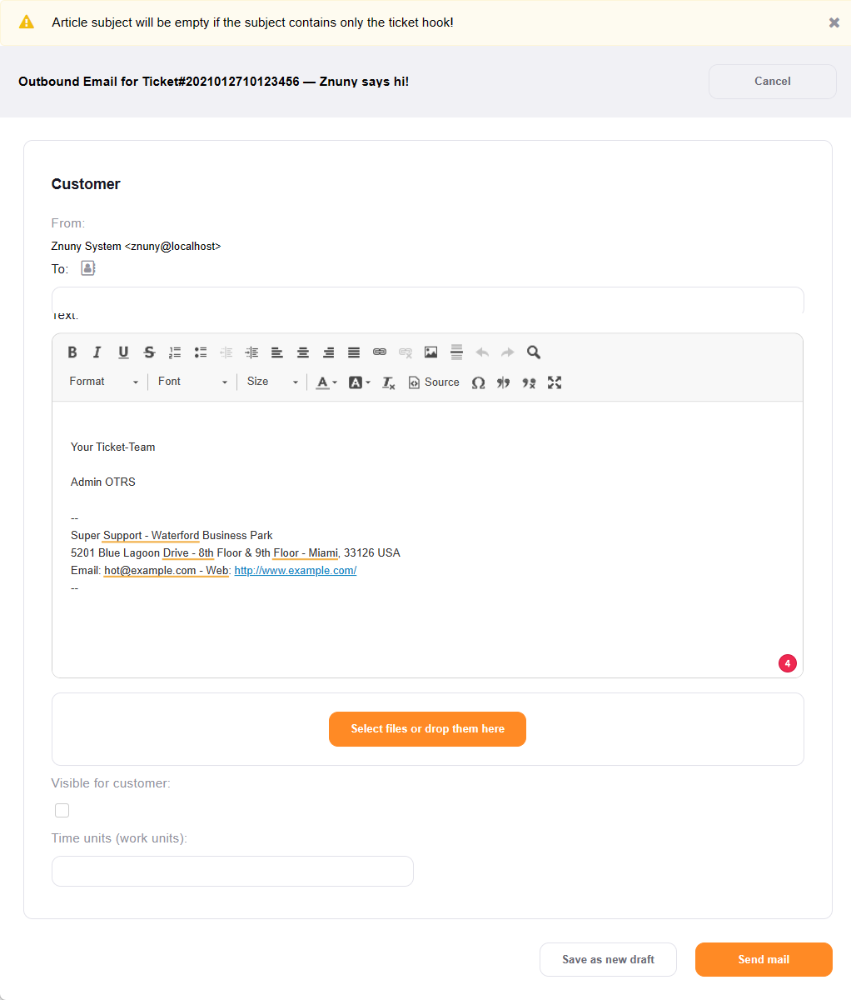

Compose a New Mail
##################
.. _PageNavigation ticketviews_agentticketemailoutbound:

It's possible to compose a new mail out of the current ticket. Do this by selecting *E-Mail Outbound* under *Communication* in the :ref:`ticket menu <PageNavigation ticketviews_agentticketzoom_ticketmenu>`.

.. note::

    This action is not to be confused with answering a communication. It's used to contact someone other than the ticket's customer user. Therefore you must add a recipient, subject, text, and any attachments. There are no inclusions from previous communications.
