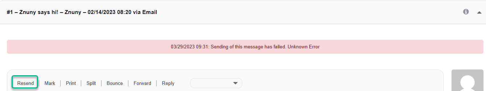

Resend an Email
###############
.. _PageNavigation ticketviews_agentticketmailresend:

.. important::

    Message failure is only reported in combination with ``Kernel::System::Email::SMTP*``. Sending failure when using Sendmail will not be reported.

Do this by selecting *Resend* in the :ref:`article menu <PageNavigation ticketviews_agentticketzoom_articlemenu>`.

Resending an e-mail after hard failure opens the :ref:`agent ticket compose <PageNavigation ticketviews_agentticketcompose>` screen with all previous data. Make changes as necessary and click send.

.. note::

    A warning appears before a hard failure happens. The amount of retries is configurable. Contact your administrator for more information.

Message Area
************

After a hard failure results in a notification. The article menu *Resend* then appears.

.. note::

    The message should be helpful to inform you which changes should be made. i.e recipient or network error (as seen in our example).
