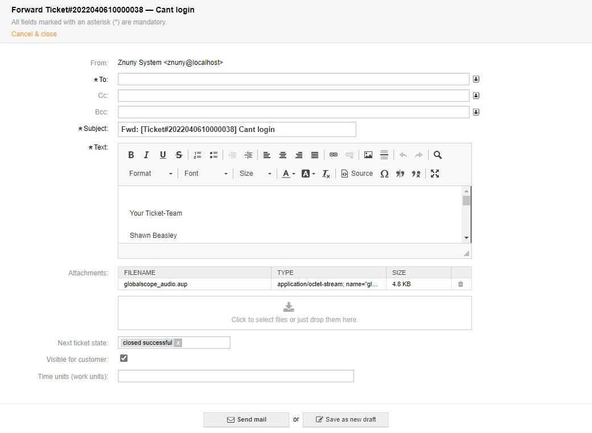

Forward a Communication
#######################
.. _PageNavigation ticketviews_agentticketforward:

Forwarding an email allows you to send a communication to a third party, including all attachments.

Do this by clicking *Forward* in the :ref:`article menu <PageNavigation ticketviews_agentticketzoom_articlemenu>` of an email communication.

.. note:: 

    The forwarded mail contains all attachments and inline images.
