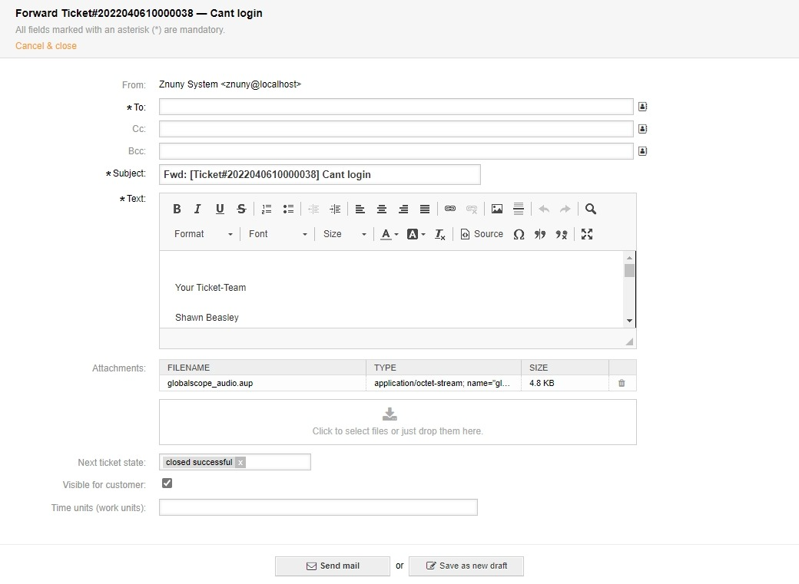

.. meta::
   :description: Forward a Znuny email article to a third party with all original attachments and inline images, keeping the ticket history intact for future reference.
   :keywords: znuny forward email, article forward, forward communication, forward attachments, email forward, third party forward

Forward a Communication
#######################
.. _PageNavigation ticketviews_agentticketforward:

Forwarding an email allows you to send a communication to a third party, including all attachments.

Do this by clicking *Forward* in the :ref:`article menu <PageNavigation ticketviews_agentticketzoom_articlemenu>` of an email communication.

.. note:: 

    The forwarded mail contains all attachments and inline images.

While forwarding an email to a system address, you may get this error:

> Note that it's not possible to forward a communication to an address 

If you get this error, that is intended, as a ticket can only live in one queue.
If you need to move one ticket instead, use the "Move" feature instead than manual forwarding.
