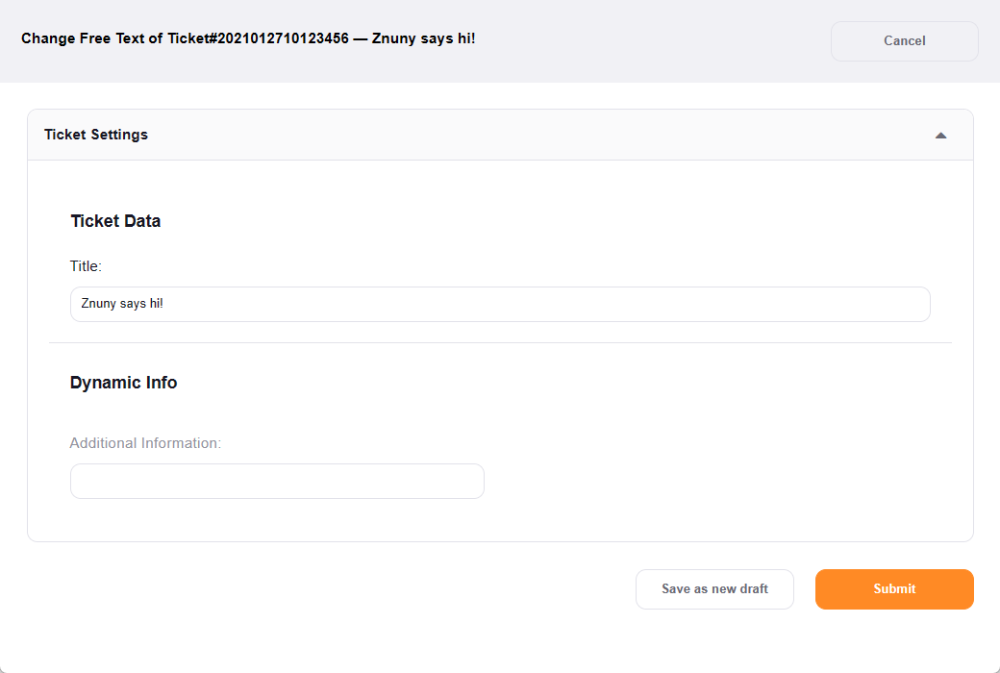

Change Metadata (FreeText)
##########################
.. _PageNavigation ticketviews_agentticketfreetext:

One of the most powerful things that the software provides is the ability to record metadata in each ticket. The primary metadata is the ticket data. Secondarily the dynamic fields contain user-defined metadata. The software provides an individual mask for rewriting the metadata of a ticket.

Select *Miscellaneous* then *Free Fields* in the :ref:`ticket menu <PageNavigation ticketviews_agentticketzoom_ticketmenu>`.

In the screen above, there are some optional fields configured. By default, the ticket title is available.

In the metadata screen, you change configured ticket data. In the example above, we have corrected the title, added a purchase order number, and selected a queue for redistribution of the ticket.
