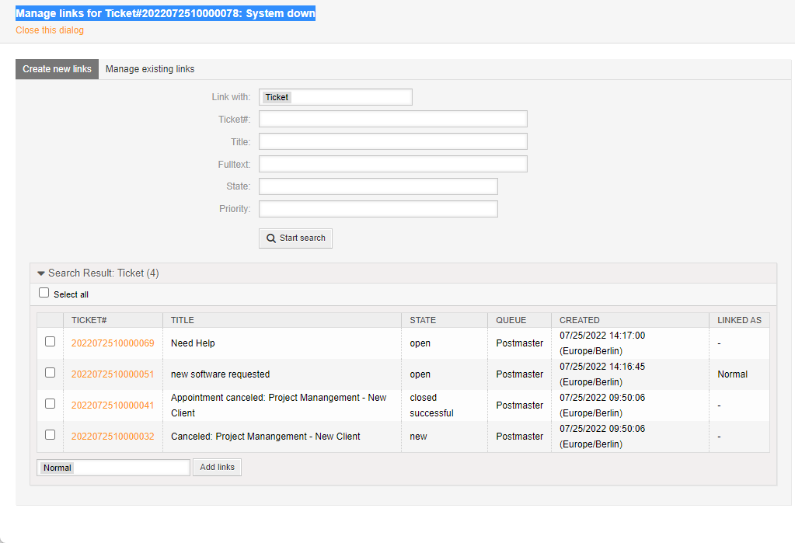
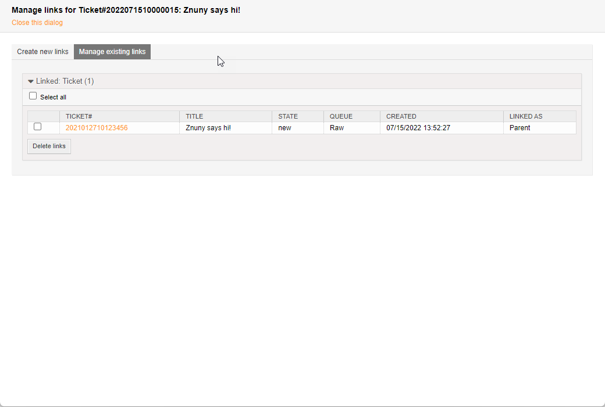
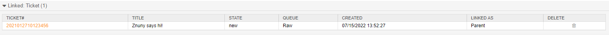

Linking Tickets To Objects
##########################
.. _PageNavigation ticketviews_agentticketlink:

Select *Link* in under "Miscellaneous* the :ref:`ticket menu <PageNavigation ticketviews_agentticketzoom_ticketmenu>`.

Add A Link
**********

Here you'll see a list of ticket meeting your search criteria.

.. versionadded:: 6.4

    The default search will show tickets from the customer of the current ticket if ``Frontend::AgentLinkObject::WildcardSearch`` configured. This is depicted active in the above screen shot.

You may modify the search to change the type of object to be searched. Other objects may be

* Appointment

If you have other modules installed, some new values may appear.

* FAQ
* Configuration Item

Show relationships between tickets and other objects by using the link function. Linking tickets to objects can be a good way of visualizing the relationships.

Link Relationships
==================

There are three types of relationships that an object can have with the ticket. 

Parent
    Linking as a "parent" denotes the ticket as a subordinate or deriving of the selected object.
Normal
    Linking as "normal" denotes equal precedence showing the objects have a mutual relationship.
Child
    Linking as a "child" denotes the ticket being superior to or the origin of the linked object

.. note::

    Other modules may bring their own link types.

Remove A Link
*************

Removing a link can also be performed from the same menu by clicking on the *manage existing links* tab in the link screen.

Additionally, in the ticket zoom, links can be deleted using the delete icon. This requires additional configuration ``LinkObject::ViewMode`` must be set to Complex.

