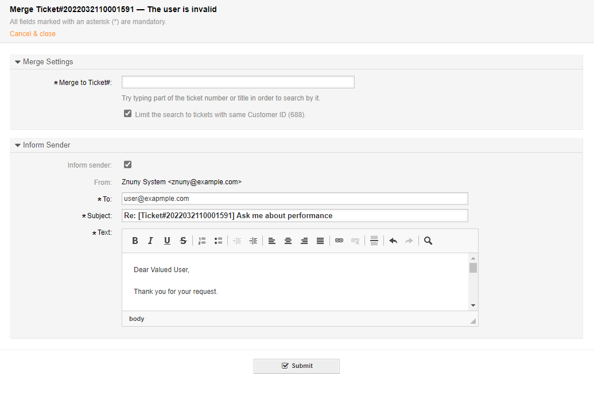
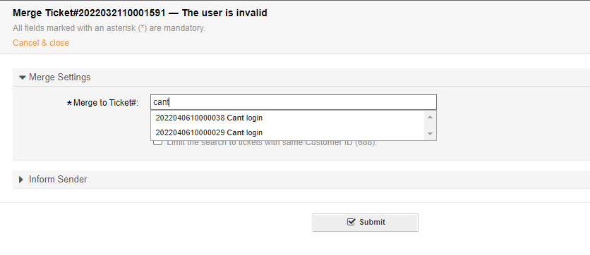

Merge Tickets
#############
.. _PageNavigation ticketviews_agentticketmerge:

Sometimes communications do not reach their destination. In this case, an unwanted second ticket could be the result. It is possible to combine tickets using the merge feature. When you perform a ticket merge, selected tickets, including all history entries and communications, are shuffled together to create a single ticket.

Select *Miscellaneous* then *Merge* from the :ref:`ticket menu <PageNavigation ticketviews_agentticketzoom_ticketmenu>`.

In this screen you can select a target ticket for the merge. Optionally you can also send a message to the customer informing them that you have merged this into another ticket.

You can filter for ticket number or ticket title. Initially, only open tickets for the currently selected customer are searched.

.. warning::

    A merge is irreversible.

A link to the ticket with a ghost article Remains for audit purposes.

