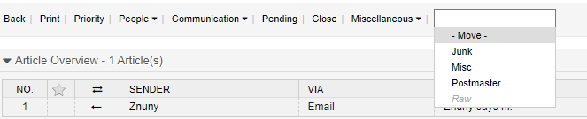

Sort a Ticket
#############
.. _PageNavigation ticketviews_agentticketmove:

Moving a ticket into a separate queue is one way to distribute the ticket to a different team. There are two different options involved when moving a ticket. You can choose to have the ticket moved via a dropdown menu, the default setting, or in a separate screen. Using the separate screen provides the option of adding additional metadata for modification when moving a ticket. Additionally, it provides an added permissions layer. This screen also adds a method to create a note when moving the ticket if required.

Select the target queue from the :ref:`ticket menu <PageNavigation ticketviews_agentticketzoom_ticketmenu>`. If the configuration is "New Window" click on menu item *Queue*.

Move Type
*********

Dropdown
    By default, the action is immediate when using the dropdown.

New Window
    Configurable by the administrator.

This will show the queue as a menu item.

You can then add a note. when moving.

.. image:: images/agent_ticket_move.png
    :alt: Agent Ticket Move Image

