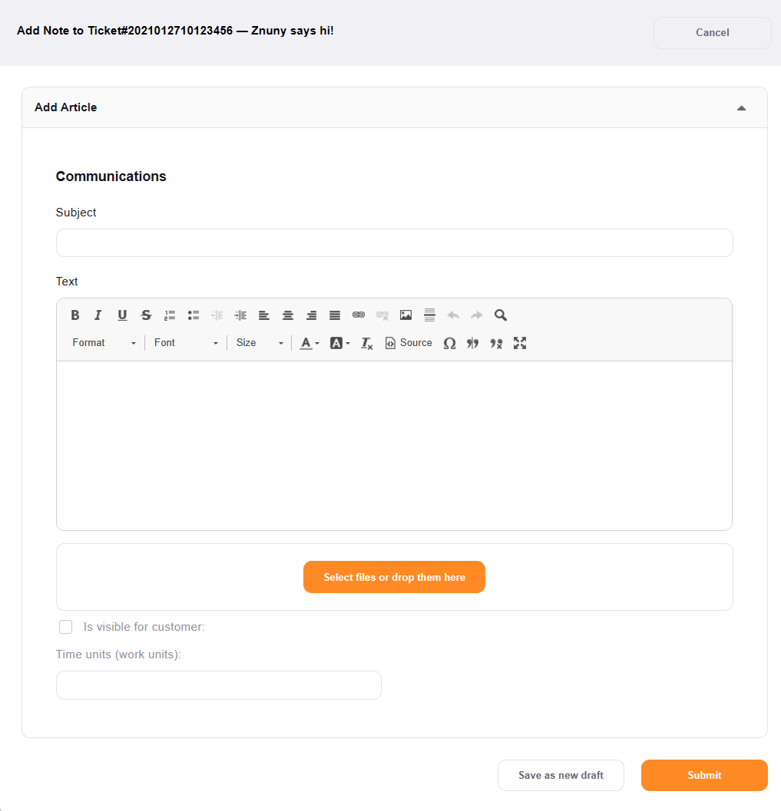

Create a Note
#############
.. _PageNavigation ticketviews_agentticketnote:

Creating a note is communicating exclusively over the software without sending a mail. To view the notes (Znuny or Phone Channel), you must have an agent or customer user login and read access to the ticket.

Select *Communication* -> *Note* from the :ref:`ticket menu <PageNavigation ticketviews_agentticketzoom_ticketmenu>`.

.. _PageNavigation ticketviews_agentticketnote-reply:

.. note::

    This screen is the same screen used by the *Reply to Note* function from the article menu. When replying to a customer note or phone call set the *is visible for customer* check mark if the communication should be visible for the customer in the front-end.

