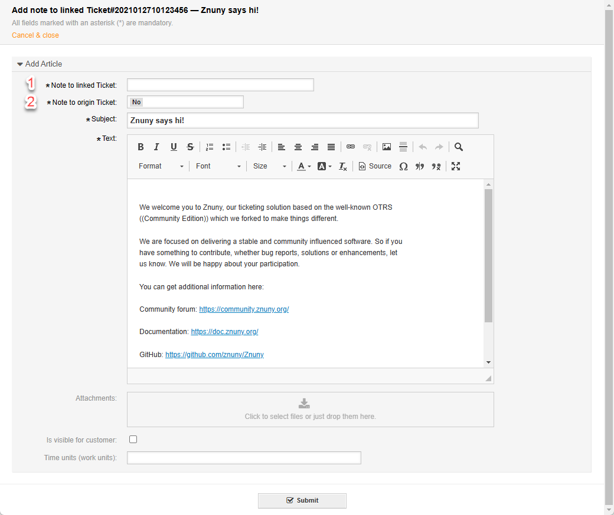
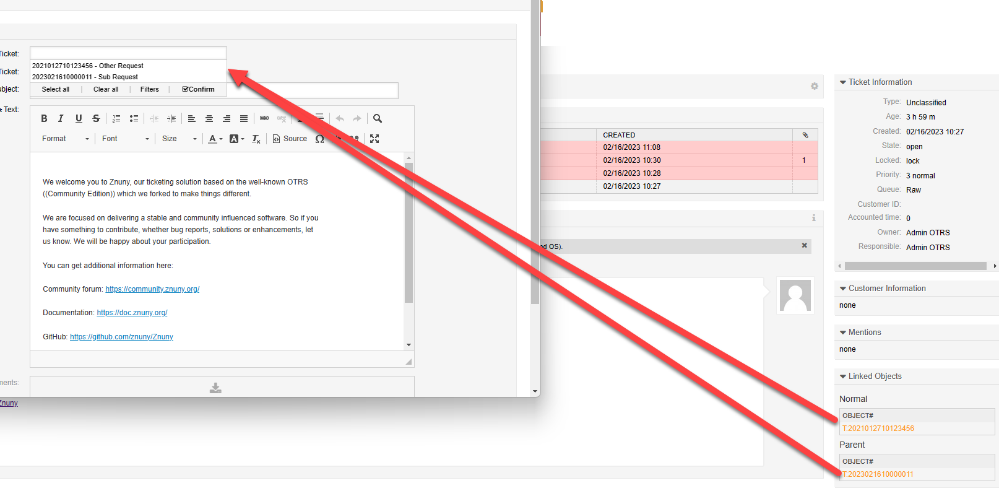

Copy an Article to Another Ticket
#################################
.. _PageNavigation ticketviews_agentticketnotetolinkedticket:

.. versionadded:: 6.5

It is now possible to copy an article to a linked ticket. Do this by clicking *Tranfer notice* in the :ref:`article menu <PageNavigation ticketviews_agentticketzoom_articlemenu>` of an any communication.

1. Select which linked ticket should receive the article.
2. Select if a copy of the article should be created in the current ticket.

This action copies the subject and body of the communication to the defined ticket by default.

Here you see one or more tickets can be selected. All linked tickets are shown, regardless of link type or direction.

