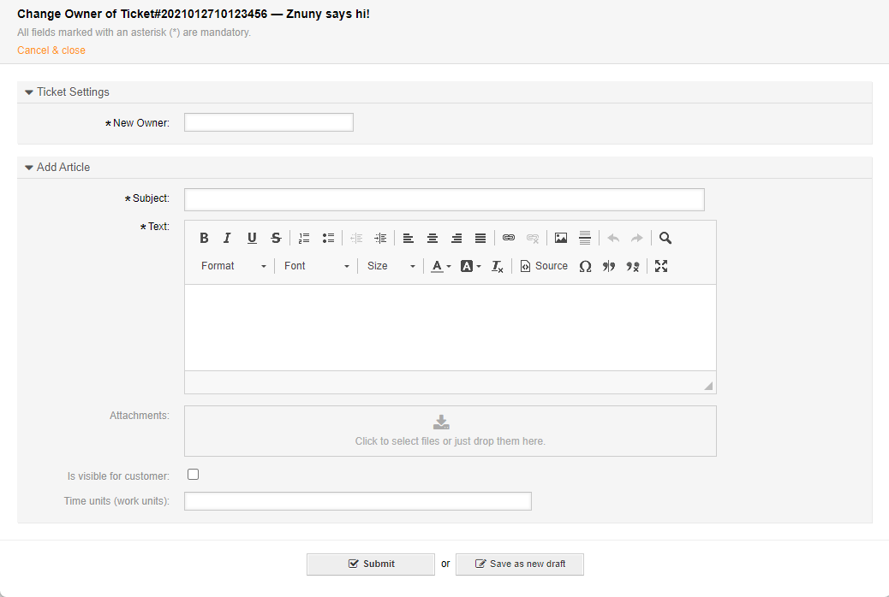

.. meta::
   :description: Assign a new owner to a Znuny ticket — choose from agents with owner or rw permission in the queue; the ticket locks to the new owner automatically.
   :keywords: znuny ticket owner, assign ticket, change owner, owner permission, owner lock, ticket assignment

.. _PageNavigation ticketviews_agentticketowner:

Assign the Ticket
#################

Assign a new owner to the ticket. Choose from anyone with *owner* or *rw* permissions in the queue.

Select *Owner* under *People* in the :ref:`ticket menu <PageNavigation ticketviews_agentticketzoom_ticketmenu>`.

.. note::

    This :ref:`locks <PageNavigation ticketviews_agentticketlock>` the ticket to the new owner.
