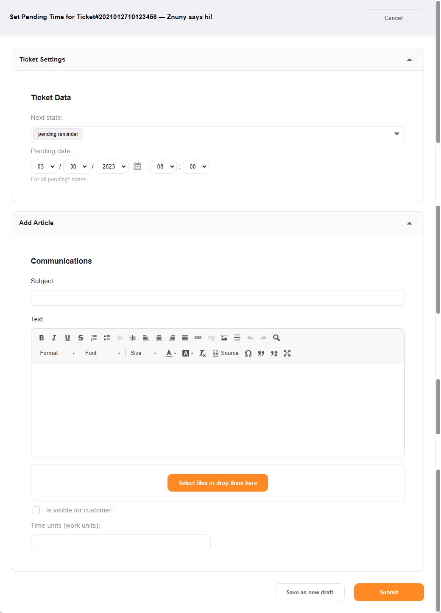

Set a Reminder
##############
.. _PageNavigation ticketviews_agentticketreminder:

Access this screen by selecting *Pending* the :ref:`ticket menu <PageNavigation ticketviews_agentticketzoom_ticketmenu>`.

Choose from one of the pending state types configured in your system, select the future date for the action, add a note and submit.

.. note:: Pending State Types

    Pending states may have automatic actions applied to them. By default, *pending auto close+* and *pending auto close-* close your ticket as successful or unsuccessful accordingly. The *pending reminder*-state just sends a reminder message. Contact your system administrator for more information.
