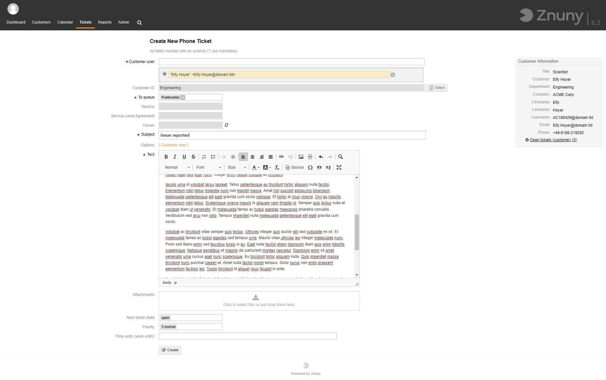

Record a Ticket
###############
.. _PageNavigation ticketviews_agentticketphone:

Select *New phone ticket* under *Ticket* in the main menu navigation or if configured click the :fa:`phone` icon in the toolbar to record an issue, event, or request reveived via telephone.

Fill out the required details and click submit to register the call.

.. note::

    Selecting an owner will :ref:`lock <PageNavigation ticketviews_agentticketlock>` the ticket to this user immediately. If you do not choose the owner, you are the owner but the ticket is unlocked. Additionally, if you decide to continue to work on the issue, assign it to yourself to lock it.

After submission, depending on your set-up, you will be redirected to the empty phone ticket mask, or will zoom into the ticket directly.
