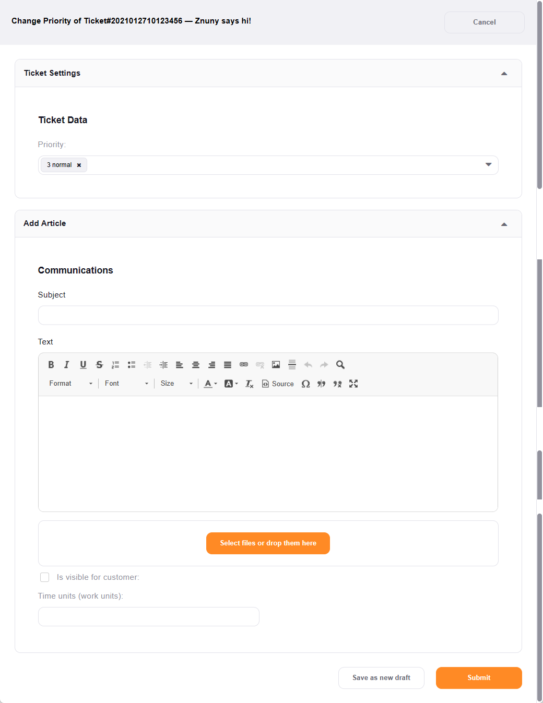
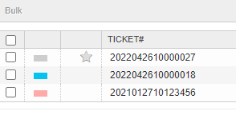

Set the Priority
################
.. _PageNavigation ticketviews_agentticketpriority:

Select *Priority* in the :ref:`ticket menu <PageNavigation ticketviews_agentticketzoom_ticketmenu>`.

The ticket priority allows users to sort the ticket according to the set priority, making high priority tickets more visible sorting them according to id and colorizing the overview table.

**Colorized View:**

Here is an example of the colorized display.

