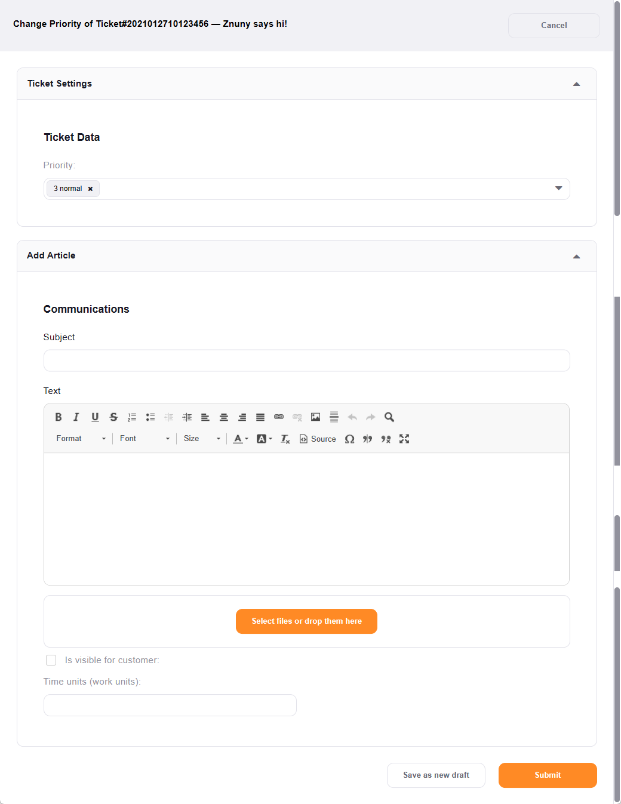
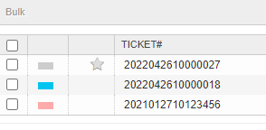

.. meta::
   :description: Raise or lower the priority on a Znuny ticket — affects sorting and can colorize overview rows so urgent tickets stand out for agents and escalation monitors.
   :keywords: znuny ticket priority, set priority, priority level, colorized priority, urgent tickets, change priority

.. _PageNavigation ticketviews_agentticketpriority:

Set the Priority
################

Select *Priority* in the :ref:`ticket menu <PageNavigation ticketviews_agentticketzoom_ticketmenu>`.

The ticket priority allows users to sort the ticket according to the set priority, making high priority tickets more visible sorting them according to id and colorizing the overview table.

**Colorized View:**

Here is an example of the colorized display.

