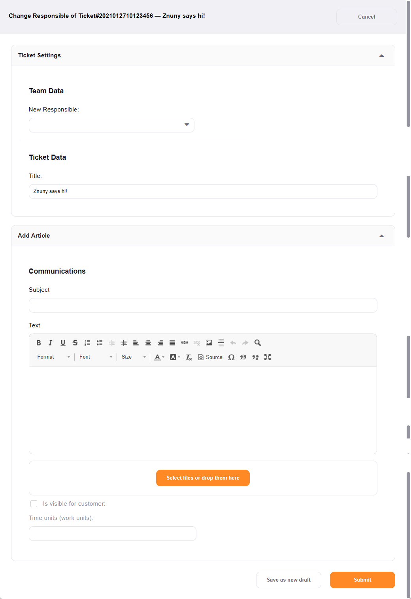

Become the Responsible Agent
############################
.. _PageNavigation ticketviews_agentticketresponsible:

The responsible feature must be activated, and then you can use the :ref:`ticket menu <PageNavigation ticketviews_agentticketzoom_ticketmenu>` choosing People -> Responsible to take responsibility for the ticket. The responsible agent has full-permissions on the ticket in any queue, just as the owner does.

It is a second ticket owner.

.. important::

    You must have full-permissions (rw) in a queue to be assigned as the responsible of the ticket.
