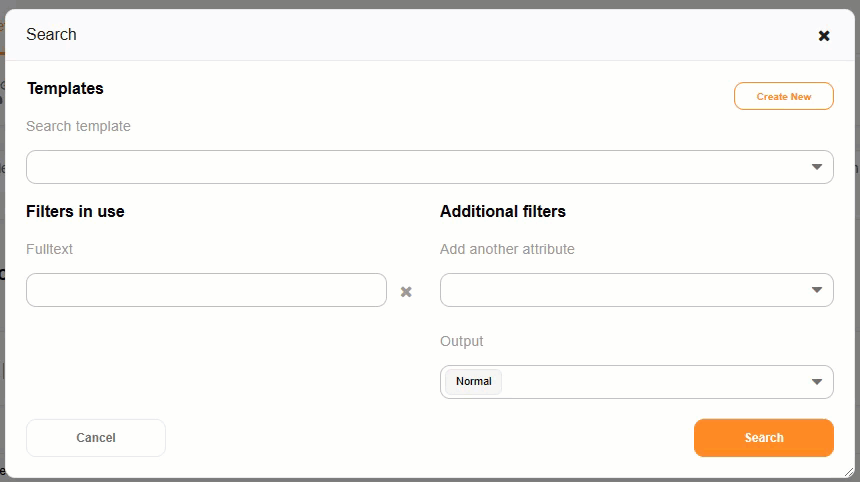
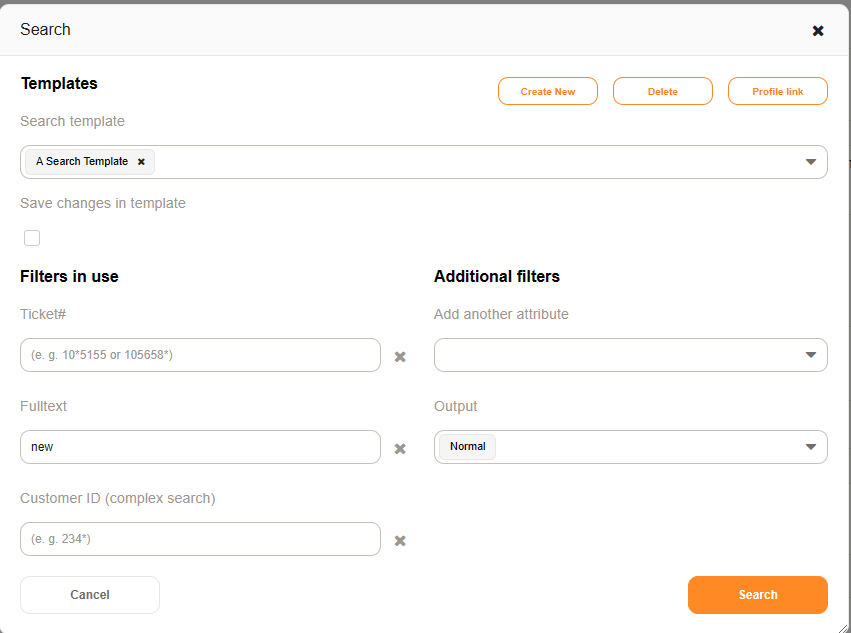

Search for Tickets
##################

You may search for tickets using

* the :fa:`search`
* the *Search* item found under *Ticket* in the menu
* the full-text search toolbar, if configured.

See the section :ref:`Search Results <PageNavigation overviews_agentticketsearch>` for more information.

Configure Search
****************

By default, a full-text search is performed. You may add individual attributes to the search to refine your search.

Search Profiles
***************

Create a search profile before searching to quickly load options or perform a quick search using the toolbar, if configured.

Update a Profile
================

It is possible, when loading a search profile, to save changes to the profile for refining a search.

Bookmark Search
***************

Search profiles can be bookmarked using the *Profile link* option when searching.

Output Format
*************

Get your results as a PDF, CSV, or XSLX document, or show them on the screen using the *narmal* option.

