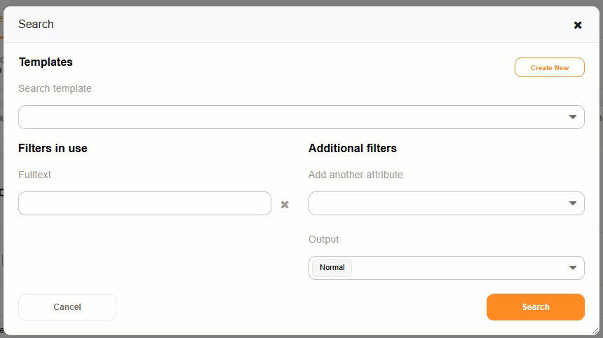
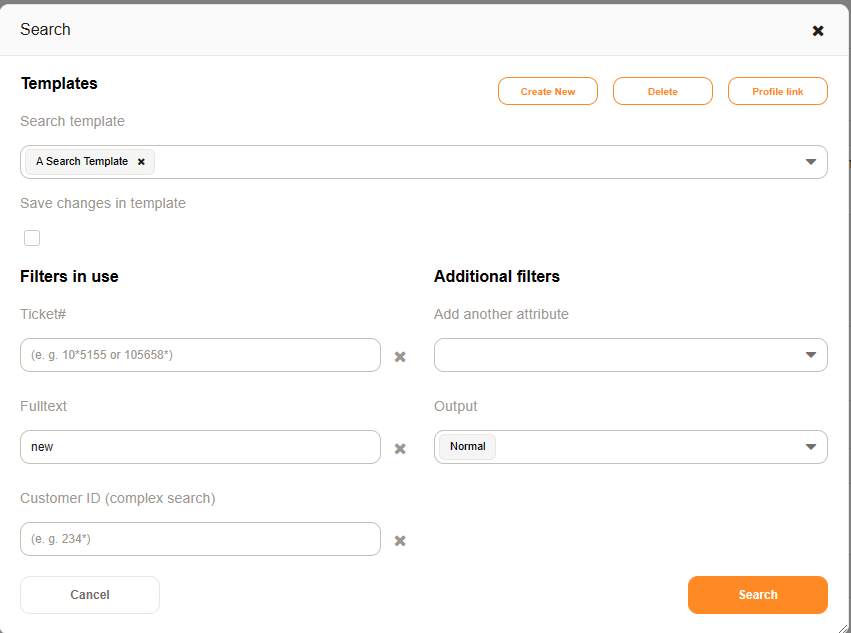

Search for Tickets
##################

You may search for tickets using

* the :fa:`search`
* the *Search* item found under *Ticket* in the menu
* the full-text search toolbar, if configured.

See the section :ref:`Search Results <PageNavigation overviews_agentticketsearch>` for more information.

Configure Search
****************

By default, a full-text search is performed. You may add individual attributes to the search to refine your search.

Search Profiles
***************

Create a search profile before searching to quickly load options or perform a quick search using the toolbar, if configured.

Update a Profile
================

It is possible, when loading a search profile, to save changes to the profile for refining a search.

Bookmark Search
***************

Search profiles can be bookmarked using the *Profile link* option when searching.

Output Format
*************

Get your results as a PDF, CSV, or XSLX document, or show them on the screen using the *normal* option.

.. important:: 
    
    Fields that should be output to the CSV, or XSLX document, must be configured under 
    
    * ``Ticket::Frontend::CustomerTicketSearch###SearchCSVData``
    * ``Ticket::Frontend::AgentTicketSearch###SearchCSVData``
    * ``Ticket::Frontend::CustomerTicketSearch###SearchCSVDynamicField``
    * ``Ticket::Frontend::AgentTicketSearch###SearchCSVDynamicField``

.. _agentinterface_ticketviews_agentticketsearch_advanced_search:

Advanced Search
***************

You can use extended search conditions when searching in the fields. This works in all text fields.

Search using a wildcard
    **\*SQL** would return MySQL and PostgreSQL.
Search using an OR operation
    **SQL||DB** would return tickets containing SQL or DB in the text. 
Search using the AND operation 
    **SQL&&DB** would return tickets containing SQL and DB in the text.
Grouping operations
    **(MariaDB||MySQL)&&Test** returns tickets containing MariaDB or MySQL and also requiring the word Test be in the ticket.
Exclusion operation
    **!Secret** returns all tickets which do not containing the word *Secret*

.. note:: 
    
    ''Ticket::Frontend::AgentTicketSearch###ExtendedSearchCondition'' must be activated. The setting is active per default. The 
    customer interface requires Ticket::Frontend::CustomerTicketSearch###ExtendedSearchCondition.
