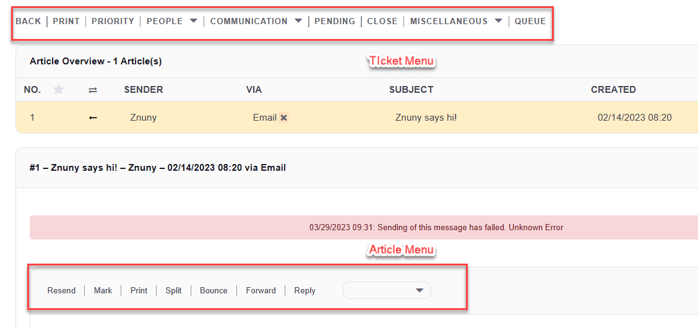
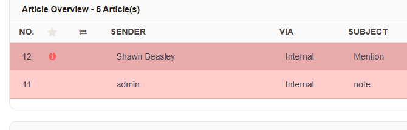
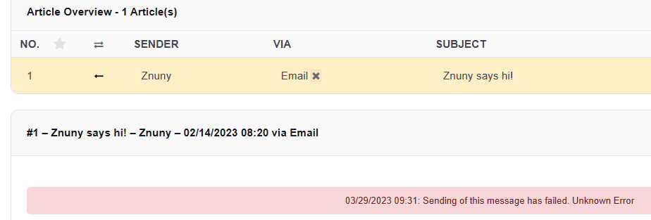
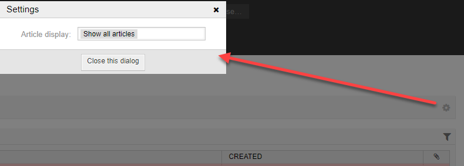
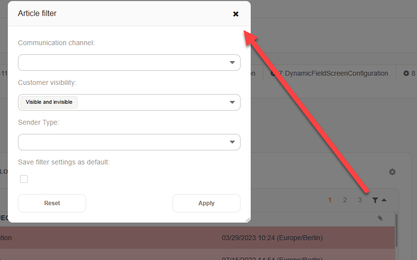
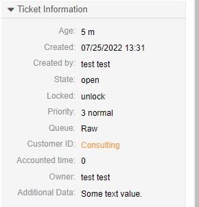
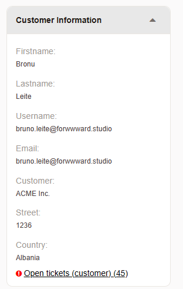
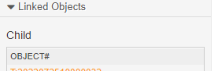
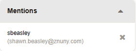

View Ticket Details
###################
.. _PageNavigation ticketviews_agentticketzoom_index:

Here's an example of a ticket detail view (AgentTicketZoom).

When you click on a ticket number from an overview screen or a link in an email notification, you'll land here.

Menus
*****

At this screen, you have access to all other screens. Here you can manipulate ticket data or review and add communications. The menus are separated for the ticket and each communication.

Ticket Menu
===========
.. _PageNavigation ticketviews_agentticketzoom_ticketmenu:

The ticket menu gives you access to the ticket data. Ticket data is modifiable information about the ticket like, but not limited to:

* Queue
* State
* Type
* Priority
* Owner
* Customer
* Customer User
* User-Defined Data (Dynamic Fields)

.. note::
    
    Your menu can and may differ based on permissions and configuration.

Clustered Items
~~~~~~~~~~~~~~~

The ticket menu items are in clusters by default, and the clusters are configurable in the system configuration. Per default, the following clusters are configured:

* People

  * :ref:`Owner <PageNavigation ticketviews_agentticketowner>` - Set the ticket owner. 
  * :ref:`Customer <PageNavigation ticketviews_agentticketcustomer>` - Assign a customer. 

* Communication

  * :ref:`Note <PageNavigation ticketviews_agentticketnote>` - Add a note.
  * :ref:`Phone Call Outbound <PageNavigation ticketviews_agentticketphoneoutbound>` - Make a call.
  * :ref:`Phone Call Inbound <PageNavigation ticketviews_agentticketphoneinbound>` - Take a call.

* Miscellaneous

  * :ref:`Lock <PageNavigation ticketviews_agentticketlock>` - Lock the ticket and take ownership.
  * :ref:`History <PageNavigation ticketviews_agenttickethistory>`
  * :ref:`Free Fields <PageNavigation ticketviews_agentticketfreetext>`
  * :ref:`Link <PageNavigation ticketviews_agentticketlink>`
  * :ref:`Merge <PageNavigation ticketviews_agentticketmerge>`
  * :ref:`New Appointment <PageNavigation agentinterface_appointments_index>`

Un-Clustered Items
~~~~~~~~~~~~~~~~~~~
* Back - Go back to the last overview.
* Print - Print all articles.

.. note::

    Images and HTML formatting is not printed. Just plain text.

* :ref:`Priority <PageNavigation ticketviews_agentticketpriority>` - Change the priority.
* :ref:`Pending <PageNavigation ticketviews_agentticketreminder>` - Set the ticket to pending.
* :ref:`Close <PageNavigation ticketviews_agentticketactionclose>` - Close the ticket.

Optional items
~~~~~~~~~~~~~~~

There may be many optional menu items based on your installed packages.

- Enroll ticket in a process.

.. note::

    Only available when at least one process is active whose start activities initial dialog is accessible by the agent.

Article Menu
============
.. _PageNavigation ticketviews_agentticketzoom_articlemenu:

Each article has a different set of menu options, based on it's type. All possible menu options are seen below. Articles are selected from the article tree found between the ticket menu article menu.

Common options
~~~~~~~~~~~~~~

* Mark - Mark a communication important.

* Print - Print the selected article.
* Split - Create a new ticket based upon the currently selected article. You can create a new phone, email, or process ticket directly from any article.

.. note::

    You should generally spilt a ticket from a customer article. Otherwise the agent is pre-filled as the customer of the new ticket.

    Additionally, the original article remains in the old ticket.

    The newly created ticket is automatically linked to the original ticket as a child.

Communication Options
~~~~~~~~~~~~~~~~~~~~~~

To respond to tickets, you can use one of other options.

* Reply to Note - Reply to a note.
* Forward - Forward the message.
* Bounce - Redirect the mail to another address.
* Reply - Reply to sender.
* Reply all - Reply to sender and all Cc: recipients.
* Message Log - Jump to the communication log.
* Transfer notice - Copy an article to a linked ticket.

.. note::

    The Message Log is only available to administrators or their delegates.

* Resend - Resend a failed communication.

Communications Table
********************

In each ticket, there is a table showing all articles in the ticket. Articles can be shown individually, or they may all be viewed at once using the cog wheel to change back and forth. Once set, the setting is persistent and applies to all tickets.

.. note:: 

    Viewing all articles will mark all articles and the ticket as read, which may not be desirable.

If ``Ticket::Frontend::TicketArticleFilter`` activated, you may also use the article filter to show only specific article types from specific senders. This may also be made persistent.

Information Widgets
*******************

On the right-hand side of each ticket, there is a set of widgets which provide different information.

Ticket Data
===========

Displays current ticket data including dynamic fields.

Customer User
=============

Shows information about the customer user and customer.

Link Object
===========

If the ``ViewMode`` is not set to *Complex*, a list of linked ticket will appear in the widget on the right side.

Mentions
========

A list of users which are mentioned in this ticket are visible. Users on the mention list can be removed by the owner or responsible of the ticket.

