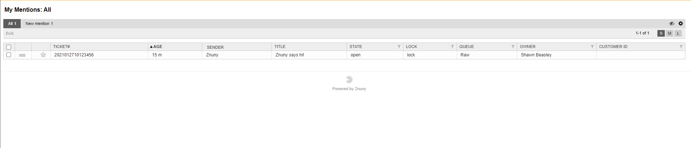

Manage Mentions
###############

.. _PageNavigation_agentinterface_ticketviews_ticketmention_index:

When viewing the mentions using the toolbar you will be able to filter between new mentions, all mentions, and also unsubscribe or unmentioned yourself in the tickets.

Select one or more mentions from either the new mentions filter or the all mentions filter, or select all mentions using select all box at the top of the table then select the eye ball on the right side to unmentioned yourself on the tickets.

**Your filter options are:**

* Unseen
* All

.. important::

    The unseen flag references the mention, and not the article count.
