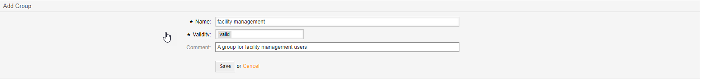
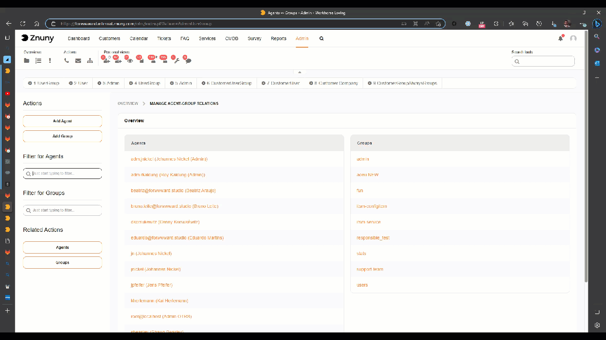
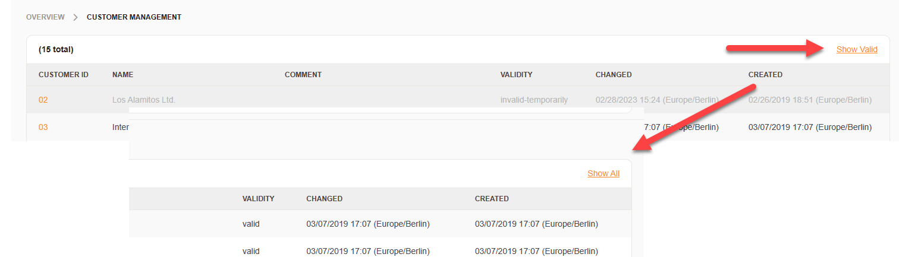
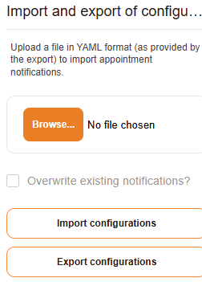
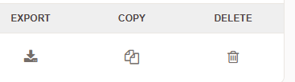

.. meta::
   :description: Manage Znuny reusable entities such as queues, priorities, roles and salutations — the common lifecycle for adding, validating, renaming and retiring entities.
   :keywords: znuny entity management, reusable entities, entity lifecycle, entity validity, entity comment, manage entities

.. _PageNavigation annexes_entity_management_index:

Managing Entities
#################

An entity is any reusable item within the system. It has, in most cases, a canonical name, a valid setting, and a comment. Typical entities are (but not limited to):

- Attachments
- Auto responses
- Groups
- Notifications
- Priorities
- Processes
- Roles
- Salutations
- Signatures
- States
- Templates
- Types

There are two types of screens when dealing with entities.

Creating an entity
******************

The first screen is the entity edit screen which allows you to create or modify an entity and its properties. 

Managing entity relationships
*****************************

The second screen is an entity relationship management screen allowing you to manage the relationship between two entities. Entities may have a one to end relationship or an end to end relationship or an end to one relationship.

For example, if you create a user group and a user role then you can use the groups roles management screen to set the relationship from groups to roles or roles to groups.

We will not create screenshots for each entity and their management, unless necessary, in each administrator section. Therefore, we will assume that this concept is sufficiently basic to understand when using the software.

Wherever entities can only be invalidated, you have the option to show valid on show all.

.. note:: All non entity system settings and configurations are found in the :ref:`pagenavigation admin_index_systemconfiguration` tool.

Exporting and importing entities
********************************

The following entities can be exported and imported:

- Auto responses
- Generic Agents
- Notifications
- PostMaster Filters
- Processes
- Salutations
- Signatures
- Templates

Bulk export and import
=======================

You can export and import entities in bulk using the export and import buttons. This allows you to manage multiple entities at once, making it easier to maintain consistency across your system.

Entity actions
**************

You can perform various actions on entities, such as exporting, copying, or deleting them. These actions help you manage your entities effectively and keep your system organized.

.. note:: 
    
    It's also possible to export and import via ``bin/znuny.Console.pl``. For more information, refer to the :ref:`pagenavigation console_admin` documentation.

   
   
