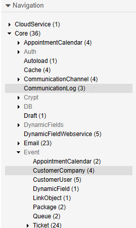

Understanding Events
####################
.. _PageNavigation annexes_event_reference_index_event_modules:

Events are triggered when objects are modified. An event registered, can't perform some interesting automation. Events are classified as Pre- or Post-Event Modules. Here we list the most commonly used event modules available and what they do.

Optional Modules
****************

Optional modules can be activated and configured as needed.

.. versionadded:: 6.5
 Ticket::EventModulePost DynamicFieldFromCustomerCompany

Ticket::EventModulePost###2700-ForceOwnerResetOnMove
 Resets the owner of a ticket when moved to a new queue.
Ticket::EventModulePost###2800-ForceStateChangeOnLock
 Can change the staet of a ticket, when locked.
Ticket::EventModulePost###3100-LockAfterCreate
 Automatically lock the ticket to the ticket creator.
Ticket::EventModulePost###4100-DynamicFieldFromCustomerUser
 Register information from customer user a dynamic field to a ticket at the event.
Ticket::EventModulePost DynamicFieldFromCustomerCompany
 Register information from a customer company dynamic field to a ticket at the event.
Ticket::EventModulePost###9600-TicketDynamicFieldDefault
 Write a default value to a dynamic field at the event.

In many cases, settings can be changed, like the event or other options. In cases like TicketDynamicFieldDefault, you will be required to make other settings. For the events DynamicFieldFromCustomer* you will have to add additional fields and set the mapping requirements. All the options for these settings, and the activation of the modules, can be found in the system configuration.

You can navigate to the settings on the left-hand side, as seen below.

