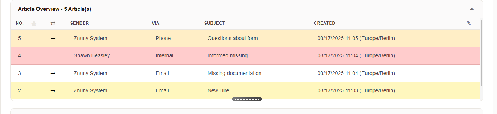

.. _PageNavigation concepts_articles_index:

Articles in Znuny
##################

In **Znuny**, an **article** represents a single unit of communication within a **ticket**. Articles track interactions such as 
emails, phone calls, internal notes, and system-generated messages, forming the conversational history of a ticket. A similar
feature is message threading in mail clients. 

   Mail Thread

The difference is that articles are a non-modifiable part of a ticket and cannot
be removed by normal means.

   Article Tree in Znuny

Key Aspects of Articles in Znuny
********************************

1. **Articles vs. Tickets**

- A **ticket** is the container for all related communication and activities.
- An **article** is an individual message or note within a ticket.

2. **Types of Articles**

Znuny supports multiple article types. The type recorded depends on the mode of interaction:

- **Email**: Emails sent or received by znuny as a follow-up to or initial request.
- **Phone**: Manual entry for an incoming or outbound phone conversation.
- **Internal**: Comments added by agents or customers.
- **System Messages**: Automated notifications like escalations, SLA breaches, or automated replies.

3. **Article Storage & Structure**

- Articles are stored **sequentially** within a ticket, maintaining a chronological communication history.
- Each article includes metadata, such as
  - **Sender/Recipient** (For emails)
  - **Communication channel (email, phone, web, etc.)**
  - **Sender Type** - Shows direction of communication.
  - **Subject**
  - **Body content**
  - **Attachments**
  - **Time of creation**

1. **Article Visibility**

- **Public Articles**: Viewable by customers (e.g., email replies).
- **Internal Articles**: Only visible to agents (e.g., internal notes).

5. **Follow-up Handling**

- Incoming emails with matching ticket identifiers are automatically attached as new articles.
- Agents can add **manual follow-ups** to tickets in the form of new articles.

6. **Permissions & Access Control**
   
- Znuny allows defining **access permissions** for tickets.
- Agents can be restricted from adding articles based on their roles.
- Customer users typically only see articles marked as visible for customer.

7. **Article Management in Znuny**

- Agents can **reply to**, **forward**, **bounce** or **split** articles into new tickets.
- Articles can be **transferred** across **linked** tickets.
- **Rich text formatting** and **attachments** are supported.
