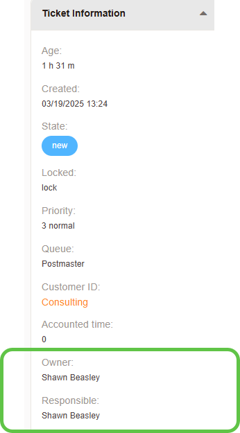

.. meta::
   :description: Ticket owner and responsible in Znuny — how ownership is assigned, transferred and taken, manual locking, and the difference between the owner and the responsible agent.
   :keywords: znuny ticket owner, responsible agent, ownership transfer, lock take, agent responsible, owner assignment

.. _PageNavigation concepts_owner_index:

Ticket Owner and Responsible
############################

   Ticket Data (Owner and Responsible)

What does ownership mean
************************

A ticket owner, when locked, has sole permissions on ticket actions like 

- external communication
- prioritization
- marking articles as important
- queue assignment

An unlocked ticket, designates that the owner is **no longer** in exclusive control, and anyone may lock the ticket, becoming the new owner.

How Ticket Ownership Is Assigned
*********************************

Every ticket in Znuny must have an owner from the moment it is created.  A newly created ticket in Znuny has the OwnerID 1 and the ticket is unlocked, indicating no agent has taken it yet. When an agent creates a ticket (for example, logging a phone call), Znuny assigns that agent as the owner. If an owner is designated during creation, the ticket is immediately locked to them by default

.. note:: 
    
    In practice, the **owner** is not assigned, but the ticket notifications will trigger a mail to all subscribers and a representative will lock the ticket, becoming the owner.

How Ownership Transfer Works
****************************

Ticket ownership can be transferred between agents using Znuny's agent interface. The primary way to reassign ownership is via the **“Owner”** action in the ticket's menu.  This means the new owner now has exclusive lock, signaling he is actively working on the issue.

Manual Locking
==============

Agents can also **“take”** ownership of a **locked** ticket in the same way. If a ticket is **unlocked** (open for anyone to work on regardless of the current ownership), an agent can click the **“Lock”** option (often found under a *Miscellaneous* or *Actions* menu) to immediately lock the ticket to themselves 

.. note:: 

    In effect, *locking = claiming ownership*. This is useful for quick self-assignment - for example, an agent should view the queue for new tickets and **lock (take)** the oldest ticket and work on it, rather than leaving it unassigned.

Automatic Locking
=================

Transferring ownership can also happen in the course of other actions. For instance, if an agent with access starts responding to an **unassigned** (unlocked) ticket, Znuny will usually **auto-lock** the ticket to that agent as they compose a reply, thereby transferring ownership to them to maintain consistency. 

Similarly, moving a ticket to another queue may involve ownership changes. By default, moving a ticket doesn't change its owner unless you specify a new one, but an administrator can enable this option and automatically reset the owner to the default (Admin) and unlock the ticket when it's moved. 

.. tip:: 

  This setting is handy in multi-tier support scenarios - e.g. when escalating a ticket from first level to second level, the system can clear the first-level owner upon moving queues, so the ticket arrives in the new queue unassigned and ready for a second-level agent to claim. If such automation is not in place, a common practice is for the first agent to manually **unlock** the ticket (relinquish ownership) or reassign the owner to a placeholder when handing off, so that the next team knows it's free for pickup.

Historical Information
======================

All ownership changes are tracked in the ticket history for accountability. The previous owner will no longer be the “active” owner once a transfer occurs, and the new owner becomes the point of contact for that ticket. 

User Notification
==================

By default Znuny sends a notification to the new owner when a ticket is assigned to them (alerting them that they now own the ticket). The customer can remain oblivious to internal owner changes unless you choose to inform them; ownership primarily affects internal workflow.

Permissions Required for Ticket Ownership
*****************************************

Znuny uses a permissions model to control who can see and manipulate tickets in a given queue. Each queue is associated with one or more permission groups, and agents must have appropriate rights in those groups to act as ticket owner. In particular, an agent needs the **“owner”** permission (or full **“rw”** access) for the ticket's queue (group) to be set as the owner or to change the owner. The “owner” permission grants the ability to set or change ticket ownership in that queue. Agents with full read-write (**rw**) access implicitly have all basic rights including the ability to take ownership, whereas an agent with only read-only access could not assume ownership.

When you use the **Owner** change menu, the dropdown of potential new owners will include only those agents who have at least owner or rw rights in the ticket's queue. This prevents assigning the ticket to someone who lacks access. Likewise, an agent without *owner* rights on a queue will not even see the menu option to change owner for tickets in that queue. Administrators manage these rights via group ↔ role or group ↔ user permissions in the Znuny admin interface. For example, you might have a group for “Support Level 1” and only members of that group (your level 1 support agents) with owner/rw permission can take tickets in the Level 1 queue.

Znuny doesn't hard-prevent a user with sufficient rights from acting on a ticket that someone else owns - for example, a user with *rw* permission could technically add notes or close the ticket even if they aren't the current owner. However, by policy and interface design, only one person should be owner at a time, and agents are expected to formally transfer ownership if they are taking over work, to avoid confusion. 

Workflow Implications of Ticket Ownership Changes
*************************************************

Changing a ticket's ownership has important implications for your support workflow and team communication. **Ownership indicates accountability** - at any given time, the ticket's owner is considered the person currently responsible for that issue. When an agent takes ownership (locking the ticket), Znuny assumes that agent is actively working on the ticket, and it **prevents others from accidentally working on it simultaneously**. If a user unlocks the ticket, the **Ownership** is only a reference to the last acting agent.

The Responsible
================

Znuny also offers a **“Responsible”** field (in addition to Owner) and a ticket “Watcher” feature to support more complex workflows. The **"Responsible"** is essentially a secondary person accountable for the ticket (a proxy or backup for the owner), and watchers are just subscribed observers. Changing the responsible party doesn't change the owner or lock, but responsible agents often get the same notifications an owner would. In practice, many organizations find the owner field sufficient for day-to-day work, and may not heavily use the responsible field. The **responsible** role can be useful if, say, one agent owns the ticket but is handing off follow-up to another agent temporarily - you might make that second agent the responsible so they are in the loop. 

.. important::
    
    The general principle remains: one ticket, one owner at any given time, to avoid confusion. If multiple people must collaborate, they should decide who is the owner (primary) versus who might just add notes or be set as responsible, rather than swapping ownership back and forth unnecessarily.

Best Practices for Managing Ticket Ownership Efficiently
********************************************************

- **"Lock" to "Claim" tickets:** Encourage support agents to **lock (take ownership of) new tickets** as soon as they begin working on them. This updates the ticket's owner and prevents overlap. For example, if a new ticket comes in, the first available agent should open it and click **Lock**, which will assign the ticket to them and signal to others that it's being handled.

- **Keep unassigned tickets unlocked and visible:** If a ticket has not been claimed, leave it in an **unlocked state with the default owner** (UserID = 1) so that it remains visible to the whole team. An unlocked ticket in the queue will notify all relevant agents of updates and will appear in their dashboards as needing attention. Avoid the situation where a ticket is assigned to a generic owner *and left locked*, as this “mutes” the ticket from the team's attention.

- **Transfer ownership when handing off:** When escalating or passing a ticket to another team member or queue, **formally transfer the ownership** instead of just leaving it. Use the Owner change action to assign the ticket to the appropriate new agent, or if you're unsure who will take it next, **unlock the ticket** so that it returns to the queue pool. For inter-queue escalations, consider enabling the configuration to reset owner on move (so that moving a ticket to a new queue automatically clears the owner and unlocks it). This ensures the receiving group sees the ticket as unassigned and picks it up promptly.

- **Ensure proper permissions are in place:** Administrators should set up group permissions so that only the intended support agents have owner rights in a queue, and every agent who needs to be assignable is included in the group.

- **Avoid ownership ping-pong and confusion:** Strive to keep **one clear owner at a time** for a ticket. If multiple agents need to collaborate, use notes or the responsible field rather than frequently changing the owner back and forth. The responsible field can be used to designate a backup person, but remember that **the owner is the primary accountable agent**. The *Mentions* feature helps prevent *Overusing* owner changes and prevent confusion.

By following these practices, both administrators and support agents can manage ticket ownership in Znuny more efficiently. Clear ownership assignment and transfer processes help ensure that every ticket is handled by the right person at the right time, with minimal confusion about who is responsible for each issue. This leads to a smoother help desk workflow and better service for end users. 

Typical Scenario (Examples)
***************************

New Ticket Claim
    A customer email creates a ticket in the “Support” queue. It arrives with OwnerID = 1 and is unlocked. Alice, a support agent, sees the new ticket and clicks **Lock** to take ownership. The ticket now shows Alice as the owner and is locked to her, so she can reply to the customer. Her teammates no longer get notifications for follow-ups to this ticket.

Escalation to Level 2
    Bob (Level 1 agent) has been working on a ticket, but needs to escalate it to the Level 2 team. He uses the **Move** action to send the ticket to the “Level 2” queue and, as part of that move, he **unlocks** the ticket (relinquishing ownership). The ticket's owner reverts to Admin (unassigned) and it's now unlocked in the Level 2 queue. A Level 2 agent sees it and **takes ownership** by locking it to themselves. The ticket is now under the Level 2 agent's ownership and they continue work on it.

Reassign to Colleague
    Carol is the owner of a ticket, but realizes that Dave would be better suited to resolve it. Carol opens the Owner change screen and selects Dave from the agent list and add's a note about the reason for transfer. Znuny updates the ticket so Dave is now the owner and locks it to him. Dave gets a notification email that a ticket has been assigned to him. Carol is no longer the owner, but she might add herself as a watcher to stay informed. Dave works on the ticket and eventually resolves it.

Ticket Closure and Follow-up
    Alice closes a ticket after resolving the issue. Upon closing, the system unlocks the ticket. Alice remains noted as the last owner. Two days later, the customer replies to the closed ticket (which reopens it). Because the ticket is reopened in an **unlocked** state, the whole support team gets notified of the follow-up. Bob, who is available, opens the ticket and **locks** it, making himself the new owner to handle the follow-up. This way the ticket seamlessly transitions to whoever is available, with ownership passing from Alice to Bob for the new inquiry.

These scenarios illustrate how Znuny's ticket ownership mechanism works in practice. The key is that ownership is always clear and intentional - tickets start unowned (but with a placeholder) until an agent claims them, and ownership can be handed off as needed using the system's tools. Both admins and agents should understand this process so that tickets are managed proactively and efficiently, without confusion over who is responsible at any given time. 
