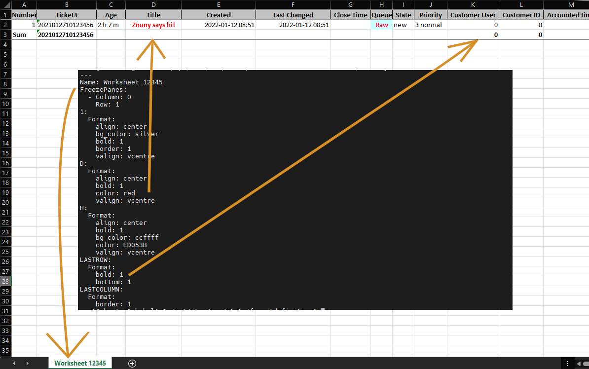

Command Line Interface
#######################

There are many things solely configurable via the command line. Most tasks require understanding how to remotely log on to the server and move about on the console.

Advanced Statistics
*******************
.. _AdvancedFeatures excel-stat-formatting:

**Functionality**

This feature provides extended (advanced) features for exporting data in Excel format. 

In addition, it is possible to define format templates to use for pre-formatting most of the Excel statistics.

Formatting Excel Statistics
===========================

A multi-level loading system formats the Excel output. Formatting information merges or overwrites formatting as declared in the source files. Merging overwrites duplicate source information. 

The loading sequence is as follows:

* Function 'ExcelFormatDefinition' of the statistics backend
* ``DEFAULT.yml`` file in the definition directory
* Statistics number as name with file extension ``.yml`` in the definition directory
* Formatting in the statistical data itself

The definition directory is located in ``var/stats/formatdefinition/excel/``.

Excel Format Sources
=====================

.. note::

   Function ExcelFormatDefinition()
      An additional Perl function extends statistics backends. The function is called ``ExcelFormatDefinition`` and takes no parameters. Depending on the statistic, ``ExcelFormatDefinition`` must return a hash (one-sided) or an array (multi-sided).

DEFAULT.yml
   If the file 'var/statsformatdefinition/excel/DEFAULT.yml' is available, it loads during statistic generation and builds the basis of Excel format.

STAT_NUMBER.yml
   Creating optional YAML definition files, per statistic, gives you finer grain control. The file exists in the definition directory named with the stat number. If the stat number is '12345', the correct file path would be 'var/statsformatdefinition/excel/12345.yml'.

.. note::

   Static Configuration
      A purely technical possibility. It comes into play when calling the function 'Array2Excel' of the Excel backend. Alternatively, pass a hash structure into the key 'Value. Formatting information is stored in individual keys. A section of the structure could then look as follows:
   
.. code-block::

    {
        Value => 'Service',
        Width => 12,
        Heigth => 10,
        Format => {
            right => 1,
            bottom => 1,
            bg_color => 'silver
            valign => 'vcentre',
            align => 'center',
        }
    },

.. note::

   Custom formatting
      Using the function ``ExcelFormatDefinition`` to include own formatting. Using the parameter ``MergeFormatDefinitions`` in your statistic. ``MergeFormatDefinitions`` includes changes from the statistics in the default formatting.

.. code-block::

   sub ExcelFormatDefinition {
       my ( $Self, %Param ) = @_;

       return {
           MergeFormatDefinitions' => 1,
           'J' => {
               "Width" => "15",
               'Format' => {
                   "right" => 1,
                   "bottom" => 1,
                   "bg_color" => "silver",
                   "Valign" => "vcentre",
                   align => 'center',
               },
           },
           'D' => {
               Width => '12'.
           },
           'H' => {
               "Width" => "40
           },
           'K' => {
               Width => '16'.
           },
       };
   };

**An example:**

To test this functionality, rename the distribution example file.

.. code-block:: shell

    su - otrs
    cd var/stats/formatdefinition/excel 
    cp 10001.example.yml.dist 10001.yml

Then you can run the stat 10001 (default on a new system). The resulting image is seen below.

**Basics:**

The basic formatting options are shown in the example file. There are special named worksheet options, and you can address any column, row or individual cell.

.. code-block:: yaml

    ---
    Name: Worksheet 12345
    FreezePanes:
      - Column: 0
        Row: 1
    1:
      Format:
        align: center
        bg_color: silver
        bold: 1
        border: 1
        valign: vcentre
    D:
      Format:
        align: center
        bold: 1
        color: red
        valign: vcentre
    H:
      Format:
        align: center
        bold: 1
        bg_color: ccffff
        color: ED053B
        valign: vcentre
    B3:
      Format:
        bold: 1
    LASTROW:
      Format:
        bold: 1
        bottom: 1
    LASTCOLUMN:
      Format:
        border: 1

Each YML element should be a column, row, or cell. The formatting options are methods of the module the complete list is shown below. The values for each method are found in the documentation as well. Let's take `set_font_shadow <https://metacpan.org/pod/Excel::Writer::XLSX#set_underline()>`_ for example. To set this for the entire tenth column, the following would be added to the YML file.

.. code-block:: YAML

    10:
      Format:
        underline: 2

**Keys for columns, rows and cells:**

A, B, C, ..., AA, ..., GD, ...
    Column labels are always letters.

1, 2, 3, ..., 10, ...
    Rows are always numbers.

A1, B3, ..., CC33, ...
    Cells are always in column row format.

**Optional Named Keys:**

Name
    The name of the worksheet.
FreezePanes
    An option to allow you to set the panes to lock at a specific row and column.
LASTROW
    This option should only be used if a sum row is selected in the statistic.
LASTCOLUMN
    This option should only be used if a sum column is selected in the statistic.

Further details
================

Read more about this feature and format requirements:

* `YAML format <https://de.wikipedia.org/wiki/YAML>`_
* `Format options <https://metacpan.org/pod/Excel::Writer::XLSX#CELL-FORMATTING>`_

Console Commands
################

Here you find the list of new console commands, added over the releases.

Console commands help automate processes using scripts to manage Znuny, without using a GUI. 

Commands are parameter of the console: 

``bin/otrs.Console.pl <COMMAND>``

Most of the commands take multiple parameters. 

.. note::   We keep adding commands to the documentation with every release. This list can be incomplete. To get an overview of available commands, call ``bin/otrs.Console.pl`` without any parameter as the application user (znuny or otrs).

.. toctree::
   :maxdepth: 2

   admin
   development
   maintenance

