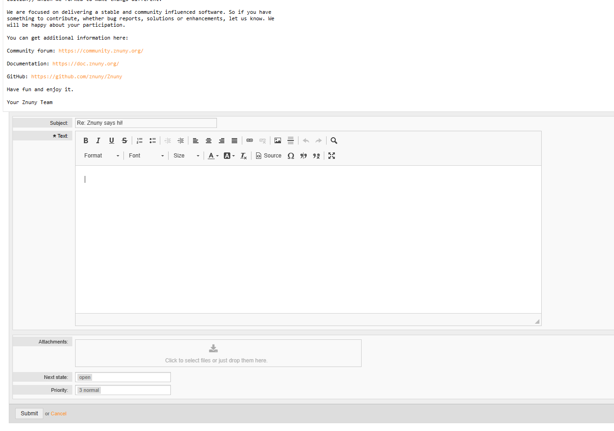

Answering Tickets
#################
.. _PageNavigation customerinderface_answering_tickets_index:

Next to telephone and email as a way to respond to and request more information, the customer may search for, or navigate to a ticket to:

- Answer articles
- Take part in a process activity via activity dialog
- Update ticket information
- Attach files
- Change the status of request

In some queues or based on other restrictions this may sometimes not be available. Contact the system admistrator in case of questions.
