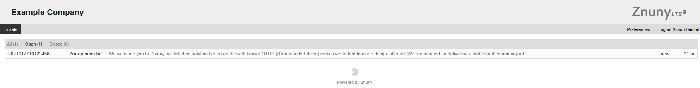

Customer User Dashboard
#######################
.. _PageNavigation customerinderface_customer_user_dashboard_index:

After a successful login, a customer user will be directed to the ticket overview module. If no tickets are registered in the system, the user see a button which will allow the customer user to create their first ticket. Upon ticket creation, the customer is rediercted to the "My Ticket" overview. Here the customer can view all tickets created by and assigend to them. To aid the customer user, the columns are sortable:

Ticket#
  The unique number assigned to the ticket.
Title
  A combination of the ticket title and last subject.
State
  The state of the request.
Age
  The age since created. Tickets continue to age even after closed.

By default, all tickets in open states are shown. The customer user can choose between the filters:

- All
- Open
- Closed

Clicking on a ticket will lead the to :ref:`viewing the ticket <PageNavigation customerinderface_viewing_tickets_index>`.
 
