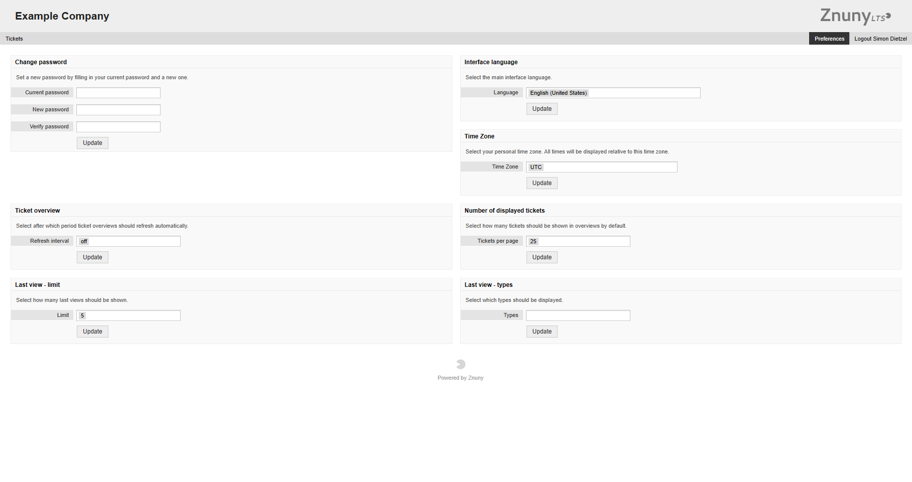

Customer User Preferences
#########################
.. _PageNavigation customerinderface_customer_user_preferences_index:

You customer users may set their own preferences in the customer user preferences screen located in the personal menu under their icon at the top left of the screen.

The options available by default are:

Change password
  Set a new password by filling in your current password and a new one. This option can be not visible for certain authentication methods.
Interface language
  Select the main interface language.
Time Zone
  Select your personal time zone. All times will be displayed relative to this time zone.
Ticket overview
  Select after which period ticket overviews should refresh automatically.
Number of displayed tickets
  Select how many tickets should be shown in overviews by default.
Last view - limit
  Select how many last views should be shown.
Last view - types
  Select which types should be displayed.

Optionally avialbale settings include but are not limited to:

PGP Key
  Upload your PGP key.
S/MIME Key
  Upload your S/MIME key.
