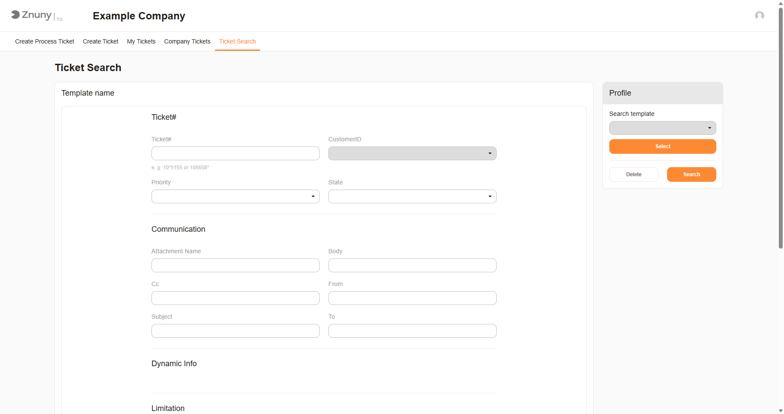

.. meta::
   :description: Let Znuny customer users find their tickets through full-text and attribute-based search — filter by state, creation date or subject to locate any past request.
   :keywords: znuny customer search, customer ticket search, search my tickets, full text search, customer portal search, find ticket

Searching Tickets
#################
.. _PageNavigation customerinderface_searching_tickets_index:

Customers may use the search to:

- Search for all ticket
- Export search results
- Save save search templates
- Access historical tickets

Once a ticket is viewed, (see :ref:`Viewing Tickets <PageNavigation customerinderface_viewing_tickets_index>` ), the ticket can also be reopened.
