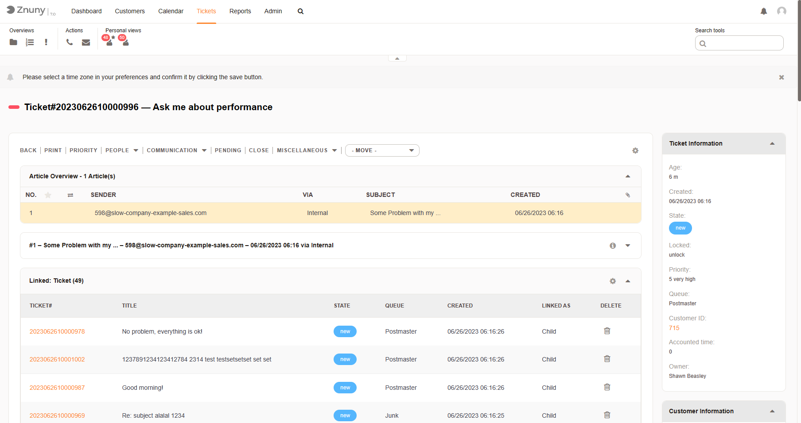

Starting Processes
##################
.. _PageNavigation customerinderface_starting_processes_index:

Processes which have a start dialog available for customers will be shown under the Create Process Ticket menu. A process ticket will require different information than a standard ticket and provides a more guided experience than a normal ticket. The customer user may not only start a process, but also be asked to participate in a process during other activities by being redirected via an email to the customer front-end to use an activity dialog to collect more data.
