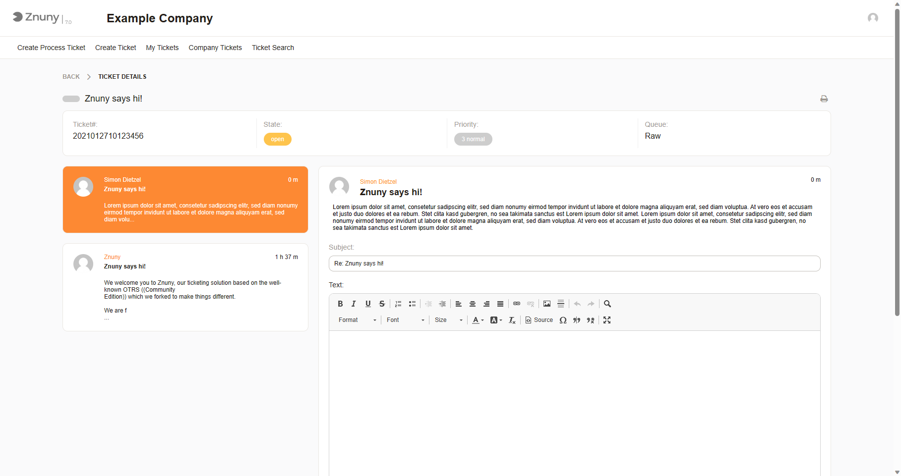

Viewing Tickets
###############
.. _PageNavigation customerinderface_viewing_tickets_index:

When viewing a ticket, the customer user has access to the basic ticket data and dynamic fields, based on the configuration.

- Ticket number
- State
- Priority
- Queue
- etc.

A customer may, depending on permissions and configuration:

- Reply to the selected message
- Browse other articles
- Upload attachments
- Change the status of the ticket
