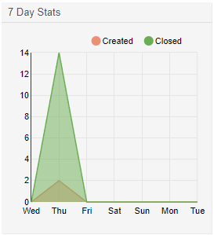

Module Layers
#############

The framework has a large number of so-called "module layers" which make it very easy to extend the system without patching existing code. One example is the number generation mechanism for tickets. It is a "module layer" with pluggable modules <, and you can add your own custom number generator modules if you wish to do so. Let's look at the different layers in detail!

Authentication and User Management
***********************************

Agent Authentication Module
============================

There are several agent authentication modules (DB, LDAP and HTTPBasicAuth) which come with the framework. It is also possible to develop your own authentication modules. The agent authentication modules are located under ``Kernel/System/Auth/*.pm``. For more information about their configuration see the admin manual. Following, there is an example of a simple agent auth module. Save it under ``Kernel/System/Auth/Simple.pm``. You just need 3 functions: ``new()``, ``GetOption()`` and ``Auth()``. Return the uid, then the authentication is ok.

**Code Example**

The interface class is called ``Kernel::System::Auth``. The example agent authentication may be called ``Kernel::System::Auth::CustomAuth``. You can find an example below.

.. code-block:: perl

    # --
    # Copyright (C) 2001-2019 OTRS AG, https://otrs.com/
    # Copyright (C) 2012-2019 Znuny GmbH, http://znuny.com/
    # --
    # $origin: znuny - baffc3ffdabea842e435a258ac49d36d348cc558 - Kernel/System/Auth.pm
    # --
    # This software comes with ABSOLUTELY NO WARRANTY. For details, see
    # the enclosed file COPYING for license information (GPL). If you
    # did not receive this file, see https://www.gnu.org/licenses/gpl-3.0.txt.
    # --

    package Kernel::System::Auth::CustomAuth;

    use strict;
    use warnings;

    use Authen::CustomAuth;

    sub new {
        my ( $Type, %Param ) = @_;

        # allocate new hash for object
        my $Self = {};
        bless( $Self, $Type );

        # check needed objects
        for (qw(LogObject ConfigObject DBObject)) {
            $Self->{$_} = $Param{$_} || die "No $_!";
        }

        # Debug 0=off 1=on
        $Self->{Debug} = 0;

        # get config
        $Self->{Die} = $Self->{ConfigObject}->Get( 'AuthModule::CustomAuth::Die' . $Param{Count} );

        # get user table
        $Self->{CustomAuthHost} = $Self->{ConfigObject}->Get( 'AuthModule::CustomAuth::Host' . $Param{Count} )
            || die "Need AuthModule::CustomAuth::Host$Param{Count}.";
        $Self->{CustomAuthSecret}
            = $Self->{ConfigObject}->Get( 'AuthModule::CustomAuth::Password' . $Param{Count} )
            || die "Need AuthModule::CustomAuth::Password$Param{Count}.";

        return $Self;
    }

    sub GetOption {
        my ( $Self, %Param ) = @_;

        # check needed stuff
        if ( !$Param{What} ) {
            $Self->{LogObject}->Log( Priority => 'error', Message => "Need What!" );
            return;
        }

        # module options
        my %Option = ( PreAuth => 0, );

        # return option
        return $Option{ $Param{What} };
    }

    sub Auth {
        my ( $Self, %Param ) = @_;

        # check needed stuff
        if ( !$Param{User} ) {
            $Self->{LogObject}->Log( Priority => 'error', Message => "Need User!" );
            return;
        }

        # get params
        my $User       = $Param{User}      || '';
        my $Pw         = $Param{Pw}        || '';
        my $RemoteAddr = $ENV{REMOTE_ADDR} || 'Got no REMOTE_ADDR env!';
        my $UserID     = '';
        my $GetPw      = '';

        # just in case for debug!
        if ( $Self->{Debug} > 0 ) {
            $Self->{LogObject}->Log(
                Priority => 'notice',
                Message  => "User: '$User' tried to authenticate with Pw: '$Pw' ($RemoteAddr)",
            );
        }

        # just a note
        if ( !$User ) {
            $Self->{LogObject}->Log(
                Priority => 'notice',
                Message  => "No User given!!! (REMOTE_ADDR: $RemoteAddr)",
            );
            return;
        }

        # just a note
        if ( !$Pw ) {
            $Self->{LogObject}->Log(
                Priority => 'notice',
                Message  => "User: $User authentication without Pw!!! (REMOTE_ADDR: $RemoteAddr)",
            );
            return;
        }

        # Create a RADIUS object
        my $CustomAuth = Authen::CustomAuth->new(
            Host   => $Self->{CustomAuthHost},
            Secret => $Self->{CustomAuthecret},
        );
        if ( !$CustomAuth ) {
            if ( $Self->{Die} ) {
                die "Can't connect to $Self->{CustomAuthHost}: $@";
            }
            else {
                $Self->{LogObject}->Log(
                    Priority => 'error',
                    Message  => "Can't connect to $Self->{CustomAuthHost}: $@",
                );
                return;
            }
        }
        my $AuthResult = $CustomAuth->check_pwd( $User, $Pw );

        # login note
        if ( defined($AuthResult) && $AuthResult == 1 ) {
            $Self->{LogObject}->Log(
                Priority => 'notice',
                Message  => "User: $User authentication ok (REMOTE_ADDR: $RemoteAddr).",
            );
            return $User;
        }

        # just a note
        else {
            $Self->{LogObject}->Log(
                Priority => 'notice',
                Message  => "User: $User authentication with wrong Pw!!! (REMOTE_ADDR: $RemoteAddr)"
            );
            return;
        }
    }

    1;

**Configuration Example**

There is the need to activate your custom agent authenticate module. This can be done using the Perl configuration below. It is not recommended to use the XML configuration because you can lock you out via the sysconfig.

.. code-block:: perl
    
    $Self->{'AuthModule'} = 'Kernel::System::Auth::CustomAuth';
                       
**Use Case Example**


Authentication Synchronization Module
======================================

There is an LDAP authentication synchronization module which come with the framework. It is also possible to develop your own authentication modules. The authentication synchronization modules are located under ``Kernel/System/Auth/Sync/*.pm``. For more information about their configuration see the admin manual. Following, there is an example of an authentication synchronization module. Save it under ``Kernel/System/Auth/Sync/CustomAuthSync.pm``. You just need 2 functions: ``new()`` and ``Sync()``. Return 1, then the synchronization is ok.

**Code Example**

The interface class is called ``Kernel::System::Auth``. The example agent authentication may be called ``Kernel::System::Auth::Sync::CustomAuthSync``. You can find an example below.

.. code-block:: perl

    # --
    # Kernel/System/Auth/Sync/CustomAuthSync.pm - provides the CustomAuthSync
    # Copyright (C) 2001-2020 OTRS AG, https://otrs.com/
    # --
    # Id: CustomAuthSync.pm,v 1.9 2010/03/25 14:42:45 martin Exp $
    # --
    # This software comes with ABSOLUTELY NO WARRANTY. For details, see
    # the enclosed file COPYING for license information (GPL). If you
    # did not receive this file, see https://www.gnu.org/licenses/gpl-3.0.txt.
    # --

    package Kernel::System::Auth::Sync::CustomAuthSync;

    use strict;
    use warnings;
    use Net::LDAP;

    sub new {
        my ( $Type, %Param ) = @_;

        # allocate new hash for object
        my $Self = {};
        bless( $Self, $Type );

        # check needed objects
        for (qw(LogObject ConfigObject DBObject UserObject GroupObject EncodeObject)) {
            $Self->{$_} = $Param{$_} || die "No $_!";
        }

        # Debug 0=off 1=on
        $Self->{Debug} = 0;

    ...

        return $Self;
    }

    sub Sync {
        my ( $Self, %Param ) = @_;

        # check needed stuff
        for (qw(User)) {
            if ( !$Param{$_} ) {
                $Self->{LogObject}->Log( Priority => 'error', Message => "Need $_!" );
                return;
            }
        }
    ...
        return 1;
    }

**Configuration Example**

You should activate your custom synchronization module. This can be done using the Perl configuration below. It is not recommended to use the XML configuration because this would allow you to lock yourself out via SysConfig.

.. code-block:: perl
    
    $Self->{'AuthSyncModule'} = 'Kernel::System::Auth::Sync::LDAP';
                       

**Use Case Example**

Useful synchronization implementation could be a SOAP or RADIUS backend.


Customer Authentication Module
===============================

There are several customer authentication modules (DB, LDAP and HTTPBasicAuth) which come with the framework. It is also possible to develop your own authentication modules. The customer authentication modules are located under ``Kernel/System/CustomerAuth/*.pm``. For more information about their configuration see the admin manual. Following, there is an example of a simple customer auth module. Save it under ``Kernel/System/CustomerAuth/Simple.pm``. You just need 3 functions: ``new()``, ``GetOption()`` and ``Auth()``. Return the uid, then the authentication is ok.

**Code Example**

The interface class is called ``Kernel::System::CustomerAuth``. The example customer authentication may be called ``Kernel::System::CustomerAuth::CustomAuth``. You can find an example below.

.. code-block:: perl

    # --
    # Kernel/System/CustomerAuth/CustomAuth.pm - provides the custom Authentication
    # based on Martin Edenhofer's Kernel::System::Auth::DB
    # Copyright (C) 2001-2020 OTRS AG, https://otrs.com/
    # --
    # Id: CustomAuth.pm,v 1.11 2009/09/22 15:16:05 mb Exp $
    # --
    # This software comes with ABSOLUTELY NO WARRANTY. For details, see
    # the enclosed file COPYING for license information (GPL). If you
    # did not receive this file, see https://www.gnu.org/licenses/gpl-3.0.txt.
    # --

    package Kernel::System::CustomerAuth::CustomAuth;

    use strict;
    use warnings;

    use Authen::CustomAuth;

    sub new {
        my ( $Type, %Param ) = @_;

        # allocate new hash for object
        my $Self = {};
        bless( $Self, $Type );

        # check needed objects
        for (qw(LogObject ConfigObject DBObject)) {
            $Self->{$_} = $Param{$_} || die "No $_!";
        }

        # Debug 0=off 1=on
        $Self->{Debug} = 0;

        # get config
        $Self->{Die}
            = $Self->{ConfigObject}->Get( 'Customer::AuthModule::CustomAuth::Die' . $Param{Count} );

        # get user table
        $Self->{CustomAuthHost}
            = $Self->{ConfigObject}->Get( 'Customer::AuthModule::CustomAuth::Host' . $Param{Count} )
            || die "Need Customer::AuthModule::CustomAuth::Host$Param{Count} in Kernel/Config.pm";
        $Self->{CustomAuthSecret}
            = $Self->{ConfigObject}->Get( 'Customer::AuthModule::CustomAuth::Password' . $Param{Count} )
            || die "Need Customer::AuthModule::CustomAuth::Password$Param{Count} in Kernel/Config.pm";

        return $Self;
    }

    sub GetOption {
        my ( $Self, %Param ) = @_;

        # check needed stuff
        if ( !$Param{What} ) {
            $Self->{LogObject}->Log( Priority => 'error', Message => "Need What!" );
            return;
        }

        # module options
        my %Option = ( PreAuth => 0, );

        # return option
        return $Option{ $Param{What} };
    }

    sub Auth {
        my ( $Self, %Param ) = @_;

        # check needed stuff
        if ( !$Param{User} ) {
            $Self->{LogObject}->Log( Priority => 'error', Message => "Need User!" );
            return;
        }

        # get params
        my $User       = $Param{User}      || '';
        my $Pw         = $Param{Pw}        || '';
        my $RemoteAddr = $ENV{REMOTE_ADDR} || 'Got no REMOTE_ADDR env!';
        my $UserID     = '';
        my $GetPw      = '';

        # just in case for debug!
        if ( $Self->{Debug} > 0 ) {
            $Self->{LogObject}->Log(
                Priority => 'notice',
                Message  => "User: '$User' tried to authentificate with Pw: '$Pw' ($RemoteAddr)",
            );
        }

        # just a note
        if ( !$User ) {
            $Self->{LogObject}->Log(
                Priority => 'notice',
                Message  => "No User given!!! (REMOTE_ADDR: $RemoteAddr)",
            );
            return;
        }

        # just a note
        if ( !$Pw ) {
            $Self->{LogObject}->Log(
                Priority => 'notice',
                Message  => "User: $User Authentication without Pw!!! (REMOTE_ADDR: $RemoteAddr)",
            );
            return;
        }

        # Create a custom object
        my $CustomAuth = Authen::CustomAuth->new(
            Host   => $Self->{CustomAuthHost},
            Secret => $Self->{CustomAuthSecret},
        );
        if ( !$CustomAuth ) {
            if ( $Self->{Die} ) {
                die "Can't connect to $Self->{CustomAuthHost}: $@";
            }
            else {
                $Self->{LogObject}->Log(
                    Priority => 'error',
                    Message  => "Can't connect to $Self->{CustomAuthHost}: $@",
                );
                return;
            }
        }
        my $AuthResult = $CustomAuth->check_pwd( $User, $Pw );

        # login note
        if ( defined($AuthResult) && $AuthResult == 1 ) {
            $Self->{LogObject}->Log(
                Priority => 'notice',
                Message  => "User: $User Authentication ok (REMOTE_ADDR: $RemoteAddr).",
            );
            return $User;
        }

        # just a note
        else {
            $Self->{LogObject}->Log(
                Priority => 'notice',
                Message  => "User: $User Authentication with wrong Pw!!! (REMOTE_ADDR: $RemoteAddr)"
            );
            return;
        }
    }

    1;

**Configuration Example**

There is the need to activate your custom customer authenticate module. This can be done using the XML configuration below.

.. code-block:: xml

    <ConfigItem Name="AuthModule" Required="1" Valid="1">
        <Description Lang="en">Module to authenticate customers.</Description>
        <Description Lang="de">Modul zum Authentifizieren der Customer.</Description>
        <Group>Framework</Group>
        <SubGroup>Frontend::CustomerAuthAuth</SubGroup>
        <Setting>
            <Option Location="Kernel/System/CustomerAuth/*.pm" SelectedID="Kernel::System::CustomerAuth::CustomAuth"></Option>
        </Setting>
    </ConfigItem>
            

**Use Case Example**

Customer User Preferences Module
=================================

There is a DB customer-user preferences module which come with the framework. It is also possible to develop your own customer-user preferences modules. The customer-user preferences modules are located under ``Kernel/System/CustomerUser/Preferences/*.pm``. For more information about their configuration see the admin manual. Following, there is an example of a customer-user preferences module. Save it under ``Kernel/System/CustomerUser/Preferences/Custom.pm``. You just need 4 functions: ``new()``, ``SearchPreferences()``, ``SetPreferences()`` and ``GetPreferences()``.

**Code Example**

The interface class is called ``Kernel::System::CustomerUser``. The example customer-user preferences may be called ``Kernel::System::CustomerUser::Preferences::Custom``. You can find an example below 
            
.. code-block:: perl

    # --
    # Kernel/System/CustomerUser/Preferences/Custom.pm - some customer user functions
    # Copyright (C) 2001-2020 OTRS AG, https://otrs.com/
    # --
    # Id: Custom.pm,v 1.20 2009/10/07 20:41:50 martin Exp $
    # --
    # This software comes with ABSOLUTELY NO WARRANTY. For details, see
    # the enclosed file COPYING for license information (GPL). If you
    # did not receive this file, see https://www.gnu.org/licenses/gpl-3.0.txt.
    # --

    package Kernel::System::CustomerUser::Preferences::Custom;

    use strict;
    use warnings;

    use vars qw(@ISA $VERSION);

    sub new {
        my ( $Type, %Param ) = @_;

        # allocate new hash for object
        my $Self = {};
        bless( $Self, $Type );

        # check needed objects
        for my $Object (qw(DBObject ConfigObject LogObject)) {
            $Self->{$Object} = $Param{$Object} || die "Got no $Object!";
        }

        # preferences table data
        $Self->{PreferencesTable} = $Self->{ConfigObject}->Get('CustomerPreferences')->{Params}->{Table}
            || 'customer_preferences';
        $Self->{PreferencesTableKey}
            = $Self->{ConfigObject}->Get('CustomerPreferences')->{Params}->{TableKey}
            || 'preferences_key';
        $Self->{PreferencesTableValue}
            = $Self->{ConfigObject}->Get('CustomerPreferences')->{Params}->{TableValue}
            || 'preferences_value';
        $Self->{PreferencesTableUserID}
            = $Self->{ConfigObject}->Get('CustomerPreferences')->{Params}->{TableUserID}
            || 'user_id';

        return $Self;
    }

    sub SetPreferences {
        my ( $Self, %Param ) = @_;

        my $UserID = $Param{UserID} || return;
        my $Key    = $Param{Key}    || return;
        my $Value = defined( $Param{Value} ) ? $Param{Value} : '';

        # delete old data
        return if !$Self->{DBObject}->Do(
            SQL => "DELETE FROM $Self->{PreferencesTable} WHERE "
                . " $Self->{PreferencesTableUserID} = ? AND $Self->{PreferencesTableKey} = ?",
            Bind => [ \$UserID, \$Key ],
        );

        $Value .= 'Custom';

        # insert new data
        return if !$Self->{DBObject}->Do(
            SQL => "INSERT INTO $Self->{PreferencesTable} ($Self->{PreferencesTableUserID}, "
                . " $Self->{PreferencesTableKey}, $Self->{PreferencesTableValue}) "
                . " VALUES (?, ?, ?)",
            Bind => [ \$UserID, \$Key, \$Value ],
        );

        return 1;
    }

    sub GetPreferences {
        my ( $Self, %Param ) = @_;

        my $UserID = $Param{UserID} || return;
        my %Data;

        # get preferences

        return if !$Self->{DBObject}->Prepare(
            SQL => "SELECT $Self->{PreferencesTableKey}, $Self->{PreferencesTableValue} "
                . " FROM $Self->{PreferencesTable} WHERE $Self->{PreferencesTableUserID} = ?",
            Bind => [ \$UserID ],
        );
        while ( my @Row = $Self->{DBObject}->FetchrowArray() ) {
            $Data{ $Row[0] } = $Row[1];
        }

        # return data
        return %Data;
    }

    sub SearchPreferences {
        my ( $Self, %Param ) = @_;

        my %UserID;
        my $Key   = $Param{Key}   || '';
        my $Value = $Param{Value} || '';

        # get preferences
        my $SQL = "SELECT $Self->{PreferencesTableUserID}, $Self->{PreferencesTableValue} "
            . " FROM "
            . " $Self->{PreferencesTable} "
            . " WHERE "
            . " $Self->{PreferencesTableKey} = '"
            . $Self->{DBObject}->Quote($Key) . "'" . " AND "
            . " LOWER($Self->{PreferencesTableValue}) LIKE LOWER('"
            . $Self->{DBObject}->Quote( $Value, 'Like' ) . "')";

        return if !$Self->{DBObject}->Prepare( SQL => $SQL );
        while ( my @Row = $Self->{DBObject}->FetchrowArray() ) {
            $UserID{ $Row[0] } = $Row[1];
        }

        # return data
        return %UserID;
    }

    1;

                       

**Configuration Example**

There is the need to activate your custom customer-user preferences module. This can be done using the XML configuration below.

.. code-block:: perl

    <ConfigItem Name="CustomerPreferences" Required="1" Valid="1">
        <Description Lang="en">Parameters for the customer preference table.</Description>
        <Description Lang="de">Parameter für die Tabelle mit den Einstellungen für die Customer.</Description>
        <Group>Framework</Group>
        <SubGroup>Frontend::Customer::Preferences</SubGroup>
        <Setting>
            <Hash>
                <Item Key="Module">Kernel::System::CustomerUser::Preferences::Custom</Item>
                <Item  Key="Params">
                    <Hash>
                        <Item Key="Table">customer_preferences</Item>
                        <Item Key="TableKey">preferences_key</Item>
                        <Item Key="TableValue">preferences_value</Item>
                        <Item Key="TableUserID">user_id</Item>
                    </Hash>
                </Item>
            </Hash>
        </Setting>
    </ConfigItem>
                       
**Use Case Example**

Useful preferences implementation could be a SOAP or LDAP backend.

Queue Preferences Module
*************************

There is a DB queue preferences module which comes with the framework. It is also possible to develop your own queue preferences modules. The queue preferences modules are located under ``Kernel/System/Queue/*.pm``. For more information about their configuration see the admin manual. Following, there is an example of a queue preferences module. Save it under ``Kernel/System/Queue/PreferencesCustom.pm``. You just need 3 functions: ``new()``, ``QueuePreferencesSet()`` and ``QueuePreferencesGet()``. Return 1, then the synchronization is ok.

**Code Example**

The interface class is called ``Kernel::System::Queue``. The example queue preferences may be called ``Kernel::System::Queue::PreferencesCustom``. You can find an example below.

.. code-block:: perl

    # --
    # Kernel/System/Queue/PreferencesCustom.pm - some user functions
    # Copyright (C) 2001-2020 OTRS AG, https://otrs.com/
    # --
    # Id: PreferencesCustom.pm,v 1.5 2009/02/16 11:47:34 tr Exp $
    # --
    # This software comes with ABSOLUTELY NO WARRANTY. For details, see
    # the enclosed file COPYING for license information (GPL). If you
    # did not receive this file, see https://www.gnu.org/licenses/gpl-3.0.txt.
    # --

    package Kernel::System::Queue::PreferencesCustom;

    use strict;
    use warnings;

    use vars qw(@ISA $VERSION);

    sub new {
        my ( $Type, %Param ) = @_;

        # allocate new hash for object
        my $Self = {};
        bless( $Self, $Type );

        # check needed objects
        for (qw(DBObject ConfigObject LogObject)) {
            $Self->{$_} = $Param{$_} || die "Got no $_!";
        }

        # preferences table data
        $Self->{PreferencesTable}        = 'queue_preferences';
        $Self->{PreferencesTableKey}     = 'preferences_key';
        $Self->{PreferencesTableValue}   = 'preferences_value';
        $Self->{PreferencesTableQueueID} = 'queue_id';

        return $Self;
    }

    sub QueuePreferencesSet {
        my ( $Self, %Param ) = @_;

        # check needed stuff
        for (qw(QueueID Key Value)) {
            if ( !defined( $Param{$_} ) ) {
                $Self->{LogObject}->Log( Priority => 'error', Message => "Need $_!" );
                return;
            }
        }

        # delete old data
        return if !$Self->{DBObject}->Do(
            SQL => "DELETE FROM $Self->{PreferencesTable} WHERE "
                . "$Self->{PreferencesTableQueueID} = ? AND $Self->{PreferencesTableKey} = ?",
            Bind => [ \$Param{QueueID}, \$Param{Key} ],
        );

        $Self->{PreferencesTableValue} .= 'PreferencesCustom';

        # insert new data
        return $Self->{DBObject}->Do(
            SQL => "INSERT INTO $Self->{PreferencesTable} ($Self->{PreferencesTableQueueID}, "
                . " $Self->{PreferencesTableKey}, $Self->{PreferencesTableValue}) "
                . " VALUES (?, ?, ?)",
            Bind => [ \$Param{QueueID}, \$Param{Key}, \$Param{Value} ],
        );
    }

    sub QueuePreferencesGet {
        my ( $Self, %Param ) = @_;

        # check needed stuff
        for (qw(QueueID)) {
            if ( !$Param{$_} ) {
                $Self->{LogObject}->Log( Priority => 'error', Message => "Need $_!" );
                return;
            }
        }

        # check if queue preferences are available
        if ( !$Self->{ConfigObject}->Get('QueuePreferences') ) {
            return;
        }

        # get preferences
        return if !$Self->{DBObject}->Prepare(
            SQL => "SELECT $Self->{PreferencesTableKey}, $Self->{PreferencesTableValue} "
                . " FROM $Self->{PreferencesTable} WHERE $Self->{PreferencesTableQueueID} = ?",
            Bind => [ \$Param{QueueID} ],
        );
        my %Data;
        while ( my @Row = $Self->{DBObject}->FetchrowArray() ) {
            $Data{ $Row[0] } = $Row[1];
        }

        # return data
        return %Data;
    }

    1;

**Configuration Example**

There is the need to activate your custom queue preferences module. This can be done using the XML configuration below.

.. code-block:: xml

    <ConfigItem Name="Queue::PreferencesModule" Required="1" Valid="1">
        <Description Lang="en">Default queue preferences module.</Description>
        <Description Lang="de">Standard Queue Preferences Module.</Description>
        <Group>Ticket</Group>
        <SubGroup>Frontend::Queue::Preferences</SubGroup>
        <Setting>
            <String Regex="">Kernel::System::Queue::PreferencesCustom</String>
        </Setting>
    </ConfigItem>
            
**Use Case Example**

Useful preferences implementation could be a SOAP or RADIUS backend.

Service Preferences Module
**************************

There is a DB service preferences module which come with the framework. It is also possible to develop your own service preferences modules. The service preferences modules are located under ``Kernel/System/Service/*.pm``. For more information about their configuration see the admin manual. Following, there is an example of a service preferences module. Save it under ``Kernel/System/Service/PreferencesCustom.pm``. You just need 3 functions: ``new()``, ``ServicePreferencesSet()`` and ``ServicePreferencesGet()``. Return 1, then the synchronization is ok.

**Code Example**

The interface class is called ``Kernel::System::Service``. The example service preferences may be called ``Kernel::System::Service::PreferencesCustom``. You can find an example below.

.. code-block:: perl

    # --
    # Kernel/System/Service/PreferencesCustom - some user functions
    # Copyright (C) 2001-2020 OTRS AG, https://otrs.com/
    # --
    # Id: PreferencesCustom.pm,v 1.2 2009/02/16 11:47:34 tr Exp $
    # --
    # This software comes with ABSOLUTELY NO WARRANTY. For details, see
    # the enclosed file COPYING for license information (GPL). If you
    # did not receive this file, see https://www.gnu.org/licenses/gpl-3.0.txt.
    # --

    package Kernel::System::Service::PreferencesCustom;

    use strict;
    use warnings;

    use vars qw(@ISA $VERSION);

    sub new {
        my ( $Type, %Param ) = @_;

        # allocate new hash for object
        my $Self = {};
        bless( $Self, $Type );

        # check needed objects
        for (qw(DBObject ConfigObject LogObject)) {
            $Self->{$_} = $Param{$_} || die "Got no $_!";
        }

        # preferences table data
        $Self->{PreferencesTable}          = 'service_preferences';
        $Self->{PreferencesTableKey}       = 'preferences_key';
        $Self->{PreferencesTableValue}     = 'preferences_value';
        $Self->{PreferencesTableServiceID} = 'service_id';

        return $Self;
    }

    sub ServicePreferencesSet {
        my ( $Self, %Param ) = @_;

        # check needed stuff
        for (qw(ServiceID Key Value)) {
            if ( !defined( $Param{$_} ) ) {
                $Self->{LogObject}->Log( Priority => 'error', Message => "Need $_!" );
                return;
            }
        }

        # delete old data
        return if !$Self->{DBObject}->Do(
            SQL => "DELETE FROM $Self->{PreferencesTable} WHERE "
                . "$Self->{PreferencesTableServiceID} = ? AND $Self->{PreferencesTableKey} = ?",
            Bind => [ \$Param{ServiceID}, \$Param{Key} ],
        );

    $Self->{PreferencesTableValue} .= 'PreferencesCustom';

        # insert new data
        return $Self->{DBObject}->Do(
            SQL => "INSERT INTO $Self->{PreferencesTable} ($Self->{PreferencesTableServiceID}, "
                . " $Self->{PreferencesTableKey}, $Self->{PreferencesTableValue}) "
                . " VALUES (?, ?, ?)",
            Bind => [ \$Param{ServiceID}, \$Param{Key}, \$Param{Value} ],
        );
    }

    sub ServicePreferencesGet {
        my ( $Self, %Param ) = @_;

        # check needed stuff
        for (qw(ServiceID)) {
            if ( !$Param{$_} ) {
                $Self->{LogObject}->Log( Priority => 'error', Message => "Need $_!" );
                return;
            }
        }

        # check if service preferences are available
        if ( !$Self->{ConfigObject}->Get('ServicePreferences') ) {
            return;
        }

        # get preferences
        return if !$Self->{DBObject}->Prepare(
            SQL => "SELECT $Self->{PreferencesTableKey}, $Self->{PreferencesTableValue} "
                . " FROM $Self->{PreferencesTable} WHERE $Self->{PreferencesTableServiceID} = ?",
            Bind => [ \$Param{ServiceID} ],
        );
        my %Data;
        while ( my @Row = $Self->{DBObject}->FetchrowArray() ) {
            $Data{ $Row[0] } = $Row[1];
        }

        # return data
        return %Data;
    }

    1;

**Configuration Example**

There is the need to activate your custom service preferences module. This can be done using the XML configuration below.

.. code-block:: xml

    <ConfigItem Name="Service::PreferencesModule" Required="1" Valid="1">
        <Description Lang="en">Default service preferences module.</Description>
        <Description Lang="de">Standard Service Preferences Module.</Description>
        <Group>Ticket</Group>
        <SubGroup>Frontend::Service::Preferences</SubGroup>
        <Setting>
            <String Regex="">Kernel::System::Service::PreferencesCustom</String>
        </Setting>
    </ConfigItem>
                       
SLA Preferences Module
**********************

There is a DB SLA preferences module which come with the framework. It is also possible to develop your own SLA preferences modules. The SLA preferences modules are located under ``Kernel/System/SLA/*.pm``. For more information about their configuration see the admin manual. Following, there is an example of an SLA preferences module. Save it under ``Kernel/System/SLA/PreferencesCustom.pm``. You just need 3 functions: ``new()``, ``SLAPreferencesSet()`` and ``SLAPreferencesGet()``. Make sure the function returns 1.

**Code Example**

The interface class is called ``Kernel::System::SLA``. The example SLA preferences may be called ``Kernel::System::SLA::PreferencesCustom``. You can find an example below.

.. code-block:: perl

    # --
    # Kernel/System/SLA/PreferencesCustom.pm - some user functions
    # Copyright (C) 2001-2020 OTRS AG, https://otrs.com/
    # --
    # This software comes with ABSOLUTELY NO WARRANTY. For details, see
    # the enclosed file COPYING for license information (GPL). If you
    # did not receive this file, see https://www.gnu.org/licenses/gpl-3.0.txt.
    # --

    package Kernel::System::SLA::PreferencesCustom;

    use strict;
    use warnings;

    use vars qw(@ISA);

    sub new {
        my ( $Type, %Param ) = @_;

        # allocate new hash for object
        my $Self = {};
        bless( $Self, $Type );

        # check needed objects
        for (qw(DBObject ConfigObject LogObject)) {
            $Self->{$_} = $Param{$_} || die "Got no $_!";
        }

        # preferences table data
        $Self->{PreferencesTable}      = 'sla_preferences';
        $Self->{PreferencesTableKey}   = 'preferences_key';
        $Self->{PreferencesTableValue} = 'preferences_value';
        $Self->{PreferencesTableSLAID} = 'sla_id';

        return $Self;
    }

    sub SLAPreferencesSet {
        my ( $Self, %Param ) = @_;

        # check needed stuff
        for (qw(SLAID Key Value)) {
            if ( !defined( $Param{$_} ) ) {
                $Self->{LogObject}->Log( Priority => 'error', Message => "Need $_!" );
                return;
            }
        }

        # delete old data
        return if !$Self->{DBObject}->Do(
            SQL => "DELETE FROM $Self->{PreferencesTable} WHERE "
                . "$Self->{PreferencesTableSLAID} = ? AND $Self->{PreferencesTableKey} = ?",
            Bind => [ \$Param{SLAID}, \$Param{Key} ],
        );

    $Self->{PreferencesTableValue} .= 'PreferencesCustom';

        # insert new data
        return $Self->{DBObject}->Do(
            SQL => "INSERT INTO $Self->{PreferencesTable} ($Self->{PreferencesTableSLAID}, "
                . " $Self->{PreferencesTableKey}, $Self->{PreferencesTableValue}) "
                . " VALUES (?, ?, ?)",
            Bind => [ \$Param{SLAID}, \$Param{Key}, \$Param{Value} ],
        );
    }

    sub SLAPreferencesGet {
        my ( $Self, %Param ) = @_;

        # check needed stuff
        for (qw(SLAID)) {
            if ( !$Param{$_} ) {
                $Self->{LogObject}->Log( Priority => 'error', Message => "Need $_!" );
                return;
            }
        }

        # check if SLA preferences are available
        if ( !$Self->{ConfigObject}->Get('SLAPreferences') ) {
            return;
        }

        # get preferences
        return if !$Self->{DBObject}->Prepare(
            SQL => "SELECT $Self->{PreferencesTableKey}, $Self->{PreferencesTableValue} "
                . " FROM $Self->{PreferencesTable} WHERE $Self->{PreferencesTableSLAID} = ?",
            Bind => [ \$Param{SLAID} ],
        );
        my %Data;
        while ( my @Row = $Self->{DBObject}->FetchrowArray() ) {
            $Data{ $Row[0] } = $Row[1];
        }

        # return data
        return %Data;
    }

    1;

**Configuration Example**

There is the need to activate your custom SLA preferences module. This can be done using the XML configuration below.

.. code-block:: xml

    <ConfigItem Name="SLA::PreferencesModule" Required="1" Valid="1">
        <Description Translatable="1">Default SLA preferences module.</Description>
        <Group>Ticket</Group>
        <SubGroup>Frontend::SLA::Preferences</SubGroup>
        <Setting>
            <String Regex="">Kernel::System::SLA::PreferencesCustom</String>
        </Setting>
    </ConfigItem>
                       
**Use Case Example**

Useful preferences implementation could be to store additional values on SLAs.

Other Core Functions
*********************

Log Module
==========

There is a global log interface for the framework that provides the possibility to create own log backends.

Writing an own logging backend is as easy as reimplementing the ``Kernel::System::Log::Log()`` method.

**Code Example**

In this small example, we'll write a little file logging backend which works similar to ``Kernel::System::Log::File``, but prepends a string to each logging entry.

.. code-block:: perl

    # --
    # Kernel/System/Log/CustomFile.pm - file log backend
    # Copyright (C) 2001-2020 OTRS AG, https://otrs.com/
    # --
    # This software comes with ABSOLUTELY NO WARRANTY. For details, see
    # the enclosed file COPYING for license information (GPL). If you
    # did not receive this file, see https://www.gnu.org/licenses/gpl-3.0.txt.
    # --

    package Kernel::System::Log::CustomFile;

    use strict;
    use warnings;

    umask "002";

    sub new {
        my ( $Type, %Param ) = @_;

        # allocate new hash for object
        my $Self = {};
        bless( $Self, $Type );

        # get needed objects
        for (qw(ConfigObject EncodeObject)) {
            if ( $Param{$_} ) {
                $Self->{$_} = $Param{$_};
            }
            else {
                die "Got no $_!";
            }
        }

        # get logfile location
        $Self->{LogFile} = '/var/log/CustomFile.log';

        # set custom prefix
        $Self->{CustomPrefix} = 'CustomFileExample';

        # Fixed bug# 2265 - For IIS we need to create a own error log file.
        # Bind stderr to log file, because IIS do print stderr to web page.
        if ( $ENV{SERVER_SOFTWARE} && $ENV{SERVER_SOFTWARE} =~ /^microsoft\-iis/i ) {
            if ( !open STDERR, '>>', $Self->{LogFile} . '.error' ) {
                print STDERR "ERROR: Can't write $Self->{LogFile}.error: $!";
            }
        }

        return $Self;
    }

    sub Log {
        my ( $Self, %Param ) = @_;

        my $FH;

        # open logfile
        if ( !open $FH, '>>', $Self->{LogFile} ) {

            # print error screen
            print STDERR "\n";
            print STDERR " >> Can't write $Self->{LogFile}: $! <<\n";
            print STDERR "\n";
            return;
        }

        # write log file
        $Self->{EncodeObject}->SetIO($FH);
        print $FH '[' . localtime() . ']';
        if ( lc $Param{Priority} eq 'debug' ) {
            print $FH "[Debug][$Param{Module}][$Param{Line}] $Self->{CustomPrefix} $Param{Message}\n";
        }
        elsif ( lc $Param{Priority} eq 'info' ) {
            print $FH "[Info][$Param{Module}]  $Self->{CustomPrefix} $Param{Message}\n";
        }
        elsif ( lc $Param{Priority} eq 'notice' ) {
            print $FH "[Notice][$Param{Module}] $Self->{CustomPrefix} $Param{Message}\n";
        }
        elsif ( lc $Param{Priority} eq 'error' ) {
            print $FH "[Error][$Param{Module}][$Param{Line}] $Self->{CustomPrefix} $Param{Message}\n";
        }
        else {

            # print error messages to STDERR
            print STDERR
                "[Error][$Param{Module}] $Self->{CustomPrefix} Priority: '$Param{Priority}' not defined! Message: $Param{Message}\n";

            # and of course to logfile
            print $FH
                "[Error][$Param{Module}] $Self->{CustomPrefix} Priority: '$Param{Priority}' not defined! Message: $Param{Message}\n";
        }

        # close file handle
        close $FH;
        return 1;
    }

    1;
                       
**Configuration Example**

To activate our custom logging module, the administrator can either set the existing configuration item ``LogModule`` manually to ``Kernel::System::Log::CustomFile``. To realize this automatically, you can provide an XML configuration file which overrides the default setting.

.. code-block:: xml

    <ConfigItem Name="LogModule" Required="1" Valid="1">
        <Description Translatable="1">Set Kernel::System::Log::CustomFile as default logging backend.</Description>
        <Group>Framework</Group>
        <SubGroup>Core::Log</SubGroup>
        <Setting>
            <Option Location="Kernel/System/Log/*.pm" SelectedID="Kernel::System::Log::CustomFile"></Option>
        </Setting>
    </ConfigItem>
                       
**Use Case Example**

Useful logging backends could be logging to a web service or to encrypted files.

.. important:: 

    Please note that ``Kernel::System::Log`` has other methods than ``Log()`` which cannot be reimplemented, for example code for working with shared memory segments and log data caching.

Output Filter Module
********************
 
Output filters allow to modify HTML on the fly. It is best practice to use output filters instead of modifying ``.tt`` files directly. There are three good reasons for that. When the same adaptation has to be applied to several frontend modules then the adaption only has to be implemented once. The second advantage is that when  is upgraded there is a chance that the filter doesn't have to be updated, when the relevant pattern has not changed. When two extensions modify the same file there is a conflict during the installation of the second package. This conflict can be resolved by using two output filters that modify the same frontend module. There are three different kinds of output filters. They are active at different stages of the generation of HTML content.

``FilterElementPost``
    These filters allow to modify the output of a template after it was rendered.

To translate content, you can run ``$LayoutObject->Translate()`` directly. If you need other template features, just define a small template file for your output filter and use it to render your content before injecting it into the main data. It can also be helpful to use jQuery DOM operations to reorder/replace content on the screen in some cases instead of using regular expressions. In this case you would inject the new code somewhere in the page as invisible content (e. g. with the class ``Hidden``), and then move it with jQuery to the correct location in the DOM and show it.

To make using post output filters easier, there is also a mechanism to request HTML comment hooks for certain templates/blocks. You can add in your module config XML like:

.. code-block:: xml

    <ConfigItem Name="Frontend::Template::GenerateBlockHooks###100-OTRSBusiness-ContactWithData" Required="1" Valid="1">
        <Description Translatable="1">Generate HTML comment hooks for the specified blocks so that filters can use them.</Description>
        <Group>OTRSBusiness</Group>
        <SubGroup>Core</SubGroup>
        <Setting>
            <Hash>
                <Item Key="AgentTicketZoom">
                    <Array>
                        <Item>CustomerTable</Item>
                    </Array>
                </Item>
            </Hash>
        </Setting>
    </ConfigItem>
                           

This will cause the block ``CustomerTable`` in ``AgentTicketZoom.tt`` to be wrapped in HTML comments each time it is rendered:

.. code-block:: html

    <!--HookStartCustomerTable-->
    ... block output ...
    <!--HookEndCustomerTable-->
                           

With this mechanism every package can request just the block hooks it needs, and they are consistently rendered. These HTML comments can then be used in your output filter for easy regular expression matching.

``FilterContent``
    This kind of filter allows to process the complete HTML output for the request right before it is sent to the browser. This can be used for global transformations.

``FilterText``
    This kind of output filter is a plugin for the method ``Kernel::Output::HTML::Layout::Ascii2HTML()`` and is only active when the parameter ``LinkFeature`` is set to 1. Thus the ``FilterText`` output filters are currently only active for the display of the body of plain text articles. Plain text articles are generated by incoming non-HTML mails and when  is configured to not use the Rich Text feature in the frontend.

**Code Example**

See package ``TemplateModule``.

**Configuration Example**

See package ``TemplateModule``.

Filter Example Ideas
=====================

Show Attributes in ``AgentTicketZoom``
~~~~~~~~~~~~~~~~~~~~~~~~~~~~~~~~~~~~~~

This can be achieved with a ``FilterElementPost`` output filter.

Create links within plain text article bodies
~~~~~~~~~~~~~~~~~~~~~~~~~~~~~~~~~~~~~~~~~~~~~

A biotech company uses gene names like IPI00217472 in plain text articles. A ``FilterText`` output filter can be used to create links to a sequence database, for the gene names.

Prohibit Active Content
~~~~~~~~~~~~~~~~~~~~~~~~

There is firewall rule that disallows all active content. In order to avoid rejection by the firewall, the HTML tag ``<applet>`` can be filtered with a ``FilterContent`` output filter.

Caveats and Warnings
=====================
Every ``FilterElementPost`` output filter is constructed and run for every configured Template that is needed for the current request. Thus low performance of the output filter or a large number of filters can severely degrade performance.

.. important:: 
    
    ``FilterElementPre`` was dropped with framework version 5.


Good Practice
==============
 
 In order to increase flexibility the list of affected templates should be configured in SysConfig.

Stats Module
*************

There are two different types of internal stats modules - dynamic and static. This section describes how such stats modules can be developed.

Dynamic Stats
=============

In contrast to static stats modules, dynamic statistics can be configured via the  web interface. In this section a simple statistic module is developed. Each dynamic stats module has to implement these subroutines:

* ``new``
* ``GetObjectName``
* ``GetObjectAttributes``
* ``ExportWrapper``
* ``ImportWrapper``

Furthermore the module has to implement either ``GetStatElement`` or ``GetStatTable``. And if the header line of the result table should be changed, a sub called ``GetHeaderLine`` has to be developed.

**Code Example**

In this section a sample stats module is shown and each subroutine is explained.

.. code-block:: perl

    # --
    # Kernel/System/Stats/Dynamic/DynamicStatsTemplate.pm - all advice functions
    # Copyright (C) 2001-2020 OTRS AG, https://otrs.com/
    # --
    # This software comes with ABSOLUTELY NO WARRANTY. For details, see
    # the enclosed file COPYING for license information (GPL). If you
    # did not receive this file, see https://www.gnu.org/licenses/gpl-3.0.txt.
    # --

    package Kernel::System::Stats::Dynamic::DynamicStatsTemplate;

    use strict;
    use warnings;

    use Kernel::System::Queue;
    use Kernel::System::State;
    use Kernel::System::Ticket;
                    

This is a common boilerplate that can be found in common framework modules. The class/package name is declared via the frameworkpackage`` keyword. Then the needed modules are used via framework ``use`` keyword.

.. code-block:: perl

    sub new {
        my ( $Type, %Param ) = @_;

        # allocate new hash for object
        my $Self = {};
        bless( $Self, $Type );

        # check needed objects
        for my $Object (
            qw(DBObject ConfigObject LogObject UserObject TimeObject MainObject EncodeObject)
            )
        {
            $Self->{$Object} = $Param{$Object} || die "Got no $Object!";
        }

        # created needed objects
        $Self->{QueueObject}    = Kernel::System::Queue->new( %{$Self} );
        $Self->{TicketObject}   = Kernel::System::Ticket->new( %{$Self} );
        $Self->{StateObject}    = Kernel::System::State->new( %{$Self} );

        return $Self;
    }
                    

``new``
    The constructor for this statistic module. It creates a new instance of the class. According to the coding guidelines objects of other classes that are needed in this module have to be created in ``new``. In lines 27 to 29 the object of the stats module is created. Lines 31 to 37 check if objects that are needed in this code - either for creating other objects or in this module - are passed. After that the other objects are created.

.. code-block:: perl

    sub GetObjectName {
        my ( $Self, %Param ) = @_;

        return 'Sample Statistics';
    }
                    

``GetObjectName``
    Returns a name for the statistic module. This is the label that is shown in the drop dow in the configuration as well as in the list of existin statistics (column "object").

.. code-block:: perl

    sub GetObjectAttributes {
        my ( $Self, %Param ) = @_;

        # get state list
        my %StateList = $Self->{StateObject}->StateList(
            UserID => 1,
        );

        # get queue list
        my %QueueList = $Self->{QueueObject}->GetAllQueues();

        # get current time to fix bug#3830
        my $TimeStamp = $Self->{TimeObject}->CurrentTimestamp();
        my ($Date) = split /\s+/, $TimeStamp;
        my $Today = sprintf "%s 23:59:59", $Date;

        my @ObjectAttributes = (
            {
                Name             => 'State',
                UseAsXvalue      => 1,
                UseAsValueSeries => 1,
                UseAsRestriction => 1,
                Element          => 'StateIDs',
                Block            => 'MultiSelectField',
                Values           => \%StateList,
            },
            {
                Name             => 'Created in Queue',
                UseAsXvalue      => 1,
                UseAsValueSeries => 1,
                UseAsRestriction => 1,
                Element          => 'CreatedQueueIDs',
                Block            => 'MultiSelectField',
                Translation      => 0,
                Values           => \%QueueList,
            },
            {
                Name             => 'Create Time',
                UseAsXvalue      => 1,
                UseAsValueSeries => 1,
                UseAsRestriction => 1,
                Element          => 'CreateTime',
                TimePeriodFormat => 'DateInputFormat',    # 'DateInputFormatLong',
                Block            => 'Time',
                TimeStop         => $Today,
                Values           => {
                    TimeStart => 'TicketCreateTimeNewerDate',
                    TimeStop  => 'TicketCreateTimeOlderDate',
                },
            },
        );

        return @ObjectAttributes;
     }
                                  

In this sample stats module, we want to provide three attributes the user can chose from: a list of queues, a list of states and a time drop down. To get the values shown in the drop down, some operations are needed. In this case ``StateList`` and ``GetAllQueues`` are called.

Then the list of attributes is created. Each attribute is defined via a hash reference. You can use these keys:

``Name``
    The label in the web interface.
``UseAsXvalue``
    This attribute can be used on the x-axis.
``UseAsValueSeries``
    This attribute can be used on the y-axis.
``UseAsRestriction``
    This attribute can be used for restrictions.
``Element``
    The HTML field name.
``Block``
    The block name in the template file (e.g. ``<OTRS_HOME>/Kernel/Output/HTML/Standard/AgentStatsEditXaxis.tt``).
``Values``
    The values shown in the attribute.

.. note:: 
    Hint: If you install this sample and you configure a statistic with some queues - lets say 'queue A' and 'queue B' - then these queues are the only ones that are shown to the user when he starts the statistic. Sometimes a dynamic drop down or multiselect field is needed. In this case, you can set ``SelectedValues`` in the definition of the attribute:

.. code-block:: perl

    {
        Name             => 'Created in Queue',
        UseAsXvalue      => 1,
        UseAsValueSeries => 1,
        UseAsRestriction => 1,
        Element          => 'CreatedQueueIDs',
        Block            => 'MultiSelectField',
        Translation      => 0,
        Values           => \%QueueList,
        SelectedValues   => [ @SelectedQueues ],
    },
                    

.. code-block:: perl

    sub GetStatElement {
        my ( $Self, %Param ) = @_;

        # search tickets
        return $Self->{TicketObject}->TicketSearch(
            UserID     => 1,
            Result     => 'COUNT',
            Permission => 'ro',
            Limit      => 100_000_000,
            %Param,
        );
    }
                                  

``GetStatElement`` Ialled for each cell in the result table. So it should be a numeric value. In this sample it does a simple ticket search. The hash ``%Param`` contains information about the "current" x-value and the y-value as well as any restrictions. So, for a cell that should count the created tickets for queue 'Misc' with state 'open' the passed parameter hash looks something like this:

.. code-block:: perl

        'CreatedQueueIDs' => [
            '4'
        ],
        'StateIDs' => [
            '2'
        ]
                    

If the "per cell" calculation should be avoided, ``GetStatTable`` is an alternative. 

``GetStatTable``
    Returns a list of rows, hence an array of array references. This leads to the same result as using ``GetStatElement``.

.. code-block:: perl

    sub GetStatTable {
        my ( $Self, %Param ) = @_;

        my @StatData;

        for my $StateName ( keys %{ $Param{TableStructure} } ) {
            my @Row;
            for my $Params ( @{ $Param{TableStructure}->{$StateName} } ) {
                my $Tickets = $Self->{TicketObject}->TicketSearch(
                    UserID     => 1,
                    Result     => 'COUNT',
                    Permission => 'ro',
                    Limit      => 100_000_000,
                    %{$Params},
                );

                push @Row, $Tickets;
            }

            push @StatData, [ $StateName, @Row ];
        }

        return @StatData;
    }
                                  

.. note:: 

    ``GetStatTable`` gets all information about the stats query that is needed. The passed parameters contain information about the attributes (``Restrictions``, attributes that are used for x/y-axis) and the table structure. The table structure is a hash reference where the keys are the values of the y-axis and their values are hash references with the parameters used for ``GetStatElement`` subroutines.

.. code-block:: perl

    'Restrictions' => {},
    'TableStructure' => {
        'closed successful' => [
            {
                'CreatedQueueIDs' => [
                    '3'
                ],
                'StateIDs' => [
                    '2'
                ]
            },
        ],
        'closed unsuccessful' => [
            {
                'CreatedQueueIDs' => [
                    '3'
                ],
                'StateIDs' => [
                    '3'
                ]
            },
        ],
    },
    'ValueSeries' => [
        {
            'Block' => 'MultiSelectField',
            'Element' => 'StateIDs',
            'Name' => 'State',
            'SelectedValues' => [
                '5',
                '3',
                '2',
                '1',
                '4'
            ],
            'Translation' => 1,
            'Values' => {
                '1' => 'new',
                '10' => 'closed with workaround',
                '2' => 'closed successful',
                '3' => 'closed unsuccessful',
                '4' => 'open',
                '5' => 'removed',
                '6' => 'pending reminder',
                '7' => 'pending auto close+',
                '8' => 'pending auto close-',
                '9' => 'merged'
            }
        }
    ],
    'XValue' => {
        'Block' => 'MultiSelectField',
        'Element' => 'CreatedQueueIDs',
        'Name' => 'Created in Queue',
        'SelectedValues' => [
            '3',
            '4',
            '1',
            '2'
        ],
        'Translation' => 0,
        'Values' => {
            '1' => 'Postmaster',
            '2' => 'Raw',
            '3' => 'Junk',
            '4' => 'Misc'
        }
    }
                                  

Sometimes the headers of the table have to be changed. In that case, a subroutine called ``GetHeaderLine`` has to be implemented. That subroutine has to return an array reference with the column headers as elements. It gets information about the x-values passed 
               
.. code-block:: perl

    sub GetHeaderLine {
        my ( $Self, %Param ) = @_;

        my @HeaderLine = ('');
        for my $SelectedXValue ( @{ $Param{XValue}->{SelectedValues} } ) {
            push @HeaderLine, $Param{XValue}->{Values}->{$SelectedXValue};
        }

        return \@HeaderLine;
    }
                    

.. code-block:: perl

    sub ExportWrapper {
        my ( $Self, %Param ) = @_;

        # wrap ids to used spelling
        for my $Use (qw(UseAsValueSeries UseAsRestriction UseAsXvalue)) {
            ELEMENT:
            for my $Element ( @{ $Param{$Use} } ) {
                next ELEMENT if !$Element || !$Element->{SelectedValues};
                my $ElementName = $Element->{Element};
                my $Values      = $Element->{SelectedValues};

                if ( $ElementName eq 'QueueIDs' || $ElementName eq 'CreatedQueueIDs' ) {
                    ID:
                    for my $ID ( @{$Values} ) {
                        next ID if !$ID;
                        $ID->{Content} = $Self->{QueueObject}->QueueLookup( QueueID => $ID->{Content} );
                    }
                }
                elsif ( $ElementName eq 'StateIDs' || $ElementName eq 'CreatedStateIDs' ) {
                    my %StateList = $Self->{StateObject}->StateList( UserID => 1 );
                    ID:
                    for my $ID ( @{$Values} ) {
                        next ID if !$ID;
                        $ID->{Content} = $StateList{ $ID->{Content} };
                    }
                }
            }
        }
        return \%Param;
    }
                                  

Configured statistics can be exported into XML format. But as queues with the same queue names can have different IDs on different instances it would be quite painful to export the IDs (the statistics would calculate the wrong numbers then). So an export wrapper should be written to use the names instead of ids. This should be done for each "dimension" of the stats module (x-axis, y-axis and restrictions).

``ImportWrapper``
    works the other way around - it converts the name to the ID in the instance the configuration is imported to.

.. code-block:: xml

    <?xml version="1.0" encoding="utf-8"?>
    <otrs_stats>
        <Cache>0</Cache>
        <Description>Sample stats module</Description>
        <File></File>
        <Format>CSV</Format>
        <Format>Print</Format>
        <Object>DeveloperManualSample</Object>
        <ObjectModule>Kernel::System::Stats::Dynamic::DynamicStatsTemplate</ObjectModule>
        <ObjectName>Sample Statistics</ObjectName>
        <Permission>stats</Permission>
        <StatType>dynamic</StatType>
        <SumCol>0</SumCol>
        <SumRow>0</SumRow>
        <Title>Sample 1</Title>
        <UseAsValueSeries Element="StateIDs" Fixed="1">
        <SelectedValues>removed</SelectedValues>
        <SelectedValues>closed unsuccessful</SelectedValues>
        <SelectedValues>closed successful</SelectedValues>
        <SelectedValues>new</SelectedValues>
        <SelectedValues>open</SelectedValues>
        </UseAsValueSeries>
        <UseAsXvalue Element="CreatedQueueIDs" Fixed="1">
        <SelectedValues>Junk</SelectedValues>
        <SelectedValues>Misc</SelectedValues>
        <SelectedValues>Postmaster</SelectedValues>
        <SelectedValues>Raw</SelectedValues>
        </UseAsXvalue>
        <Valid>1</Valid>
    </otrs_stats>
                    

Now, that all subroutines are explained, this is the complete sample stats module.

.. code-block:: perl

    # --
    # Kernel/System/Stats/Dynamic/DynamicStatsTemplate.pm - all advice functions
    # Copyright (C) 2001-2020 OTRS AG, https://otrs.com/
    # --
    # This software comes with ABSOLUTELY NO WARRANTY. For details, see
    # the enclosed file COPYING for license information (GPL). If you
    # did not receive this file, see https://www.gnu.org/licenses/gpl-3.0.txt.
    # --

    package Kernel::System::Stats::Dynamic::DynamicStatsTemplate;

    use strict;
    use warnings;

    use Kernel::System::Queue;
    use Kernel::System::State;
    use Kernel::System::Ticket;

    sub new {
        my ( $Type, %Param ) = @_;

        # allocate new hash for object
        my $Self = {};
        bless( $Self, $Type );

        # check needed objects
        for my $Object (
            qw(DBObject ConfigObject LogObject UserObject TimeObject MainObject EncodeObject)
            )
        {
            $Self->{$Object} = $Param{$Object} || die "Got no $Object!";
        }

        # created needed objects
        $Self->{QueueObject}    = Kernel::System::Queue->new( %{$Self} );
        $Self->{TicketObject}   = Kernel::System::Ticket->new( %{$Self} );
        $Self->{StateObject}    = Kernel::System::State->new( %{$Self} );

        return $Self;
    }

    sub GetObjectName {
        my ( $Self, %Param ) = @_;

        return 'Sample Statistics';
    }

    sub GetObjectAttributes {
        my ( $Self, %Param ) = @_;

        # get state list
        my %StateList = $Self->{StateObject}->StateList(
            UserID => 1,
        );

        # get queue list
        my %QueueList = $Self->{QueueObject}->GetAllQueues();

        # get current time to fix bug#3830
        my $TimeStamp = $Self->{TimeObject}->CurrentTimestamp();
        my ($Date) = split /\s+/, $TimeStamp;
        my $Today = sprintf "%s 23:59:59", $Date;

        my @ObjectAttributes = (
            {
                Name             => 'State',
                UseAsXvalue      => 1,
                UseAsValueSeries => 1,
                UseAsRestriction => 1,
                Element          => 'StateIDs',
                Block            => 'MultiSelectField',
                Values           => \%StateList,
            },
            {
                Name             => 'Created in Queue',
                UseAsXvalue      => 1,
                UseAsValueSeries => 1,
                UseAsRestriction => 1,
                Element          => 'CreatedQueueIDs',
                Block            => 'MultiSelectField',
                Translation      => 0,
                Values           => \%QueueList,
            },
            {
                Name             => 'Create Time',
                UseAsXvalue      => 1,
                UseAsValueSeries => 1,
                UseAsRestriction => 1,
                Element          => 'CreateTime',
                TimePeriodFormat => 'DateInputFormat',    # 'DateInputFormatLong',
                Block            => 'Time',
                TimeStop         => $Today,
                Values           => {
                    TimeStart => 'TicketCreateTimeNewerDate',
                    TimeStop  => 'TicketCreateTimeOlderDate',
                },
            },
        );

        return @ObjectAttributes;
    }

    sub GetStatElement {
        my ( $Self, %Param ) = @_;

        # search tickets
        return $Self->{TicketObject}->TicketSearch(
            UserID     => 1,
            Result     => 'COUNT',
            Permission => 'ro',
            Limit      => 100_000_000,
            %Param,
        );
    }

    sub ExportWrapper {
        my ( $Self, %Param ) = @_;

        # wrap ids to used spelling
        for my $Use (qw(UseAsValueSeries UseAsRestriction UseAsXvalue)) {
            ELEMENT:
            for my $Element ( @{ $Param{$Use} } ) {
                next ELEMENT if !$Element || !$Element->{SelectedValues};
                my $ElementName = $Element->{Element};
                my $Values      = $Element->{SelectedValues};

                if ( $ElementName eq 'QueueIDs' || $ElementName eq 'CreatedQueueIDs' ) {
                    ID:
                    for my $ID ( @{$Values} ) {
                        next ID if !$ID;
                        $ID->{Content} = $Self->{QueueObject}->QueueLookup( QueueID => $ID->{Content} );
                    }
                }
                elsif ( $ElementName eq 'StateIDs' || $ElementName eq 'CreatedStateIDs' ) {
                    my %StateList = $Self->{StateObject}->StateList( UserID => 1 );
                    ID:
                    for my $ID ( @{$Values} ) {
                        next ID if !$ID;
                        $ID->{Content} = $StateList{ $ID->{Content} };
                    }
                }
            }
        }
        return \%Param;
    }

    sub ImportWrapper {
        my ( $Self, %Param ) = @_;

        # wrap used spelling to ids
        for my $Use (qw(UseAsValueSeries UseAsRestriction UseAsXvalue)) {
            ELEMENT:
            for my $Element ( @{ $Param{$Use} } ) {
                next ELEMENT if !$Element || !$Element->{SelectedValues};
                my $ElementName = $Element->{Element};
                my $Values      = $Element->{SelectedValues};

                if ( $ElementName eq 'QueueIDs' || $ElementName eq 'CreatedQueueIDs' ) {
                    ID:
                    for my $ID ( @{$Values} ) {
                        next ID if !$ID;
                        if ( $Self->{QueueObject}->QueueLookup( Queue => $ID->{Content} ) ) {
                            $ID->{Content}
                                = $Self->{QueueObject}->QueueLookup( Queue => $ID->{Content} );
                        }
                        else {
                            $Self->{LogObject}->Log(
                                Priority => 'error',
                                Message  => "Import: Can' find the queue $ID->{Content}!"
                            );
                            $ID = undef;
                        }
                    }
                }
                elsif ( $ElementName eq 'StateIDs' || $ElementName eq 'CreatedStateIDs' ) {
                    ID:
                    for my $ID ( @{$Values} ) {
                        next ID if !$ID;

                        my %State = $Self->{StateObject}->StateGet(
                            Name  => $ID->{Content},
                            Cache => 1,
                        );
                        if ( $State{ID} ) {
                            $ID->{Content} = $State{ID};
                        }
                        else {
                            $Self->{LogObject}->Log(
                                Priority => 'error',
                                Message  => "Import: Can' find state $ID->{Content}!"
                            );
                            $ID = undef;
                        }
                    }
                }
            }
        }
        return \%Param;
    }

    1;
                                  
**Configuration Example**

.. code-block:: xml

    <?xml version="1.0" encoding="utf-8" ?>
    <otrs_config version="1.0" init="Config">
        <ConfigItem Name="Stats::DynamicObjectRegistration###DynamicStatsTemplate" Required="0" Valid="1">
            <Description Lang="en">Here you can decide if the common stats module may generate stats about the number of default tickets a requester created.</Description>
            <Group>Framework</Group>
            <SubGroup>Core::Stats</SubGroup>
            <Setting>
                <Hash>
                    <Item Key="Module">Kernel::System::Stats::Dynamic::DynamicStatsTemplate</Item>
                </Hash>
            </Setting>
        </ConfigItem>
    </otrs_config>

Caveats and Warnings
~~~~~~~~~~~~~~~~~~~~

If you have a lot of cells in the result table and the ``GetStatElement`` is quite complex, the request can take a long time.

Static Stats
============

The subsequent paragraphs describe the static stats. Static stats are very easy to create as these modules have to implement only three subroutines.

**Code Example**

The following paragraphs describe the subroutines needed in a static stats.

.. code-block:: perl

    sub new {
        my ( $Type, %Param ) = @_;

        # allocate new hash for object
        my $Self = {%Param};
        bless( $Self, $Type );

        # check all needed objects
        for my $Needed (
            qw(DBObject ConfigObject LogObject
            TimeObject MainObject EncodeObject)
            )
        {
            $Self->{$Needed} = $Param{$Needed} || die "Got no $Needed";
        }

        # create needed objects
        $Self->{TypeObject}   = Kernel::System::Type->new( %{$Self} );
        $Self->{TicketObject} = Kernel::System::Ticket->new( %{$Self} );
        $Self->{QueueObject}  = Kernel::System::Queue->new( %{$Self} );

        return $Self;
    }
                                  

The ``new`` creates a new instance of the static stats class. First it creates a new object and then it checks for the needed objects.

.. code-block:: perl

    sub Param {
        my $Self = shift;

        my %Queues = $Self->{QueueObject}->GetAllQueues();
        my %Types  = $Self->{TypeObject}->TypeList(
            Valid => 1,
        );

        my @Params = (
            {
                Frontend  => 'Type',
                Name      => 'TypeIDs',
                Multiple  => 1,
                Size      => 3,
                Data      => \%Types,
            },
            {
                Frontend  => 'Queue',
                Name      => 'QueueIDs',
                Multiple  => 1,
                Size      => 3,
                Data      => \%Queues,
            },
        );

        return @Params;
    }
                                  

The ``Param`` method provides the list of all parameters/attributes that can be selected to create a static stat. It gets some parameters passed: The values for the stats attributes provided in a request, the format of the stats and the name of the object (name of the module).

The parameters/attributes have to be hash references with these key-value pairs:

``Frontend``
    The label in the web interface.
``Name``
    The HTML field name.
``Data``
   The values shown in the attribute.

Other parameter for the ``BuildSelection`` method of the ``LayoutObject`` can be used, as it is done with ``Size`` and ``Multiple`` in this sample module.

.. code-block:: perl

    sub Run {
        my ( $Self, %Param ) = @_;

        # check needed stuff
        for my $Needed (qw(TypeIDs QueueIDs)) {
            if ( !$Param{$Needed} ) {
                $Self->{LogObject}->Log(
                    Priority => 'error',
                    Message  => "Need $Needed!",
                );
                return;
            }
        }

        # set report title
        my $Title = 'Tickets per Queue';

        # table headlines
        my @HeadData = (
            'Ticket Number',
            'Queue',
            'Type',
        );

        my @Data;
        my @TicketIDs = $Self->{TicketObject}->TicketSearch(
            UserID     => 1,
            Result     => 'ARRAY',
            Permission => 'ro',
            %Param,
        );

        for my $TicketID ( @TicketIDs ) {
            my %Ticket = $Self->{TicketObject}->TicketGet(
                UserID => 1,
                TicketID => $TicketID,
            );
            push @Data, [ $Ticket{TicketNumber}, $Ticket{Queue}, $Ticket{Type} ];
        }

        return ( [$Title], [@HeadData], @Data );
    }
                                  

The ``Run`` method actually generates the table data for the stats. It gets the attributes for this stats passed. In this sample in ``%Param`` a key ``TypeIDs`` and a key ``QueueIDs`` exist (see attributes in ``Param`` method) and their values are array references. The returned data consists of three parts: Two array references and an array. In the first array reference the title for the statistic is stored, the second array reference contains the headlines for the columns in the table. And then the data for the table body follow.

.. code-block:: perl

    # --
    # Kernel/System/Stats/Static/StaticStatsTemplate.pm
    # Copyright (C) 2001-2020 OTRS AG, https://otrs.com/
    # --
    # This software comes with ABSOLUTELY NO WARRANTY. For details, see
    # the enclosed file COPYING for license information (GPL). If you
    # did not receive this file, see https://www.gnu.org/licenses/gpl-3.0.txt.
    # --

    package Kernel::System::Stats::Static::StaticStatsTemplate;

    use strict;
    use warnings;

    use Kernel::System::Type;
    use Kernel::System::Ticket;
    use Kernel::System::Queue;

    =head1 NAME

    StaticStatsTemplate.pm - the module that creates the stats about tickets in a queue

    =head1 SYNOPSIS

    All functions

    =head1 PUBLIC INTERFACE

    =over 4

    =cut

    =item new()

    create an object

        use Kernel::Config;
        use Kernel::System::Encode;
        use Kernel::System::Log;
        use Kernel::System::Main;
        use Kernel::System::Time;
        use Kernel::System::DB;
        use Kernel::System::Stats::Static::StaticStatsTemplate;

        my $ConfigObject = Kernel::Config->new();
        my $EncodeObject = Kernel::System::Encode->new(
            ConfigObject => $ConfigObject,
        );
        my $LogObject    = Kernel::System::Log->new(
            ConfigObject => $ConfigObject,
        );
        my $MainObject = Kernel::System::Main->new(
            ConfigObject => $ConfigObject,
            LogObject    => $LogObject,
        );
        my $TimeObject = Kernel::System::Time->new(
            ConfigObject => $ConfigObject,
            LogObject    => $LogObject,
        );
        my $DBObject = Kernel::System::DB->new(
            ConfigObject => $ConfigObject,
            LogObject    => $LogObject,
            MainObject   => $MainObject,
        );
        my $StatsObject = Kernel::System::Stats::Static::StaticStatsTemplate->new(
            ConfigObject => $ConfigObject,
            LogObject    => $LogObject,
            MainObject   => $MainObject,
            TimeObject   => $TimeObject,
            DBObject     => $DBObject,
            EncodeObject => $EncodeObject,
        );

    =cut

    sub new {
        my ( $Type, %Param ) = @_;

        # allocate new hash for object
        my $Self = {%Param};
        bless( $Self, $Type );

        # check all needed objects
        for my $Needed (
            qw(DBObject ConfigObject LogObject
            TimeObject MainObject EncodeObject)
            )
        {
            $Self->{$Needed} = $Param{$Needed} || die "Got no $Needed";
        }

        # create needed objects
        $Self->{TypeObject}   = Kernel::System::Type->new( %{$Self} );
        $Self->{TicketObject} = Kernel::System::Ticket->new( %{$Self} );
        $Self->{QueueObject}  = Kernel::System::Queue->new( %{$Self} );

        return $Self;
    }

    =item Param()

    Get all parameters a user can specify.

        my @Params = $StatsObject->Param();

    =cut

    sub Param {
        my $Self = shift;

        my %Queues = $Self->{QueueObject}->GetAllQueues();
        my %Types  = $Self->{TypeObject}->TypeList(
            Valid => 1,
        );

        my @Params = (
            {
                Frontend  => 'Type',
                Name      => 'TypeIDs',
                Multiple  => 1,
                Size      => 3,
                Data      => \%Types,
            },
            {
                Frontend  => 'Queue',
                Name      => 'QueueIDs',
                Multiple  => 1,
                Size      => 3,
                Data      => \%Queues,
            },
        );

        return @Params;
    }

    =item Run()

    generate the statistic.

        my $StatsInfo = $StatsObject->Run(
            TypeIDs  => [
                1, 2, 4
            ],
            QueueIDs => [
                3, 4, 6
            ],
        );

    =cut

    sub Run {
        my ( $Self, %Param ) = @_;

        # check needed stuff
        for my $Needed (qw(TypeIDs QueueIDs)) {
            if ( !$Param{$Needed} ) {
                $Self->{LogObject}->Log(
                    Priority => 'error',
                    Message  => "Need $Needed!",
                );
                return;
            }
        }

        # set report title
        my $Title = 'Tickets per Queue';

        # table headlines
        my @HeadData = (
            'Ticket Number',
            'Queue',
            'Type',
        );

        my @Data;
        my @TicketIDs = $Self->{TicketObject}->TicketSearch(
            UserID     => 1,
            Result     => 'ARRAY',
            Permission => 'ro',
            %Param,
        );

        for my $TicketID ( @TicketIDs ) {
            my %Ticket = $Self->{TicketObject}->TicketGet(
                UserID => 1,
                TicketID => $TicketID,
            );
            push @Data, [ $Ticket{TicketNumber}, $Ticket{Queue}, $Ticket{Type} ];
        }

        return ( [$Title], [@HeadData], @Data );
    }

    1;

**Configuration example**

There is no configuration needed. Right after installation, the module is available to create a statistic for this module.

                                  
Ticket Number Generator Modules
*******************************

Ticket number generators are used to create distinct identifiers aka ticket number for new tickets. Any method of creating a string of numbers is possible, you should use common sense about the length of the resulting string (guideline: 5-10).

When creating a ticket number, make sure the result is prefixed by the SysConfig variable ``SystemID`` in order to enable the detection of ticket numbers on inbound email responses. A ticket number generator module needs the two functions ``TicketCreateNumber()`` and ``GetTNByString()``.

The method ``TicketCreateNumber()`` is called without parameters and returns the new ticket number.

The method ``GetTNByString()`` is called with the param String which contains the string to be parsed for a ticket number and returns the ticket number if found.

**Code Example**

See ``Kernel/System/Ticket/Number/UserRandom.pm`` in the package ``TemplateModule``.

**Configuration example**

Use Case Ideas
===============

Ticket Special Schema
~~~~~~~~~~~~~~~~~~~~~

You will need to create a new ticket number generator if the default modules don't provide the ticket number scheme you'd like to use.

Caveats and Warnings
=====================
You should stick to the code of ``GetTNByString()`` as used in existing ticket number generators to prevent problems with ticket number parsing. Also the routine to detect a loop in ``TicketCreateNumber()`` should be kept intact to prevent duplicate ticket numbers 

Ticket Event Module
********************

Ticket event modules are running right after a ticket action takes place. Per convention these modules are located in the directory ``Kernel/System/Ticket/Event``. 

A ticket event module needs only two functions: 

``new()``
    Constructor
``Run()````Run()`` 
    Receives at least the parameters ``Event``, ``UserID``, and ``Data``. 
``Data``
    is a hash ref containing data of the ticket, and in case of article-related events also containing article data.

**Code example**

See ``Kernel/System/Ticket/Event/EventModulePostTemplate.pm`` in the package ``TemplateModule``.

**Configuration Example**

See ``Kernel/Config/Files/EventModulePostTemplate.xml`` in the package ``TemplateModule``.

Implementation Examples
=======================

Force Unlock on Move
~~~~~~~~~~~~~~~~~~~~

This standard feature has been implemented with the ticket event module ``Kernel::System::Ticket::Event::ForceUnlock``. When this feature is not wanted, then it can be turned off by unsetting the SysConfig entry ``Ticket::EventModulePost###910-ForceUnlockOnMove``.

Use Case Ideas
===============

Cleanup after Ticket Deletion
~~~~~~~~~~~~~~~~~~~~~~~~~~~~~

A customized might hold non-standard data in additional database tables. When a ticket is deleted then this additional data needs to be deleted. This functionality can be achieved with a ticket event module listening to ``TicketDelete`` events.

Tweet Upon Ticket Create
~~~~~~~~~~~~~~~~~~~~~~~~

A ticket event module listening to ``TicketCreate`` can send out tweets.

Caveats and Warnings
====================

None known.

Frontend Modules
****************

Dashboard Module
=================

Dashboard module to display statistics in the form of a line graph.




.. code-block:: perl

    # --
    # Kernel/Output/HTML/DashboardTicketStatsGeneric.pm - message of the day
    # Copyright (C) 2001-2020 OTRS AG, https://otrs.com/
    # --
    # This software comes with ABSOLUTELY NO WARRANTY. For details, see
    # the enclosed file COPYING for license information (GPL). If you
    # did not receive this file, see https://www.gnu.org/licenses/gpl-3.0.txt.
    # --

    package Kernel::Output::HTML::DashboardTicketStatsGeneric;

    use strict;
    use warnings;

    sub new {
        my ( $Type, %Param ) = @_;

        # allocate new hash for object
        my $Self = {%Param};
        bless( $Self, $Type );

        # get needed objects
        for (
            qw(Config Name ConfigObject LogObject DBObject LayoutObject ParamObject TicketObject UserID)
            )
        {
            die "Got no $_!" if !$Self->{$_};
        }

        return $Self;
    }

    sub Preferences {
        my ( $Self, %Param ) = @_;

        return;
    }

    sub Config {
        my ( $Self, %Param ) = @_;

        my $Key = $Self->{LayoutObject}->{UserLanguage} . '-' . $Self->{Name};
        return (
            %{ $Self->{Config} },
            CacheKey => 'TicketStats' . '-' . $Self->{UserID} . '-' . $Key,
        );

    }

    sub Run {
        my ( $Self, %Param ) = @_;

        my %Axis = (
            '7Day' => {
                0 => { Day => 'Sun', Created => 0, Closed => 0, },
                1 => { Day => 'Mon', Created => 0, Closed => 0, },
                2 => { Day => 'Tue', Created => 0, Closed => 0, },
                3 => { Day => 'Wed', Created => 0, Closed => 0, },
                4 => { Day => 'Thu', Created => 0, Closed => 0, },
                5 => { Day => 'Fri', Created => 0, Closed => 0, },
                6 => { Day => 'Sat', Created => 0, Closed => 0, },
            },
        );

        my @Data;
        my $Max = 1;
        for my $Key ( 0 .. 6 ) {

            my $TimeNow = $Self->{TimeObject}->SystemTime();
            if ($Key) {
                $TimeNow = $TimeNow - ( 60 * 60 * 24 * $Key );
            }
            my ( $Sec, $Min, $Hour, $Day, $Month, $Year, $WeekDay )
                = $Self->{TimeObject}->SystemTime2Date(
                SystemTime => $TimeNow,
                );

            $Data[$Key]->{Day} = $Self->{LayoutObject}->{LanguageObject}->Get(
                $Axis{'7Day'}->{$WeekDay}->{Day}
            );

            my $CountCreated = $Self->{TicketObject}->TicketSearch(

                # cache search result 20 min
                CacheTTL => 60 * 20,

                # tickets with create time after ... (ticket newer than this date) (optional)
                TicketCreateTimeNewerDate => "$Year-$Month-$Day 00:00:00",

                # tickets with created time before ... (ticket older than this date) (optional)
                TicketCreateTimeOlderDate => "$Year-$Month-$Day 23:59:59",

                CustomerID => $Param{Data}->{UserCustomerID},
                Result     => 'COUNT',

                # search with user permissions
                Permission => $Self->{Config}->{Permission} || 'ro',
                UserID => $Self->{UserID},
            );
            $Data[$Key]->{Created} = $CountCreated;
            if ( $CountCreated > $Max ) {
                $Max = $CountCreated;
            }

            my $CountClosed = $Self->{TicketObject}->TicketSearch(

                # cache search result 20 min
                CacheTTL => 60 * 20,

                # tickets with create time after ... (ticket newer than this date) (optional)
                TicketCloseTimeNewerDate => "$Year-$Month-$Day 00:00:00",

                # tickets with created time before ... (ticket older than this date) (optional)
                TicketCloseTimeOlderDate => "$Year-$Month-$Day 23:59:59",

                CustomerID => $Param{Data}->{UserCustomerID},
                Result     => 'COUNT',

                # search with user permissions
                Permission => $Self->{Config}->{Permission} || 'ro',
                UserID => $Self->{UserID},
            );
            $Data[$Key]->{Closed} = $CountClosed;
            if ( $CountClosed > $Max ) {
                $Max = $CountClosed;
            }
        }

        @Data = reverse @Data;
        my $Source = $Self->{LayoutObject}->JSONEncode(
            Data => \@Data,
        );

        my $Content = $Self->{LayoutObject}->Output(
            TemplateFile => 'AgentDashboardTicketStats',
            Data         => {
                %{ $Self->{Config} },
                Key    => int rand 99999,
                Max    => $Max,
                Source => $Source,
            },
        );

        return $Content;
    }

    1;
                        

To use this module add the following to the``Kernel/Config.pm`` and restart your web server (if you use``mod_perl``).

.. code-block:: xml

    <ConfigItem Name="DashboardBackend###0250-TicketStats" Required="0" Valid="1">
        <Description Lang="en">Parameters for the dashboard backend. "Group" are used to restricted access to the plugin (e. g. Group: admin;group1;group2;). "Default" means if the plugin is enabled per default or if    the user needs to enable it manually. "CacheTTL" means the cache time in minutes for the plugin.</Description>
        <Description Lang="de">Parameter für das Dashboard Backend. "Group" ist verwendet um den Zugriff auf das Plugin einzuschränken (z. B. Group: admin;group1;group2;). ""Default" bedeutet ob das Plugin per default   aktiviert ist oder ob dies der Anwender manuell machen muss. "CacheTTL" ist die Cache-Zeit in Minuten nach der das Plugin erneut aufgerufen wird.</Description>
        <Group>Ticket</Group>
        <SubGroup>Frontend::Agent::Dashboard</SubGroup>
        <Setting>
            <Hash>
                <Item Key="Module">Kernel::Output::HTML::DashboardTicketStatsGeneric</Item>
                <Item Key="Title">7 Day Stats</Item>
                <Item Key="Created">1</Item>
                <Item Key="Closed">1</Item>
                <Item Key="Permission">rw</Item>
                <Item Key="Block">ContentSmall</Item>
                <Item Key="Group"></Item>
                <Item Key="Default">1</Item>
                <Item Key="CacheTTL">45</Item>
            </Hash>
        </Setting>
    </ConfigItem>

.. important:: 
    
    The above module is already part of the framework and serves the soul purpose of an example. You should also create configurations as separate XML files and register them as described in the section about :ref:`XML Files <HowItWorks XMLFiles>` 

Caveats and Warnings
====================

An excessive number of days or individual lines may lead to performance degradation.

Notification Module
********************

Notification modules are used to display a notification below the main navigation. You can write and register your own notification module. There are currently 5 ticket menus in the framework.

* ``AgentOnline``
* ``AgentTicketEscalation``
* ``CharsetCheck``
* ``CustomerOnline``
* ``UIDCheck``

**Code Example**

The notification modules are located under ``Kernel/Output/HTML/TicketNotification*.pm``. Following, there is an example of a notify module. Save it under ``Kernel/Output/HTML/TicketNotificationCustom.pm``. You just need 2 functions: ``new()`` and ``Run()``.

.. code-block:: perl

    # --
    # Kernel/Output/HTML/NotificationCustom.pm
    # Copyright (C) 2001-2020 OTRS AG, https://otrs.com/
    # --
    # This software comes with ABSOLUTELY NO WARRANTY. For details, see
    # the enclosed file COPYING for license information (GPL). If you
    # did not receive this file, see https://www.gnu.org/licenses/gpl-3.0.txt.
    # --

    package Kernel::Output::HTML::NotificationCustom;

    use strict;
    use warnings;

    use Kernel::System::Custom;

    sub new {
        my ( $Type, %Param ) = @_;

        # allocate new hash for object
        my $Self = {};
        bless( $Self, $Type );

        # get needed objects
        for my $Object (qw(ConfigObject LogObject DBObject LayoutObject TimeObject UserID)) {
            $Self->{$Object} = $Param{$Object} || die "Got no $Object!";
        }
        $Self->{CustomObject} = Kernel::System::Custom->new(%Param);
        return $Self;
    }

    sub Run {
        my ( $Self, %Param ) = @_;

        # get session info
        my %CustomParam      = ();
        my @Customs    = $Self->{CustomObject}->GetAllCustomIDs();
        my $IdleMinutes = $Param{Config}->{IdleMinutes} || 60 * 2;
        for (@Customs) {
            my %Data = $Self->{CustomObject}->GetCustomIDData( CustomID => $_, );
            if (
                $Self->{UserID} ne $Data{UserID}
                && $Data{UserType} eq 'User'
                && $Data{UserLastRequest}
                && $Data{UserLastRequest} + ( $IdleMinutes * 60 ) > $Self->{TimeObject}->SystemTime()
                && $Data{UserFirstname}
                && $Data{UserLastname}
                )
            {
                $CustomParam{ $Data{UserID} } = "$Data{UserFirstname} $Data{UserLastname}";
                if ( $Param{Config}->{ShowEmail} ) {
                    $CustomParam{ $Data{UserID} } .= " ($Data{UserEmail})";
                }
            }
        }
        for ( sort { $CustomParam{$a} cmp $CustomParam{$b} } keys %CustomParam ) {
            if ( $Param{Message} ) {
                $Param{Message} .= ', ';
            }
            $Param{Message} .= "$CustomParam{$_}";
        }
        if ( $Param{Message} ) {
            return $Self->{LayoutObject}->Notify( Info => 'Custom Message: %s", "' . $Param{Message} );
        }
        else {
            return '';
        }
    }

    1;

**Configuration Example**

There is the need to activate your custom notification module. This can be done using the XML configuration below. There may be additional parameters in the config hash for your notification module.

.. code-block:: perl

    <ConfigItem Name="Frontend::NotifyModule###3-Custom" Required="0" Valid="0">
        <Description Lang="en">Module to show custom message in the agent interface.</Description>
        <Description Lang="de">Mit diesem Modul können eigene Meldungenen innerhalb des Agent-Interfaces angezeigt werden.</Description>
        <Group>Framework</Group>
        <SubGroup>Frontend::Agent::ModuleNotify</SubGroup>
        <Setting>
            <Hash>
                <Item Key="Module">Kernel::Output::HTML::NotificationCustom</Item>
                <Item Key="Key1">1</Item>
                <Item Key="Key2">2</Item>
            </Hash>
        </Setting>
    </ConfigItem>

                      
**Use Case Example**

Useful ticket menu implementation could be a link to an external tool if parameters (e.g. ``FreeTextField``) have been set.

Ticket Menu Module
*******************

Ticket menu modules are used to display an additional link in the menu above a ticket. You can write and register your own ticket menu module. There are 4 ticket menus (Generic, Lock, Responsible and TicketWatcher) which come with the framework. For more information please have a look at the admin manual.

**Code Example**

The ticket menu modules are located under ``Kernel/Output/HTML/TicketMenu*.pm``. Following, there is an example of a ticket menu module. Save it under ``Kernel/Output/HTML/TicketMenuCustom.pm``. You just need 2 functions: ``new()`` and ``Run()``.

.. code-block:: perl

    # --
    # Kernel/Output/HTML/TicketMenuCustom.pm
    # Copyright (C) 2001-2020 OTRS AG, https://otrs.com/
    # --
    # Id: TicketMenuCustom.pm,v 1.17 2010/04/12 21:34:06 martin Exp $
    # --
    # This software comes with ABSOLUTELY NO WARRANTY. For details, see
    # the enclosed file COPYING for license information (GPL). If you
    # did not receive this file, see https://www.gnu.org/licenses/gpl-3.0.txt.
    # --

    package Kernel::Output::HTML::TicketMenuCustom;

    use strict;
    use warnings;

    sub new {
        my ( $Type, %Param ) = @_;

        # allocate new hash for object
        my $Self = {};
        bless( $Self, $Type );

        # get needed objects
        for my $Object (qw(ConfigObject LogObject DBObject LayoutObject UserID TicketObject)) {
            $Self->{$Object} = $Param{$Object} || die "Got no $Object!";
        }

        return $Self;
    }

    sub Run {
        my ( $Self, %Param ) = @_;

        # check needed stuff
        if ( !$Param{Ticket} ) {
            $Self->{LogObject}->Log(
                Priority => 'error',
                Message  => 'Need Ticket!'
            );
            return;
        }

        # check if frontend module registered, if not, do not show action
        if ( $Param{Config}->{Action} ) {
            my $Module = $Self->{ConfigObject}->Get('Frontend::Module')->{ $Param{Config}->{Action} };
            return if !$Module;
        }

        # check permission
        my $AccessOk = $Self->{TicketObject}->Permission(
            Type     => 'rw',
            TicketID => $Param{Ticket}->{TicketID},
            UserID   => $Self->{UserID},
            LogNo    => 1,
        );
        return if !$AccessOk;

        # check permission
        if ( $Self->{TicketObject}->CustomIsTicketCustom( TicketID => $Param{Ticket}->{TicketID} ) ) {
            my $AccessOk = $Self->{TicketObject}->OwnerCheck(
                TicketID => $Param{Ticket}->{TicketID},
                OwnerID  => $Self->{UserID},
            );
            return if !$AccessOk;
        }

        # check acl
        return
            if defined $Param{ACL}->{ $Param{Config}->{Action} }
                && !$Param{ACL}->{ $Param{Config}->{Action} };

        # if ticket is customized
        if ( $Param{Ticket}->{Custom} eq 'lock' ) {

            # if it is locked for somebody else
            return if $Param{Ticket}->{OwnerID} ne $Self->{UserID};

            # show custom action
            return {
                %{ $Param{Config} },
                %{ $Param{Ticket} },
                %Param,
                Name        => 'Custom',
                Description => 'Custom to give it back to the queue!',
                Link        => 'Action=AgentTicketCustom;Subaction=Custom;TicketID=$QData{"TicketID"}',
            };
        }

        # if ticket is customized
        return {
            %{ $Param{Config} },
            %{ $Param{Ticket} },
            %Param,
            Name        => 'Custom',
            Description => 'Custom it to work on it!',
            Link        => 'Action=AgentTicketCustom;Subaction=Custom;TicketID=$QData{"TicketID"}',
        };
    }

    1;
                     
**Configuration Example**

There is the need to activate your custom ticket menu module. This can be done using the XML configuration below. There may be additional parameters in the config hash for your ticket menu module.

.. code-block:: xml

    <ConfigItem Name="Ticket::Frontend::MenuModule###110-Custom" Required="0" Valid="1">
        <Description Lang="en">Module to show custom link in menu.</Description>
        <Description Lang="de">Mit diesem Modul wird der Custom-Link in der Linkleiste der Ticketansicht angezeigt.</Description>
        <Group>Ticket</Group>
        <SubGroup>Frontend::Agent::Ticket::MenuModule</SubGroup>
        <Setting>
            <Hash>
                <Item Key="Module">Kernel::Output::HTML::TicketMenuCustom</Item>
                <Item Key="Name">Custom</Item>
                <Item Key="Action">AgentTicketCustom</Item>
            </Hash>
        </Setting>
    </ConfigItem>
                       

         .. container:: section

            .. container:: titlepage

               .. container::

                  .. container::

Use Case Example
=================
Useful ticket menu implementation could be a link to a external tool if parameters (e.g. ``FreeTextField``) have been set.


Caveats and Warnings
====================

The ticket menu directs to an URL that can be handled. If you want to handle that request via the framework, you have to write your own frontend module.

 
Network Transport
******************

The network transport is used as method to send and receive information between Znuny and a remote system. The generic inteface configuration allows a web service to use different network transport modules for provider and requester, but the most common scenario is that the same transport module is used for both.

*Znuny as provider:*
    Znuny uses the network transport modules to get the data from the Remote System and the operation to be executed. After the operation is performed Znuny uses them again to send the response back to the Remote System.

*Znuny as requester:*
    Znuny uses the network transport modules to send petitions to.the Remote System to perform a remote action along with therequired data. Znuny waits for the Remote System response andsend it back to the Requester module.
    
    In both ways network transport modules deal with the data in the Remote System format. It is not recommended to do any data transformation in this modules, as the Mapping layer is the responsible to perform any data transformation needed during the communication. An exception of this is the data conversion that is required specifically by for the transport e.g. XML or JSON from / to Perl conversions.

Transport Back-end
==================

Next we will show how to develop a new transport backend. Each transport backend has to implement these subroutines:

* ``new``
* ``ProviderProcessRequest``
* ``ProviderGenerateResponse``
* ``RequesterPerformRequest``

We should implement each one of this methods in order to be able to communicate correctly with a Remote System in both ways. All network transport backends are handled by the transport module (``Kernel/GenericInterface/Transport.pm``).

Currently Generic Interface implements the HTTP SOAP and HTTP REST transports. If the planned web service can use HTTP SOAP or HTTP SOAP there is no need to create a new network transport module, instead we recommend to take a look into HTTP SOAP or HTTP REST configurations to check their settings and how it can be tuned according to the remote system.

**Code Example**

In case that the provided network transports does not match the web service needs, then in this section a sample network transport module is shown and each subroutine is explained. Normally transport modules uses CPAN modules as backends. For example the HTTP SOAP transport modules uses ``SOAP::Lite`` module as backend.

For this example a custom package is used to return the data without doing a real network request to a Remote System, instead this custom module acts as a loop-back interface.

.. code-block:: perl

    # --
    # Kernel/GenericInterface/Transport/HTTP/Test.pm - GenericInterface network transport interface for testing
    # Copyright (C) 2001-2020 OTRS AG, https://otrs.com/
    # --
    # This software comes with ABSOLUTELY NO WARRANTY. For details, see
    # the enclosed file COPYING for license information (GPL). If you
    # did not receive this file, see https://www.gnu.org/licenses/gpl-3.0.txt.
    # --

    package Kernel::GenericInterface::Transport::HTTP::Test;

    use strict;
    use warnings;

    use HTTP::Request::Common;
    use LWP::UserAgent;
    use LWP::Protocol;

    # prevent 'Used once' warning for Kernel::OM
    use Kernel::System::ObjectManager;

    our $ObjectManagerDisabled = 1;
                    

This is common header that can be found in common OTRS
modules. The class/package name is declared via the
``package`` keyword. Transports can not be instantiated
by the Object Manager.

.. code-block:: perl

    sub new {
        my ( $Type, %Param ) = @_;

        my $Self = {};
        bless( $Self, $Type );

        for my $Needed (qw( DebuggerObject TransportConfig)) {
            $Self->{$Needed} = $Param{$Needed} || return {
                Success      => 0,
                ErrorMessage => "Got no $Needed!"
            };
        }

        return $Self;
    }

                    

The constructor ``new`` creates a new instance of the class. According to the coding guidelines only objects of other classes not handled by the object manager that are needed in this module have to be created in ``new``.

.. code-block:: perl

    sub ProviderProcessRequest {
        my ( $Self, %Param ) = @_;

        if ( $Self->{TransportConfig}->{Config}->{Fail} ) {

            return {
                Success      => 0,
                ErrorMessage => "HTTP status code: 500",
                Data         => {},
            };
        }

        my $ParamObject = $Kernel::OM->Get('Kernel::System::Web::Request');

        my %Result;
        for my $ParamName ( $ParamObject->GetParamNames() ) {
            $Result{$ParamName} = $ParamObject->GetParam( Param => $ParamName );
        }

        # special handling for empty post request
        if ( scalar keys %Result == 1 && exists $Result{POSTDATA} && !$Result{POSTDATA} ) {
            %Result = ();
        }

        if ( !%Result ) {

            return $Self->{DebuggerObject}->Error(
                Summary => 'No request data found.',
            );
        }

        return {
            Success   => 1,
            Data      => \%Result,
            Operation => 'test_operation',
        };
    }
                                  

The ``ProviderProcessRequest`` function gets the reques from the Remote System (in this case the same OTRS) an extracts the data and the operation to perform from th request. For this example the operation is alway ``test_operation``.

The way this function parses the request to get the dat and the operation name, depends completely on th protocol to be implemented and the external modules tha are used for.

.. code-block:: perl

    sub ProviderGenerateResponse {
        my ( $Self, %Param ) = @_;

        if ( $Self->{TransportConfig}->{Config}->{Fail} ) {

            return {
                Success      => 0,
                ErrorMessage => 'Test response generation failed',
            };
        }

        my $Response;

        if ( !$Param{Success} ) {
            $Response
                = HTTP::Response->new( 500 => ( $Param{ErrorMessage} || 'Internal Server Error' ) );
            $Response->protocol('HTTP/1.0');
            $Response->content_type("text/plain; charset=UTF-8");
            $Response->date(time);
        }
        else {

            # generate a request string from the data
            my $Request
                = HTTP::Request::Common::POST( 'http://testhost.local/', Content => $Param{Data} );

            $Response = HTTP::Response->new( 200 => "OK" );
            $Response->protocol('HTTP/1.0');
            $Response->content_type("text/plain; charset=UTF-8");
            $Response->add_content_utf8( $Request->content() );
            $Response->date(time);
        }

        $Self->{DebuggerObject}->Debug(
            Summary => 'Sending HTTP response',
            Data    => $Response->as_string(),
        );

        # now send response to client
        print STDOUT $Response->as_string();

        return {
            Success => 1,
        };
    }
                    

This function sends the response back to the Remote System for the requested operation.

For this particular example we return a standard HTTP response success (200) or not (500), along with the required data on each case.

.. code-block:: perl

    sub RequesterPerformRequest {
        my ( $Self, %Param ) = @_;

        if ( $Self->{TransportConfig}->{Config}->{Fail} ) {

            return {
                Success      => 0,
                ErrorMessage => "HTTP status code: 500",
                Data         => {},
            };
        }

        # use custom protocol handler to avoid sending out real network requests
        LWP::Protocol::implementor(
            testhttp => 'Kernel::GenericInterface::Transport::HTTP::Test::CustomHTTPProtocol'
        );
        my $UserAgent = LWP::UserAgent->new();
        my $Response = $UserAgent->post( 'testhttp://localhost.local/', Content => $Param{Data} );

        return {
            Success => 1,
            Data    => {
                ResponseContent => $Response->content(),
            },
        };
    }
                    

This is the only function that is used by the framework as requester. It sends the request to the Remote System and waits for its response.

For this example we use a custom protocol handler to avoid send the request to the real network. This custom protocol is specified below.

.. code-block:: perl

    package Kernel::GenericInterface::Transport::HTTP::Test::CustomHTTPProtocol;

    use base qw(LWP::Protocol);

    sub new {
        my $Class = shift;

        return $Class->SUPER::new(@_);
    }

    sub request {    ## no critic
        my $Self = shift;

        my ( $Request, $Proxy, $Arg, $Size, $Timeout ) = @_;

        my $Response = HTTP::Response->new( 200 => "OK" );
        $Response->protocol('HTTP/1.0');
        $Response->content_type("text/plain; charset=UTF-8");
        $Response->add_content_utf8( $Request->content() );
        $Response->date(time);

        #print $Request->as_string();
        #print $Response->as_string();

        return $Response;
    }

                    

This is the code for the custom protocol that we use. This approach is only useful for training or for testing environments where the Remote Systems are not available.

For a new module development we do not recommend to use this approach, a real protocol needs to be implemented.

Configuration Example
~~~~~~~~~~~~~~~~~~~~~

There is the need to register this network transport module to be accessible in the GUI. This can be done using the XML configuration below.

.. code-block:: xml

    <ConfigItem Name="GenericInterface::Transport::Module###HTTP::Test" Required="0" Valid="1">
        <Description Translatable="1">GenericInterface module registration for the transport layer.</Description>
        <Group>GenericInterface</Group>
        <SubGroup>GenericInterface::Transport::ModuleRegistration</SubGroup>
        <Setting>
            <Hash>
                <Item Key="Name">Test</Item>
                <Item Key="Protocol">HTTP</Item>
                <Item Key="ConfigDialog">AdminGenericInterfaceTransportHTTPTest</Item>
            </Hash>
        </Setting>
    </ConfigItem>
                                  

Mapping
~~~~~~~

The mapping is used to convert data from the framework to the external systems, and vice versa. This data can be represented as key => value pairs. Mapping modules can be developed to transform not just values but also the keys.

*For example:*

+-----------------+-----------------+
| From            | To              |
+=================+=================+
| Prio => Warning | PriorityID => 3 |
+-----------------+-----------------+


The mapping layer is not absolutely necessary, a web service can skip it completely depending on the web service configuration and how invokers and operation are implemented. But if some data transformations are needed, is highly recommended to use an existing mapping module or create a new one.

Mapping modules can be called more than one time during a normal communication, take a look to the following examples.

*Znuny as provider example:*

         
#. The remote system sends the request with the data in the remote system format
#. The data is mapped from the remote system format to the the framework format
#. the framework performs the operation and return the response in the framework format
#. The data is mapped from the the framework format to the remote system format
#. The response with the data in the remote system format is sent to the remote system

*Znuny as requester example:*

#. the framework prepares the request to the remote system using the data in the the framework format
#. The data is mapped from the the framework format to the remote system format
#. The request is sent to the remote system which performs the action and sends the response back to the framework with the data in remote system format
#. The data is mapped form remote system format (again) to the the framework format
#. the framework processes the response

Mapping Back-end
================

Generic Interface provides a mapping module called *Simple*. With this module most of the data transformations including key and value mapping can be done, and also it defines rules for to handling the default mappings for both keys and values.

So it is highly probable that you don't need to develop a custom mapping module. Please check *Simple* mapping module (``Kernel/GenericInterface/Mapping/Simple.pm``) and its on-line documentation before continue.

If *Simple* mapping module does not match your needs then we will show how to develop a new mapping backend. Each mapping backend has to implement these subroutines:

We should implement each one of this methods in order to be able to map the data in the communication, handled either by the requester or provider. All mapping backends are handled by the mapping module (``Kernel/GenericInterface/Mapping.pm``).

**Code Example**

In this section a sample mapping module is shown and each subroutine is explained.

.. code-block:: perl

    # --
    # Kernel/GenericInterface/Mapping/Test.pm - GenericInterface test data mapping backend
    # Copyright (C) 2001-2020 OTRS AG, https://otrs.com/
    # --
    # This software comes with ABSOLUTELY NO WARRANTY. For details, see
    # the enclosed file COPYING for license information (GPL). If you
    # did not receive this file, see https://www.gnu.org/licenses/gpl-3.0.txt.
    # --

    package Kernel::GenericInterface::Mapping::Test;

    use strict;
    use warnings;

    use Kernel::System::VariableCheck qw(IsHashRefWithData IsStringWithData);

    our $ObjectManagerDisabled = 1;
                    

This is common header that can be found in common modules. The class/package name is declared via the ``package`` keyword.

We also include ``VariableCheck`` module to perform certain validation over some variables. Mappings can not be instantiated by the Object Manager.

.. code-block:: perl

    sub new {
        my ( $Type, %Param ) = @_;

        # allocate new hash for object
        my $Self = {};
        bless( $Self, $Type );

        # check needed params
        for my $Needed (qw(DebuggerObject MappingConfig)) {
            if ( !$Param{$Needed} ) {

                return {
                    Success      => 0,
                    ErrorMessage => "Got no $Needed!"
                };
            }
            $Self->{$Needed} = $Param{$Needed};
        }

        # check mapping config
        if ( !IsHashRefWithData( $Param{MappingConfig} ) ) {

            return $Self->{DebuggerObject}->Error(
                Summary => 'Got no MappingConfig as hash ref with content!',
            );
        }

        # check config - if we have a map config, it has to be a non-empty hash ref
        if (
            defined $Param{MappingConfig}->{Config}
            && !IsHashRefWithData( $Param{MappingConfig}->{Config} )
            )
        {

            return $Self->{DebuggerObject}->Error(
                Summary => 'Got MappingConfig with Data, but Data is no hash ref with content!',
            );
        }

        return $Self;
    }
                    

The constructor ``new`` creates a new instance of the class. According to the coding guidelines only objects of other classes not handled by the object manager that are needed in this module have to be created in ``new``.

.. code-block:: perl

    sub Map {
        my ( $Self, %Param ) = @_;

        # check data - only accept undef or hash ref
        if ( defined $Param{Data} && ref $Param{Data} ne 'HASH' ) {

            return $Self->{DebuggerObject}->Error(
                Summary => 'Got Data but it is not a hash ref in Mapping Test backend!'
            );
        }

        # return if data is empty
        if ( !defined $Param{Data} || !%{ $Param{Data} } ) {

            return {
                Success => 1,
                Data    => {},
            };
        }

        # no config means that we just return input data
        if (
            !defined $Self->{MappingConfig}->{Config}
            || !defined $Self->{MappingConfig}->{Config}->{TestOption}
            )
        {

            return {
                Success => 1,
                Data    => $Param{Data},
            };
        }

        # check TestOption format
        if ( !IsStringWithData( $Self->{MappingConfig}->{Config}->{TestOption} ) ) {

            return $Self->{DebuggerObject}->Error(
                Summary => 'Got no TestOption as string with value!',
            );
        }

        # parse data according to configuration
        my $ReturnData = {};
        if ( $Self->{MappingConfig}->{Config}->{TestOption} eq 'ToUpper' ) {
            $ReturnData = $Self->_ToUpper( Data => $Param{Data} );
        }
        elsif ( $Self->{MappingConfig}->{Config}->{TestOption} eq 'ToLower' ) {
            $ReturnData = $Self->_ToLower( Data => $Param{Data} );
        }
        elsif ( $Self->{MappingConfig}->{Config}->{TestOption} eq 'Empty' ) {
            $ReturnData = $Self->_Empty( Data => $Param{Data} );
        }
        else {
            $ReturnData = $Param{Data};
        }

        # return result
        return {
            Success => 1,
            Data    => $ReturnData,
        };
    }
                    

The ``Map`` function is the main part of each mapping module. It receives the mapping configuration (rules) and the data in the original format (either the system or remote system format) and converts it to a new format, even if the structure of the data can be changed during the mapping process.

In this particular example there are three rules to map the values. This rules are set in the mapping configuration key ``TestOption`` and they are ``ToUpper``, ``ToLower`` and ``Empty``.

.. container:: itemizedlist

    -  ``ToUpper``: converts each data value to upper
        case.

    -  ``ToLower``: converts each data value to lower
        case.

    -  ``Empty``: converts each data value into an empty
        string.

In this example no data key transformations were implemented.

.. code-block:: perl

    sub _ToUpper {
        my ( $Self, %Param ) = @_;

        my $ReturnData = {};
        for my $Key ( sort keys %{ $Param{Data} } ) {
            $ReturnData->{$Key} = uc $Param{Data}->{$Key};
        }

        return $ReturnData;
    }

    sub _ToLower {
        my ( $Self, %Param ) = @_;

        my $ReturnData = {};
        for my $Key ( sort keys %{ $Param{Data} } ) {
            $ReturnData->{$Key} = lc $Param{Data}->{$Key};
        }

        return $ReturnData;
    }

    sub _Empty {
        my ( $Self, %Param ) = @_;

        my $ReturnData = {};
        for my $Key ( sort keys %{ $Param{Data} } ) {
            $ReturnData->{$Key} = '';
        }

        return $ReturnData;
    }

                    

This are the helper functions that actually performs the string conversions.

**Configuration Example**

There is the need to register this mapping module to be accessible in the GUI. This can be done using the XML configuration below.

.. code-block:: xml

    <ConfigItem Name="GenericInterface::Mapping::Module###Test" Required="0" Valid="1">
        <Description Translatable="1">GenericInterface module registration for the mapping layer.</Description>
        <Group>GenericInterface</Group>
        <SubGroup>GenericInterface::Mapping::ModuleRegistration</SubGroup>
        <Setting>
            <Hash>
                <Item Key="ConfigDialog"></Item>
            </Hash>
        </Setting>
    </ConfigItem>
                                  
Invoker
*******

Invoker backend
================

Next we will show how to develop a new Invoker. Each invoker has to implement these subroutines:

* ``new``
* ``PrepareRequest``
* ``HandleResponse``

We should implement each one of this methods in order to be able to execute a request using the request handler (``Kernel/GenericInterface/Requester.pm``).

**Code Example**

In this section a sample invoker module is shown and each subroutine is explained.

.. code-block:: perl

    # --
    # Kernel/GenericInterface/Invoker/Test.pm - GenericInterface test data Invoker backend
    # Copyright (C) 2001-2020 OTRS AG, https://otrs.com/
    # --
    # This software comes with ABSOLUTELY NO WARRANTY. For details, see
    # the enclosed file COPYING for license information (GPL). If you
    # did not receive this file, see https://www.gnu.org/licenses/gpl-3.0.txt.
    # --

    package Kernel::GenericInterface::Invoker::Test::Test;

    use strict;
    use warnings;

    use Kernel::System::VariableCheck qw(IsString IsStringWithData);

    # prevent 'Used once' warning for Kernel::OM
    use Kernel::System::ObjectManager;

    our $ObjectManagerDisabled = 1;
                    

This is common header that can be found in common modules. The class/package name is declared via the ``package`` keyword. Invokers can not be instantiated by the Object Manager.

.. code-block:: perl

    sub new {
        my ( $Type, %Param ) = @_;

        # allocate new hash for object
        my $Self = {};
        bless( $Self, $Type );

        # check needed params
        if ( !$Param{DebuggerObject} ) {
            return {
                Success      => 0,
                ErrorMessage => "Got no DebuggerObject!"
            };
        }

        $Self->{DebuggerObject} = $Param{DebuggerObject};

        return $Self;
    }
                    

The constructor ``new`` creates a new instance of the class. According to the coding guidelines only objects of other classes not handled by the object manager that are needed in this module have to be created in ``new``.

.. code-block:: perl

    sub PrepareRequest {
        my ( $Self, %Param ) = @_;

        # we need a TicketNumber
        if ( !IsStringWithData( $Param{Data}->{TicketNumber} ) ) {
            return $Self->{DebuggerObject}->Error( Summary => 'Got no TicketNumber' );
        }

        my %ReturnData;

        $ReturnData{TicketNumber} = $Param{Data}->{TicketNumber};

        # check Action
        if ( IsStringWithData( $Param{Data}->{Action} ) ) {
            $ReturnData{Action} = $Param{Data}->{Action} . 'Test';
        }

        # check request for system time
        if ( IsStringWithData( $Param{Data}->{GetSystemTime} ) && $Param{Data}->{GetSystemTime} ) {
            $ReturnData{SystemTime} = $Kernel::OM->Get('Kernel::System::Time')->SystemTime();
        }

        return {
            Success => 1,
            Data    => \%ReturnData,
        };
    }
                    

The ``PrepareRequest`` function is used to handle and collect all needed data to be sent into the request. Here we can receive data from the request handler, use it, extend it, generate new data, and after that, we can transfer the results to the mapping layer.

For this example we are expecting to receive a ticket number. If there isn't then we use the debugger method ``Error()`` that creates an entry in the debug log and also returns a structure with the parameter ``Success`` as 0 and an error message as the passed ``Summary``.

Also this example appends the word "Test" to the parameter ``Action`` and if ``GetSystemTime`` is requested, it will fill the ``SystemTime`` parameter with the current system time. This part of the code is to prepare the data to be sent. On a real invoker some calls to core modules (``Kernel/System/*.pm``) should be made here.

If during any part of the ``PrepareRequest`` function the request need to be stop without generating and error an entry in the debug log the following code can be used:

.. code-block:: perl

    # stop requester communication
    return {
        Success           => 1,
        StopCommunication => 1,
    };
                    

Using this, the Requester will understand that the request should not continue (it will not be sent to Mapping layer and will also not be sent to the Network Transport). The Requester will not send an error on the debug log, it will only silently stop.

.. code-block:: perl

    sub HandleResponse {
        my ( $Self, %Param ) = @_;

        # if there was an error in the response, forward it
        if ( !$Param{ResponseSuccess} ) {
            if ( !IsStringWithData( $Param{ResponseErrorMessage} ) ) {

                return $Self->{DebuggerObject}->Error(
                    Summary => 'Got response error, but no response error message!',
                );
            }

            return {
                Success      => 0,
                ErrorMessage => $Param{ResponseErrorMessage},
            };
        }

        # we need a TicketNumber
        if ( !IsStringWithData( $Param{Data}->{TicketNumber} ) ) {

            return $Self->{DebuggerObject}->Error( Summary => 'Got no TicketNumber!' );
        }

        # prepare TicketNumber
        my %ReturnData = (
            TicketNumber => $Param{Data}->{TicketNumber},
        );

        # check Action
        if ( IsStringWithData( $Param{Data}->{Action} ) ) {
            if ( $Param{Data}->{Action} !~ m{ \A ( .*? ) Test \z }xms ) {

                return $Self->{DebuggerObject}->Error(
                    Summary => 'Got Action but it is not in required format!',
                );
            }
            $ReturnData{Action} = $1;
        }

        return {
            Success => 1,
            Data    => \%ReturnData,
        };
    }
                    

The ``HandleResponse`` function is used to receive and process the data from the previous request, that was made to the Remote System. This data already passed by Mapping layer, to transform it from Remote System format to the framework format (if needed).

For this particular example it checks the ticket number again and check if the action ends with the word 'Test' (as was done in the ``PrepareRequest`` function).

.. note::
    This invoker is only used for tests, a real invoker will check if the response was on the format described by the Remote System and can perform some actions like: call another invoker, perform a call to a Core Module, update the database, send an error, etc.

**Configuration Example**

There is the need to register this invoker module to be accessible in the GUI. This can be done using the XML configuration below.

.. code-block:: xml

    <ConfigItem Name="GenericInterface::Invoker::Module###Test::Test" Required="0" Valid="1">
        <Description Translatable="1">GenericInterface module registration for the invoker layer.</Description>
        <Group>GenericInterface</Group>
        <SubGroup>GenericInterface::Invoker::ModuleRegistration</SubGroup>
        <Setting>
            <Hash>
                <Item Key="Name">Test</Item>
                <Item Key="Controller">Test</Item>
                <Item Key="ConfigDialog">AdminGenericInterfaceInvokerDefault</Item>
            </Hash>
        </Setting>
    </ConfigItem>
                                  
 Operation
 *********

The operation is used to perform an action within the framework. This action is requested by the external system and can include special parameters in order to correctly execute the action.After the action is performed, the framework sends a defined confirmation to the external system.

Operation Back-end
==================

Next we will show how to develop a new Operation, each operation has to implement these subroutines:

* ``new``
* ``Run``

We should implement each one of this methods in order to be able to execute the action handled by the provider (``Kernel/GenericInterface/Provider.pm``).

**Code Example**

In this section a sample operation module is shown and each subroutine is explained.

.. code-block:: perl

    # --
    # Kernel/GenericInterface/Operation/Test/Test.pm - GenericInterface test operation backend
    # Copyright (C) 2001-2020 OTRS AG, https://otrs.com/
    # --
    # This software comes with ABSOLUTELY NO WARRANTY. For details, see
    # the enclosed file COPYING for license information (GPL). If you
    # did not receive this file, see https://www.gnu.org/licenses/gpl-3.0.txt.
    # --

    package Kernel::GenericInterface::Operation::Test::Test;

    use strict;
    use warnings;

    use Kernel::System::VariableCheck qw(IsHashRefWithData);

    our $ObjectManagerDisabled = 1;
                    

This is common header that can be found in common modules. The class/package name is declared via the ``package`` keyword.

We also include ``VariableCheck`` module to perform certain validation over some variables. Operations can not be instantiated by the Object Manager.

.. code-block:: perl

    sub new {
        my ( $Type, %Param ) = @_;

        my $Self = {};
        bless( $Self, $Type );

        # check needed objects
        for my $Needed (qw(DebuggerObject)) {
            if ( !$Param{$Needed} ) {
                return {
                    Success      => 0,
                    ErrorMessage => "Got no $Needed!"
                };
            }

            $Self->{$Needed} = $Param{$Needed};
        }

        return $Self;
    }
                    

The constructor ``new`` creates a new instance of the class. According to the coding guidelines only objects of other classes not handled by the object manager that are needed in this module have to be created in ``new``.

.. code-block:: perl

    sub Run {
        my ( $Self, %Param ) = @_;

        # check data - only accept undef or hash ref
        if ( defined $Param{Data} && ref $Param{Data} ne 'HASH' ) {

            return $Self->{DebuggerObject}->Error(
                Summary => 'Got Data but it is not a hash ref in Operation Test backend)!'
            );
        }

        if ( defined $Param{Data} && $Param{Data}->{TestError} ) {

            return {
                Success      => 0,
                ErrorMessage => "Error message for error code: $Param{Data}->{TestError}",
                Data         => {
                    ErrorData => $Param{Data}->{ErrorData},
                },
            };
        }

        # copy data
        my $ReturnData;

        if ( ref $Param{Data} eq 'HASH' ) {
            $ReturnData = \%{ $Param{Data} };
        }
        else {
            $ReturnData = undef;
        }

        # return result
        return {
            Success => 1,
            Data    => $ReturnData,
        };
    }
                    

The ``Run`` function is the main part of each operation. It receives all internal mapped data from remote system needed by the provider to execute the action, it performs the action and returns the result to the provider to be external mapped and deliver back to the remote system.

This particular example returns the same data as came from the remote system, unless ``TestError`` parameter is passed. In this case it returns an error.

**Configuration Example**

There is the need to register this operation module to be accessible in the GUI. This can be done using the XML configuration below.

.. code-block:: xml

    <ConfigItem Name="GenericInterface::Operation::Module###Test::Test" Required="0" Valid="1">
        <Description Translatable="1">GenericInterface module registration for the operation layer.</Description>
        <Group>GenericInterface</Group>
        <SubGroup>GenericInterface::Operation::ModuleRegistration</SubGroup>
        <Setting>
            <Hash>
                <Item Key="Name">Test</Item>
                <Item Key="Controller">Test</Item>
                <Item Key="ConfigDialog">AdminGenericInterfaceOperationDefault</Item>
            </Hash>
        </Setting>
    </ConfigItem>
                    
Unit Test Example
*****************

Unit Test for Generic Interface operations does not differs from other unit tests but it is needed to consider testing locally, but also simulating a remote connection. It is a good practice to test both separately since results could be slightly different.

See more under :ref:`Unit Testing <UnitTest PageNavigation>`.

The following is just the starting point for a unit test:

.. code-block:: perl

    # --
    # Copyright (C) 2001-2020 OTRS AG, https://otrs.com/
    # --
    # This software comes with ABSOLUTELY NO WARRANTY. For details, see
    # the enclosed file COPYING for license information (GPL). If you
    # did not receive this file, see https://www.gnu.org/licenses/gpl-3.0.txt.
    # --

    ## no critic (Modules::RequireExplicitPackage)
    use strict;
    use warnings;
    use utf8;

    use vars (qw($Self));

    use Kernel::GenericInterface::Debugger;
    use Kernel::GenericInterface::Operation::Test::Test;

    use Kernel::System::VariableCheck qw(:all);

    # Skip SSL certificate verification (RestoreDatabase must not be used in this test).
    $Kernel::OM->ObjectParamAdd(
        'Kernel::System::UnitTest::Helper' => {
            SkipSSLVerify => 1,
        },
    );
    my $Helper = $Kernel::OM->Get('Kernel::System::UnitTest::Helper');

    # get a random number
    my $RandomID = $Helper->GetRandomNumber();

    # create a new user for current test
    my $UserLogin = $Helper->TestUserCreate(
        Groups => ['users'],
    );
    my $Password = $UserLogin;

    my $UserID = $Kernel::OM->Get('Kernel::System::User')->UserLookup(
        UserLogin => $UserLogin,
    );

    # set web-service name
    my $WebserviceName = '-Test-' . $RandomID;

    # create web-service object
    my $WebserviceObject = $Kernel::OM->Get('Kernel::System::GenericInterface::Webservice');
    $Self->Is(
        'Kernel::System::GenericInterface::Webservice',
        ref $WebserviceObject,
        "Create web service object",
    );

    my $WebserviceID = $WebserviceObject->WebserviceAdd(
        Name   => $WebserviceName,
        Config => {
            Debugger => {
                DebugThreshold => 'debug',
            },
            Provider => {
                Transport => {
                    Type => '',
                },
            },
        },
        ValidID => 1,
        UserID  => 1,
    );
    $Self->True(
        $WebserviceID,
        "Added Web Service",
    );

    # get remote host with some precautions for certain unit test systems
    my $Host = $Helper->GetTestHTTPHostname();

    my $ConfigObject = $Kernel::OM->Get('Kernel::Config');

    # prepare web-service config
    my $RemoteSystem =
        $ConfigObject->Get('HttpType')
        . '://'
        . $Host
        . '/'
        . $ConfigObject->Get('ScriptAlias')
        . '/nph-genericinterface.pl/WebserviceID/'
        . $WebserviceID;

    my $WebserviceConfig = {
        Description =>
            'Test for Ticket Connector using SOAP transport backend.',
        Debugger => {
            DebugThreshold => 'debug',
            TestMode       => 1,
        },
        Provider => {
            Transport => {
                Type   => 'HTTP::SOAP',
                Config => {
                    MaxLength => 10000000,
                    NameSpace => 'http://otrs.org/SoapTestInterface/',
                    Endpoint  => $RemoteSystem,
                },
            },
            Operation => {
                Test => {
                    Type => 'Test::Test',
                },
            },
        },
        Requester => {
            Transport => {
                Type   => 'HTTP::SOAP',
                Config => {
                    NameSpace => 'http://otrs.org/SoapTestInterface/',
                    Encoding  => 'UTF-8',
                    Endpoint  => $RemoteSystem,
                },
            },
            Invoker => {
                Test => {
                    Type => 'Test::TestSimple'
                    ,    # requester needs to be Test::TestSimple in order to simulate a request to a remote system
                },
            },
        },
    };

    # update web-service with real config
    # the update is needed because we are using
    # the WebserviceID for the Endpoint in config
    my $WebserviceUpdate = $WebserviceObject->WebserviceUpdate(
        ID      => $WebserviceID,
        Name    => $WebserviceName,
        Config  => $WebserviceConfig,
        ValidID => 1,
        UserID  => $UserID,
    );
    $Self->True(
        $WebserviceUpdate,
        "Updated Web Service $WebserviceID - $WebserviceName",
    );

    # debugger object
    my $DebuggerObject = Kernel::GenericInterface::Debugger->new(
        DebuggerConfig => {
            DebugThreshold => 'debug',
            TestMode       => 1,
        },
        WebserviceID      => $WebserviceID,
        CommunicationType => 'Provider',
    );
    $Self->Is(
        ref $DebuggerObject,
        'Kernel::GenericInterface::Debugger',
        'DebuggerObject instantiate correctly',
    );

    # define test cases
    my @Tests = (
        {
            Name           => 'Test case name',
            SuccessRequest => 1,                  # 1 or 0
            RequestData    => {

                # ... add test data
            },
            ExpectedReturnLocalData => {
                Data => {

                    # ... add expected local results
                },
                Success => 1,                     # 1 or 0
            },
            ExpectedReturnRemoteData => {
                Data => {

                    # ... add expected remote results
                },
                Success => 1,                     # 1 or 0
            },
            Operation => 'Test',
        },

        # ... add more test cases
    );

    TEST:
    for my $Test (@Tests) {

        # create local object
        my $LocalObject = "Kernel::GenericInterface::Operation::Test::$Test->{Operation}"->new(
            DebuggerObject => $DebuggerObject,
            WebserviceID   => $WebserviceID,
        );

        $Self->Is(
            "Kernel::GenericInterface::Operation::Test::$Test->{Operation}",
            ref $LocalObject,
            "$Test->{Name} - Create local object",
        );

        my %Auth = (
            UserLogin => $UserLogin,
            Password  => $Password,
        );
        if ( IsHashRefWithData( $Test->{Auth} ) ) {
            %Auth = %{ $Test->{Auth} };
        }

        # start requester with our web-service
        my $LocalResult = $LocalObject->Run(
            WebserviceID => $WebserviceID,
            Invoker      => $Test->{Operation},
            Data         => {
                %Auth,
                %{ $Test->{RequestData} },
            },
        );

        # check result
        $Self->Is(
            'HASH',
            ref $LocalResult,
            "$Test->{Name} - Local result structure is valid",
        );

        # create requester object
        my $RequesterObject = $Kernel::OM->Get('Kernel::GenericInterface::Requester');
        $Self->Is(
            'Kernel::GenericInterface::Requester',
            ref $RequesterObject,
            "$Test->{Name} - Create requester object",
        );

        # start requester with our web-service
        my $RequesterResult = $RequesterObject->Run(
            WebserviceID => $WebserviceID,
            Invoker      => $Test->{Operation},
            Data         => {
                %Auth,
                %{ $Test->{RequestData} },
            },
        );

        # check result
        $Self->Is(
            'HASH',
            ref $RequesterResult,
            "$Test->{Name} - Requester result structure is valid",
        );

        $Self->Is(
            $RequesterResult->{Success},
            $Test->{SuccessRequest},
            "$Test->{Name} - Requester successful result",
        );

        # ... add tests for the results
    }

    # delete web service
    my $WebserviceDelete = $WebserviceObject->WebserviceDelete(
        ID     => $WebserviceID,
        UserID => $UserID,
    );
    $Self->True(
        $WebserviceDelete,
        "Deleted Web Service $WebserviceID",
    );

    # also delete any other added data during the this test, since RestoreDatabase must not be used.

    1;
                    

WSDL Extension Example
***********************

WSDL files contain the definitions of the web services and its operations for SOAP messages, in case we will extend ``development/webservices/GenericTickeConnectorSOAP.wsdl`` in some places:

**Port Type:**

.. code-block:: xml

        <wsdl:portType name="GenericTicketConnector_PortType">
            <!-- ... -->
            <wsdl:operation name="Test">
                <wsdl:input message="tns:TestRequest"/>
                <wsdl:output message="tns:TestResponse"/>
            </wsdl:operation>
        <!-- ... -->
                    

**Binding:**

.. code-block:: xml

        <wsdl:binding name="GenericTicketConnector_Binding" type="tns:GenericTicketConnector_PortType">
            <soap:binding style="document" transport="http://schemas.xmlsoap.org/soap/http"/>
            <!-- ... -->
            <wsdl:operation name="Test">
                <soap:operation soapAction="http://www.otrs.org/TicketConnector/Test"/>
                <wsdl:input>
                    <soap:body use="literal"/>
                </wsdl:input>
                <wsdl:output>
                    <soap:body use="literal"/>
                </wsdl:output>
            </wsdl:operation>
            <!-- ... -->
        </wsdl:binding>
                    

**Type:**

.. code-block:: xml

        <wsdl:types>
            <xsd:schema targetNamespace="http://www.otrs.org/TicketConnector/" xmlns:xsd="http://www.w3.org/2001/XMLSchema">
            <!-- ... -->
                <xsd:element name="Test">
                    <xsd:complexType>
                        <xsd:sequence>
                                <xsd:element minOccurs="0" name="Param1" type="xsd:string"/>
                                <xsd:element minOccurs="0" name="Param2" type="xsd:positiveInteger"/>
                        </xsd:sequence>
                    </xsd:complexType>
                </xsd:element>
                <xsd:element name="TestResponse">
                    <xsd:complexType>
                        <xsd:sequence>
                            <xsd:element maxOccurs="unbounded" minOccurs="1" name="Attribute1" type="xsd:string"/>
                        </xsd:sequence>
                    </xsd:complexType>
                </xsd:element>
            <!-- ... -->
            </xsd:schema>
        </wsdl:types>
                    

**Message:**

.. code-block:: xml

        <!-- ... -->
        <wsdl:message name="TestRequest">
            <wsdl:part element="tns:Test" name="parameters"/>
        </wsdl:message>
        <wsdl:message name="TestResponse">
            <wsdl:part element="tns:TestResponse" name="parameters"/>
        </wsdl:message>
        <!-- ... -->
                                  
WADL Extension Example
***********************
WADL files contain the definitions of the web services and its operations for REST interface, add a new resource to ``development/webservices/GenericTickeConnectorREST.wadl``.

.. code-block:: xml

    <resources base="http://localhost/otrs/nph-genericinterface.pl/Webservice/GenericTicketConnectorREST">
        <!-- ... -->
        <resource path="Test" id="Test">
        <doc xml:lang="en" title="Test"/>
            <param name="Param1" type="xs:string" required="false" default="" style="query" xmlns:xs="http://www.w3.org/2001/XMLSchema"/>
            <param name="Param2" type="xs:string" required="false" default="" style="query" xmlns:xs="http://www.w3.org/2001/XMLSchema"/>
            <method name="GET" id="GET_Test">
            <doc xml:lang="en" title="GET_Test"/>
            <request/>
            <response status="200">
                <representation mediaType="application/json; charset=UTF-8"/>
            </response>
            </method>
        </resource>
        </resource>
        <!-- ... -->
    </resources>

Web Service SOAP Extension Example
***********************************

Web services can be imported by a YAML with a predefined structure in this case we will extend ``development/webservices/GenericTickeConnectorSOAP.yml`` for a SOAP web service.

.. code-block:: yaml

    Provider:
    Operation:
        # ...
        Test:
        Description: This is only a test
        MappingInbound: {}
        MappingOutbound: {}
        Type: Test::Test
                                  
Web Service REST Extension Example
***********************************

Web services can be imported by a YAML with a predefined structure in this case we will extend ``development/webservices/GenericTickeConnectorREST.yml`` for a REST web service.

.. code-block:: yaml

    Provider:
    Operation:
        # ...
        Test:
        Description: This is only a test
        MappingInbound: {}
        MappingOutbound: {}
        Type: Test::Test
    # ...
    Transport:
        Config:
        # ...
        RouteOperationMapping:
            # ..
            Test:
            RequestMethod:
            - GET
            Route: /Test
                                  
Daemon And Scheduler
********************

System Daemon
==============

The daemon is a separated process that helps executes certain actions asynchronously and detached of the server sprocess, but sharing the same database.

System Daemon Modules
~~~~~~~~~~~~~~~~~~~~~~~

The daemon ``bin/otrs.Daemon.pl`` main purpose is to call (Daemonize) all the registered daemon modules in the System Configuration.

Each daemon module must implement a common API in order to be correctly called by the System Daemon and be a semi persistent process in the system. Persistent process could grow in size and memory usage over the time and normally they do not respond to changes in the configuration. That is why the daemon modules should implement a discard mechanism to be stopped and re-spawned again from time to time, freeing system resources and re-reading the configuration.

A daemon module could be an all-in-one solution to perform a certain job, but there could be the case that a solution requires different daemon modules due to its complexity. That is exactly the case of the System Scheduler Daemon that is split into several daemon modules including some daemon modules for task management and task execution.

It is not always necessary to create a new daemon module to perform certain task, usually the System Scheduler Daemon can deal with the majority of them, either if it is an System function that needs to be executed on a regular basis (CRON like) or if it's triggered by an System event, the System Scheduler should be capable to deal with it out of the box or by adding a new scheduler task worker module.

**Creating A New Daemon Module**
                           
All daemon modules requires to be registered in the System Configuration in order to be called by the main System Daemon.

**Daemon Module Registration ExampleCode**

.. code-block:: xml

    <Setting Name="DaemonModules###TestDaemon" Required="1" Valid="1">
        <Description Translatable="1">The daemon registration for the scheduler generic agent task manager.</Description>
        <Navigation>Daemon::ModuleRegistration</Navigation>
        <Value>
            <Hash>
                <Item Key="Module">Kernel::System::Daemon::DaemonModules::TestDaemon</Item>
            </Hash>
        </Value>
    </Setting>
                        

 **Daemon Module Example Code**
 
 The following code implements a daemon module that displays the system time every 2 seconds.

.. code-block:: perl

    # --
    # Copyright (C) 2001-2020 OTRS AG, https://otrs.com/
    # --
    # This software comes with ABSOLUTELY NO WARRANTY. For details, see
    # the enclosed file COPYING for license information (GPL). If you
    # did not receive this file, see https://www.gnu.org/licenses/gpl-3.0.txt.
    # --

    package Kernel::System::Daemon::DaemonModules::TestDaemon;

    use strict;
    use warnings;
    use utf8;

    use Kernel::System::VariableCheck qw(:all);

    use parent qw(Kernel::System::Daemon::BaseDaemon);

    our @ObjectDependencies = (
        'Kernel::Config',
        'Kernel::System::Cache',
        'Kernel::System::DB',
    );
                        

This is common header that can be found in most modules. The class/package name is declared via the ``package`` keyword.

In this case we are inheriting from ``BaseDaemon`` class, and the object manager dependencies are set.

.. code-block:: perl

    sub new {
        my ( $Type, %Param ) = @_;

        # Allocate new hash for object.
        my $Self = {};
        bless $Self, $Type;

        # Get objects in constructor to save performance.
        $Self->{ConfigObject} = $Kernel::OM->Get('Kernel::Config');
        $Self->{CacheObject}  = $Kernel::OM->Get('Kernel::System::Cache');
        $Self->{DBObject}     = $Kernel::OM->Get('Kernel::System::DB');

        # Disable in memory cache to be clusterable.
        $Self->{CacheObject}->Configure(
            CacheInMemory  => 0,
            CacheInBackend => 1,
        );

        $Self->{SleepPost} = 2;          # sleep 2 seconds after each loop
        $Self->{Discard}   = 60 * 60;    # discard every hour

        $Self->{DiscardCount} = $Self->{Discard} / $Self->{SleepPost};

        $Self->{Debug}      = $Param{Debug};
        $Self->{DaemonName} = 'Daemon: TestDaemon';

        return $Self;
    }
                        

The constructor ``new`` creates a new instance of the class. Some used objects are also created here. It is highly recommended to disable in-memory cache in daemon modules especially if the framework runs in a cluster environment.

In order to make this daemon module to be execute every two seconds it is necessary to define a sleep time accordingly, otherwise it will be executed a soon as possible.

Refreshing the daemon module from time to time is necessary in order to define when it should be discarded.

For the following functions (``PreRun``, ``Run`` and ``PostRun``) if they return false, the main Daemon will discard the object and create a new one as soon as possible.

.. code-block:: perl

    sub PreRun {
        my ( $Self, %Param ) = @_;

        # Check if database is on-line.
        return 1 if $Self->{DBObject}->Ping();

        sleep 10;

        return;
    }
                        

The ``PreRun`` method is executed before the main daemon module method, and the its purpose is to perform some test before the real operation. In this case a check to the database is done (always recommended), otherwise it sleeps for 10 seconds. This is needed in order to wait for DB connection to be reestablished.

.. code-block:: perl

    sub Run {
        my ( $Self, %Param ) = @_;

        print "Current time " . localtime . "\n";

        return 1;
    }
                        

The ``Run`` method is where the main daemon module code resides, in this case it only prints the current time.

.. code-block:: perl

    sub PostRun {
        my ( $Self, %Param ) = @_;
        sleep $Self->{SleepPost};
        $Self->{DiscardCount}--;

        if ( $Self->{Debug} ) {
            print "  $Self->{DaemonName} Discard Count: $Self->{DiscardCount}\n";
        }

        return if $Self->{DiscardCount} <= 0;

        return 1;
    }
                        

The ``PostRun`` method is used to perform the sleeps (preventing the daemon module to be executed too often) and also to manage the safe discarding of the object. Other operations like verification or cleanup can be done here.

.. code-block:: perl

    sub Summary {
        my ( $Self, %Param ) = @_;

        my %Summary = (
            Header => 'Test Daemon Summary:',
            Column => [
                {
                    Name        => 'SomeColumn',
                    DisplayName => 'Some Column',
                    Size        => 15,
                },
                {
                    Name        => 'AnotherColumn',
                    DisplayName => 'Another Column',
                    Size        => 15,
                },
                # ...
            ],
            Data => [
                {
                    SomeColumn    => 'Some Data 1',
                    AnotherColumn => 'Another Data 1',
                },
                {
                    SomeColumn    => 'Some Data 2',
                    AnotherColumn => 'Another Data 2',
                },
                # ...
            ],
            NoDataMesssage => '',
        );

        return \%Summary;
    }
                        

The ``Summary`` method is called by the console command ``Maint::Daemon::Summary`` and it's required to return ``Header``, ``Column``, ``Data`` and ``NoDataMessages`` keys. ``Column`` and ``Data`` needs to be an array of hashes. It is used to display useful information of what the daemon module is currently doing, or what has been done so far. This method is optional.

.. code-block:: perl

    1;
                        

    End of file.

System Scheduler
================
The system scheduler is a conjunction of daemon modules and task workers that runs together in order to perform all needed tasks asynchronously from the web server process.

Scheduler Task Managers
========================

``SchedulerCronTaskManager`` 
    reads registered cron tasks from the SysConfig and determines the correct time to create a task to be executed.

``SchedulerFutureTaskManager``
    checks the tasks that are set to be executed just one time in the future and sets this task to be executed in time. For example, when a Generic Interface Invoker can not reach the remote server, it can self schedule to be run again 5 minutes later.

``SchedulerGenericAgentTaskManager``
    continuously reads the ``GenericAgent`` tasks that are set to be run on regular time basis and sets their execution accordingly.

Whenever these tasks managers are not enough, a new daemon module can be created. At a certain point of its ``Run()`` method it needs to call ``TaskAdd()`` from the ``chedulerDB`` object to register a task, and as soon as it is registered, it will be executed in the next free slot by the ``SchedulerTaskWorker``.

Scheduler Task Workers
=======================

``SchedulerTaskWorker`` 
    execute all tasks planned by the previous tasks managers plus the ones that come directly from the code by using the Asynchronous Executor.

In order to execute each task, the ``SchedulerTaskWorker`` calls a backend module (Task Worker) to perform the specific task. The worker module is determined by the task type. If a new task type is added, it will require a new task worker.

**Creating A New Scheduler Task Worker**

All files placed under ``Kernel/System/Daemon/DaemonModules/SchedulerTaskWorker`` could potentially be task workers and they do not require any registration in the system configuration.

**Scheduler Task Worker Example Code**

.. code-block:: perl

    # --
    # Copyright (C) 2001-2020 OTRS AG, https://otrs.com/
    # --
    # This software comes with ABSOLUTELY NO WARRANTY. For details, see
    # the enclosed file COPYING for license information (GPL). If you
    # did not receive this file, see https://www.gnu.org/licenses/gpl-3.0.txt.
    # --

    package Kernel::System::Daemon::DaemonModules::SchedulerTaskWorker::TestWorker;

    use strict;
    use warnings;

    use parent qw(Kernel::System::Daemon::DaemonModules::BaseTaskWorker);

    our @ObjectDependencies = (
        'Kernel::System::Log',
    );
                            

This is common header that can be found in most OTR modules. The class/package name is declared via th ``package`` keyword.

In this case we are inheriting from ``BaseTaskWorker`` class, and the object manager dependencies are set.

.. code-block:: perl

    sub new {
        my ( $Type, %Param ) = @_;

        my $Self = {};
        bless( $Self, $Type );

        $Self->{Debug}      = $Param{Debug};
        $Self->{WorkerName} = 'Worker: Test';

        return $Self;
    }
                            

The constructor ``new`` creates a new instance of the class.

.. code-block:: perl

    sub Run {
        my ( $Self, %Param ) = @_;

        # Check task params.
        my $CheckResult = $Self->_CheckTaskParams(
            %Param,
            NeededDataAttributes => [ 'NeededAtrribute1', 'NeededAtrribute2' ],
            DataParamsRef        => 'HASH', # or 'ARRAT'
        );

        # Stop execution if an error in params is detected.
        return if !$CheckResult;

        my $Success;
        my $ErrorMessage;

        if ( $Self->{Debug} ) {
            print "    $Self->{WorkerName} executes task: $Param{TaskName}\n";
        }

        do {

            # Localize the standard error.
            local *STDERR;

            # Redirect the standard error to a variable.
            open STDERR, ">>", \$ErrorMessage;

            $Success = $Kernel::OM->Get('Kernel::System::MyPackage')->Run(
                Param1 => 'someparam',
            );
        };

        if ( !$Success ) {

            $ErrorMessage ||= "$Param{TaskName} execution failed without an error message!";

            $Self->_HandleError(
                TaskName     => $Param{TaskName},
                TaskType     => 'Test',
                LogMessage   => "There was an error executing $Param{TaskName}: $ErrorMessage",
                ErrorMessage => "$ErrorMessage",
            );
        }

            return $Success;
        }
                                             

The ``Run`` is the main method. A call to ``_CheckTaskParams()`` from the base class will save some lines of code. Executing the task while capturing the STDERR is a very good practice, since the scheduler runs normally unattended, and saving all errors to a variable will make it available for further processing. ``_HandleError()`` provides a common interface to send the error messages as email to the recipient specified in the System Configuration.

.. code-block:: perl

    1;
                            

    End of file.

Dynamic Fields
***************

**Overview**

Dynamic Fields are custom fields that can be added to a screen to enhance and add information to an object (e.g. a ticket or an article).

The Dynamic Fields are the evolution of the ticket and article Free Fields (``TikcetFreeText``, ``TicketFreeKey``, ``TicketFreeTime``, ``ArticleFreeText``, ``ArticleFreeKey`` and ``ArticleFreeTime``) from older versions of the framework.

From framwork version 3.1 the old Free Fields has been replaced with the new Dynamic Fields. For a better backward compatibility and data preservation when updating from previous versions, a migration script has been developed to convert the existing Free Fields to Dynamic Fields and to move their values from the *ticket* and *article* tables in the database to new dynamic fields tables.

.. note::

    Any custom development that uses Free Fields needs to be ported to the new Dynamic Fields code structure, otherwise it will not work anymore. For this reason is very important to know that only updated installations of framework 3.0 has the old Free Fields converted to Dynamic Fields, new or clean installations have no Dynamic Fields defined "out of the box" and any Dynamic Field needed by the custom development needs to be added.

The restriction on the number of the fields per ticket or article has been removed. This means that a ticket or article could have as many fields as needed. And now it is also possible to use the Dynamic Fields framework for other objects rather than just ticket or article.

The new Dynamic Fields can store the same data types as the Free Fields (Text and Date/Time), and they can be also defined as them (Single line input, drop-down and date-time), but Dynamic Fields go beyond that, a new integer data type has been added and also new options to define the fields like Multiple-line inputs, check-boxes, Multiple-select and date (without time) fields. Each field type defines its own data type.

Due to its modular design each Dynamic Field type can be seen as a plug-in to a framework, and this plug-in can be a standard package to extend the available types of the Dynamic Fields or even to extend current Dynamic Field with more functions.

Dynamic Fields Framework
=========================

Before creating new Dynamic Fields is necessary to understand its framework and how screens interact with them, as well as their underlying API.

The following picture shows the architecture of the Dynamic Fields framework.

.. image:: images/dfframework.png

Dynamic Field Backend Modules
~~~~~~~~~~~~~~~~~~~~~~~~~~~~~~

Dynamic Field (Backend)
^^^^^^^^^^^^^^^^^^^^^^^^

Normally called as ``BackendObject`` in the frontend modules is the mediator between the frontend modules and each specific Dynamic Field implementation or Driver. It defines a Generic middle API for all Dynamic Field Drivers, and each Driver has the responsibility to implement the middle API for the specific needs for the field.

The Dynamic Field Backend is the master controller of all the Drivers. Each function in this module is responsible to check the required parameters and call the same function in the specific Driver according to the Dynamic Field Configuration parameter received.

This module is also responsible to call specific functions on each Object Type Delegate (like Ticket or Article) e.g. to add a history entry or fire an event.

This module is located in ``Kernel/System/DynamicField/Backend.pm``.

Dynamic Field Drivers
^^^^^^^^^^^^^^^^^^^^^^

A Dynamic Field Driver is the implementation of the Dynamic Field. Each Driver must implement all the mandatory functions specified in the Backend (there are some functions that depends on a behavior and it is not needed to implement those if the Dynamic Field does not have that particular behavior).

A Driver is responsible to know how to get its own value or values from a web request, or from a profile (like a search profile). It also needs to know the HTML code to render the field in edit or display screens, or how to interact with the stats module, among other functions.

These modules are located in ``Kernel/System/DynamicField/Driver/*.pm``.

It exists some base drivers like ``Base.pm``, ``BaseText.pm``, ``BaseSelect.pm`` and ``BaseDateTime.pm``, that implements common functions for certain drivers (e.g. Driver ``TextArea.pm`` uses ``BaseText.pm`` that also uses ``Base.pm`` then ``TextArea`` only needs to implement the functions that are missing in ``Base.pm`` and ``BateText.pm`` or the ones that are special cases).

**Dynamic Field Class Diagram**

.. mermaid::

    classDiagram

        Base_Dynamic_Field <|-- Base_Text
        Base_Dynamic_Field <|-- Base_Select
        Base_Dynamic_Field <|-- Base_Date_Time
        Base_Dynamic_Field <|-- Base_Checkbox
        Base_Text <|-- Text
        Base_Text <|-- TextArea
        Base_Select <|-- Dropdoown
        Base_Select <|-- Multi_Select
        Base_Date_Time <|-- Date
        Base_Date_Time <|-- DateTime

        Base_Dynamic_Field: +Name
        Base_Dynamic_Field: +Lable
        Base_Dynamic_Field: +Type
        Base_Dynamic_Field: +Object
        Base_Dynamic_Field: +Vaild


Object Type Delegate
~~~~~~~~~~~~~~~~~~~~

An Object Type Delegate is responsible to perform specific functions on the object linked to the dynamic field. These functions are triggered by the Backend object as they are needed.

These modules are located in ``Kernel/System/DynamicField/ObjectType/*.pm``.

Dynamic Fields Admin Modules
============================
 
 To manage the Dynamic Fields (Add, Edit and List) a series of modules has been already developed. There is one specific master module (``AdminDynamicField.pm``) that shows the list of defined Dynamic Fields, and from within other modules are called to create new Dynamic Fields or modify an existing ones.

Normally a Dynamic Field Driver needs its own Admin Module (Admin Dialog) to define its properties. This dialog might differ from other Drivers. But this is not mandatory, Drivers can share Admin Dialogs, if they can provide needed information for all the Drivers that are linked to them, no matter if they are from different type. What is mandatory is that each Driver must be linked to an Admin Dialog (e.g. Text and TextArea Drivers share ``AdminDynamicFieldText.pm`` Admin Dialog, and Date and Date/Time Drivers share ``AdminDynamicFieldDateTime.pm`` Admin Dialog).

Admin Dialogs follow the normal  Admin Module rules and architecture. But for standardization all configuration common parts to all Dynamic Fields should have the same look and feel among all Admin Dialogs.

These modules are located in ``Kernel/Modules/*.pm``.

.. note::
    
    Each Admin Dialog needs its corresponding HTML template file (``.tt``).


Dynamic Fields Core Modules
=============================
This modules reads and writes the Dynamic Fields information from and to the database tables.

``DynamicField.pm`` Core Module
    This module is responsible to manage the Dynamic Field definitions. It provides the basic API for add, change, delete, list and get Dynamic Fields. This module is located in ``Kernel/System/DynamicField.pm``.

`DynamicFieldValue.pm`` Core Module

    This module is responsible to read and write Dynamic Field values into the form and into the database. This module is highly used by the Drivers and is located in ``Kernel/System/DynamicFieldValue.pm``.

Dynamic Fields Database Tables
===============================
There are two tables in the database to store the dynamic field information:

dynamic_field 
    Used by the Core Module ``DynamicField.pm``, it stores the Dynamic Field definitions.

dynamic_field_value
    Used by the Core Module ``DynamicFieldValue.pm`` to save the Dynamic Field values for each Dynamic Field and each Object Type instance.

Dynamic Fields Configuration Files
===================================

The Backend module needs a way to know which Drivers exists and since the amount of Drivers can be easily extended. The easiest way to manage them is to use the system configuration, where the information of Dynamic Field Drivers and Object Type Drivers can be stored and extended.

The master Admin Module also needs to know this information about the available Dynamic Field Drivers to use the Admin Dialog linked with, to create or modify the Dynamic Fields.

Frontend modules need to read the system configuration to know which Dynamic Fields are active for each screen and which ones are also mandatory. For example: ``Ticket::Frontend::AgentTicketPhone###DynamicField`` stores the active, mandatory and inactive Dynamic Fields for New Phone Ticket Screen.

Dynamic Field Interaction With Frontend Modules
===============================================

Knowing about how Frontend modules interact with Dynamic fields is not strictly necessary to extend Dynamic Fields for the Ticket or Article objects, since all the screens that could use the Dynamic Fields are already prepared. But in case of custom developments or to extend the Dynamic Fields to other objects is very useful to know how to access Dynamic Fields framework from a Frontend Module.

The following picture shows a simple example of how the Dynamic Fields interact with other framework parts.

.. image:: images/dfInteraction.png
    :alt: Dynamic Field Interaction


The first step is that the Frontend module reads the configured Dynamic Fields. For example ``AgentTicketNote`` should read ``Ticket::Frontend::AgentTicketNote###DynamicField`` setting. This setting can be used as the filter parameter for DynamicField Core Module function ``DynamicFieldListGet()``. The screen can store the results of this function to have the list of the Dynamic Fields activated for this particular screen.

Next, the screen should try to get the values from the web request. It can use the Backend Object function ``EditFieldValueGet()`` for this purpose, and can use this values to trigger ACLs. The Backend Object will use each Driver to perform the specific actions for all functions.

To continue, the screen should get the HTML for each field to display it. The Backend Object function ``EditFieldRender()`` can be used to perform this action and the ACLs restriction as well as the Values from the web request can be passed to this function in order to get better results. In case of a submit the screen could also use the BackendObject function ``EditFieldValueValidate()`` to check the mandatory fields.

.. note::

    Other screens could use ``DisplayFieldRender()`` instead of ``EditFieldRender()`` if the screen only shows the field value, and in such case no value validation is needed.

To store the value of the Dynamic Field is necessary to get the Object ID. For this example if the Dynamic Field is linked to a ticket object, the screen should already have the TicketID, otherwise if the field is linked to an article object in order to set the value of the field is necessary to create the article first. ``ValueSet()`` from the Backend Object can be used to set the Dynamic Field value.

In summary the Frontend modules does not need to know how each Dynamic Field works internally to get or set their values or to display them. It just needs to call the Backend Object module and use the fields in a generic way.

How To Extend The Dynamic Fields
=================================

There are many ways to extend the Dynamic Fields. The following sections will try to cover the most common scenarios.

Create a New Dynamic Field Type
~~~~~~~~~~~~~~~~~~~~~~~~~~~~~~~~


To create a new Dynamic Field Type is necessary to:

Ticket or Article
^^^^^^^^^^^^^^^^^^

* Create a Dynamic Field Driver
 
This is the main module of the new field.
 
* Create or use an existing Admin Dialog
 
To have a management interface and set its configuration options.
 
* Create a Configuration File
 
To register the new field in the Backend (or new Admin Dialogs in the framework if needed) and be able to create instances or it.

Other Objects
^^^^^^^^^^^^^^

To create a new Dynamic Field Type for other objects is necessary to:


* Create a Dynamic Field Driver

This is the main module of the new field.

* Create an Object Type Delegate

This is necessary, even if the "other object" does not require any specific data handling in its functions (e.g. after a value is set). All Object Type Delegates must implement the functions that the Backend requires.

Take a look in the current Object Type Delegates to implement the same functions, even if they just return a successful value for the "other object".

* Create or use an existing Admin Dialog

To have a management interface and set its configuration options.

* Implement Dynamic Fields in the Frontend Modules

To be able to use the Dynamic Fields.

* Create a Configuration File

To register the new field in the Backend (or new Admin Dialogs in the framework if needed) and be able to create instances or it. And make the needed settings to show, hide or show the Dynamic Fields as Mandatory in the new screens.

Create a New package to use Dynamic Fields
~~~~~~~~~~~~~~~~~~~~~~~~~~~~~~~~~~~~~~~~~~

To create a package to use existing dynamic fields is necessary to:


* Implement Dynamic Fields in the Frontend Modules

To be able to use the Dynamic Fields.

* Create a Configuration File

To give the end user the possibility to show, hide o show the Dynamic Fields as Mandatory in the ne screens.

Extend Backend and Drivers Functionalities
==========================================

It might be possible that the Backend object does not have a needed function for custom developments, or could also be possible that it has the function needed, but the return format does not match the needs of the custom development, or that a new behavior is needed to execute the new or the old functions.

The easiest way to do this, is to extend the current field files. For this it is necessary to create a new Backend extension file that defines the new functions and create also Drivers extensions that implement these new functions for each field. These new drivers will only need to implement the new functions since the original drivers takes care of the standard functions. All these new files do not need a constructor as they will be loaded as a base for the Backend object and the drivers.

The only restrictions are that the functions should be named different than the ones on the Backend and Drivers, otherwise they will be overwritten with current objects.

Put the new Backend extension into the ``DynamicField`` directory (e.g. ``/Kernel/System/DynamicField/NewPackageBackend.pm`` and its Drivers in ``/Kernel/System/DynamicField/Driver/NewPackage*.pm``).

New behaviors only need a small setting in the extensions configuration file.

To create new Backend functions is needed to:

* Create a New Backend extension module

To define only the new functions.

* Create the Dynamic Fields Driver extensions

To implement only the new functions.

* Implement New Dynamic Fields functions in the Frontend Modules

To be able to use the new Dynamic Fields functions.

* Create a Configuration File

To register the new backend and drivers extensions and behaviors.

Other Extensions
~~~~~~~~~~~~~~~~

Other extensions could be a combination of the above examples.

Creating A New Dynamic Field
^^^^^^^^^^^^^^^^^^^^^^^^^^^^^

To illustrate this process a new Dynamic Field "Password" will be created. This new Dynamic Field Type will show a New password field to Ticket or Article objects. Since is very similar to a Text Dynamic Field we will use the ``Base`` and ``BaseText`` Drivers as a basis to build this new field.

.. note::

    This new password field implementation is just for educational purposes, it does not provide any level of security and is not recommended for production systems.

To create this new Dynamic Field we will create 4 files: a Configuration File (XML), to register the modules, an Admin Dialog Module (Perl), to setup the field options, a template module, for the Admin Dialog and a Dynamic Field Driver (Perl).

**File Structure:**

.. code-block:: shell

    $HOME (e. g. /opt/znuny/)
    |
    ...
    |--/Kernel/
    |   |--/Config/
    |   |   |--/Files/
    |   |   |   |DynamicFieldPassword.xml
    ...
    |   |--/Modules/
    |   |   |AdminDynamicFieldPassword.pm
    ...
    |   |--/Output/
    |   |   |--/HTML/
    |   |   |   |--/Standard/
    |   |   |   |   |AdminDynamicFieldPassword.tt
    ...
    |   |--/System/
    |   |   |--/DynamicField/
    |   |   |   |--/Driver/
    |   |   |   |   |Password.pm
    ...
        
Dynamic Field Configuration File
================================

The configuration files are used to register the Dynamic Field Types (Driver) and the Object Type Drivers for the ``BackendObject``. They also store standard registrations for Admin Modules in the framework.


**Code Example**

In this section a configuration file for password Dynamic Field is shown and explained.

.. code-block:: xml

    <?xml version="1.0" encoding="utf-8"?>
    <otrs_config version="1.0" init="Application">
                

This is the normal header for a configuration file.

.. code-block:: xml

        <ConfigItem Name="DynamicFields::Driver###Password" Required="0" Valid="1">
            <Description Translatable="1">DynamicField backend registration.</Description>
            <Group>DynamicFieldPassword</Group>
            <SubGroup>DynamicFields::Backend::Registration</SubGroup>
            <Setting>
                <Hash>
                    <Item Key="DisplayName" Translatable="1">Password</Item>
                    <Item Key="Module">Kernel::System::DynamicField::Driver::Password</Item>
                    <Item Key="ConfigDialog">AdminDynamicFieldPassword</Item>
                </Hash>
            </Setting>
        </ConfigItem>
                

This setting registers the Password Dynamic Field Driver for the Backend module so it can be included in the list of available Dynamic Fields Types. It also specify its own Admin Dialog in the key ``ConfigDialog``. This key is used by the Master Dynamic Field Admin Module to manage this new Dynamic Field Type.

.. code-block:: xml

        <ConfigItem Name="Frontend::Module###AdminDynamicFieldPassword" Required="0" Valid="1">
            <Description Translatable="1">Frontend module registration for the agent interface.</Description>
            <Group>DynamicFieldPassword</Group>
            <SubGroup>Frontend::Admin::ModuleRegistration</SubGroup>
            <Setting>
                <FrontendModuleReg>
                    <Group>admin</Group>
                    <Description>Admin</Description>
                    <Title Translatable="1">Dynamic Fields Text Backend GUI</Title>
                    <Loader>
                        <JavaScript>Core.Agent.Admin.DynamicField.js</JavaScript>
                    </Loader>
                </FrontendModuleReg>
            </Setting>
        </ConfigItem>
                

This is a standard module registration for the Password Admin Dialog in the Admin Interface.

.. code-block:: xml

    </otrs_config>
                

Standard closure of a configuration file.

Dynamic Field Admin Dialog Example
===================================

The Admin Dialogs are standard Admin modules to manage (add or edit) the Dynamic Fields.

**Code Example:**

In this section an Admin Dialog for password dynamic field is shown and explained.

.. code-block:: perl

    # --
    # Kernel/Modules/AdminDynamicFieldPassword.pm - provides a dynamic fields password config view for admins
    # Copyright (C) 2001-2020 OTRS AG, https://otrs.com/
    # --
    # This software comes with ABSOLUTELY NO WARRANTY. For details, see
    # the enclosed file COPYING for license information (GPL). If you
    # did not receive this file, see https://www.gnu.org/licenses/gpl-3.0.txt.
    # --

    package Kernel::Modules::AdminDynamicFieldPassword;

    use strict;
    use warnings;

    use Kernel::System::VariableCheck qw(:all);
    use Kernel::System::Valid;
    use Kernel::System::CheckItem;
    use Kernel::System::DynamicField;
                

This is common header that can be found in common  modules. The class/package name is declared via the ``package`` keyword.

.. code-block:: perl

    sub new {
        my ( $Type, %Param ) = @_;

        my $Self = {%Param};
        bless( $Self, $Type );

        for (qw(ParamObject LayoutObject LogObject ConfigObject)) {
            if ( !$Self->{$_} ) {
                $Self->{LayoutObject}->FatalError( Message => "Got no $_!" );
            }
        }

        # create additional objects
        $Self->{ValidObject} = Kernel::System::Valid->new( %{$Self} );

        $Self->{DynamicFieldObject} = Kernel::System::DynamicField->new( %{$Self} );

        # get configured object types
        $Self->{ObjectTypeConfig} = $Self->{ConfigObject}->Get('DynamicFields::ObjectType');

        # get the fields config
        $Self->{FieldTypeConfig} = $Self->{ConfigObject}->Get('DynamicFields::Backend') || {};

        $Self->{DefaultValueMask} = '****';
        return $Self;
    }
                

The constructor ``new`` creates a new instance of the class. According to the coding guidelines objects of other classes that are needed in this module have to be created in ``new``.

.. code-block:: perl

    sub Run {
        my ( $Self, %Param ) = @_;

        if ( $Self->{Subaction} eq 'Add' ) {
            return $Self->_Add(
                %Param,
            );
        }
        elsif ( $Self->{Subaction} eq 'AddAction' ) {

            # challenge token check for write action
            $Self->{LayoutObject}->ChallengeTokenCheck();

            return $Self->_AddAction(
                %Param,
            );
        }
        if ( $Self->{Subaction} eq 'Change' ) {

            return $Self->_Change(
                %Param,
            );
        }
        elsif ( $Self->{Subaction} eq 'ChangeAction' ) {

            # challenge token check for write action
            $Self->{LayoutObject}->ChallengeTokenCheck();

            return $Self->_ChangeAction(
                %Param,
            );
        }

        return $Self->{LayoutObject}->ErrorScreen(
            Message => "Undefined subaction.",
        );
    }
                

``Run`` is the default function to be called by the web request. We try to make this function as simple as possible and let the helper functions to do the "hard" work.

.. code-block:: perl

    sub _Add {
        my ( $Self, %Param ) = @_;

        my %GetParam;
        for my $Needed (qw(ObjectType FieldType FieldOrder)) {
            $GetParam{$Needed} = $Self->{ParamObject}->GetParam( Param => $Needed );
            if ( !$Needed ) {

                return $Self->{LayoutObject}->ErrorScreen(
                    Message => "Need $Needed",
                );
            }
        }

        # get the object type and field type display name
        my $ObjectTypeName = $Self->{ObjectTypeConfig}->{ $GetParam{ObjectType} }->{DisplayName} || '';
        my $FieldTypeName  = $Self->{FieldTypeConfig}->{ $GetParam{FieldType} }->{DisplayName}   || '';

        return $Self->_ShowScreen(
            %Param,
            %GetParam,
            Mode           => 'Add',
            ObjectTypeName => $ObjectTypeName,
            FieldTypeName  => $FieldTypeName,
        );
    }
                

``_Add`` 
    function is also pretty simple, it just get some parameters from the web request and call the
``_ShowScreen()`` 
    function. Normally this function is not needed to be modified.

.. code-block:: perl

    sub _AddAction {
        my ( $Self, %Param ) = @_;

        my %Errors;
        my %GetParam;

        for my $Needed (qw(Name Label FieldOrder)) {
            $GetParam{$Needed} = $Self->{ParamObject}->GetParam( Param => $Needed );
            if ( !$GetParam{$Needed} ) {
                $Errors{ $Needed . 'ServerError' }        = 'ServerError';
                $Errors{ $Needed . 'ServerErrorMessage' } = 'This field is required.';
            }
        }

        if ( $GetParam{Name} ) {

            # check if name is alphanumeric
            if ( $GetParam{Name} !~ m{\A ( ?: [a-zA-Z] | \d )+ \z}xms ) {

                # add server error error class
                $Errors{NameServerError} = 'ServerError';
                $Errors{NameServerErrorMessage} =
                    'The field does not contain only ASCII letters and numbers.';
            }

            # check if name is duplicated
            my %DynamicFieldsList = %{
                $Self->{DynamicFieldObject}->DynamicFieldList(
                    Valid      => 0,
                    ResultType => 'HASH',
                    )
            };

            %DynamicFieldsList = reverse %DynamicFieldsList;

            if ( $DynamicFieldsList{ $GetParam{Name} } ) {

                # add server error error class
                $Errors{NameServerError}        = 'ServerError';
                $Errors{NameServerErrorMessage} = 'There is another field with the same name.';
            }
        }

        if ( $GetParam{FieldOrder} ) {

            # check if field order is numeric and positive
            if ( $GetParam{FieldOrder} !~ m{\A ( ?: \d )+ \z}xms ) {

                # add server error error class
                $Errors{FieldOrderServerError}        = 'ServerError';
                $Errors{FieldOrderServerErrorMessage} = 'The field must be numeric.';
            }
        }

        for my $ConfigParam (
            qw(
            ObjectType ObjectTypeName FieldType FieldTypeName DefaultValue ValidID ShowValue
            ValueMask
            )
            )
        {
            $GetParam{$ConfigParam} = $Self->{ParamObject}->GetParam( Param => $ConfigParam );
        }

        # uncorrectable errors
        if ( !$GetParam{ValidID} ) {

            return $Self->{LayoutObject}->ErrorScreen(
                Message => "Need ValidID",
            );
        }

        # return to add screen if errors
        if (%Errors) {

            return $Self->_ShowScreen(
                %Param,
                %Errors,
                %GetParam,
                Mode => 'Add',
            );
        }

        # set specific config
        my $FieldConfig = {
            DefaultValue => $GetParam{DefaultValue},
            ShowValue    => $GetParam{ShowValue},
            ValueMask    => $GetParam{ValueMask} || $Self->{DefaultValueMask},
        };

        # create a new field
        my $FieldID = $Self->{DynamicFieldObject}->DynamicFieldAdd(
            Name       => $GetParam{Name},
            Label      => $GetParam{Label},
            FieldOrder => $GetParam{FieldOrder},
            FieldType  => $GetParam{FieldType},
            ObjectType => $GetParam{ObjectType},
            Config     => $FieldConfig,
            ValidID    => $GetParam{ValidID},
            UserID     => $Self->{UserID},
        );

        if ( !$FieldID ) {

            return $Self->{LayoutObject}->ErrorScreen(
                Message => "Could not create the new field",
            );
        }

        return $Self->{LayoutObject}->Redirect(
            OP => "Action=AdminDynamicField",
        );
    }
                

The ``_AddAction`` function gets the configuration parameters from a new dynamic field, and it validates that the Dynamic Field name only contains letters and numbers. This function could validate any other parameter.

``Name``, ``Label``, ``FieldOrder``, ``Validity`` are common parameters for all Dynamic Fields and they are required. Each Dynamic Field has its specific configuration that must contain at least the ``DefaultValue`` parameter. In this case it also have ``ShowValue`` and ``ValueMask`` parameters for Password field.

If the field has the ability to store a fixed list of values they should be stored in the ``PossibleValues`` parameter inside the specific configuration hash.

As in other Admin Modules, if a parameter is not valid this function returns to the Add screen highlighting the erroneous form fields.

If all the parameters are correct it creates a new Dynamic Field.

.. code-block:: perl

    sub _Change {
        my ( $Self, %Param ) = @_;

        my %GetParam;
        for my $Needed (qw(ObjectType FieldType)) {
            $GetParam{$Needed} = $Self->{ParamObject}->GetParam( Param => $Needed );
            if ( !$Needed ) {

                return $Self->{LayoutObject}->ErrorScreen(
                    Message => "Need $Needed",
                );
            }
        }

        # get the object type and field type display name
        my $ObjectTypeName = $Self->{ObjectTypeConfig}->{ $GetParam{ObjectType} }->{DisplayName} || '';
        my $FieldTypeName  = $Self->{FieldTypeConfig}->{ $GetParam{FieldType} }->{DisplayName}   || '';

        my $FieldID = $Self->{ParamObject}->GetParam( Param => 'ID' );

        if ( !$FieldID ) {

            return $Self->{LayoutObject}->ErrorScreen(
                Message => "Need ID",
            );
        }

        # get dynamic field data
        my $DynamicFieldData = $Self->{DynamicFieldObject}->DynamicFieldGet(
            ID => $FieldID,
        );

        # check for valid dynamic field configuration
        if ( !IsHashRefWithData($DynamicFieldData) ) {

            return $Self->{LayoutObject}->ErrorScreen(
                Message => "Could not get data for dynamic field $FieldID",
            );
        }

        my %Config = ();

        # extract configuration
        if ( IsHashRefWithData( $DynamicFieldData->{Config} ) ) {
            %Config = %{ $DynamicFieldData->{Config} };
        }

        return $Self->_ShowScreen(
            %Param,
            %GetParam,
            %${DynamicFieldData},
            %Config,
            ID             => $FieldID,
            Mode           => 'Change',
            ObjectTypeName => $ObjectTypeName,
            FieldTypeName  => $FieldTypeName,
        );
    }
                

The ``_Change`` function is very similar to the ``_Add`` function but since this function is used to edit an existing field it needs to validated the ``FieldID`` parameter and gather the current Dynamic Field data.

.. code-block:: perl

    sub _ChangeAction {
        my ( $Self, %Param ) = @_;

        my %Errors;
        my %GetParam;

        for my $Needed (qw(Name Label FieldOrder)) {
            $GetParam{$Needed} = $Self->{ParamObject}->GetParam( Param => $Needed );
            if ( !$GetParam{$Needed} ) {
                $Errors{ $Needed . 'ServerError' }        = 'ServerError';
                $Errors{ $Needed . 'ServerErrorMessage' } = 'This field is required.';
            }
        }

        my $FieldID = $Self->{ParamObject}->GetParam( Param => 'ID' );
        if ( !$FieldID ) {

            return $Self->{LayoutObject}->ErrorScreen(
                Message => "Need ID",
            );
        }

        if ( $GetParam{Name} ) {

            # check if name is lowercase
            if ( $GetParam{Name} !~ m{\A ( ?: [a-zA-Z] | \d )+ \z}xms ) {

                # add server error error class
                $Errors{NameServerError} = 'ServerError';
                $Errors{NameServerErrorMessage} =
                    'The field does not contain only ASCII letters and numbers.';
            }

            # check if name is duplicated
            my %DynamicFieldsList = %{
                $Self->{DynamicFieldObject}->DynamicFieldList(
                    Valid      => 0,
                    ResultType => 'HASH',
                    )
            };

            %DynamicFieldsList = reverse %DynamicFieldsList;

            if (
                $DynamicFieldsList{ $GetParam{Name} } &&
                $DynamicFieldsList{ $GetParam{Name} } ne $FieldID
                )
            {

                # add server error class
                $Errors{NameServerError}        = 'ServerError';
                $Errors{NameServerErrorMessage} = 'There is another field with the same name.';
            }
        }

        if ( $GetParam{FieldOrder} ) {

            # check if field order is numeric and positive
            if ( $GetParam{FieldOrder} !~ m{\A ( ?: \d )+ \z}xms ) {

                # add server error error class
                $Errors{FieldOrderServerError}        = 'ServerError';
                $Errors{FieldOrderServerErrorMessage} = 'The field must be numeric.';
            }
        }

        for my $ConfigParam (
            qw(
            ObjectType ObjectTypeName FieldType FieldTypeName DefaultValue ValidID ShowValue
            ValueMask
            )
            )
        {
            $GetParam{$ConfigParam} = $Self->{ParamObject}->GetParam( Param => $ConfigParam );
        }

        # uncorrectable errors
        if ( !$GetParam{ValidID} ) {

            return $Self->{LayoutObject}->ErrorScreen(
                Message => "Need ValidID",
            );
        }

        # get dynamic field data
        my $DynamicFieldData = $Self->{DynamicFieldObject}->DynamicFieldGet(
            ID => $FieldID,
        );

        # check for valid dynamic field configuration
        if ( !IsHashRefWithData($DynamicFieldData) ) {

            return $Self->{LayoutObject}->ErrorScreen(
                Message => "Could not get data for dynamic field $FieldID",
            );
        }

        # return to change screen if errors
        if (%Errors) {

            return $Self->_ShowScreen(
                %Param,
                %Errors,
                %GetParam,
                ID   => $FieldID,
                Mode => 'Change',
            );
        }

        # set specific config
        my $FieldConfig = {
            DefaultValue => $GetParam{DefaultValue},
            ShowValue    => $GetParam{ShowValue},
            ValueMask    => $GetParam{ValueMask},
        };

        # update dynamic field (FieldType and ObjectType cannot be changed; use old values)
        my $UpdateSuccess = $Self->{DynamicFieldObject}->DynamicFieldUpdate(
            ID         => $FieldID,
            Name       => $GetParam{Name},
            Label      => $GetParam{Label},
            FieldOrder => $GetParam{FieldOrder},
            FieldType  => $DynamicFieldData->{FieldType},
            ObjectType => $DynamicFieldData->{ObjectType},
            Config     => $FieldConfig,
            ValidID    => $GetParam{ValidID},
            UserID     => $Self->{UserID},
        );

        if ( !$UpdateSuccess ) {

            return $Self->{LayoutObject}->ErrorScreen(
                Message => "Could not update the field $GetParam{Name}",
            );
        }

        return $Self->{LayoutObject}->Redirect(
            OP => "Action=AdminDynamicField",
        );
    }
                

``_ChangeAction()`` is very similar to ``_AddAction()``, but adapted for the update of an existing field instead of creating a new one.

.. code-block:: perl

    sub _ShowScreen {
        my ( $Self, %Param ) = @_;

        $Param{DisplayFieldName} = 'New';

        if ( $Param{Mode} eq 'Change' ) {
            $Param{ShowWarning}      = 'ShowWarning';
            $Param{DisplayFieldName} = $Param{Name};
        }

        # header
        my $Output = $Self->{LayoutObject}->Header();
        $Output .= $Self->{LayoutObject}->NavigationBar();

        # get all fields
        my $DynamicFieldList = $Self->{DynamicFieldObject}->DynamicFieldListGet(
            Valid => 0,
        );

        # get the list of order numbers (is already sorted).
        my @DynamicfieldOrderList;
        for my $Dynamicfield ( @{$DynamicFieldList} ) {
            push @DynamicfieldOrderList, $Dynamicfield->{FieldOrder};
        }

        # when adding we need to create an extra order number for the new field
        if ( $Param{Mode} eq 'Add' ) {

            # get the last element from the order list and add 1
            my $LastOrderNumber = $DynamicfieldOrderList[-1];
            $LastOrderNumber++;

            # add this new order number to the end of the list
            push @DynamicfieldOrderList, $LastOrderNumber;
        }

        my $DynamicFieldOrderSrtg = $Self->{LayoutObject}->BuildSelection(
            Data          => \@DynamicfieldOrderList,
            Name          => 'FieldOrder',
            SelectedValue => $Param{FieldOrder} || 1,
            PossibleNone  => 0,
            Class         => 'W50pc Validate_Number',
        );

        my %ValidList = $Self->{ValidObject}->ValidList();

        # create the Validity select
        my $ValidityStrg = $Self->{LayoutObject}->BuildSelection(
            Data         => \%ValidList,
            Name         => 'ValidID',
            SelectedID   => $Param{ValidID} || 1,
            PossibleNone => 0,
            Translation  => 1,
            Class        => 'W50pc',
        );

        # define config field specific settings
        my $DefaultValue = ( defined $Param{DefaultValue} ? $Param{DefaultValue} : '' );

        # create the Show value select
        my $ShowValueStrg = $Self->{LayoutObject}->BuildSelection(
            Data => [ 'No', 'Yes' ],
            Name => 'ShowValue',
            SelectedValue => $Param{ShowValue} || 'No',
            PossibleNone  => 0,
            Translation   => 1,
            Class         => 'W50pc',
        );

        # generate output
        $Output .= $Self->{LayoutObject}->Output(
            TemplateFile => 'AdminDynamicFieldPassword',
            Data         => {
                %Param,
                ValidityStrg          => $ValidityStrg,
                DynamicFieldOrderSrtg => $DynamicFieldOrderSrtg,
                DefaultValue          => $DefaultValue,
                ShowValueStrg         => $ShowValueStrg,
                ValueMask             => $Param{ValueMask} || $Self->{DefaultValueMask},
            },
        );

        $Output .= $Self->{LayoutObject}->Footer();

        return $Output;
    }

    1;
                

The ``_ShowScreen`` function is used to set and define the HTML elements and blocks from a template to generate the Admin Dialog HTML code.

Dynamic Field Template for Admin Dialog Example
================================================

The template is the place where the HTML code of the dialog is stored.

**Code Example**

In this section an Admin Dialog template for the password Dynamic Field is shown and explained.

.. code-block:: perl

    # --
    # AdminDynamicFieldPassword.tt - provides HTML form for AdminDynamicFieldPassword
    # Copyright (C) 2001-2020 OTRS AG, https://otrs.com/
    # --
    # This software comes with ABSOLUTELY NO WARRANTY. For details, see
    # the enclosed file COPYING for license information (GPL). If you
    # did not receive this file, see https://www.gnu.org/licenses/gpl-3.0.txt.
    # --
                

This is common header that can be found in common modules.

.. code-block:: html

    <div class="MainBox ARIARoleMain LayoutFixedSidebar SidebarFirst">
        <h1>[% Translate("Dynamic Fields") | html %] - [% Translate(Data.ObjectTypeName) | html %]: [% Translate(Data.Mode) | html %] [% Translate(Data.FieldTypeName) | html %] [% Translate("Field") | html %]</h1>

        <div class="Clear"></div>

        <div class="SidebarColumn">
            <div class="WidgetSimple">
                <div class="Header">
                    <h2>[% Translate("Actions") | html %]</h2>
                </div>
                <div class="Content">
                    <ul class="ActionList">
                        <li>
                            <a href="[% Env("Baselink") %]Action=AdminDynamicField" class="CallForAction"><span>[% Translate("Go back to overview") | html %]</span></a>
                        </li>
                    </ul>
                </div>
            </div>
        </div>
                

This part of the code has the main box and also the actions side bar. No modifications are needed in this section.

.. code-block:: html

        <div class="ContentColumn">
            <form action="[% Env("CGIHandle") %]" method="post" class="Validate PreventMultipleSubmits">
                <input type="hidden" name="Action" value="AdminDynamicFieldPassword" />
                <input type="hidden" name="Subaction" value="[% Data.Mode | html %]Action" />
                <input type="hidden" name="ObjectType" value="[% Data.ObjectType | html %]" />
                <input type="hidden" name="FieldType" value="[% Data.FieldType | html %]" />
                <input type="hidden" name="ID" value="[% Data.ID | html %]" />
                

In this section of the code is defined the right part of the dialog. Notice that the value of the ``Action`` hidden input must match with the name of the Admin Dialog.

.. code-block:: html

    <div class="WidgetSimple">
        <div class="Header">
            <h2>[% Translate("General") | html %]</h2>
        </div>
        <div class="Content">
            <div class="LayoutGrid ColumnsWithSpacing">
                <div class="Size1of2">
                    <fieldset class="TableLike">
                        <label class="Mandatory" for="Name"><span class="Marker">*</span> [% Translate("Name") | html %]:</label>
                        <div class="Field">
                            <input id="Name" class="W50pc [% Data.NameServerError | html %] [% Data.ShowWarning | html %]  Validate_Alphanumeric" type="text" maxlength="200" value="[% Data.Name | html %]" name="Name"/>
                            <div id="NameError" class="TooltipErrorMessage"><p>[% Translate("This field is required, and the value should be alphabetic and numeric characters only.") | html %]</p></div>
                            <div id="NameServerError" class="TooltipErrorMessage"><p>[% Translate(Data.NameServerErrorMessage) | html %]</p></div>
                            <p class="FieldExplanation">[% Translate("Must be unique and only accept alphabetic and numeric characters.") | html %]</p>
                            <p class="Warning Hidden">[% Translate("Changing this value will require manual changes in the system.") | html %]</p>
                        </div>
                        <div class="Clear"></div>

                        <label class="Mandatory" for="Label"><span class="Marker">*</span> [% Translate("Label") | html %]:</label>
                        <div class="Field">
                            <input id="Label" class="W50pc [% Data.LabelServerError | html %] Validate_Required" type="text" maxlength="200" value="[% Data.Label | html %]" name="Label"/>
                            <div id="LabelError" class="TooltipErrorMessage"><p>[% Translate("This field is required.") | html %]</p></div>
                            <div id="LabelServerError" class="TooltipErrorMessage"><p>[% Translate(Data.LabelServerErrorMessage) | html %]</p></div>
                            <p class="FieldExplanation">[% Translate("This is the name to be shown on the screens where the field is active.") | html %]</p>
                        </div>
                        <div class="Clear"></div>

                        <label class="Mandatory" for="FieldOrder"><span class="Marker">*</span> [% Translate("Field order") | html %]:</label>
                        <div class="Field">
                            [% Data.DynamicFieldOrderSrtg %]
                            <div id="FieldOrderError" class="TooltipErrorMessage"><p>[% Translate("This field is required and must be numeric.") | html %]</p></div>
                            <div id="FieldOrderServerError" class="TooltipErrorMessage"><p>[% Translate(Data.FieldOrderServerErrorMessage) | html %]</p></div>
                            <p class="FieldExplanation">[% Translate("This is the order in which this field will be shown on the screens where is active.") | html %]</p>
                        </div>
                        <div class="Clear"></div>
                    </fieldset>
                </div>
                <div class="Size1of2">
                    <fieldset class="TableLike">
                        <label for="ValidID">[% Translate("Validity") | html %]:</label>
                        <div class="Field">
                            [% Data.ValidityStrg %]
                        </div>
                        <div class="Clear"></div>

                        <div class="SpacingTop"></div>
                        <label for="FieldTypeName">[% Translate("Field type") | html %]:</label>
                        <div class="Field">
                            <input id="FieldTypeName" readonly="readonly" class="W50pc" type="text" maxlength="200" value="[% Data.FieldTypeName | html %]" name="FieldTypeName"/>
                            <div class="Clear"></div>
                        </div>

                        <div class="SpacingTop"></div>
                        <label for="ObjectTypeName">[% Translate("Object type") | html %]:</label>
                        <div class="Field">
                            <input id="ObjectTypeName" readonly="readonly" class="W50pc" type="text" maxlength="200" value="[% Data.ObjectTypeName | html %]" name="ObjectTypeName"/>
                            <div class="Clear"></div>
                        </div>
                    </fieldset>
                </div>
            </div>
        </div>
    </div>
                                 

This first widget contains the common form attributes for the Dynamic Fields. For consistency with other Dynamic Fields is recommended to leave this part of the code unchanged.

.. code-block:: html

    <div class="WidgetSimple">
        <div class="Header">
            <h2>[% Translate(Data.FieldTypeName) | html %] [% Translate("Field Settings") | html %]</h2>
        </div>
        <div class="Content">
            <fieldset class="TableLike">

                <label for="DefaultValue">[% Translate("Default value") | html %]:</label>
                <div class="Field">
                    <input id="DefaultValue" class="W50pc" type="text" maxlength="200" value="[% Data.DefaultValue | html %]" name="DefaultValue"/>
                    <p class="FieldExplanation">[% Translate("This is the default value for this field.") | html %]</p>
                </div>
                <div class="Clear"></div>

                <label for="ShowValue">[% Translate("Show value") | html %]:</label>
                <div class="Field">
                    [% Data.ShowValueStrg %]
                    <p class="FieldExplanation">
                        [% Translate("To reveal the field value in non edit screens ( e.g. Ticket Zoom Screen )") | html %]
                    </p>
                </div>
                <div class="Clear"></div>

                <label for="ValueMask">[% Translate("Hidden value mask") | html %]:</label>
                <div class="Field">
                    <input id="ValueMask" class="W50pc" type="text" maxlength="200" value="[% Data.ValueMask | html %]" name="ValueMask"/>
                    <p class="FieldExplanation">
                        [% Translate("This is the alternate value to show if Show value is set to \"No\" ( Default: **** ).") | html %]
                    </p>
                </div>
                <div class="Clear"></div>

            </fieldset>
        </div>
    </div>
                                 

The second widget has the Dynamic Field specific form attributes. This is the place where new attributes can be set and it could use JavaScript and AJAX technologies to make it more easy or friendly for the end user.

.. code-block:: html

                <fieldset class="TableLike">
                    <div class="Field SpacingTop">
                        <button type="submit" class="Primary" value="[% Translate("Save") | html %]">[% Translate("Save") | html %]</button>
                        [% Translate("or") | html %]
                        <a href="[% Env("Baselink") %]Action=AdminDynamicField">[% Translate("Cancel") | html %]</a>
                    </div>
                    <div class="Clear"></div>
                </fieldset>
            </form>
        </div>
    </div>
    [% WRAPPER JSOnDocumentComplete %]
    <script type="text/javascript">//<![CDATA[
    $('.ShowWarning').bind('change keyup', function (Event) {
        $('p.Warning').removeClass('Hidden');
    });

    Core.Agent.Admin.DynamicField.ValidationInit();
    //]]></script>
    [% END %]
                                 

The final part of the file contains the "Submit" button and the "Cancel" link, as well as other needed JavaScript code.

Dynamic Field Driver Example
============================

The driver *is* the Dynamic Field. It contains several functions that are used wide in the framework. A driver can inherit some functions form base classes, for example ``TextArea`` driver inherits most of the functions from ``Base.pm`` and ``BaseText.pm`` and it only implements the functions that requires different logic or results. Checkbox field driver only inherits from ``Base.pm`` as all other functions are very different from any other Base driver.
.. note::

    Please refer to the Perl On-line Documentation (POD) of the module ``/Kernel/System/DynmicField/Backend.pm`` to have the list of all attributes and possible return data for each function.

**Code Example**

In this section the Password Dynamic Field driver is shown and explained. This driver inherits some functions from ``Base.pm`` and ``BaseText.pm`` and only implements the functions that needs different results.

.. code-block:: perl

    # --
    # Kernel/System/DynamicField/Driver/Password.pm - Driver for DynamicField Password backend
    # Copyright (C) 2001-2020 OTRS AG, https://otrs.com/
    # --
    # This software comes with ABSOLUTELY NO WARRANTY. For details, see
    # the enclosed file COPYING for license information (GPL). If you
    # did not receive this file, see https://www.gnu.org/licenses/gpl-3.0.txt.
    # --

    package Kernel::System::DynamicField::Driver::Password;

    use strict;
    use warnings;

    use Kernel::System::VariableCheck qw(:all);
    use Kernel::System::DynamicFieldValue;

    use base qw(Kernel::System::DynamicField::Driver::BaseText);

    our @ObjectDependencies = (
        'Kernel::Config',
        'Kernel::System::DynamicFieldValue',
        'Kernel::System::Main',
    );
                

This is the common header that can be found in common  modules. The class/package name is declared via the ``package`` keyword. Notice that ``BaseText`` is used as base class.

.. code-block:: perl

    sub new {
        my ( $Type, %Param ) = @_;

        # allocate new hash for object
        my $Self = {};
        bless( $Self, $Type );

        # set field behaviors
        $Self->{Behaviors} = {
            'IsACLReducible'               => 0,
            'IsNotificationEventCondition' => 1,
            'IsSortable'                   => 0,
            'IsFiltrable'                  => 0,
            'IsStatsCondition'             => 1,
            'IsCustomerInterfaceCapable'   => 1,
        };

        # get the Dynamic Field Backend custom extensions
        my $DynamicFieldDriverExtensions
            = $Kernel::OM->Get('Kernel::Config')->Get('DynamicFields::Extension::Driver::Password');

        EXTENSION:
        for my $ExtensionKey ( sort keys %{$DynamicFieldDriverExtensions} ) {

            # skip invalid extensions
            next EXTENSION if !IsHashRefWithData( $DynamicFieldDriverExtensions->{$ExtensionKey} );

            # create a extension config shortcut
            my $Extension = $DynamicFieldDriverExtensions->{$ExtensionKey};

            # check if extension has a new module
            if ( $Extension->{Module} ) {

                # check if module can be loaded
                if (
                    !$Kernel::OM->Get('Kernel::System::Main')->RequireBaseClass( $Extension->{Module} )
                    )
                {
                    die "Can't load dynamic fields backend module"
                        . " $Extension->{Module}! $@";
                }
            }

            # check if extension contains more behaviors
            if ( IsHashRefWithData( $Extension->{Behaviors} ) ) {

                %{ $Self->{Behaviors} } = (
                    %{ $Self->{Behaviors} },
                    %{ $Extension->{Behaviors} }
                );
            }
        }

        return $Self;
    }
                

The constructor ``new`` creates a new instance of the class. According to the coding guidelines objects of other classes that are needed in this module have to be created in ``new``.

It is important to define the behaviors correctly as the field might or might not be used in certain screens, functions that depends on behaviors that are not active for this particular field might not be needed to be implemented.

.. note::
    
    Drivers are created only by the ``BackendObject`` and not directly from any other module.

.. code-block:: perl

    sub EditFieldRender {
        my ( $Self, %Param ) = @_;

        # take config from field config
        my $FieldConfig = $Param{DynamicFieldConfig}->{Config};
        my $FieldName   = 'DynamicField_' . $Param{DynamicFieldConfig}->{Name};
        my $FieldLabel  = $Param{DynamicFieldConfig}->{Label};

        my $Value = '';

        # set the field value or default
        if ( $Param{UseDefaultValue} ) {
            $Value = ( defined $FieldConfig->{DefaultValue} ? $FieldConfig->{DefaultValue} : '' );
        }
        $Value = $Param{Value} if defined $Param{Value};

        # extract the dynamic field value from the web request
        my $FieldValue = $Self->EditFieldValueGet(
            %Param,
        );

        # set values from ParamObject if present
        if ( defined $FieldValue ) {
            $Value = $FieldValue;
        }

        # check and set class if necessary
        my $FieldClass = 'DynamicFieldText W50pc';
        if ( defined $Param{Class} && $Param{Class} ne '' ) {
            $FieldClass .= ' ' . $Param{Class};
        }

        # set field as mandatory
        $FieldClass .= ' Validate_Required' if $Param{Mandatory};

        # set error css class
        $FieldClass .= ' ServerError' if $Param{ServerError};

        my $HTMLString = <<"EOF";
    <input type="password" class="$FieldClass" id="$FieldName" name="$FieldName" title="$FieldLabel" value="$Value" />
    EOF

        if ( $Param{Mandatory} ) {
            my $DivID = $FieldName . 'Error';

            # for client side validation
            $HTMLString .= <<"EOF";
        <div id="$DivID" class="TooltipErrorMessage">
            <p>
                \$Text{"This field is required."}
            </p>
        </div>
    EOF
        }

        if ( $Param{ServerError} ) {

            my $ErrorMessage = $Param{ErrorMessage} || 'This field is required.';
            my $DivID = $FieldName . 'ServerError';

            # for server side validation
            $HTMLString .= <<"EOF";
        <div id="$DivID" class="TooltipErrorMessage">
            <p>
                \$Text{"$ErrorMessage"}
            </p>
        </div>
    EOF
        }

        # call EditLabelRender on the common Driver
        my $LabelString = $Self->EditLabelRender(
            %Param,
            DynamicFieldConfig => $Param{DynamicFieldConfig},
            Mandatory          => $Param{Mandatory} || '0',
            FieldName          => $FieldName,
        );

        my $Data = {
            Field => $HTMLString,
            Label => $LabelString,
        };

        return $Data;
    }
                

This function is the responsible to create the HTML representation of the field and its label, and is used in the edit screens like ``AgentTicketPhone``, ``AgentTicketNote``, etc.

.. code-block:: perl

    sub DisplayValueRender {
        my ( $Self, %Param ) = @_;

        # set HTMLOutput as default if not specified
        if ( !defined $Param{HTMLOutput} ) {
            $Param{HTMLOutput} = 1;
        }

        my $Value;
        my $Title;

        # check if field is set to show password or not
        if (
            defined $Param{DynamicFieldConfig}->{Config}->{ShowValue}
            && $Param{DynamicFieldConfig}->{Config}->{ShowValue} eq 'Yes'
            )
        {

            # get raw Title and Value strings from field value
            $Value = defined $Param{Value} ? $Param{Value} : '';
            $Title = $Value;
        }
        else {

            # show the mask and not the value
            $Value = $Param{DynamicFieldConfig}->{Config}->{ValueMask} || '';
            $Title = 'The value of this field is hidden.'
        }

        # HTMLOutput transformations
        if ( $Param{HTMLOutput} ) {
            $Value = $Param{LayoutObject}->Ascii2Html(
                Text => $Value,
                Max => $Param{ValueMaxChars} || '',
            );

            $Title = $Param{LayoutObject}->Ascii2Html(
                Text => $Title,
                Max => $Param{TitleMaxChars} || '',
            );
        }
        else {
            if ( $Param{ValueMaxChars} && length($Value) > $Param{ValueMaxChars} ) {
                $Value = substr( $Value, 0, $Param{ValueMaxChars} ) . '...';
            }
            if ( $Param{TitleMaxChars} && length($Title) > $Param{TitleMaxChars} ) {
                $Title = substr( $Title, 0, $Param{TitleMaxChars} ) . '...';
            }
        }

        # create return structure
        my $Data = {
            Value => $Value,
            Title => $Title,
        };

        return $Data;
    }
                

``DisplayValueRender()`` function returns the field value as a plain text as well as its title (both can be translated). For this particular example we are checking if the password should be revealed or display a predefined mask by a configuration parameter in the Dynamic Field.

.. code-block:: perl

    sub ReadableValueRender {
        my ( $Self, %Param ) = @_;

        my $Value;
        my $Title;

        # check if field is set to show password or not
        if (
            defined $Param{DynamicFieldConfig}->{Config}->{ShowValue}
            && $Param{DynamicFieldConfig}->{Config}->{ShowValue} eq 'Yes'
            )
        {

            # get raw Title and Value strings from field value
            $Value = $Param{Value} // '';
            $Title = $Value;
        }
        else {

            # show the mask and not the value
            $Value = $Param{DynamicFieldConfig}->{Config}->{ValueMask} || '';
            $Title = 'The value of this field is hidden.'
        }

        # cut strings if needed
        if ( $Param{ValueMaxChars} && length($Value) > $Param{ValueMaxChars} ) {
            $Value = substr( $Value, 0, $Param{ValueMaxChars} ) . '...';
        }
        if ( $Param{TitleMaxChars} && length($Title) > $Param{TitleMaxChars} ) {
            $Title = substr( $Title, 0, $Param{TitleMaxChars} ) . '...';
        }

        # create return structure
        my $Data = {
            Value => $Value,
            Title => $Title,
        };

        return $Data;
    }
                

This function is similar to ``DisplayValueRender()``but is used in places where there is no ``LayoutObject``.

Other functions
***************

The following are other functions that are might needed if the new Dynamic Field does not inherit from other classes. To see the complete code of this functions please take a look directly into the files ``Kernel/System/DynamicField/Driver/Base.pm`` and ``Kernel/System/DynamicField/Driver/BaseText.pm``

.. code-block:: perl

    sub ValueGet { ... }
                

This function retrieves the value from the field on a specified Object. In this case we are returning the first text value, since the field only stores one text value at time.

.. code-block:: perl

    sub ValueSet { ... }
                

``ValueSet()`` is used to store a Dynamic Field value. In this case this field only stores one text type value. Other fields could store more than one value on either ``ValueText``, ``ValueDateTime`` or ``ValueInt`` format.

.. code-block:: perl

    sub ValueDelete { ... }
                

This function is used to delete one field value attached to a particular object ID. For example if the instance of an object is to be deleted, then there is no reason to have the field value stored in the database for that particular object instance.

.. code-block:: perl

    sub AllValuesDelete { ... }
                

``AllValuesDelete()`` function is used to delete all values from a certain Dynamic Field. This function is very useful when a Dynamic Field is going to be deleted.

.. code-block:: perl

    sub ValueValidate { ... }
                

The ``ValueValidate()`` function is used to check if the value is consistent to its type.

.. code-block:: perl

    sub SearchSQLGet { ... }
                

This function is used by ``TicketSearch`` core module to build the internal query to search for a ticket based on this field as a search parameter.

.. code-block:: perl

    sub SearchSQLOrderFieldGet { ... }
                

The ``SearchSQLOrderFieldGet`` is also a helper for ``TicketSearch`` module. ``$Param{TableAlias}`` should be kept and ``value_text`` could be replaced with ``value_date`` or ``value_int`` depending on the field.

.. code-block:: perl

    sub EditFieldValueGet { ... }
                

``EditFieldValueGet()`` is a function used in the edit screens of the framework and its purpose is to get the value of the field, either from a template like generic agent profile or from a web request. This function gets the web request in the ``$Param{ParamObject}``, that is a copy of the ``ParamObject`` of the Frontend Module or screen.

There are two return formats for this function, the normal: that is just the raw value or a structure: that is the pair field name => field value. For example a Date Dynamic Field returns normally the date as string, and if it should return a structure it returns a pair for each part of the date in the hash.

If the result should be a structure then, normally this is used to store its values in a template, like a generic agent profile. For example a date field uses several HTML components to build the field, like the "Used" check-box and selects for year, month, day etc.

.. code-block:: perl

    sub EditFieldValueValidate { ... }
                

This function should provide at least a method to validate if the field is empty, and return an error if the field is empty and mandatory, but it can also do more validations for other kind of fields, like if the option selected is valid, or if a date should be only in the past etc. It can provide a custom error message also.

.. code-block:: perl

    sub SearchFieldRender { ... }
                

This function is used by ticket search dialog and it is similar to ``EditFieldRander()``, but normally on a search screen small changes has to be done for all fields. For this example we use a HTML text input instead of a password input. In other fields like Dropdown field is displayed as a Multiple select in order to let the user search for more than one value at a time.

.. code-block:: perl

    sub SearchFieldValueGet { ... }
                

Very similar to ``EditFieldValueGet()``, but uses a different name prefix, adapted for the search dialog screen.

.. code-block:: perl

    sub SearchFieldParameterBuild { ... }
                
``SearchFieldParameterBuild()`` is used also by the ticket search dialog to set the correct operator and value to do the search on this field. It also returns how the value should be displayed in the used search attributes in the results page.

.. code-block:: perl

    sub StatsFieldParameterBuild { ... }
                

This function is used by the stats modules. It includes the field definition in the stats format. For fields with fixed values it also includes all this possible values and if they can be translated, take a look to the ``BaseSelect`` driver code for an example how to implement those.

.. code-block:: perl

    sub StatsSearchFieldParameterBuild { ... }
                

``StatsSearchFieldParameterBuild()`` is very similar to the ``SearchFieldParameterBuild()``. The difference is that the ``SearchFieldParameterBuild()`` gets the value from the search profile and this one gets the value directly from its parameters.

This function is used by statistics module.

.. code-block:: perl

    sub TemplateValueTypeGet { ... }
                

The ``TemplateValueTypeGet()`` function is used to know how the Dynamic Field values stored on a profile should be retrieved, as a SCALAR or as an ARRAY, and it also defines the correct name of the field in the profile.

.. code-block:: perl

    sub RandomValueSet { ... }
                

This function is used by ``otrs.Console.pl Dev::Tools::Database::RandomDataInsert`` console to populate the database with some test and random data. The value inserted by this function is not really relevant. The only restriction is that the value must be compatible with the field value type.

.. code-block:: perl

    sub ObjectMatch { ... }
                

Used by the notification modules. This functio returns 1 if the field is present in th ``$Param{ObjectAttributes}`` parameter and if i matches the given value.

Creating a Dynamic Field Functionality Extension
==================================================

To illustrate this process a new Dynamic Field functionality extension for the function *Foo* will be added to the Backend Object as well as in the Text field driver.

         To create this extension we will create 3 files: a Configuration File (XML) to register the modules, a Backend extension (Perl) to define the new function, and a Text field Driver extension (Perl) that implements the new function for Text fields.

         **File Structure**

.. code-block:: perl

    $HOME (e. g. /opt/znuny/)
    |
    ...
    |--/Kernel/
    |   |--/Config/
    |   |   |--/Files/
    |   |   |   |DynamicFieldFooExtension.xml
    ...
    |   |--/System/
    |   |   |--/DynamicField/
    |   |   |   FooExtensionBackend.pm
    |   |   |   |--/Driver/
    |   |   |   |   |FooExtensionText.pm
    ...
                    
Dynamic Field Foo Extension files
=================================

Dynamic Field Extension
~~~~~~~~~~~~~~~~~~~~~~~~

The configuration files are used to register the extensions for the Backend and Drivers as well as new behaviors for each drivers 
.. note::

    If a driver is extended with a new function, the backend will need also an extension for that function.

**Code Example**

In this section a configuration file for ``Foo`` extension is shown and explained.

.. code-block:: xml

    <?xml version="1.0" encoding="utf-8"?>
    <otrs_config version="1.0" init="Application">
                

This is the normal header for a configuration file.

.. code-block:: xml

        <ConfigItem Name="DynamicFields::Extension::Backend###100-Foo" Required="0" Valid="1">
            <Description Translatable="1">Dynamic Fields Extension.</Description>
            <Group>DynamicFieldFooExtension</Group>
            <SubGroup>DynamicFields::Extension::Registration</SubGroup>
            <Setting>
                <Hash>
                    <Item Key="Module">Kernel::System::DynamicField::FooExtensionBackend</Item>
                </Hash>
            </Setting>
        </ConfigItem>
                

This setting registers the extension in the ``Backend`` object. The module will be loaded from ``Backend`` as a base class.

.. code-block:: xml

        <ConfigItem Name="DynamicFields::Extension::Driver::Text###100-Foo" Required="0" Valid="1">
            <Description Translatable="1">Dynamic Fields Extension.</Description>
            <Group>DynamicFieldFooExtension</Group>
            <SubGroup>DynamicFields::Extension::Registration</SubGroup>
            <Setting>
                <Hash>
                    <Item Key="Module">Kernel::System::DynamicField::Driver::FooExtensionText</Item>
                    <Item Key="Behaviors">
                        <Hash>
                            <Item Key="Foo">1</Item>
                        </Hash>
                    </Item>
                </Hash>
            </Setting>
        </ConfigItem>
                

This is the registration for an extension in the ``Text`` Dynamic Field Driver. The module will be loaded as a base class in the Driver. Notice also that new behaviors can be specified. These extended behaviors will be added to the behaviors that the Driver has out of the box, therefore a call to ``HasBehavior()`` to check for these new behaviors will be totally transparent.

.. code-block:: xml

    </otrs_config>
                

Standard closure of a configuration file.

Dynamic Field Backend Extension Example
==========================================

Backend extensions will be loaded transparently into the Backend itself as a base class. All defined object and properties from the Backend will be accessible in the extension.

.. note::

    All new functions defined in the Backend extension should be implemented in a Driver extension.

**Code Example**

In this section the ``Foo`` extension for Backend is shown and explained. The extension only defines the function ``Foo()``.

.. code-block:: perl

    # --
    # Kernel/System/DynamicField/FooExtensionBackend.pm - Extension for DynamicField backend
    # Copyright (C) 2001-2020 OTRS AG, https://otrs.com/
    # --
    # This software comes with ABSOLUTELY NO WARRANTY. For details, see
    # the enclosed file COPYING for license information (GPL). If you
    # did not receive this file, see https://www.gnu.org/licenses/gpl-3.0.txt.
    # --

    package Kernel::System::DynamicField::FooExtensionBackend;

    use strict;
    use warnings;

    use Kernel::System::VariableCheck qw(:all);

    =head1 NAME

    Kernel::System::DynamicField::FooExtensionBackend

    =head1 SYNOPSIS

    DynamicFields Extension for Backend

    =head1 PUBLIC INTERFACE

    =over 4

    =cut
                

This is common header that can be found in common  modules. The class/package name is declared via the ``package`` keyword.

.. code-block:: perl

    =item Foo()

    Testing function: returns 1 if function is available on a Dynamic Field driver.

        my $Success = $BackendObject->Foo(
            DynamicFieldConfig   => $DynamicFieldConfig,      # complete config of the DynamicField
        );

    Returns:
        $Success = 1;       # or undef

    =cut

    sub Foo {
        my ( $Self, %Param ) = @_;

        # check needed stuff
        for my $Needed (qw(DynamicFieldConfig)) {
            if ( !$Param{$Needed} ) {
                $Kernel::OM->Get('Kernel::System::Log')->Log(
                    Priority => 'error',
                    Message  => "Need $Needed!",
                );

                return;
            }
        }

        # check DynamicFieldConfig (general)
        if ( !IsHashRefWithData( $Param{DynamicFieldConfig} ) ) {
            $Kernel::OM->Get('Kernel::System::Log')->Log(
                Priority => 'error',
                Message  => "The field configuration is invalid",
            );

            return;
        }

        # check DynamicFieldConfig (internally)
        for my $Needed (qw(ID FieldType ObjectType)) {
            if ( !$Param{DynamicFieldConfig}->{$Needed} ) {
                $Kernel::OM->Get('Kernel::System::Log')->Log(
                    Priority => 'error',
                    Message  => "Need $Needed in DynamicFieldConfig!",
                );

                return;
            }
        }

        # set the dynamic field specific backend
        my $DynamicFieldBackend = 'DynamicField' . $Param{DynamicFieldConfig}->{FieldType} . 'Object';

        if ( !$Self->{$DynamicFieldBackend} ) {
            $Kernel::OM->Get('Kernel::System::Log')->Log(
                Priority => 'error',
                Message  => "Backend $Param{DynamicFieldConfig}->{FieldType} is invalid!",
            );

            return;
        }

        # verify if function is available
        return if !$Self->{$DynamicFieldBackend}->can('Foo');

        # call HasBehavior on the specific backend
        return $Self->{$DynamicFieldBackend}->Foo(%Param);
    }
                

The function ``Foo()`` is only used for test purposes. First it checks the Dynamic Field configuration, then it checks if the Dynamic Field Driver (type) exists and was already loaded. To prevent the function call on a driver where is not defined it first check if the driver can execute the function, then executes the function in the driver passing all parameters.

.. note::

    It is also possible to skip the step that tests if the Driver can execute the function. To do that it is necessary to implement a mechanism in the Frontend module to require a special behavior on the Dynamic Field, and only after call the function in the Backend object.

Dynamic Field Driver Extension Example
======================================

Driver extensions will be loaded transparently into the Driver itself as a base class. All defined object and properties from the Driver will be accessible in the extension.

.. note::

    All new functions implemented in the Driver extension should be defined in a Backend extension, as every function is called from the Backend Object.

**Code Example**

In this section the ``Foo`` extension for Text field driver is shown and explained. The extension only implements the function ``Foo()``.

.. code-block:: perl

    # --
    # Kernel/System/DynamicField/Driver/FooExtensionText.pm - Extension for DynamicField Text Driver
    # Copyright (C) 2001-2020 OTRS AG, https://otrs.com/
    # --
    # This software comes with ABSOLUTELY NO WARRANTY. For details, see
    # the enclosed file COPYING for license information (GPL). If you
    # did not receive this file, see https://www.gnu.org/licenses/gpl-3.0.txt.
    # --

    package Kernel::System::DynamicField::Driver::FooExtensionText;

    use strict;
    use warnings;

    =head1 NAME

    Kernel::System::DynamicField::Driver::FooExtensionText

    =head1 SYNOPSIS

    DynamicFields Text Driver Extension

    =head1 PUBLIC INTERFACE

    This module extends the public interface of L<Kernel::System::DynamicField::Backend>.
    Please look there for a detailed reference of the functions.

    =over 4

    =cut
                

This is common header that can be found in common  modules. The class/package name is declared via the ``package`` keyword.

.. code-block:: perl

    sub Foo {
        my ( $Self, %Param ) = @_;
        return 1;
    }
                

The function ``Foo()`` has no special logic. It is only for testing and it always returns 1.

Email Handling
***************
Ticket PostMaster Module
=========================

PostMaster modules are used during the PostMaster process. There are two kinds of PostMaster modules: ``PostMasterPre`` (used after parsing an email) and ``PostMasterPost`` (used after an email is processed and is in the database).

If you want to create your own postmaster filter, just createyour own module. These modules are located unde ``Kernel/System/PostMaster/Filter/*.pm``. For default modulessee the admin manual. You just need two functions: ``new()``and ``Run()``.

 following is an exemplary module to match emails and set X-OTRS-Headers (see ``doc/X-OTRS-Headers.txt`` for more info).

``Kernel/Config/Files/MyModule.xml``:

.. code-block:: xml

    <ConfigItem Name="PostMaster::PreFilterModule###1-Example" Required="0" Valid="1">
        <Description Translatable="1">Example module to filter and manipulate incoming messages.</Description>
        <Group>Ticket</Group>
        <SubGroup>Core::PostMaster</SubGroup>
        <Setting>
            <Hash>
                <Item Key="Module">Kernel::System::PostMaster::Filter::Example</Item>
                <Item Key="Match">
                    <Hash>
                        <Item Key="From">noreply@</Item>
                    </Hash>
                </Item>
                <Item Key="Set">
                    <Hash>
                        <Item Key="X-OTRS-Ignore">yes</Item>
                    </Hash>
                </Item>
            </Hash>
        </Setting>
    </ConfigItem>
            

    And the actual filter code in
    ``Kernel/System/PostMaster/Filter/Example.pm``:

.. code-block:: perl

    # --
    # Copyright (C) 2001-2020 OTRS AG, https://otrs.com/
    # --
    # This software comes with ABSOLUTELY NO WARRANTY. For details, see
    # the enclosed file COPYING for license information (GPL). If you
    # did not receive this file, see https://www.gnu.org/licenses/gpl-3.0.txt.
    # --

    package Kernel::System::PostMaster::Filter::Example;

    use strict;
    use warnings;

    our @ObjectDependencies = (
        'Kernel::System::Log',
    );

    sub new {
        my ( $Type, %Param ) = @_;

        # allocate new hash for object
        my $Self = {};
        bless ($Self, $Type);

        $Self->{Debug} = $Param{Debug} || 0;

        return $Self;
    }

    sub Run {
        my ( $Self, %Param ) = @_;
        # get config options
        my %Config = ();
        my %Match = ();
        my %Set = ();
        if ($Param{JobConfig} && ref($Param{JobConfig}) eq 'HASH') {
            %Config = %{$Param{JobConfig}};
            if ($Config{Match}) {
                %Match = %{$Config{Match}};
            }
            if ($Config{Set}) {
                %Set = %{$Config{Set}};
            }
            }
            # match 'Match => ???' stuff
            my $Matched = '';
            my $MatchedNot = 0;
            for (sort keys %Match) {
            if ($Param{GetParam}->{$_} && $Param{GetParam}->{$_} =~ /$Match{$_}/i) {
                $Matched = $1 || '1';
                if ($Self->{Debug} > 1) {
                    $Kernel::OM->Get('Kernel::System::Log')->Log(
                        Priority => 'debug',
                        Message => "'$Param{GetParam}->{$_}' =~ /$Match{$_}/i matched!",
                    );
                }
            }
            else {
                $MatchedNot = 1;
                if ($Self->{Debug} > 1) {
                    $Kernel::OM->Get('Kernel::System::Log')->Log(
                        Priority => 'debug',
                        Message => "'$Param{GetParam}->{$_}' =~ /$Match{$_}/i matched NOT!",
                    );
                }
            }
            }
            # should I ignore the incoming mail?
            if ($Matched && !$MatchedNot) {
            for (keys %Set) {
                if ($Set{$_} =~ /\[\*\*\*\]/i) {
                    $Set{$_} = $Matched;
                }
                $Param{GetParam}->{$_} = $Set{$_};
                $Kernel::OM->Get('Kernel::System::Log')->Log(
                    Priority => 'notice',
                    Message => "Set param '$_' to '$Set{$_}' (Message-ID: $Param{GetParam}->{'Message-ID'}) ",
                );
            }
        }

        return 1;
    }

    1;
            

Email Parsing Flow

.. mermaid::

    graph LR
        A[Parsing] --> B[Pre-Filter]
        B-->C[Processing]
        C-->D[Post-Filter]

