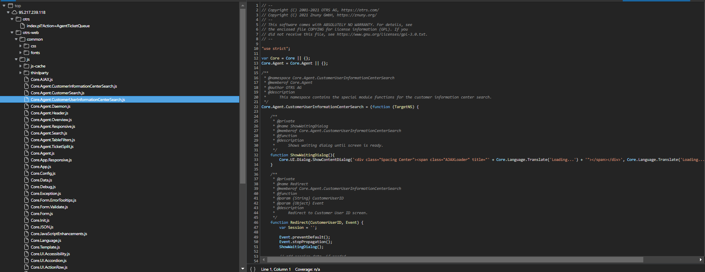
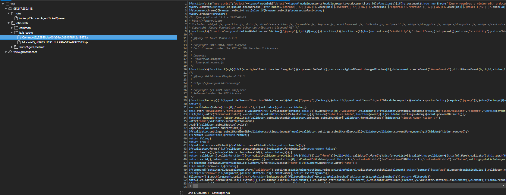

.. _PageNavigation how-it-works:

Znuny Internals
###############

Here you can learn about the interiors of the software. Knowing how the framework modules work together gives you the upper hand when developing. This section is not a how-to, but a what happens when and why.
   
Configuration Mechanism
************************
.. _HowItWorks ConfigMechanism:

We discuss the software's configuration mechanism here in this chapter; graphical interface (GUI - System Configuration) and file-based configuration. We address how the configuration works internally and how you can provide new configuration options or change existing default values.

System files generate the configuration for the software and the GUI. These files are.

Perl Configuration Files
========================
 
``Defaults.pm``
    Framework defaults.
    
.. important::
    
    Never modify or remove this file!

**Automatically Generated Configuration Files**

Under ``Kernel/Config/Files`` these files are automatically generated by the system.

``ZZZAAuto.pm``
    A perl cache file containing user-configured or default values.
``ZZZACL.pm``
    A perl cache file containing ACL configuration from the database.
``ZZZProcessManagement.pm``
    A perl cache file containing all process configuration from the database.

These files are a perl representation of the current system configuration. Never make manual changes to these files.

XML Configuration Files
=======================
.. _HowItWorks XMLFiles:

XML files define user configurable options for use in the GUI. These are specially formatted. 

.. note:: 
   
   To convert an older XML format, you can use 'otrs.Console.pl Dev::Tools::Migrate::ConfigXMLStructure' command. 

   This console command is only available in Znuny LTS 6.0.

The file ``Kernel/Config/Files/ZZZAAuto.pm`` is a cached Perl version of the XML that contains all settings with their current values. Generation happens during a system deployment. Manual redeployment is performed with ``bin/otrs.Console.pl Maint::Config::Rebuild``.

.. note::
    ``Kernel/Config/Files/ZZZAuto.pm`` does not exist anymore. It's now merged with ``Kernel/Config/Files/ZZZAAuto.pm``. Remove ``Kernel/Config/Files/Backups/ZZZAutoOTRS5.pm`` after a successful update.

Each XML config file has the following layout:

.. code-block:: xml

   <?xml version="1.0" encoding="utf-8" ?>
   <otrs_config version="2.0" init="Changes">
       <!--  settings will be here -->
   </otrs_config>
                        
The otrs_config element
~~~~~~~~~~~~~~~~~~~~~~~

``init``
    The global ``init`` attribute describes where the configuration options should be loaded. There are different levels available. These options will be loaded or overwitten in the following order: 
 
    * ``Framework``
      Framework settings like FQDN.
    * ``Application`` 
      Application Settings like Ticket::Hook.
    * ``Config``
      Extending options like for features as in ITSM.
    * ``Changes``
      Custom development for overwriting framework options.

The configuration items are written as ``Setting`` elements with a ``Description``, a ``Navigation`` group (for the tree-based navigation in the GUI) and the ``Value`` that it represents. Here's an example:

.. code-block:: xml

    <Setting Name="Ticket::Hook" Required="1" Valid="1">
        <Description Translatable="1">The identifier for a ticket, e.g. Ticket#, Call#, MyTicket#. The default is Ticket#.</Description>
        <Navigation>Core::Ticket</Navigation>
        <Value>
            <Item ValueType="String" ValueRegex="">Ticket#</Item>
        </Value>
    </Setting>
                        
Attributes of the ``Setting`` element
~~~~~~~~~~~~~~~~~~~~~~~~~~~~~~~~~~~~~~

``Required`` 
    If this is set to 1, the config setting cannot be disabled.

``Valid``
    Determines if the config setting is active (1) or inactive (0) by default.

``ConfigLevel``
    Sets the level of technical experience of the administrator. It can be 100 (Expert), 200 (Advanced) or 300 (Beginner). As a guideline which config level should be given to an option, it is recommended that all options having to do with the configuration of external interaction, like Sendmail, LDAP, SOAP, and others should get a config level of at least 200 (Advanced).

``Invisible``
    If set to 1, the config setting is not shown in the GUI.

**Guidelines for placing settings in the correct ``Navigation`` nodes**

* Only create new nodes if neccessary. Avoid nodes with only very few settings if possible.
* On the first tree level, no new nodes should be added.
* Don't place new settings in ``Core`` directly. This is reserved for a few important global settings.

``Core::*``
    These nodes accept new groups for settings convering similar topics (like ``Core::Email``) or relate to the same entity (like ``Core::Queue``).

* All event handler registrations go to ``Core::Event``.
* Don't add new direct child nodes within ``Frontend``.
  * Global front end settings go to ``Frontend::Base``, settings only affecting a part of the system go to the respective ``Admin, Agent, Customer`` or ``Public`` sub-nodes.
* Front end settings that only affect one screen should go to the relevant screen (``View``) node (create one if needed), for example ``AgentTicketZoom`` related settings go to ``Frontend::Agent::View::TicketZoom``. If there are module layers within one screen with groups of related settings, they would also go to a sub group here (e. g. ``Frontend::Agent::View::TicketZoom::MenuModule`` for all ticket zoom menu module registrations).
* All global Loader settings go to ``Frontend::Base::Loader``, screen specific Loader settings to ``Frontend::*::ModuleRegistration::Loader``.

**Structure of ``Value`` elements**

``Value`` 
    This element hold the actual configuration data payload. They can contain single values, hashes or arrays.

 ``Item``
    This element holds one piece of data.

``ValueType``
    An optional attribute dictating which kind of data the ``Item`` holds. Also, how to present the setting to the user in the GUI. If no ``ValueType`` is specified, it defaults to ``String``.

.. note:: 
    Please see below for a definition of the different value types.

.. code-block:: xml
    
    <Setting Name="Ticket::Hook" Required="1" Valid="1">
        <Description Translatable="1">The identifier for a ticket, e.g. Ticket#, Call#, MyTicket#. The default is Ticket#.</Description>
        <Navigation>Core::Ticket</Navigation>
        <Value>
            <Item ValueType="String" ValueRegex="">Ticket#</Item>
        </Value>
    </Setting>

``Array``
    With this config element arrays can be displayed.

.. code-block:: perl

    <Setting Name="SettingName">
       ...
        <Value>
            <Array>
                <Item Translatable="1">Value 1</Item>
                <Item Translatable="1">Value 2</Item>
                ...
            </Array>
        </Value>
    </Setting>
                                      
``Hash``
    With this config element hashes can be displayed.

.. code-block:: xml

    <Setting Name="SettingName">
        ...
        <Value>
            <Hash>
                <Item Key="One" Translatable="1">First</Item>
                <Item Key="Two" Translatable="1">Second</Item>
                ...
            </Hash>
        </Value>
    </Setting>
                       

It's possible to have nested array/hash elements (like hash of arrays, array of hashes, array of hashes of arrays, ...). Below is an example array of hashes.

.. code-block:: xml

    <Setting Name="ExampleAoH">
        ...
        <Value>
            <Array>
                <DefaultItem>
                    <Hash>
                    <Item></Item>
                    </Hash>
                </DefaultItem>
                <Item>
                    <Hash>
                    <Item Key="One">1</Item>
                    <Item Key="Two">2</Item>
                    </Hash>
                </Item>
                <Item>
                    <Hash>
                    <Item Key="Three">3</Item>
                    <Item Key="Four">4</Item>
                    </Hash>
                </Item>
            </Array>
        </Value>
    </Setting>
                                      
Value Types
^^^^^^^^^^^^

.. _HowItWorks value-types:

The XML config settings support various types of configuration variables.

String

.. code-block:: xml

    <Setting Name="SettingName">
        ...
        <Value>
            <Item ValueType="String" ValueRegex=""></Item>
        </Value>
    </Setting>
                                      
.. note::
    
    String is a config element for numbers and single-line strings. Checking the validity with a regular expression is possible (optional). The value String is the default ``ValueType``.

.. code-block:: perl

    <Setting Name="SettingName">
        ...
        <Value>
            <Item ValueType="String" ValueRegex="" Translatable="1">Value</Item>
        </Value>
    </Setting>
                        

The optional ``Translatable`` attribute marks this setting as translatable, which will cause it to be included in the translation files. This attribute can be placed on any tag (see also below).

Password
    A config element for passwords. It's still stored as plain text in the XML, but it's masked in the GUI.

.. code-block:: xml

    <Setting Name="SettingName">
        ...
        <Value>
            <Item ValueType="Password">Secret</Item>
        </Value>
    </Setting>
                                      
PerlModule
    A config element for Perl module. It has a ``ValueFilter`` attribute, which filters possible values for selection. In the example below, user can select Perl module ``Kernel::System::Log::SysLog`` or ``Kernel::System::Log::File``.

.. code-block:: xml

    <Setting Name="SettingName">
        ...
        <Value>
            <Item ValueType="PerlModule" ValueFilter="Kernel/System/Log/*.pm">Kernel::System::Log::SysLog</Item>
        </Value>
    </Setting>
                                      
Textarea
    A config element for multiline text.

.. code-block:: xml

    <Setting Name="SettingName">
        ...
        <Value>
            <Item ValueType="Textarea"></Item>
        </Value>
    </Setting>

Select
    This config element offers preset values as a pull-down menu. The ``SelectedID`` or ``SelectedValue`` attributes can pre-select a default value.

.. code-block:: xml

    <Setting Name="SettingName">
        ...
        <Value>
            <Item ValueType="Select" SelectedID="Queue">
                <Item ValueType="Option" Value="Queue" Translatable="1">Queue</Item>
                <Item ValueType="Option" Value="SystemAddress" Translatable="1">System address</Item>
            </Item>
        </Value>
    </Setting>

Checkbox
    This config element checkbox has two states: 0 or 1.

.. code-block:: xml

    <Setting Name="SettingName">
        ...
        <Value>
            <Item ValueType="Checkbox">0</Item>
        </Value>
    </Setting>

Date
    This config element contains a date value.

.. code-block:: xml

    <Setting Name="SettingName">
        ...
        <Value>
            <Item ValueType="Date">2016-02-02</Item>
        </Value>
    </Setting>

DateTime
    This config element contains a date and time value.

.. code-block:: xml

    <Setting Name="SettingName">
        ...
        <Value>
            <Item ValueType="DateTime">2016-12-08 01:02:03</Item>
        </Value>
    </Setting>

Directory
    This config element contains a directory.

.. code-block:: xml

    <Setting Name="SettingName">
        ...
        <Value>
            <Item ValueType="Directory">/etc</Item>
        </Value>
    </Setting>
                        
File
    This config element contains a file path.

.. code-block:: xml

    <Setting Name="SettingName">
        ...
        <Value>
            <Item ValueType="File">/etc/hosts</Item>
        </Value>
    </Setting>

Entity
    This config element contains a value of a particular entity. ``ValueEntityType`` attribute defines the entity type. Supported entities: ``DynamicField``, ``Queue``, ``Priority``, ``State`` and ``Type``. Consistency checks will ensure that only valid entities can be configured and that entities used in the configuration cannot be set to invalid. Also, when an entity is renamed, all referencing config settings will be updated.

.. code-block:: xml

    <Setting Name="SettingName">
        ...
        <Value>
            <Item ValueType="Entity" ValueEntityType="Queue">Junk</Item>
        </Value>
    </Setting>
                                      
TimeZone
    This config element contains a time zone value.

.. code-block:: xml

    <Setting Name="SettingName">
        ...
        <Value>
            <Item ValueType="TimeZone">UTC</Item>
        </Value>
    </Setting>

VacationDays
    This config element contains definitions for vacation days which are repeating each year. Following attributes are mandatory: ``ValueMonth``, ``ValueDay``.

.. code-block:: xml

    <Setting Name="SettingName">
        ...
        <Value>
            <Item ValueType="VacationDays">
                <DefaultItem ValueType="VacationDays"></DefaultItem>
                <Item ValueMonth="1" ValueDay="1" Translatable="1">New Year's Day</Item>
                <Item ValueMonth="5" ValueDay="1" Translatable="1">International Workers' Day</Item>
                <Item ValueMonth="12" ValueDay="24" Translatable="1">Christmas Eve</Item>
            </Item>
        </Value>
    </Setting>

VacationDaysOneTime
    This config element contains definitions for vacation days which occur only once. Following attributes are mandatory: ``ValueMonth``, ``ValueDay`` and ``ValueYear``.

.. code-block:: xml

    <Setting Name="SettingName">
        ...
        <Value>
            <Item ValueType="VacationDaysOneTime">
                <Item ValueYear="2004" ValueMonth="1" ValueDay="1">test</Item>
            </Item>
        </Value>
    </Setting>

WorkingHours
    This config element contains definitions for working hours.

.. code-block:: xml

    <Setting Name="SettingName">
        ...
        <Value>
            <Item ValueType="WorkingHours">
                <Item ValueType="Day" ValueName="Mon">
                    <Item ValueType="Hour">8</Item>
                    <Item ValueType="Hour">9</Item>
                </Item>
                <Item ValueType="Day" ValueName="Tue">
                    <Item ValueType="Hour">8</Item>
                    <Item ValueType="Hour">9</Item>
                </Item>
            </Item>
        </Value>
    </Setting>
                    
Frontend Registration
    Module registration for Agent Interface:

.. code-block:: xml

    <Setting Name="SettiFrontend::Module###AgentModuleName">
        ...
        <Value>
            <Item ValueType="FrontendRegistration">
                <Hash>
                    <Item Key="Group">
                        <Array>
                        </Array>
                    </Item>
                    <Item Key="GroupRo">
                        <Array>
                        </Array>
                    </Item>
                    <Item Key="Description" Translatable="1">Phone Call.</Item>
                    <Item Key="Title" Translatable="1">Phone-Ticket</Item>
                    <Item Key="NavBarName">Ticket</Item>
                </Hash>
            </Item>
        </Value>
    </Setting>

DefaultItem in Array and Hash
~~~~~~~~~~~~~~~~~~~~~~~~~~~~~~

The new XML structure allows us to create complex structures. Therefore we need ``DefaultItem`` entries to describe the structure of the Array/Hash. If it's not provided, system considers that you want simple Array/Hash with scalar values. ``DefaultItem`` is used as a template when adding new elements, so it can contain additional attributes, like ``ValueType``, and it can define default values.

**Here are few examples:**

Array of Array with Select items
^^^^^^^^^^^^^^^^^^^^^^^^^^^^^^^^^

.. code-block:: xml

    <Array>
        <DefaultItem>
            <Array>
                <DefaultItem ValueType="Select" SelectedID='option-2'>
                    <Item ValueType="Option" Value="option-1">Option 1</Item>
                    <Item ValueType="Option" Value="option-2">Option 2</Item>
                </DefaultItem>
            </Array>
        </DefaultItem>
        ...
    </Array>

Hash of Hash with Date items
^^^^^^^^^^^^^^^^^^^^^^^^^^^^^^^^^

.. code-block:: xml

    <Hash>
        <DefaultItem>
            <Hash>
                <DefaultItem ValueType="Date">2017-01-01</DefaultItem>
            </Hash>
        </DefaultItem>
        ...
    </Hash>

Accessing Config Options at Runtime
~~~~~~~~~~~~~~~~~~~~~~~~~~~~~~~~~~~~

You can read and write (for one request) the config options via the core module ``Kernel::Config``.

If you want to read a config option:

.. code-block:: perl

    my $ConfigOption = $Kernel::OM->Get('Kernel::Config')->Get('Prefix::Option');
                        

If you want to change a config option at runtime and just for this one request/process:

.. code-block:: perl

    $Kernel::OM->Get('Kernel::Config')->Set(
        Key => 'Prefix::Option'
        Value => 'SomeNewValue',
    );

Database Mechanism
*******************

The software includes its own database layer that supports different databases.

**How it works**

The database layer (``Kernel::System::DB``) supports two inputs:

* SQL
* XML.

SQL
====

The SQL interface should be used for normal database actions (SELECT, INSERT, UPDATE, ...). It can be used like a normal Perl DBI interface.

**CRUD Operations**

SQL Create
~~~~~~~~~~

.. code-block:: perl

   $Kernel::OM->Get('Kernel::System::DB')->Do(
         SQL=> "INSERT INTO table (name, id) VALUES ('SomeName', 123)",
   );

SQL Read
~~~~~~~~~

.. code-block:: perl

   my $SQL = "SELECT id FROM table WHERE tn = '123'";

   $Kernel::OM->Get('Kernel::System::DB')->Prepare(SQL => $SQL, Limit => 15);

   while (my @Row = $Kernel::OM->Get('Kernel::System::DB')->FetchrowArray()) {
         $Id = $Row[0];
   }
   return $Id;

.. note::
   
   Take care to use ``Limit`` as param and not in the SQL string because not all databases support LIMIT in SQL strings.

.. code-block:: perl

   my $SQL = "SELECT id FROM table WHERE tn = ? AND group = ?";

   $Kernel::OM->Get('Kernel::System::DB')->Prepare(
         SQL   => $SQL,
         Limit => 15,
         Bind  => [ $Tn, $Group ],
   );

   while (my @Row = $Kernel::OM->Get('Kernel::System::DB')->FetchrowArray()) {
         $Id = $Row[0];
   }
   return $Id;

SQL Update
~~~~~~~~~~~

.. code-block:: perl

   $Kernel::OM->Get('Kernel::System::DB')->Do(
         SQL=> "UPDATE table SET name = 'SomeName', id = 123",
   );

SQL Delete
~~~~~~~~~~~

.. code-block:: perl
   
   $Kernel::OM->Get('Kernel::System::DB')->Do(
         SQL=> "DELETE FROM table WHERE id = 123",
   );
                           
.. note::
   
   Use the ``Bind`` attribute where ever you can, especially for long statements. If you use ``Bind`` you do not need the function ``Quote()``.

Statement Quoting
~~~~~~~~~~~~~~~~~

**String**

.. code-block:: perl

   my $QuotedString = $Kernel::OM->Get('Kernel::System::DB')->Quote("It's a problem!");
                        

**Integer**

.. code-block:: perl

   my $QuotedInteger = $Kernel::OM->Get('Kernel::System::DB')->Quote('123', 'Integer');
                        

**Number**

.. code-block:: perl

   my $QuotedNumber = $Kernel::OM->Get('Kernel::System::DB')->Quote('21.35', 'Number');
                        

.. important::
   
   Please use the ``Bind`` attribute instead of ``Quote()`` wherever possible.

XML
====

The XML interface should be used for INSERT, CREATE TABLE, DROP TABLE, and ALTER TABLE. 
This syntax can differ depending upon the used database. XML format ensures cross-platform compatibility.

.. note::
   
   The ``<Insert>`` syntax has changed in >=2.2. Values are now used in the tag content (not longer in an attribute).

**CRUD Operations**

XML Create
~~~~~~~~~~

.. code-block:: xml

   <TableCreate Name="calendar_event">
         <Column Name="id" Required="true" PrimaryKey="true" AutoIncrement="true" Type="BIGINT"/>
         <Column Name="title" Required="true" Size="250" Type="VARCHAR"/>
         <Column Name="content" Required="false" Size="250" Type="VARCHAR"/>
         <Column Name="start_time" Required="true" Type="DATE"/>
         <Column Name="end_time" Required="true" Type="DATE"/>
         <Column Name="owner_id" Required="true" Type="INTEGER"/>
         <Column Name="event_status" Required="true" Size="50" Type="VARCHAR"/>
         <Index Name="calendar_event_title">
            <IndexColumn Name="title"/>
         </Index>
         <Unique Name="calendar_event_title">
            <UniqueColumn Name="title"/>
         </Unique>
         <ForeignKey ForeignTable="users">
            <Reference Local="owner_id" Foreign="id"/>
         </ForeignKey>
   </TableCreate>

Possible data types are: 

* ``BIGINT``
* ``SMALLINT``
* ``INTEGER``
* ``VARCHAR`` 
* ``DATE``
* ``LONGBLOB``

``VARCHAR``
   
   The *Size* attribute is needed and is a value from 1 to 1000000.

``DATE``

   The date format is ``yyyy-mm-dd hh:mm:ss``.

``LONGBLOB``
   
   Columns need special treatment. Their content needs to be ``Base64`` transcoded if the database driver does not support the feature ``DirectBlob``. Please see the following example:

.. code-block:: perl

   my $Content = $StorableContent;
   if ( !$DBObject->GetDatabaseFunction('DirectBlob') ) {
         $Content = MIME::Base64::encode_base64($StorableContent);
   }
               

Similarly, when reading from such a column, the content must not automatically be decoded as ``UTF-8`` by passing the ``Encode => 0`` flag to ``Prepare()``:

.. code-block:: perl

   return if !$DBObject->Prepare(
         SQL => '
            SELECT content_type, content, content_id, content_alternative, disposition, filename
            FROM article_data_mime_attachment
            WHERE id = ?',
         Bind   => [ \$AttachmentID ],
         Encode => [ 1, 0, 0, 0, 1, 1 ],
   );

   while ( my @Row = $DBObject->FetchrowArray() ) {

         $Data{ContentType} = $Row[0];

         # Decode attachment if it's e. g. a postgresql backend.
         if ( !$DBObject->GetDatabaseFunction('DirectBlob') ) {
            $Data{Content} = decode_base64( $Row[1] );
         }
         else {
            $Data{Content} = $Row[1];
         }
         $Data{ContentID}          = $Row[2] || '';
         $Data{ContentAlternative} = $Row[3] || '';
         $Data{Disposition}        = $Row[4];
         $Data{Filename}           = $Row[5];
   }

XML Read
~~~~~~~~

Read is used only in the SQL format.

XML Update
~~~~~~~~~~~

.. code-block:: xml

   <Insert Table="some_table">
         <Data Key="id">1</Data>
         <Data Key="description" Type="Quote">exploit</Data>
   </Insert>

XML Delete
~~~~~~~~~~~~

Delete is used only in the SQL format.

**Other Operations**

Drop a Table
~~~~~~~~~~~~~

.. code-block:: xml
   
   <TableDrop Name="calendar_event"/>
                           

Alter a Table
~~~~~~~~~~~~~

The following shows an example of add, change, and drop columns.

.. code-block:: xml

   <TableAlter Name="calendar_event">
         <ColumnAdd Name="test_name" Type="varchar" Size="20" Required="true"/>

         <ColumnChange NameOld="test_name" NameNew="test_title" Type="varchar" Size="30" Required="true"/>

         <ColumnChange NameOld="test_title" NameNew="test_title" Type="varchar" Size="100" Required="false"/>

         <ColumnDrop Name="test_title"/>

         <IndexCreate Name="index_test3">
            <IndexColumn Name="test3"/>
         </IndexCreate>

         <IndexDrop Name="index_test3"/>

         <UniqueCreate Name="uniq_test3">
            <UniqueColumn Name="test3"/>
         </UniqueCreate>

         <UniqueDrop Name="uniq_test3"/>
   </TableAlter>
                           
Rename a Table
~~~~~~~~~~~~~~~
               
.. code-block:: xml               

   <TableAlter NameOld="calendar_event" NameNew="calendar_event_new"/>
                           

Statement Processing
=====================

You need code to process your XML formatted SQL Statements.

.. code-block:: perl

   my @XMLARRAY = @{$Self->ParseXML(String => $XML)};

   my @SQL = $Kernel::OM->Get('Kernel::System::DB')->SQLProcessor(
         Database => \@XMLARRAY,
   );
   push(@SQL, $Kernel::OM->Get('Kernel::System::DB')->SQLProcessorPost());

   for (@SQL) {
         $Kernel::OM->Get('Kernel::System::DB')->Do(SQL => $_);
   }
                           
Database Drivers
=================

``$OTRS_HOME/Kernel/System/DB/*.pm`` is the location  

Supported Databases
~~~~~~~~~~~~~~~~~~~

Databases house either the application database or external tables for users, customers, dynamic fields, among other uses.

**Internal Tables**

Tables delivered and used by the application can be housed in:

* MySQL
* PostgreSQL
* Oracle

**External Table**

Other data can additionally reside on:

* Microsoft SQL Server

Log Mechanism
**************

System Log
===========

The framework comes with a system log backend for application logging and debugging.

The ``Log`` object can be accessed and used via the ```ObjectManager`` like this:

.. code-block:: perl

    $Kernel::OM->Get('Kernel::System::Log')->Log(
          Priority => 'error',
          Message  => 'Need something!',
    );
                     
Log messages are written based on the configured log level set in the system configuration ( ``MinimumLogLevel``), and their *Priority* flag.

The order of log levels is (low to high priority order):

* ``debug``
* ``info``
* ``notice``
* ``error``

Log messages of the configured priority, or higher, are logged by the system logger.

The system log output works with a syslog daemon, or log file, depending on the selected module in the system configuration (``LogModule``).

Communication Log
==================

.. _HowItWorks CommunicationLog:

A specialized logging backend for message communications exists. The system has dedicated tables and front-end modules to track and display communication log information for easier debugging and operational overview.

To use, first create a non-singleton instance of the communication log object:

Create an Instance
~~~~~~~~~~~~~~~~~~~

.. code-block:: perl

   my $CommunicationLogObject = $Kernel::OM->Create(
         'Kernel::System::CommunicationLog',
         ObjectParams => {
            Transport   => 'Email',     # Transport log module
            Direction   => 'Incoming',  # Incoming|Outgoing
            AccountType => 'POP3',      # Mail account type
            AccountID   => 1,           # Mail account ID
         },
   );
               

When you have a communication log object instance, you can start an object log for logging individual messages. There are two object logs currently implemented: ``Connection`` and ``Message``.

Log Type Connection
~~~~~~~~~~~~~~~~~~~

``Connection``
   This object log logs any connection-related messages. For example: Authenticating to a server or retrieval-information).

Start a Communication Log
^^^^^^^^^^^^^^^^^^^^^^^^^^

Start the object log by declaring its type, and you can use it immediately:

.. code-block:: perl

   $CommunicationLogObject->ObjectLogStart(
         ObjectLogType => 'Connection',
   );

   $CommunicationLogObject->ObjectLog(
         ObjectLogType => 'Connection',
         Priority      => 'Debug',                              # Trace, Debug, Info, Notice, Warning or Error
         Key           => 'Kernel::System::MailAccount::POP3',
         Value         => "Open connection to 'host.example.com' (user-1).",
   );
                     
.. important:: 

   The communication log object instance handles the currently started object logs, so you don't need to remember and bring them around everywhere, but it also means that you can only start one object per type.

Close a Communication Log
^^^^^^^^^^^^^^^^^^^^^^^^^^

If you encounter an unrecoverable error, you can choose to close the object log and mark it as failed:

.. code-block:: perl

   $CommunicationLogObject->ObjectLog(
         ObjectLogType => 'Connection',
         Priority      => 'Error',
         Key           => 'Kernel::System::MailAccount::POP3',
         Value         => 'Something went wrong!',
   );

   $CommunicationLogObject->ObjectLogStop(
         ObjectLogType => 'Connection',
         Status        => 'Failed',
   );
                     
Mark as Failed Communication
^^^^^^^^^^^^^^^^^^^^^^^^^^^^

In turn, you can mark the communication log as a failure as well:

.. code-block:: perl

   $CommunicationLogObject->CommunicationStop(
         Status => 'Failed',
   );
                     
Stop a Communication Log
^^^^^^^^^^^^^^^^^^^^^^^^^

Otherwise, stop the object log and communication log as success:

.. code-block:: perl

   $CommunicationLogObject->ObjectLog(
         ObjectLogType => 'Connection',
         Priority      => 'Debug',
         Key           => 'Kernel::System::MailAccount::POP3',
         Value         => "Connection to 'host.example.com' closed.",
   );

   $CommunicationLogObject->ObjectLogStop(
         ObjectLogType => 'Connection',
         Status        => 'Successful',
   );

   $CommunicationLogObject->CommunicationStop(
         Status => 'Successful',
   );
                     
Log Type Message
~~~~~~~~~~~~~~~~

``Message`` 

   This object log is for any log entries regarding specific messages and their processing. Usage is similar. Just make sure to start it before using it:

Start a Message Log
^^^^^^^^^^^^^^^^^^^

.. code-block:: perl

   $CommunicationLogObject->ObjectLogStart(
         ObjectLogType => 'Message',
   );


Mark as  Failed Message
^^^^^^^^^^^^^^^^^^^^^^^

.. code-block:: perl

   $CommunicationLogObject->ObjectLogStop(
         ObjectLogType => 'Message',
         Status        => 'Failed',
   );

Stop a Message Log
^^^^^^^^^^^^^^^^^^^

.. code-block:: perl

   $CommunicationLogObject->ObjectLog(
         ObjectLogType => 'Message',
         Priority      => 'Error',
         Key           => 'Kernel::System::MailAccount::POP3',
         Value         => "Could not process message. Raw mail saved (report it on http://bugs.otrs.org/)!",
   );

   $CommunicationLogObject->ObjectLogStop(
         ObjectLogType => 'Message',
         Status        => 'Failed',
   );

Close a Message Log
^^^^^^^^^^^^^^^^^^^

.. code-block:: perl

   $CommunicationLogObject->CommunicationStop(
         Status => 'Failed',
   );
               

You also may link the log object and later lookup the communications for one object type and ID:

.. code-block:: perl

   $CommunicationLogObject->ObjectLookupSet(
         ObjectLogType    => 'Message',
         TargetObjectType => 'Article',
         TargetObjectID   => 2,
   );

   my $LookupInfo = $CommunicationLogObject->ObjectLookupGet(
         TargetObjectType => 'Article',
         TargetObjectID   => 2,
   );
                     
Good Practice Logging
======================

Always stop the log and flag it as failed if any log object fails. Administrators then can see failed communications in the overview and take any needed actions.

Retaining a log during the lifespan of a process is essential! Therefore, passing the existing communication log to other methods is possible. This approach collects needed information from all other parts of the function during its processing.

During an asynchronus task you can also choose to recreate the communication log object using its current state. Just get the communication ID and pass it to the new code, and then create the instance with this parameter supplied:

.. code-block:: perl

   # Get communication ID in parent code.
   my $CommunicationID = $CommunicationLogObject->CommunicationIDGet();

   # Somehow pass communication ID to child code.
   # ...

   # Recreate the instance in child code by using same communication ID.
   my $CommunicationLogObject = $Kernel::OM->Create(
         'Kernel::System::CommunicationLog',
         ObjectParams => {
            CommunicationID => $CommunicationID,
         },
   );
                     

Normal usage applies to this new object.

If you need to retrieve the communication log data or do something else with it, please also take a look at the Perl documentation for ``Kernel::System::CommunicationLog::DB.pm``.

Date and Time
**************

The framework comes with it's own package to handle date and time ensuring correct calculation and storage of date and time.

Dates and date-times are a ``DateTime`` object (see ``perldoc Kernel::System::DateTime``). Every ``DateTime`` object holds it's own date, time, and time zone information. In contrast to the deprecated ``Kernel::System::Time`` package, this means that you create a ``DateTime`` object for every date or date-time you want to use.

Creating a DateTime Object
===========================

The object manager  ``Create`` method supports packages with multiple object instance.

.. code-block:: perl

   my $DateTimeObject = $Kernel::OM->Create(
         'Kernel::System::DateTime',
         ObjectParams => {
            TimeZone => 'Europe/Berlin'
         },
   );
                     

The example above creates a ``DateTime`` object for the current date and time in time zone Europe/Berlin. There are more options to create a ``DateTime`` object (time components, string, time-stamp, cloning). See ``perldoc Kernel::System::DateTime``.

.. note::
   
   You will get an error if you try to retrieve a ``DateTime`` object via ``$Kernel::OM->Get('Kernel::System::DateTime')``.

Time zones
===========

A ``DateTime`` object takes care o timezone conversion. If you want to convert to another timezone simply use the following example.

.. code-block:: perl

   $DateTimeObject->ToTimeZone( TimeZone => 'Europe/Berlin' );
                     

``OTRSTimeZone``
   
   This setting defines the timezone that Znuny uses internally to store dates and times in the database.

.. note::

   A ``DateTime`` object must be converted to ``OTRSTimeZone`` before storage in the database.
   
Convert to System Time
~~~~~~~~~~~~~~~~~~~~~~

To keep timezone consistency, use ``ToOTRSTimeZone()``) to convert the current time to application time. An exception could be that you explicitly want a database column to hold a date/time in a specific timezone. 

.. important:: 

   The database itself won't provide timezone information.

Timezone Listing
~~~~~~~~~~~~~~~~~

``TimeZoneList()`` of ``Kernel::System::DateTime`` provides a list of available time zones.

DateTime Important Methods
~~~~~~~~~~~~~~~~~~~~~~~~~~

The ``Kernel::System::DateTime`` package provides the main methods shown below (this list is only a selection, see source code for details).

``Create()`` or ``Clone()``

   Creates a new ``DateTime`` object can be created using the object manager's ``Create()``. method or cloned using another ``DateTime`` object with its ``Clone()`` method.

``Get()``

   Returns objects data as a hash.

``Set()``

   Change ``DateTime`` object components (year, month, day, hour, minute, second) or set a date and time based on a given string ('2016-05-24 23:04:12'). 
   
.. note::
   
   Note that you cannot change the time zone with this method.

``ToTimeZone()``
   
   Change the time zone of a ``DateTime`` object or as a shortcut for converting to the application's timezone ``ToOTRSTimeZone()``.

``OTRSTimeZoneGet()``

   Get the application's timezone or user default time

``UserDefaultTimeZoneGet()``

   Get the default user time zone.
         
.. important:: text
   
   Never retrieve these settings manually with ``Kernel::Config``.

``Compare()``
   
   ``Kernel::System::DateTime`` uses operator overloading for comparisons. Compare two ``DateTime`` objects with <, <=, ==, !=, >= and >.  is usable in Perl's sort context as it returns -1, 0 or 1.

Legacy Time
===========

The deprecated package ``Kernel::System::Time`` has been extended and fully supports time zones instead of time offsets to ensure that existing code works without (much) change.

.. important:: 
   
   There is a case requiring code change. If you have code using offsets to calculate a new date/time or date/time difference, you have to migrate this code to use the new ``DateTime`` object.

Time Code Conversion
====================

**Old**

.. code-block:: perl

   my $TimeObject     = $Kernel::OM->Get('Kernel::System::Time'); # Assume a time offset of 0 for this time object
   my $SystemTime     = $TimeObject->TimeStamp2SystemTime( String => '2004-08-14 22:45:00' );
   my $UserTimeZone   = '+2'; # normally retrieved via config or param
   my $UserSystemTime = $SystemTime + $UserTimeZone * 3600;
   my $UserTimeStamp  = $TimeObject->SystemTime2TimeStamp( SystemTime => $UserSystemTime );
                     

**New**

.. code-block:: perl

   my $DateTimeObject = $Kernel::OM->Create('Kernel::System::DateTime'); # This implicitly uses the configured timezone of the value OTRSTimeZone when creating the object.
   my $UserTimeZone   = 'Europe/Berlin'; # normally retrieved via config or param
   $DateTimeObject->ToTimeZone( TimeZone => $UserTimeZone );
   my $SystemTime    = $DateTimeObject->ToEpoch(); # note that the epoch is independent from the time zone, it's always calculated for UTC
   my $UserTimeStamp = $DateTimeObject->ToString();

Loader Mechanism
****************
.. _HowItWorks LoaderMechanism:

The loader provides scalability and performance fro loading the increasing number of CSS and JS files required for the framework.

How it works
============

Simply put, the "Loader":

* determines for each request precisely which CSS and JavaScript files are needed at the client side by the current application module
* collects all the relevant data
* minifies the data, removing unnecessary whitespace and documentation
* serves it to the client in only a few HTTP requests instead of many individual ones, allowing the client to cache these snippets in the browser cache
* performs these tasks in a highly performing way, utilizing the caching mechanisms.

This oversimplification should suffice to get you started.

Basic Operation
================

The configuration settings ``Loader::Enabled::CSS`` and ``Loader::Enabled::JS``, determine if CSS and JavaScript loading is used. By default, they are on.

.. warning::
   
   Because of rendering problems in Internet Explorer, the Loader cannot be turned off for CSS files for this client browser (config setting will be overridden). Up to version 8, Internet Explorer cannot handle more than 32 CSS files on a page.

Turning off the "Loader" and reloading the page in your browser, you will see all CSS files loaded in the ``<head>`` or section of the page, and many JavaScript files at the bottom of the page, just before the closing ``</body>`` element.

Here the developer tools when the "Loader" is off:



Turn on the "Loader" again and reload your page now. Now you can see that there are "Loader" very few CSS and JavaScript tags in the HTML code, like this:

Javascript Minified Header
~~~~~~~~~~~~~~~~~~~~~~~~~~

Here the developer tools when the "Loader" is on:



.. code-block:: html

   <script type="text/javascript" src="/otrs30-dev-web/js/js-cache/CommonJS_d16010491cbd4faaaeb740136a8ecbfd.js"></script>

   <script type="text/javascript" src="/otrs30-dev-web/js/js-cache/ModuleJS_b54ba9c085577ac48745f6849978907c.js"></script>

Looking at the example above, we see that the "Loader" generated (or read them from cache) two files and put them within the ``<script>`` tag. instead of linking to all relevant JavaScript files separately (as you saw it without the "Loader" activated).

Not using the "Loader" results in:

* Extra HTTP requests
* Unnecessary content

.. note::
   
   Turn off the "Loader" when troubleshooting or during development for readability. Never do this on a production system.

CSS Minified Header
~~~~~~~~~~~~~~~~~~~

The CSS section looks a little more complicated:

.. code-block:: html

         <link rel="stylesheet" type="text/css" href="/otrs30-dev-web/skins/Agent/default/css-cache/CommonCSS_00753c78c9be7a634c70e914486bfbad.css" />

   <!--[if IE 7]>
         <link rel="stylesheet" type="text/css" href="/otrs30-dev-web/skins/Agent/default/css-cache/CommonCSS_IE7_59394a0516ce2e7359c255a06835d31f.css" />
   <![endif]-->

   <!--[if IE 8]>
         <link rel="stylesheet" type="text/css" href="/otrs30-dev-web/skins/Agent/default/css-cache/CommonCSS_IE8_ff58bd010ef0169703062b6001b13ca9.css" />
   <![endif]-->
                     

As Internet Explorer 7 and 8 need special treatment for lack of support of some standard web technologies. The speical CSS loads alongside standard CSS. These are so-called "conditional comments" and cause the CSS to only load for Internet Explorer 7 and 8. All other browsers ignore it.

Conclusion
~~~~~~~~~~~~

Let's now, learn to utilize the "Loader" in your extensions.

* Configure the "Loader" for your purpose.
* Load additional, or alternative, CSS or JavaScript files into the configuration.

Configuring the Loader
=======================

The "Loader" settings are in the system configuration.

Settings are hashes so that extensions can add new hash keys for additional content to be loaded.

Javascript
~~~~~~~~~~

.. _LoaderMechanism Javascript:

The loading order is for files is:

* Common Files (Framework)
* Special Files (Module)

Common JavaScript
^^^^^^^^^^^^^^^^^^

``Loader::Agent::CommonJS``

   Framework files loaded for use in the agent frontend.

``Loader::Customer::CommonJS``

   Framework files loaded for use in the customer frontend.

Let's look at an example:

``Loader::Agent::CommonJS###000-Framework``

   A list of JavaScript files which always need to be loaded for the agent interface.

.. code-block:: xml

   <Setting Name="Loader::Agent::CommonJS###000-Framework" Required="1" Valid="1">
         <Description Translatable="1">List of JS files to always be loaded for the agent interface.</Description>
         <Navigation>Frontend::Base::Loader</Navigation>
         <Value>
            <Array>
               <Item>thirdparty/jquery-3.2.1/jquery.js</Item>
               <Item>thirdparty/jquery-browser-detection/jquery-browser-detection.js</Item>

               ...

               <Item>Core.Agent.Header.js</Item>
               <Item>Core.UI.Notification.js</Item>
               <Item>Core.Agent.Responsive.js</Item>
            </Array>
         </Value>
   </Setting>
                     

Just adding new XML configurations to your package extends this setting.

.. code-block:: xml
   
   <Setting Name="Loader::Agent::CommonJS###000-Framework" Required="1" Valid="1">
         <Description Translatable="1">List of JS files to always be loaded for the agent interface.</Description>
         <Navigation>Frontend::Base::Loader</Navigation>
         <Value>
               <Array>
                     <Item>thirdparty/jquery-3.2.1/jquery.js</Item>
               </Array>
         </Value>
   </Setting>
                            

Module-Specific JavaScript
^^^^^^^^^^^^^^^^^^^^^^^^^^^

Configure JavaScript for exclusive use by a module in the system configuration. In the following example, the exclusively used JavaScript for the agent dashboard is loaded in the module registration setting.

.. code-block:: xml

   <Setting Name="Loader::Module::AgentDashboard###001-Framework" Required="0" Valid="1">
         <Description Translatable="1">Loader module registration for the agent interface.</Description>
         <Navigation>Frontend::Agent::ModuleRegistration::Loader</Navigation>
         <Value>
            <Hash>
               <Item Key="CSS">
                     <Array>
                        <Item>Core.Agent.Dashboard.css</Item>

                        ...

                     </Array>
               </Item>
               <Item Key="JavaScript">
                     <Array>
                        <Item>thirdparty/momentjs-2.18.1/moment.min.js</Item>
                        <Item>thirdparty/fullcalendar-3.4.0/fullcalendar.min.js</Item>
                        <Item>thirdparty/d3-3.5.6/d3.min.js</Item>
                        <Item>thirdparty/nvd3-1.7.1/nvd3.min.js</Item>
                        <Item>thirdparty/nvd3-1.7.1/models/OTRSLineChart.js</Item>
                        <Item>thirdparty/nvd3-1.7.1/models/OTRSMultiBarChart.js</Item>
                        <Item>thirdparty/nvd3-1.7.1/models/OTRSStackedAreaChart.js</Item>
                        <Item>thirdparty/canvg-1.4/rgbcolor.js</Item>
                     </Array>
               </Item>
            </Hash>
         </Value>
   </Setting>
                     

.. note::
   It is possible to put a ``<Item Key="JavaScript">`` tag in the frontend module registrations containing an ``<Array>`` element with one tag ``<Item>`` per JavaScript file to be loaded for this application module.

Summary
^^^^^^^^^^

Now you've all the needed information for configuring the "Loader" for JavaScript.

CSS
~~~~

The "Loader" handles CSS files similarly to JavaScript files. This is described in the above :ref:`section <LoaderMechanism Javascript>`. Extending these settings is similar as well. Therefore there is no need to repeat this (as in `DRY <https://en.wikipedia.org/wiki/Don't_repeat_yourself>`_). If you have questions, you may always ask in the community for more help.


Internationalization Mechanism
*******************************

There are four steps needed to translate / localize software: 

* Mark Translatable Strings
* Generate Translations
* Translate Strings
* Apply Translations

Mark Translatable Strings
==========================

In Perl code, all literal strings to be translated are automatically marked for translation: ``$LanguageObject->Translate('My string %s', $Data)`` will mark 'My string %s' for translation. If you need to mark a string and translate it later, you can use the NOOP method ``Kernel::Langauge::Translatable()``.

.. code-block:: perl

   my $UntranslatedString = Translatable('My string %s');
 

All literal strings enclosed in ``Translate()``-Tag within template files are automatically marked for extraction: 

   ``[% Translate('My string %s', Data.Data )%]``

In SysConfig and Database XML files you can mark strings for extraction with the ``Translatable="1"`` attribute.

.. code-block:: xml
   
   # Database XML
   <Insert Table="groups">
         <Data Key="id" Type="AutoIncrement">1</Data>
         ...
         <Data Key="comments" Type="Quote" Translatable="1">Group for default access.</Data>
         ...
   </Insert>

   # SysConfig XML
   <Setting>
         <Option SelectedID="0">
               <Item Key="0" Translatable="1">No</Item>
               <Item Key="1" Translatable="1">Yes</Item>
         </Option>
   </Setting>

Generate Translations
======================

To collect translatable strings into the translation files, use the console command ``otrs.Console.pl Dev::Tools::TranslationsUpdate``. This command parses source files for all translatable strings. The script then places the strings into the translation file.

For the framework and other modules listed in our Weblate, the script creates .pot and .po files. These files are used to push the translatable strings to `Weblate <https://weblate.org/en/>`_ and pull the translations from there.

For performance, the framework uses Perl files for translations. 

``otrs.Console.pl Dev::Tools::TranslationsUpdate`` generates these files as well. 

There are two different translation cache file types. These are used in the following order. 

Duplicate translations result in the use of the last translation.


``Kernel/Language/$Language.pm``

   Default Framework Translation File

``Kernel/Language/$Language_Custom.pm``

   Custom Translation File

Translation Files
=================

Framework Translation
~~~~~~~~~~~~~~~~~~~~~

The base framework language is English!

The default framework translation file includes all framework or extension strings to be translated. The following is an example:

.. code-block:: perl

   package Kernel::Language::de;

   use strict;
   use warnings;

   use vars qw(@ISA $VERSION);

   sub Data {
       my $Self = shift;

       # $$START$$

       # possible charsets
       $Self->{Charset} = ['iso-8859-1', 'iso-8859-15', ];
       # date formats (%A=WeekDay;%B=LongMonth;%T=Time;%D=Day;%M=Month;%Y=Jear;)
       $Self->{DateFormat} = '%D.%M.%Y %T';
       $Self->{DateFormatLong} = '%A %D %B %T %Y';
       $Self->{DateFormatShort} = '%D.%M.%Y';
       $Self->{DateInputFormat} = '%D.%M.%Y';
       $Self->{DateInputFormatLong} = '%D.%M.%Y - %T';

       $Self->{Translation} = {
       # Template: AAABase
       ##.......
       'Yes' => 'Ja',
       'No' => 'Nein',
       'yes' => 'ja',
       'no' => 'kein',
       'Off' => 'Aus',
       'off' => 'aus',
       ##......
       };
       # $$STOP$$
       return 1;
   }

   1;
    
Custom Translation File
~~~~~~~~~~~~~~~~~~~~~~~

Since this file is processed last, the string translation here wins. To add a specialized translation, add a custom file for your language.

**Make a copy:**

.. code-block:: shell

   bash ~/Kernel/Language># cp xx_Custom.pm > en_Custom.pm

**Modify for Use:**

.. code-block:: perl

   package Kernel::Language::en_Custom; # Use the filename in the format
                                        # lang_Custom.pm

   use strict;
   use warnings;

   use vars qw(@ISA $VERSION);

   sub Data {
       my $Self = shift;

       # $$START$$

       # own translations
       $Self->{Translation}->{'Lock'} = 'in progress';
       $Self->{Translation}->{'Unlock'} = 'for action';

       # $$STOP$$
       return 1;
   }

   1;

Translate Strings
===================

Znuny uses Weblate to manage the translation process.

Apply Translations
===================

You can use the method ``$LanguageObject->Translate()`` to translate strings at runtime from Perl code, and the ``Translate()``-Tag in templates.

.. |pipe| unicode:: U+01c0

Template Mechanism
*******************

Internally, the framework uses a templating mechanism to dynamically generate its HTML pages (and other content), while keeping the program logic (Perl) and the presentation (HTML) separate. Typically, a frontend module will use an own template file, pass some data to it and return the rendered result to the user.

The template files are under ``Kernel/Output/HTML/Standard/*.tt``

The framework relies on `the Template::Toolkit renderin engine <https://template-toolkit.org/>`__. The ful Template::Toolkit syntax can be used in templates. This sectio describes some example use cases and framework extensions to the
Template::Toolkit syntax.

Template Commands
==================

Inserting Dynamic Data
~~~~~~~~~~~~~~~~~~~~~~~

In templates, dynamic data must be inserted, quoted etc. This section lists the relevant commands to do that.

[% Data.Name %]
    If data parameters are given to the templates by the application module, these data can be output to the template. "[% Data.Name %]" is the most simple, but also most dangerous one. It will insert the data parameter whose name is ``Name`` into the template as it is, without further processing.

.. warning::

   Because of the missing HTML quoting, this can result in security problems. Never output data that was input by a user without quoting in HTML context. The user could - for example - just insert a ``<script>`` tag, and it would be output on the HTML page generated.

   Whenever possible, use "[% Data.Name |pipe| html %]" (in HTML) or "[% Data.Name |pipe| uri %]"  (in Links) instead.

**Example:** 

Whenever we generate HTML in the application, we need to output it to the template without HTML quoting, like ``<select>`` elements, which are generated by the function ``Layout::BuildSelection()``.

.. code-block:: html

   <label for="Dropdown">Example Dropdown</label>
   [% Data.DropdownString"]
                        

If you have data entries with complex names containing special characters, you cannot use the dot (``.``) notation to access this data. Use ``item()`` instead:  [% Data.item('Complex-name') %].

[% Data.Name |pipe| html %]
   This command has the same function as the previous one, but it performs HTML quoting on the data as it is inserted to the template.

**Example:**

The name of the author is [% Data.Name |pipe| html %].
                        

It's also possible specify a maximum length for the value. If, for example, you just want to show 8 characters of a variable (result will be "SomeName[...]"), use the following:

**Example:**

The first 20 characters of the author's name: [% Data.Name |pipe| truncate(20) |pipe| html %].
                        
[% Data.Name |pipe| uri %]
   This command performs `URL encoding <http://en.wikipedia.org/wiki/Percent-encoding>`_ on the data as it is inserted to the template. This should be used to output single parameter names or values of URLs, to prevent security problems. It cannot be used for complete URLs because it will also mask ``=``, for example.

**Example:**

<a href="[% Env("Baselink") %];Location=[% Data.File |pipe| uri %]">[% Data.File |pipe| truncate(110) |pipe| html %]</a>
                                 
[% Data.Name |pipe| JSON %]
   This command outputs a string or another data structure as a JavaScript JSON string.

**Example:**

var Text = [% Data.Text |pipe| JSON %];
                                 

Please note that the filter notation will only work for simple strings. To output complex data as JSON, please use it as a function:


[% Env() %]
   Inserts environment variables provided by the ``LayoutObject``. Some examples:

**Example:**

The current user name is: [% Env("UserFullname") %]

Some other common predefined variables are:

* [% Env("Action") %]
  the current action
* [% Env("Baselink") %]
  index.pl?SessionID=...
* [% Env("CGIHandle") %]
  current index.pl, customer.pl, etc.
* [% Env("SessionID") %]
  current session id
* [% Env("Time") %]
  current time
* [% Env("UserFullname") %]
  current user first and last name
* [% Env("UserIsGroup[admin]") %]
  Yes, or empty
* [% Env("UserIsGroup[users]") %]
  Yes, or empty
* [% Env("UserLogin") %]
  current user login
                        

.. warning::

   Because of the missing HTML quoting, this can result in security problems. Never output data that was input by a user without quoting in HTML context. The user could - for example - just insert a ``<script>`` tag, and it would be output on the HTML page generated.

Don't forget to add the '|pipe| html' filter, where appropriate.

[% Config() %]
   Inserts config variables into the template. Let's see an example ``Kernel/Config.pm``:

.. code-block:: perl

   [...]
         # FQDN
         # (Full qualified domain name of your system.)
         $Self->{FQDN} = 'znuny.example.com';
         # AdminEmail
         # (Email of the system admin.)
         $Self->{AdminEmail} = 'admin@example.com';
   [...]
                        

To output values from it in the template, use:

   The hostname is '[% Config(FQDN) %]'

   The admin email address is '[% Config(AdminEmail) %]'
                        

.. warning::

   Because of the missing HTML quoting, this can result in security problems.

Don't forget to add the "|pipe| html" filter where appropriate.

Localization Command
=====================

[% Translate() %]
   Translates a string into the current user's selected language. If no translation is found, the original string will be used.

**Example:**

Translate this text: [% Translate("Help") |pipe| html %]
                        

You can also translate dynamic data by using "Translate" as a filter:

**Example:**

Translate data from the application: [% Data.Type |pipe| Translate |pipe| html %]
                        

You can also specify one or more parameters (``%s``) inside of the string which should be replaced with dynamic data:

**Example:**

Translate this text and insert the given data: [% Translate("Change %s settings", Data.Type) |pipe| html %]
                        

Strings in JavaScript can be translated and processed with the JSON filter.

**Example:**

var Text = [% Translate("Change %s settings", Data.Type) |pipe| JSON %]
                        
[% Localize() %]
   Outputs data according to the current language/locale.

In different cultural areas, different convention for date and time formatting are used. For example, what is the 01.02.2010 in Germany, would be 02/01/2010 in the USA. "[% Localize() %]" abstracts this away from the templates. 

**Example:**

[% Data.CreateTime |pipe| Localize("TimeLong") %] outputs 06/09/2010 15:45:41
                        

First, the data is inserted from the application module with ``Data``. Here always an ISO UTC timestamp (2010-06-09 15:45:41) must be passed as data to [% Localize() %]. Then it will be output it according to the date/time definition of the current locale.

The data passed to "[% Localize() %]" must be UTC. If a time zone offset is specified for the current agent, it will be applied to the UTC timestamp before the output is generated.

There are different possible date/time output formats: 

TimeLong
    2010-06-09 15:45:41
TimeShort
    15:45 
Date
    2010-06-09 

Exapmles:

    [% Data.CreateTime |pipe| Localize("TimeLong") %] outputs 06/09/2010 15:45:41

    [% Data.CreateTime |pipe| Localize("TimeShort") %] outputs 06/09/2010 15:45

    [% Data.CreateTime |pipe| Localize("Date") %] outputs 06/09/2010
                        

Also the output of human readable file sizes is available as an option ``Localize('Filesize')`` (just pass the raw file size in bytes).

**Exapmle:**

[% Data.Filesize |pipe| Localize("Filesize") %] outputs 23 MB
                        
[% ReplacePlaceholders() %]
   Replaces placeholders (%s) in strings with passed parameters.

In certain cases, you might want to insert HTML code in translations, instead of placeholders. On the other hand, you also need to take care of sanitization, since translated strings should not be trusted as-is. For this, you can first translate the string, pass it through the HTML filter and finally replace placeholders with static (safe) HTML code.

**Example:**

[% Translate("This is %s.") |pipe| html |pipe| ReplacePlaceholders('<strong>bold text</strong>') %]
                        

Number of parameters to ``ReplacePlaceholders()`` filter should match number of placeholders in the original string.

You can also use  [% ReplacePlaceholders() %] in function format, in case you are not translating anything. In this case, first parameter is the target string, and any found placeholders in it are substituted with subsequent parameters.

**Example:**

[% ReplacePlaceholders("This string has both %s and %s.", '<strong>bold text</strong>, '<em>italic text</em>') %]
                        
Template Processing Commands
=============================

Lines starting with a # at the beginning of will not be shown in the html output. This can be used both for commenting the Template code or for disabling parts of it.

.. code-block:: html

   # this section is temporarily disabled
   # <div class="AsBlock">
   #     <a href="...">link</a>
   # </div>
                        
[% InsertTemplate("Copyright.tt") %]
   Includes another template file into the current one. The included file may also contain template commands.

.. warning::

   Please note that the ``InsertTemplate`` command was added to provide better backwards compatibility to the old DTL system. It might be deprecated in a future version of the framework and removed later. If you don't use block commands in your included template, you don't need ``InsertTemplate`` and can use standard Template::Toolkit syntax like
   ``INCLUDE/PROCESS`` instead.

.. code-block:: html

   # include Copyright.tt
   [% InsertTemplate("Copyright") %]
                        
.. note::

   This is not the same as Template::Toolkit's [% INCLUDE %] command, which just processes the referenced template. [% InsertTemplate() %] actually adds the content of the referenced template into the current template, so that it can be processed together. That makes it possible for the embedded template to access the same environment/data as the main template.

[% RenderBlockStart %] and [% RenderBlockEnd %]
   With this command, one can specify parts of a template file as a block. This block needs to be explicitly filled with a function call from the application, to be present in the generated output. The application can call the block 0 (it will not be present in the output), 1 or more times (each with possibly a different set of data parameters passed to the template).

.. warning::

   Please note that the blocks commands were added to provide better backwards compatibility to the old DTL system. They might be deprecated in a future version of the framework and removed later. We advise you to develop any new code without using the blocks commands. You can use standard Template::Toolkit syntax like ``IF/ELSE``, ``LOOP``\ s and other helpful things for conditional template output.

One common use case is the filling of a table with dynamic data:

.. code-block::

   <table class="DataTable">
         <thead>
            <tr>
               <th>[% Translate("Name") | html %]</th>
               <th>[% Translate("Type") | html %]</th>
               <th>[% Translate("Comment") | html %]</th>
               <th>[% Translate("Validity") | html %]</th>
               <th>[% Translate("Changed") | html %]</th>
               <th>[% Translate("Created") | html %]</th>
            </tr>
         </thead>
         <tbody>
   [% RenderBlockStart("NoDataFoundMsg") %]
            <tr>
               <td colspan="6">
                     [% Translate("No data found.") | html %]
               </td>
            </tr>
   [% RenderBlockEnd("NoDataFoundMsg") %]
   [% RenderBlockStart("OverviewResultRow") %]
            <tr>
               <td><a class="AsBlock" href="[% Env("Baselink") %]Action=[% Env("Action") %];Subaction=Change;ID=[% Data.ID | uri %]">[% Data.Name | html %]</a></td>
               <td>[% Translate(Data.TypeName) | html %]</td>
               <td title="[% Data.Comment | html %]">[% Data.Comment | truncate(20) | html %]</td>
               <td>[% Translate(Data.Valid) | html %]</td>
               <td>[% Data.ChangeTime | Localize("TimeShort") %]</td>
               <td>[% Data.CreateTime | Localize("TimeShort") %]</td>
            </tr>
   [% RenderBlockEnd("OverviewResultRow") %]
         </tbody>
   </table>
                        

The surrounding table with the header is always generated. If no data was found, the block ``NoDataFoundMsg`` is called once, resulting in a table with one data row with the message "No data found."

If data was found, for each row there is one function call made for the block ``OverViewResultRow`` (each time passing in the data for this particular row), resulting in a table with as many data rows as results were found.

Let's look at how the blocks are called from the application module:

.. code-block:: perl

   my %List = $Kernel::OM->Get('Kernel::System::State)->StateList(
         UserID => 1,
         Valid  => 0,
   );

   # if there are any states, they are shown
   if (%List) {

         # get valid list
         my %ValidList = $Kernel::OM->Get('Kernel::System::Valid')->ValidList();
         for my $ListKey ( sort { $List{$a} cmp $List{$b} } keys %List ) {

            my %Data = $Kernel::OM->Get('Kernel::System::State)->StateGet( ID => $ListKey );
            $Kernel::OM->Get('Kernel::Output::HTML::Layout')->Block(
               Name => 'OverviewResultRow',
               Data => {
                     Valid => $ValidList{ $Data{ValidID} },
                     %Data,
               },
            );
         }
   }

   # otherwise a no data found msg is displayed
   else {
         $Kernel::OM->Get('Kernel::Output::HTML::Layout')->Block(
            Name => 'NoDataFoundMsg',
            Data => {},
         );
   }
                        

Note how the blocks have both their name and an optional set of data passed in as separate parameters to the block function call. Data inserting commands inside a block always need the data provided to the block function call of this block, not the general template rendering call.

For details, please refer to the POD of ``Kernel::Output::HTML::Layout``.

[% WRAPPER JSOnDocumentComplete %]...[% END %]      
   Marks JavaScript code which should be executed after all CSS, JavaScript and other external content has been loaded and the basic JavaScript initialization was finished. Again, let's look at an example:

.. code-block::

    <form action="[% Env("CGIHandle") %]" method="post" enctype="multipart/form-data" name="MoveTicketToQueue" class="Validate PreventMultipleSubmits" id="MoveTicketToQueue">
        <input type="hidden" name="Action"       value="[% Env("Action") %]"/>
        <input type="hidden" name="Subaction"    value="MoveTicket"/>

        ...

        <div class="Content">
            <fieldset class="TableLike FixedLabel">
                <label class="Mandatory" for="DestQueueID"><span class="Marker">*</span> [% Translate("New Queue") | html %]:</label>
                <div class="Field">
                    [% Data.MoveQueuesStrg %]
                    <div id="DestQueueIDError" class="TooltipErrorMessage" ><p>[% Translate("This field is required.") | html %]</p></div>
                    <div id="DestQueueIDServerError" class="TooltipErrorMessage"><p>[% Translate("This field is required.") | html %]</p></div>
    [% WRAPPER JSOnDocumentComplete %]
    <script type="text/javascript">
        $('#DestQueueID').bind('change', function (Event) {
            $('#NoSubmit').val('1');
            Core.AJAX.FormUpdate($('#MoveTicketToQueue'), 'AJAXUpdate', 'DestQueueID', ['NewUserID', 'OldUserID', 'NewStateID', 'NewPriorityID' [% Data.DynamicFieldNamesStrg %]]);
        });
    </script>
    [% END %]
                        </div>
                        <div class="Clear"></div>
                           
This snippet creates a small form and puts an ``onchange`` handler on the ``<select>`` element which triggers an AJAX based form update.

Why is it necessary to enclose the JavaScript code in [% WRAPPER JSOnDocumentComplete %]...[% END %]? Starting with framework version 3.0, JavaScript loading was moved to the footer part of the page for performance reasons. This means that within the ``<body>`` of the page, no JavaScript libraries are loaded yet. With  [% WRAPPER JSOnDocumentComplete %]...[% END %] you can make sure that this JavaScript is moved to a part of the final HTML document, where it will be executed only after the entire external JavaScript and CSS content has been successfully loaded and initialized.

Inside the  [% WRAPPER JSOnDocumentComplete %]...[% END %] block, you can use ``<script>`` tags to enclose your JavaScript code, but you do not have to do so. It may be beneficial because it will enable correct syntax highlighting in IDEs which support it.

Using a Template File
======================

Ok, but how to actually process a template file and generate the result? This is really simple:

.. code-block::
    
   # render AdminState.tt
   $Output .= $Kernel::OM->Get('Kernel::Output::HTML::Layout')->Output(
         TemplateFile => 'AdminState',
         Data         => \%Param,
   );
               
In the frontend modules, the ``Output()`` function of ``Kernel::Output::HTML::Layout`` is called (after all the needed blocks have been called in this template) to generate the final output. An optional set of data parameters is passed to the template, for all data inserting commands which are not inside of a block.
