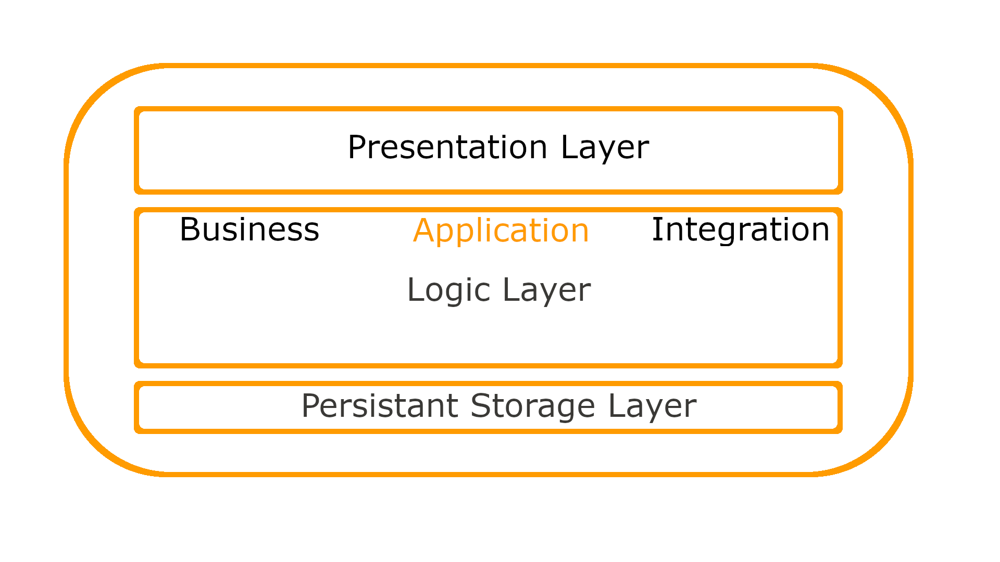

.. _PageNavigation system_architecture:

System architecture
####################

Znuny is a cross-platform application framework built on open source technologies. The default technology stack used in development is a `LAMP <https://en.wikipedia.org/wiki/LAMP_%28software_bundle%29>`_ stack.

* Linux
* Apache
* MySQL
* Perl

Other technologies and standards used include (not exclusively):

* POP(S)
* IMAP(S/TLS)
* SMTP(S/TLS)
* JavaScript
* HTML
* JQuery

Application Layers
******************
:ref:`- jump top - <PageNavigation system_architecture>` 

It's a server-based web application consisting of the following layers:

* Presentation
* Program Logic
* Business Logic
* External Integration
* Storage




Application Structure
*********************
:ref:`- jump top - <PageNavigation system_architecture>` 

The following text discusses the application structure in great detail, outlining the file system and important files.

Application Directories
=======================
:ref:`- jump top - <PageNavigation system_architecture>` 

Directories give a sensible structure to the application and knowing what each directory is used for is essential to programming for, debugging, and maintaining the product.

+----------------------------------------+----------------------------------+
| Directory                              | Description                      |
+========================================+==================================+
| ``bin/``                               | command-line tools               |
+----------------------------------------+----------------------------------+
| ``bin/cgi-bin/``                       | web handle                       |
+----------------------------------------+----------------------------------+
| ``bin/fcgi-bin/``                      | fast cgi web handle              |
+----------------------------------------+----------------------------------+
| ``Kernel``                             | application codebase             |
+----------------------------------------+----------------------------------+
| ``Kernel/Config/``                     | configuration files              |
+----------------------------------------+----------------------------------+
| ``Kernel/Config/Files``                | configuration files              |
+----------------------------------------+----------------------------------+
| ``Kernel/GenericInterface/``           | the Generic Interface API        |
+----------------------------------------+----------------------------------+
| ``Kernel/GenericInterface/Invoker/``   | invoker modules for Generic      |
|                                        | Interface                        |
+----------------------------------------+----------------------------------+
| ``Kernel/GenericInterface/Mapping/``   | mapping modules for Generic      |
|                                        | Interface, e.g. Simple           |
+----------------------------------------+----------------------------------+
| ``Kernel/GenericInterface/Operation/`` | operation modules for Generic    |
|                                        | Interface                        |
+----------------------------------------+----------------------------------+
| ``Kernel/GenericInterface/Transport/`` | transport modules for Generic    |
|                                        | Interface, e.g. "HTTP SOAP"      |
+----------------------------------------+----------------------------------+
| ``Kernel/Language``                    | language translation files       |
+----------------------------------------+----------------------------------+
| ``Kernel/Scheduler/``                  | Scheduler files                  |
+----------------------------------------+----------------------------------+
| ``Kernel/Scheduler/TaskHandler``       | handler modules for scheduler    |
|                                        | tasks, i.e. GenericInterface     |
+----------------------------------------+----------------------------------+
| ``Kernel/System/``                     | core modules, e.g. Log,          |
|                                        | Ticket, ...                      |
+----------------------------------------+----------------------------------+
| ``Kernel/Modules/``                    | frontend modules, e.g.           |
|                                        | QueueView...                     |
+----------------------------------------+----------------------------------+
| ``Kernel/Output/HTML/``                | html templates                   |
+----------------------------------------+----------------------------------+
| ``var/``                               | variable data                    |
+----------------------------------------+----------------------------------+
| ``var/log``                            | logfiles                         |
+----------------------------------------+----------------------------------+
| ``var/cron/``                          | cron files                       |
+----------------------------------------+----------------------------------+
| ``var/httpd/htdocs/``                  | htdocs directory with index.html |
+----------------------------------------+----------------------------------+
| ``var/httpd/htdocs/skins/Agent/``      | available skins for the Agent    |
|                                        | interface                        |
+----------------------------------------+----------------------------------+
| ``var/httpd/htdocs/skins/Customer/``   | available skins for the Customer |
|                                        | interface                        |
+----------------------------------------+----------------------------------+
| ``var/httpd/htdocs/js/``               | JavaScript files                 |
+----------------------------------------+----------------------------------+
| ``scripts/``                           | misc files                       |
+----------------------------------------+----------------------------------+
| ``scripts/test/``                      | unit test files                  |
+----------------------------------------+----------------------------------+
| ``scripts/test/sample/``               | unit test sample data files      |
+----------------------------------------+----------------------------------+

Files Extensions
================

``.pl``
   Perl
``.pm``
   Perl Module
``.tt``
   Template::Toolkit template files
``.dist``
   Default templates of files
``.yaml`` | ``.yml``
   YAML files, used for Web Service configuration

Core Modules
************
:ref:`- jump top - <PageNavigation system_architecture>` 

Core modules are under ``$OTRS_HOME/Kernel/System/*``. 

Core modules build program logic and user-programmed business logic.
Routines such as locking and creating a ticket or processing a transition for a business processes name just a few tasks performed by core modules.

A few main core modules are:

+----------------------------+---------------------------------+
| Module                     | Description                     |
+============================+=================================+
| ``Kernel::System::Config`` | Access to configuration options |
+----------------------------+---------------------------------+
| ``Kernel::System::Log``    | Access to logging               |
+----------------------------+---------------------------------+
| ``Kernel::System::DB``     | Access to the database          |
+----------------------------+---------------------------------+
| ``Kernel::System::Auth``   | User authentication             |
+----------------------------+---------------------------------+
| ``Kernel::System::User``   | User management                 |
+----------------------------+---------------------------------+
| ``Kernel::System::Group``  | Group functions                 |
+----------------------------+---------------------------------+
| ``Kernel::System::Email``  | Email processing                |
+----------------------------+---------------------------------+

.. note:: Module Names and Paths

   Above the Perl notation is used. The path to each ``.pm`` file is ``Kernel/System`` or ``Custom/Kernel/System`` as known from Perl.


Front-end Handle
****************
:ref:`- jump top - <PageNavigation system_architecture>` 

Each user interface has a set of handles. The handles call the *Action* modules, generate the front-end (if applicable), and provide function.

A typical handle looks like this.

`http://otrs.example.com/otrs/index.pl?Action=Module <>`_


Front-end Modules
*****************
:ref:`- jump top - <PageNavigation system_architecture>` 

Front-end modules are composed of an HTML Template and it's identically named Perl module. Here we are referring to the logic layer.

Front-end modules are under ``Kernel/Modules/``.

There are two public functions per module:

``new()``

``run()``

These are use by the front-end handle.

**An example:**

``index.pl`` ``new()`` is used to create a front-end module object.
The front-end handle provides the basic framework objects. 

These are, for example: 

+------------------+-----------------------------------------------+
| Framework Object | Description                                   |
+==================+===============================================+
| ``ParamObject``  | Get form parameters.                          |
+------------------+-----------------------------------------------+
| ``DBObject``     | Use the active database connection.           |
+------------------+-----------------------------------------------+
| ``LayoutObject`` | Use templates and other html layout functions |
+------------------+-----------------------------------------------+
| ``ConfigObject`` | Access system configurations.                 |
+------------------+-----------------------------------------------+
| ``LogObject``    | Access to logging.                            |
+------------------+-----------------------------------------------+
| ``UserObject``   | Access to user functions (current user)       |
+------------------+-----------------------------------------------+
| ``GroupObject``  | Access to group functions.                    |
+------------------+-----------------------------------------------+

Command Frontend (CMD)
**********************
.. _PageNavigation system_architecture_CMD:
:ref:`- jump top - <PageNavigation system_architecture>` 

The CMD front-end are used by non-humans and have access to all framework objects except the ``LayoutObject``.

The CMD modules used by core modules for various actions in the system like providing a RPC (SOAP) front-end via the ``bin/cgi-bin/rpc.pl``.

Additional CMD modules are all those contained under the ``bin``` directory. Most notably ``bin/otrs.Console.pl``

Generic Interface Modules
*************************
:ref:`- jump top - <PageNavigation system_architecture>` 

Generic interface modules are under ``Kernel/GenericInterface/*``. Different generic interface modules are used to handle each part of a web service provider or consumer request to the system.

The main modules for the Generic Interface are:

+-----------------------------------------+---------------------------------------------------------+
| Module Name                             | Description                                             |
+=========================================+=========================================================+
| ``Kernel::GenericInterface::Transport`` | (to interact with remote systems)                       |
+-----------------------------------------+---------------------------------------------------------+
| ``Kernel::GenericInterface::Mapping``   | (to transform data into a required format)              |
+-----------------------------------------+---------------------------------------------------------+
| ``Kernel::GenericInterface::Requester`` | (to use Znuny as a client for the web service)          |
+-----------------------------------------+---------------------------------------------------------+
| ``Kernel::GenericInterface::Provider``  | (to use Znuny as a server for web service)              |
+-----------------------------------------+---------------------------------------------------------+
| ``Kernel::GenericInterface::Operation`` | (to execute provider actions)                           |
+-----------------------------------------+---------------------------------------------------------+
| ``Kernel::GenericInterface::Invoker``   | (to execute pequester actions)                          |
+-----------------------------------------+---------------------------------------------------------+
| ``Kernel::GenericInterface::Debugger``  | (to track web service communication, using log entries) |
+-----------------------------------------+---------------------------------------------------------+

Generic Interface Invoker Modules
=================================
:ref:`- jump top - <PageNavigation system_architecture>` 

Generic interface invoker modules are under ``Kernel/GenericInterface/Invoker``. Each Invoker is contained in a folder called ``Controller``. 

This approach defines the name space not only for internal classes and controllers but for filenames too. 

For example: ``Kernel/GenericInterface/Invoker/Ticket`` is the folder for all ticket invokers.

Generic interface invoker modules prepare data for consumers without the need for Znuny API knowledge.


Generic Interface Mapping Modules
=================================
:ref:`- jump top - <PageNavigation system_architecture>` 

The generic interface makes use of data mapping technologies. 

All generic interface mapping modules are located under ``Kernel/GenericInterface/Mapping/*``. These modules are used to transform data (keys, values pairs) output types.

Default mapping modules are 

* Simple
* XSLT (Version 1.1)

Special can be performed with

* Znuny
* Test
* OutOfOffice

Generic Interface Operation Modules
===================================
:ref:`- jump top - <PageNavigation system_architecture>` 

Generic interface operation modules are under ``Kernel/GenericInterface/Operation``. Each operation is contained in a folder named ``Controller``. 

This approach defines the name space not only for internal classes and methods but for filenames too. 

For example: ``Kernel/GenericInterface/Operation/Ticket/`` is the Controller for all Ticket-type operations. The associated ticket operations are:

* ``TicketGet.pm``
* ``TicketSearch.pm``
* ``Ticket*.pm``

Generic interface operation modules are the backend logic for consumer requests and provide the consumer a valid response without the need for Znuny API knowledge.


Generic Interface Transport Modules
===================================
:ref:`- jump top - <PageNavigation system_architecture>` 

Generic interface network transport modules are under ``Kernel/GenericInterface/Operation``. Each transport module should be placed in a 
directory named identical to the protocol used. 

For example: The "HTTP SOAP" transport module, located in ``Kernel/GenericInterface/Transport/HTTP/SOAP.pm``.

Generic Interface transport modules control the consumer transport options (i.e. end-point, authentication, headers, etc.) required for requests to third party systems.

Process Management
******************
:ref:`- jump top - <PageNavigation system_architecture>` 

Process Management Transition Action Modules
============================================
:ref:`- jump top - <PageNavigation system_architecture>` 

Process Management Activities
=============================
:ref:`- jump top - <PageNavigation system_architecture>` 


Scheduler Task Handler Modules
******************************
:ref:`- jump top - <PageNavigation system_architecture>` 

Scheduler task handler modules are under ``Kernel/Scheduler/TaskHandler``. These modules are used to perform asynchronous tasks.
One example of such a task is the ``GenericInterface`` (GI) task handler. This performs GI Requests to third-party systems. 
This helps the system to be more responsive, preventing possible performance issues by scheduling the tasks to be performed individually.


Database Structure
*******************
:ref:`- jump top - <PageNavigation system_architecture>` 

Znuny relies on a relational database for persistent storage. The model is moderately large and contains the following tables per default.

Below you is a list of all tables. The relationship model is at `GitHub <https://github.com/znuny/Znuny/blob/dev/development/diagrams/Database/znuny_database.png>`_.

* acl
* acl_sync
* acl_ticket_attribute_relations
* article
* article_data_mime
* article_data_mime_attachment
* article_data_mime_plain
* article_data_mime_send_error
* article_data_otrs_chat
* article_flag
* article_search_index
* article_sender_type
* auto_response
* auto_response_type
* calendar
* calendar_appointment
* calendar_appointment_ticket
* cloud_service_config
* communication_channel
* communication_log
* communication_log_object
* communication_log_object_entry
* communication_log_obj_lookup
* customer_company
* customer_preferences
* customer_user
* customer_user_customer
* dynamic_field
* dynamic_field_obj_id_name
* dynamic_field_value
* follow_up_possible
* form_draft
* generic_agent_jobs
* gi_debugger_entry
* gi_debugger_entry_content
* gi_webservice_config
* gi_webservice_config_history
* group_customer
* group_customer_user
* group_role
* group_user
* link_object
* link_relation
* link_state
* link_type
* mail_account
* mail_queue
* notification_event
* notification_event_item
* notification_event_message
* package_repository
* permission_groups
* personal_queues
* personal_services
* pm_activity
* pm_activity_dialog
* pm_entity_sync
* pm_process
* pm_transition
* pm_transition_action
* postmaster_filter
* process_id
* queue
* queue_auto_response
* queue_preferences
* queue_standard_template
* roles
* role_user
* salutation
* scheduler_future_task
* scheduler_recurrent_task
* scheduler_task
* search_profile
* service
* service_customer_user
* service_preferences
* service_sla
* sessions
* signature
* sla
* sla_preferences
* smime_signer_cert_relations
* standard_attachment
* standard_template
* standard_template_attachment
* sysconfig_default
* sysconfig_default_version
* sysconfig_deployment
* sysconfig_deployment_lock
* sysconfig_modified
* sysconfig_modified_version
* system_address
* system_data
* system_maintenance
* ticket
* ticket_flag
* ticket_history
* ticket_history_type
* ticket_index
* ticket_lock_index
* ticket_lock_type
* ticket_loop_protection
* ticket_number_counter
* ticket_priority
* ticket_state
* ticket_state_type
* ticket_type
* ticket_watcher
* time_accounting
* user_preferences
* users
* valid
* virtual_fs
* virtual_fs_db
* virtual_fs_preferences
* web_upload_cache
* xml_storage
