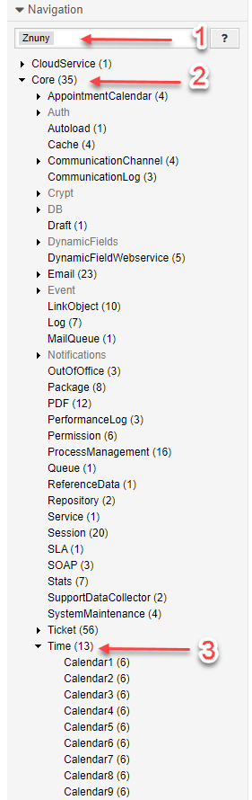

Working Hours and Calendars
###########################
.. _PageNavigation generalinformation_workinghours_index:

Working hours in calendars are defined within the system configuration and used for escalation calculation.

Work Calendars
**************

Work calendars not to be configured with the :ref:`web calendars <PageNavigation agentinterface_calandarscreens_index>`. Work calendars are configured centrally and used by the following components for calculation of escalation.

* Queues
* Service Level Agreements

Configure a Work Calendar
*************************

Calendars are configured in the system configuration under the navigation group:

**Znuny > Core > Time**

Here you have, by default, ten calendars, starting with ``Core::Time`` (default calendar). The default will apply if no calendar is selected. For each calendar you have the following options:

* TimeWorkingHours
* TimeVacationDaysOneTime
* TimeVacationDays
* TimeZone
* CalendarWeekDayStart
* CalendarName

.. note::

    For single timezone systems, you can set your default timezone for all users with ``UserDefaultTimeZone`` in ``Core::Time``.

.. important::

    Ensue that ``OTRSTimeZone`` is set to the timezone of your server. We recommend to always use UTC on your servers.