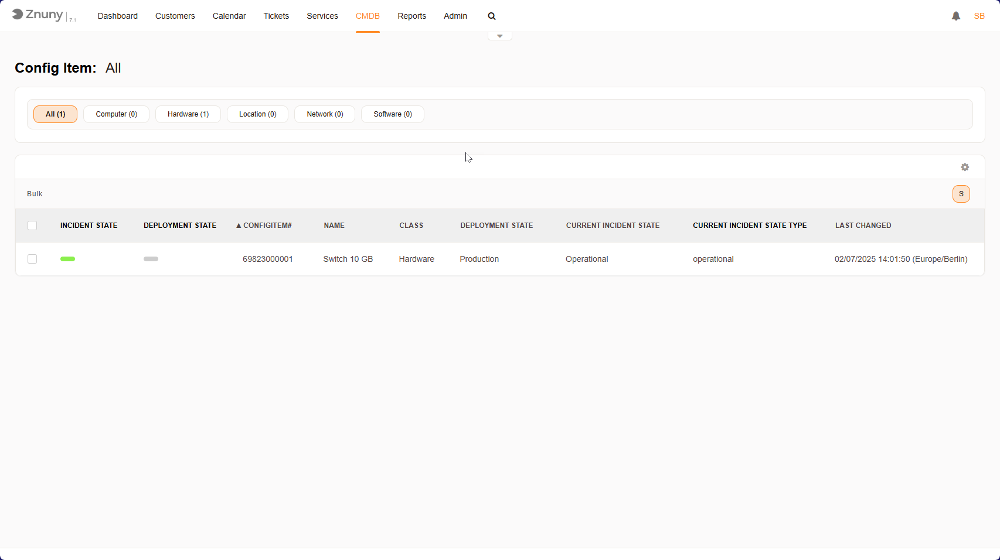
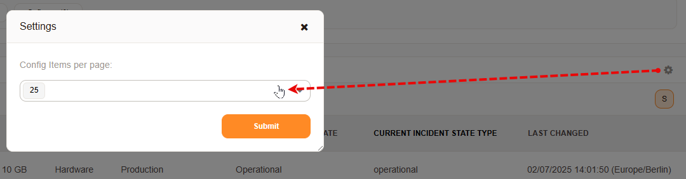

.. meta::
   :description: View and filter Configuration Items in Znuny's CMDB overview screen — read the incident/deployment state columns and adjust how many CIs are shown per page.
   :keywords: znuny ci overview, cmdb overview, configuration item list, incident state, deployment state

.. _PageNavigation itsmfeatures_configurationmanagement_overview:

View Configuration Items
########################

This section helps you manage and track all your IT assets, such as computers, hardware, software, and network devices, from the Configuration Item overview screen.

   CI Overview

What You Can See Here
=====================

At the top, you'll find filters that let you quickly find specific items:

- **All** - Shows all CIs in the system.
- **Computer, Hardware, Location, Network, Software** - These class tabs let you filter the list down to one CI class at a time.

Below the filters, you'll see a table listing your Configuration Items. Each row represents an item, and each column gives details about it.

What Each Column Means
======================

+----------------------------+------------------------------------------------------------------------------------------------------+
| Label                      | Description                                                                                          |
+============================+======================================================================================================+
| **Incident State**         | Shows if the item is working fine or has an issue. A green indicator means it's running smoothly.    |
+----------------------------+------------------------------------------------------------------------------------------------------+
| **Deployment State**       | Tells you if the item is in use, being tested, or retired.                                           |
+----------------------------+------------------------------------------------------------------------------------------------------+
| **Config Item #**          | A unique ID for tracking this item in the system.                                                    |
+----------------------------+------------------------------------------------------------------------------------------------------+
| **Name**                   | The name of the item (e.g. a **10GB Network Switch**).                                               |
+----------------------------+------------------------------------------------------------------------------------------------------+
| **Current Incident State** | Shows if the item is operational or has a problem.                                                   |
+----------------------------+------------------------------------------------------------------------------------------------------+
| **Last changed**           | The last time this item's status was updated.                                                        |
+----------------------------+------------------------------------------------------------------------------------------------------+

What Can You Do Here
====================

1. **Check the status of IT assets** - See if everything is working properly.
2. **Sort and filter CIs** - Quickly find what you're looking for.
3. **Select items for bulk actions** - If you need to update multiple items at once.
4. **Customize columns** - Adjust the view to show only the information you need.

You can change the number of CIs viewable per page by clicking the gear icon in the top right
corner of the table, and setting your desired amount.

   Overview Setting
