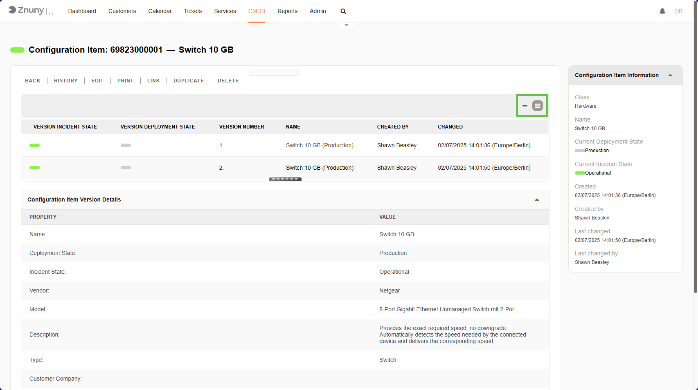

.. meta::
   :description: Read the Configuration Item detail screen in Znuny — status information, version history, technical attribute details, and the CI action menu.
   :keywords: znuny view configuration item, ci detail screen, ci version history, cmdb zoom, ci menu permissions

.. _PageNavigation itsmfeatures_configurationmanagement_viewing_ci:

Viewing a CI
############

This screen provides detailed information about a specific Configuration Item (CI) in the CMDB (Configuration Management Database). Here, you can view, edit, track changes, and manage the lifecycle of the selected CI.

   Viewing a CI

What You Can See Here
=====================

The page is displaying details for **Switch 10 GB**, a hardware item with the unique ID **6982300001**.

Main Sections
=============

1. **CI Status Information (Top)**

   - **Current Incident State**: Operational (working fine, no issues).
   - **Current Deployment State**: Production (currently in use).
   - **Class**: Hardware (categorized as an IT asset).
   - **Created and Last Changed**: Separate fields show who created the CI and when, and who last changed it and when.

2. **CI Version History (Middle)**

   - Tracks different versions of this CI.
   - Each version includes:
     - **Version Number** (1, 2, etc.).
     - **State at that time** (Incident and Deployment states).
     - **Timestamp & Author** of the last change.

.. note::

    Switch between showing only the newest version and showing all versions using the "Show one version" / "Show all versions" links above the version tree.

3. **Configuration Item Version Details (Bottom)**

   - **Technical details** about the CI, including:
     - **Vendor**: Netgear.
     - **Model**: 8-Port Gigabit Ethernet Unmanaged Switch.
     - **Description**: Provides exact required speed, no downgrade.
     - **Type**: Switch.

.. important::

    The available attributes are configured by the system administrator. See :ref:`PageNavigation annexes_itsm_configurationitemdefinition_index` for the full reference.

What You Can Do Here
====================

In the **CI Menu**, you have several actions:

- **BACK** - Return to the CI list.
- **HISTORY** - View all changes made to this CI.
- **EDIT** - Modify details such as the vendor, description, or state. (RW permissions required)
- **PRINT** - Generate a printable version of this CI.
- **LINK** - Create relationships with other CIs.
- **DUPLICATE** - Clone this CI for quick creation of a similar one. (RW permissions required)
- **DELETE** - Remove this CI from the system. (RW permissions required)

How You Can Use This Page
=========================

1. **Track Hardware/Software Assets** - Keep records of network switches, servers, or applications.
2. **Monitor Status Changes** - Identify when a CI was moved to production, had an incident, or was retired.
3. **Edit or Update Details** - Change vendor, model, description, or link it to other ITSM processes.
4. **Audit & Troubleshoot** - If there are issues, check version history for past changes.
