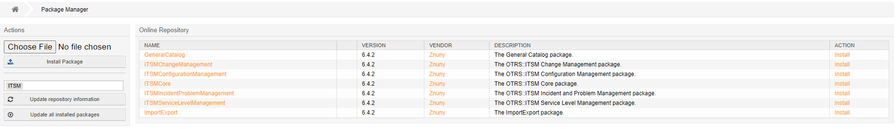
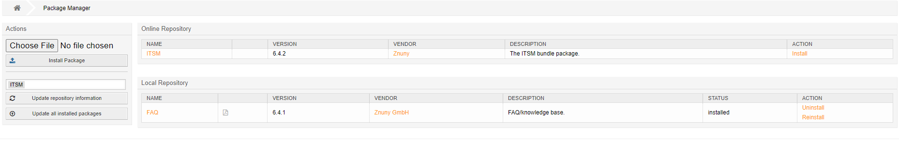

ITSM Features
#############
.. _PageNavigation itsmfeatures_index:

ITSM Features are provided by way of package installation. The following feature set is available as a bundle or individual package and can be installed after installing the Prerequisite modules.

Pre-requisite features are

* General Catalog
* ITSM Core

ITSM Features Highlights
************************

Incident and Problem Management
    Service criticality and incident impact calculate the priority of issues. Set a minimum time between incidents to prevent service desk flooding.
Configuration Management
    Declare, manage, and track the status of configuration items. Create relationships between configuration items, services, requests, and customer and customer users.
Service Level Management
    Extended service level reporting with added statistic templates.
Change Management
    A full-blown change management tool for designing and implementing standard, normal, and emergency changes. Work-order creation, assignment, and conditions set the stage for the change management engine. Notifications for special roles like change builder, change manager and change advisory board.

.. important::

    In most cases, we recommend utilizing a process vs. installing the change management feature. The use of the change management feature only makes sense under special circumstances.

Extra supporting features are:

Import Export
    Import, Export, and Update configuration items from a CSV file.

Online Repository Installation
*******************************

Depending on if you want the individual feature set or the bundle, your Settings will vary.

Bundle URL: ``https://download.znuny.org/releases/itsm/latest/``
Individual Packages URL: ``https://download.znuny.org/releases/itsm/bundle6x/``

Search for and configure the setting ``Package:RepositoryList`` as seen below and deploy the setting. 

.. seealso::
    :ref:`Installing Features <PageNavigation admin_packagemanagement_index>` 

Then navigate to the package manager and update the online repository to install from the online repository. Make sure to install the prerequisites in the order 

1. GeneralCatalog
2. ITSMCore

Alternatively, you can install the bundle in just one click, if the repository is configured for this.

.. note::
    
    Installing from the Bundle resolves dependencies themselves.

Manual Installation
*******************

Suppose you'd like to manually install the features. In that case, it is as easy as going to our `latest download page <https://download.znuny.org/releases/itsm/latest/>`_ and downloading the desired package(s) and then installing them from the package manager or via the command line.

Individual
===========

Make sure to install the prerequisites in the order 

1. GeneralCatalog
2. ITSMCore

After completing this you can then install the other downloaded packages.

Bundle
======

If you want to include all of the packages at one time you can use the bundle package ship also provided by our `bundle download page <https://download.znuny.org/releases/itsm/bundle6x/>`_. We highly recommend installing the package individually. Removing individual packages after installing the bundle is not easily done.

.. note::

    Make sure your database accepts packages over 15 MB in size. A MySQL database for example accepts packages up to 1 MB by default. In this case, the value for max_allowed_packet must be increased. The recommended maximum size accepted is 20 MB.

Upgrading ITSM
**************

Upgrading ITSM just like with other add-ons. Once you've updated your framework you may then update ITSM.
