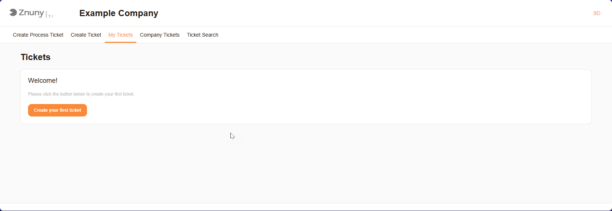

User Interface
##############
Znuny provides a user-friendly interface that allows users to navigate through various functionalities and features. The interface is designed to be intuitive, making it easy for users to access the tools they need.
You can create tickets, manage existing ones, and search for specific tickets using the provided options. The interface is organized into different sections, each serving a specific purpose.

Navigation
**********
- **Create Process Ticket**: Initiate a new ticket within a specific process or workflow.
- **Create Ticket**: Create a new ticket; typically used for general support requests or inquiries.
- **My Tickets**: A personalized view of tickets assigned to the logged-in user, allowing you to track your own tickets and their statuses.
- **Company Tickets**: A section that displays tickets associated the logged-in user company or organization.
- **Ticket Search**: Search for specific tickets based on various criteria, such as ticket number, status, and many other options.

.. note::

   The interface may vary slightly depending on the configuration and Installed Modules.

   View when a new user logs in for the first time.