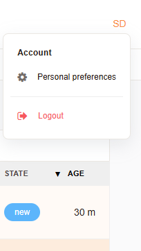

Setting User Preferences
########################

Depending on your systems configuration, you can set preferences and logout using the user options menu at the top right of the screen. The user options menu is 
represented by a small icon that includes you registered gravatar, or user name initials.

.. tip:: 
   
   You should always set your preferences first, as a new user. This will ensure that the system is configured to your liking.

   User Options Menu

User Preferences
****************

- **Change Password**: This option allows you to change your password.
- **Ticket Overview Refresh**: This option allows you set a time in minutes for the ticket overview to refresh. The default is off.
- **Last view - types**: This option allows you to select screens to be displayed in the last view area for quick access.
- **Interface Language**: This option allows you to select the language for the interface. The default is English, unless otherwise set by the administrator.
- **Number of displayed tickets**: This option allows you to set the number of tickets displayed per page in the ticket overview. The default is 25.
- **Time Zone**: This option allows you to set the time zone for the interface. The default is UTC, unless otherwise set by the administrator.
- **Last View Limit**: This option allows you to set the number of last view items displayed. The default is 5.

.. note:: 
   
   Other options may be available depending on your system configuration. Speak to your administrator for more information.

   