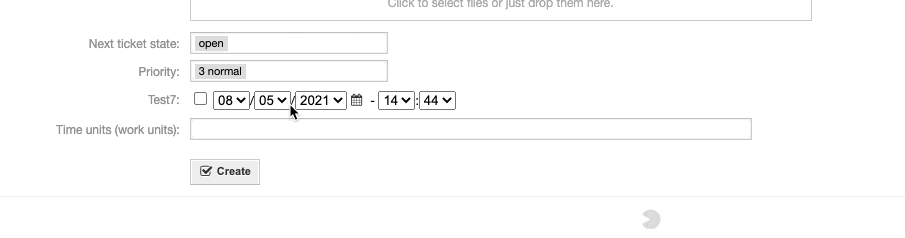
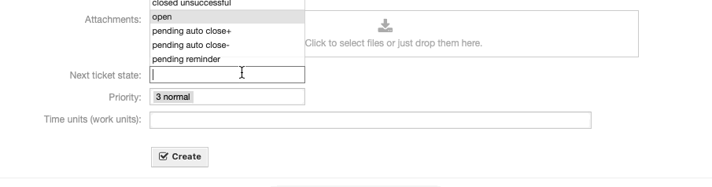

New Features
############

 
In release 6.1 we have a mix from pull requests and the integration of existing packages.

.. _Integrated features 6.1:

Packages that were integrated
#############################
 
.. note:: If your setup depends on those add-ons, please note that you can remove them from your dependencies if you target 6.1 .

- :ref:`Znuny4OTRS-AdvancedDynamicFields`
- :ref:`Znuny4OTRS-LastViews`
- :ref:`Znuny4OTRS-AutoCheckbox`
- :ref:`Znuny4OTRS-ShowPendingTimeIfNeeded`
- :ref:`Znuny4OTRS-TimeAccountingWebservice`
- :ref:`Znuny4OTRS-DynamicFieldWebservice`
- :ref:`Znuny4OTRS-GIArticleSend`
- :ref:`Znuny4OTRS-AdvancedGI`
- :ref:`Znuny4OTRS-GenericInterfaceREST`
- :ref:`Znuny4OTRS-AdvancedOutOfOffice`
- :ref:`Znuny4OTRS-EnhancedProxySupport`
- :ref:`Znuny4OTRS-Repo`

.. _Znuny4OTRS-AdvancedDynamicFields:

Znuny4OTRS-AdvancedDynamicFields
********************************************

Advanced Dynamic Field adds a new element to the admin interface, which allows an admin to 
add/remove Dynamic Fields from views using drag and drop.  

.. _Znuny4OTRS-LastViews:

Znuny4OTRS-LastViews
********************************************

Is a helper view which adds a new toolbar above the menu bar. This new toolbar allows you to switch
quickly between the last opened views, tickets and so on. 

.. _Znuny4OTRS-AutoCheckbox:

Znuny4OTRS-AutoCheckbox
********************************************

This add-on automatically checks the checkbox of given Dynamic Fields of typ date/date time as soon as a change has been made.

.. _Znuny4OTRS-ShowPendingTimeIfNeeded:

Znuny4OTRS-ShowPendingTimeIfNeeded
********************************************

The pending time is only shown, if a pending state is selected. 

.. _Znuny4OTRS-TimeAccountingWebservice:

Znuny4OTRS-TimeAccountingWebservice
********************************************

This feature adds an operation the web services to read all time accounting entries of a given agent.

.. _Znuny4OTRS-DynamicFieldWebservice:

Znuny4OTRS-DynamicFieldWebservice
********************************************

A new Dynamic Field backend was added. The **Webservice** backend adds the possibility to 
request data for a Dynamic Field with a web services. 

.. note:: The web service and the required mapping must be configured in the Web Service module of the admin area.

.. _Znuny4OTRS-GIArticleSend:

Znuny4OTRS-GIArticleSend
********************************************

This feature allows to send articles via the Generic Interface operations TicketUpdate and TicketCreate.

.. note:: Support for signing and encryption with S/MIME and PGP is also possible.

.. _Znuny4OTRS-AdvancedGI:

Znuny4OTRS-AdvancedGI
********************************************

The Advanced GI is a massive extension for the Generic Interface. 

It adds the following features:

- Enhanced mapping allows nested structures, reduced structures, key->value structures
- Call web services from Process Management module
- Enhanced XSLT support, force array for Znuny|OTRS tags 
- NTLM authentication support
- Tunnel Invoker, passes data structures like ticket information 1:1 to external services
- Use web services via Generic Agent
- Use System Configuration values (via tags) in web service configurations
- Base64 encoding support
- Omitting of specific fields

.. _Znuny4OTRS-GenericInterfaceREST:

Znuny4OTRS-GenericInterfaceREST
********************************************

This feature set adds additional X-Header support to the REST Transport layer.

- New Header X-OTRS-Header-(UserLogin|CustomerUserLogin|SessionID|Password)
- Additional X-Header for incomming and outgoing requests

.. _Znuny4OTRS-AdvancedOutOfOffice:

Znuny4OTRS-AdvancedOutOfOffice
********************************************

This feature adds a functionality to modify out of office settings of agents
and also includes a web service configuration. This web service
configuration is able set the out of office settings by external systems.
For example take this information from an Active Directory, HR system, etc. 
Please see the web service documentation for more details.

.. _Znuny4OTRS-EnhancedProxySupport:

Znuny4OTRS-EnhancedProxySupport
********************************************

If you have a setup where some urls need to be accessed through a 
proxy and some dont, we added a new option:

- WebUserAgent::NoProxy
  
Just pass hosts (host.de,hostname.de,...) as comma separated list. 
Those hosts will be excluded from WebUserAgent::Proxy requests.

It also possible to set a specific user agent for proxy requests.

- WebUserAgent::UserAgent
  
.. _Znuny4OTRS-Repo:

Znuny4OTRS-Repo
********************************************

The Znuny-Repo was needed in earlier versions of Znuny LTS and OTRS ((Community Edition)).
It includes some helper methods we used over the years to make the life easier for us and speedup
package development. 
It is now part of the Znuny Core and no longer needed as an add-on in Znuny. 

