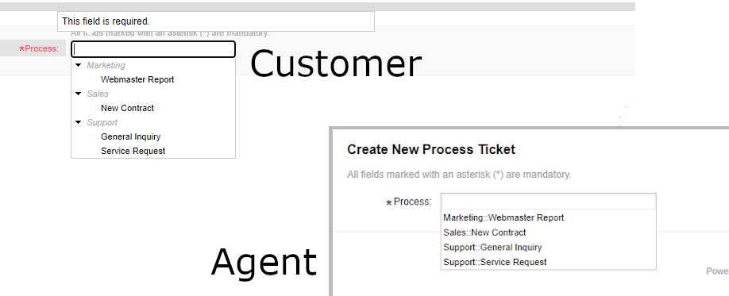
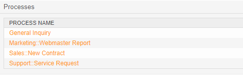

New Features
############

In Release 6.2.2, we fixed bugs and added two enhancements. 

There are no new features.

Enhancements
************

Process Tree View
==================

It is now possible to show the list of active processes, as a tree-view, independently in the agent and customer frontend

----

Use the system configuration setting:

* Ticket::Frontend::AgentTicketProcess###ProcessListTreeView
* Ticket::Frontend::CustomerTicketProcess###ProcessListTreeView

Name your processes using the *::* convention.

To update your system, follow the :ref:`Updating Instructions <UpdatingInstructions Update62>`

See the detailed changelog here:  

`Changelog <https://github.com/znuny/Znuny/blob/rel-6_2/CHANGES.md>`_
