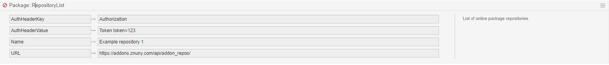

Changes
#######

Znuny 6.3.2 is a security and issue-fix release.

Breaking Changes
****************
.. _BreakingChange rel-6_3_2:

These breaking changes are necessary for security reasons. We have included safety precautions during the update, so that these changes are noted and you will not loose changes. See :ref:`Updating to 6.3<PageNavigation install_update-6_3>`.

CMD Usage
=========

Read more in the :ref:`developer manual <PageNavigation system_architecture_CMD>`.

We removed the CMD function for web-configured generic agents due to a reported security issue. The functionality remains. It's just that the configuration of such is now more secure.

The CMD functionality is now used exclusively via a generic agent module. The generic agent then executes this module.

We provide a sample module: ``Kernel/System/GenericAgent/SystemCommandExecution.pm.dist`` to be copied to SystemCommandExecution.pm for activation.

See more under automation with :ref:`generic agents<Page automation_generic_agent>`.

.. note::

    This change counteracts the attack vector because a user now requires SSH access to configure the use of the CMD function.

System Configuration
====================

Some system configurations can be misused, similar to the above issue. Therefore, and as they are standard settings in most cases, we've moved them to the ``Defaults.pm``. They can be modified if necessary by copying these settings to the Config.pm

* MIME-Viewer###*
* SendmailModule::CMD

Removed Options
===============

The following options are removed.

* DashboardBackend###0420-CmdOutput
* PostMaster::PreFilterModule###4-CMD
* PostMaster::PreFilterModule###5-SpamAssassin
* PostMaster::PreFilterModule###6-SpamAssassin
* Kernel::System::PostMaster::Filter::CMD

Improvements
************

These enhancements have been made to the software in this patch level:

Repository List Extended
========================

With this version we've improved the system configuration for repositories.

The system configuration option: ``Package::RepositoryList`` now accepts next to Name and URL, AuthHeaderKey and AuthHeaderValue for added security and authenticatin against add-on repositories if required.

Console Command Usage
~~~~~~~~~~~~~~~~~~~~~

Package installation via ``otrs.Console.pl`` has changed from using the package url to using the package name.

.. code:: shell

  [zunny@znuny-local ~]$ bin/otrs.Console.pl Admin::Package::RepositoryList

  ....

  +----------------------------------------------------------------------------+
  | 13) Name:        Znuny-QuickClose
  |    Version:     6.3.1
  |    Vendor:      Znuny GmbH
  |    URL:         http://znuny.com/
  |    License:     GNU AFFERO GENERAL PUBLIC LICENSE Version 3, November 2007
  |    Description: Enables quick close in ticket action menu.
  |    Install:     Znuny Open Source Add-ons:9571
  +----------------------------------------------------------------------------+
  ....

  Done.
  [zunny@znuny-local ~]$ bin/otrs.Console.pl Admin::Package::Install "Znuny Open Source Add-ons:9571"
  Installing package...
  Notice: Install /opt/otrs/Kernel/Config/Files/XML/ZnunyQuickClose.xml (660)!
  Notice: Install /opt/otrs/Kernel/Language/de_ZnunyQuickClose.pm (660)!
  Notice: Install /opt/otrs/Kernel/Language/nl_ZnunyQuickClose.pm (660)!
  Notice: Install /opt/otrs/Kernel/Modules/AgentTicketZnunyQuickClose.pm (660)!
  Notice: Create Directory /opt/otrs/scripts/test/ZnunyQuickClose!
  Notice: Create Directory /opt/otrs/scripts/test/ZnunyQuickClose/var!
  Notice: Create Directory /opt/otrs/scripts/test/ZnunyQuickClose/var/packagesetup!
  Notice: Install /opt/otrs/scripts/test/ZnunyQuickClose/var/packagesetup/ZnunyQuickClose.t (660)!
  Notice: Create Directory /opt/otrs/var/packagesetup!
  Notice: Install /opt/otrs/var/packagesetup/ZnunyQuickClose.pm (660)!
  Notice: Create Directory /opt/otrs/doc/en!
  Notice: Install /opt/otrs/doc/en/Znuny-QuickClose_en.pdf (660)!
  Notice: Create Directory /opt/otrs/doc/de!
  Notice: Install /opt/otrs/doc/de/Znuny-QuickClose_de.pdf (660)!
  Code:
          $Kernel::OM->Get('var::packagesetup::ZnunyQuickClose')->CodeInstall();
  
  Done.

.. note::

    For legacy support, you can still use the URL.

.. code:: shell

  [otrs@znuny-local ~]$ bin/otrs.Console.pl Admin::Package::Install https://download.znuny.org/releases/packages/:FAQ
  Installing package...
  
