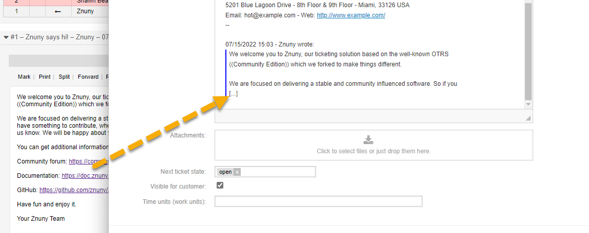

New Features
############

All New
*******

Mentions
========

Other users now can be referenced/mentioned in the rich text editor and will be notified about it. A mention is quicker than creating a note to inform an agent and does not replace this functionality. There is a new dashboard widget and overview for agents to view their mentions.

They can also remove themselves from the mentioned list at any time.

Check out the full feature set in the documentation.

* :ref:`View Mentions <PageNavigation_agentinterface_ticketviews_ticketmention_index>`
* :ref:`Make A Mention <PageNavigation_agentinterface_ticketviews_agentticketactioncommon_mentions>`

Snippet
=======

Hour of templates in the software empowers standardized communications and enables quick turnaround time. This feature has now been extended to include text snippets! Snippets can be used In conjunction with current templates and in any queue where they are assigned. Now you are not only limited to the template created by the administrator but you can also extend the template by using these text snippets.

.. image:: /agentinterface/ticketviews/agentticketactioncommon/images/snippet_animation.gif
    :alt: Snippet Example GIF

Read more on use in the :ref:`common feature <PageNavigation ticketviews_agentticketactioncommon_snippet>` section and configuration in the :ref:`managing communications <PageNavigation admin_communication_templates_index>` section of the manual.

Standard Process Templates
==========================

In addition to the power of templates when creating, answering, sending emails, and adding notes to tickets, it is now possible to use this within the process management activity dialogues.

Read more about this new feature under ::ref:`Communication Templates <PageNavigation admin_communication_templates_index>` and :ref:`Process Management <PageNavigation admin_processmanagement_activitydialogs_article_field>` in the administration area of this  manual.

JWT Authentication For Invokers
===============================

It is now possible to secure your connection with JWT.

See more under :ref:`Network Transport Configuration <PageNavigation admin_webservices_transport_authentication>`.

Integrated packages
*******************

As always, we like to include great features which have been a hit with our enterprise customers into the Znuny framework. This time we have introduced the following packages:

* Znuny-QuoteLimit

Improvements
************

Link Tickets Default Filter
===========================

The configuration option ``Frontend::AgentLinkObject::WildcardSearch`` now returns only the ticket assigned to the current customer of the ticket. This will enable using this option without performance concerns.

LDAP Nested Group Support (AuthSync)
====================================

A switch has been added to support LDAP nested groups when using ``AuthSync`` for role deployment. Now you can assign multiple roles, to a single security object saving hours of configuration in large organizations.

See about backend ``AuthSync`` configuration options in our :ref:`user backends<PageNavigation admin_usermanagment_user_backends>` section of the manual.

S/MIME Keystore Handling
========================

If you use S/MIME with many certificates and keys, we have improved indexing to speed up loading times.

See :ref:`Securing Communications <PageNavigation admin_security_index>`

OAuth2 For Generic Interface Invokers
=====================================

Some providers may require a line separation in the authentication. Read more in the chapter :ref:`OAuth2 Token Administration <PageNavigation authenticate_token_index>`.

General Changes
***************

In our continuing efforts to further promote and nurture the independence of Znuny, from the previous software branch otrs, we have removed the following services previously used by the OTRS AG.

* Removed CloudService - This was the service used report status and validity of system usage, contract information and system health to the OTRS AG.
* Removed System Registration - This was the service used to register systems with the OTRS AG.

Bugs Fixed
**********

Fixed mails being sent to invalid customers.
Fixed broken modernized fields after entry error.
Fixed overlapping CSS elements.
Fixed broken file permissions.
Fixed issue with high CPU load on parsing e-mails in PostMaster filter DetectAttachment.
Fixed SMIME verification does not consider SENDER.

Read about all changes in teh `CHANGES.md <https://github.com/znuny/Znuny/blob/rel-6_4_1/CHANGES.md>`_

Visual Changes
**************

Removed CKEditor plugin `elementspath <https://ckeditor.com/cke4/addon/elementspath>`_.
Long attachment names are now shortened in the interface.
There is no longer an element path at the bottom of the editor.

Developer Relevant Changes
**************************

None

Integration Relevant Changes
****************************

CustomerIDRaw Now Supported TicketSearch Generic Interface Operation