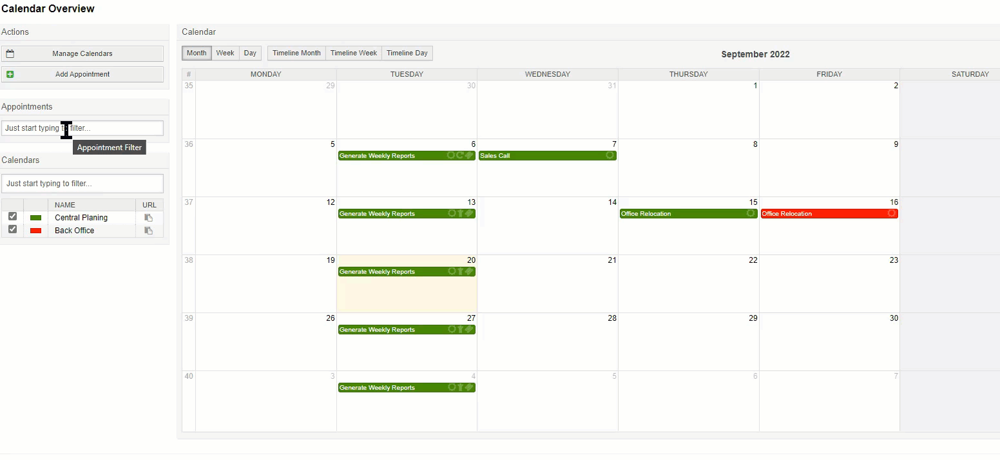
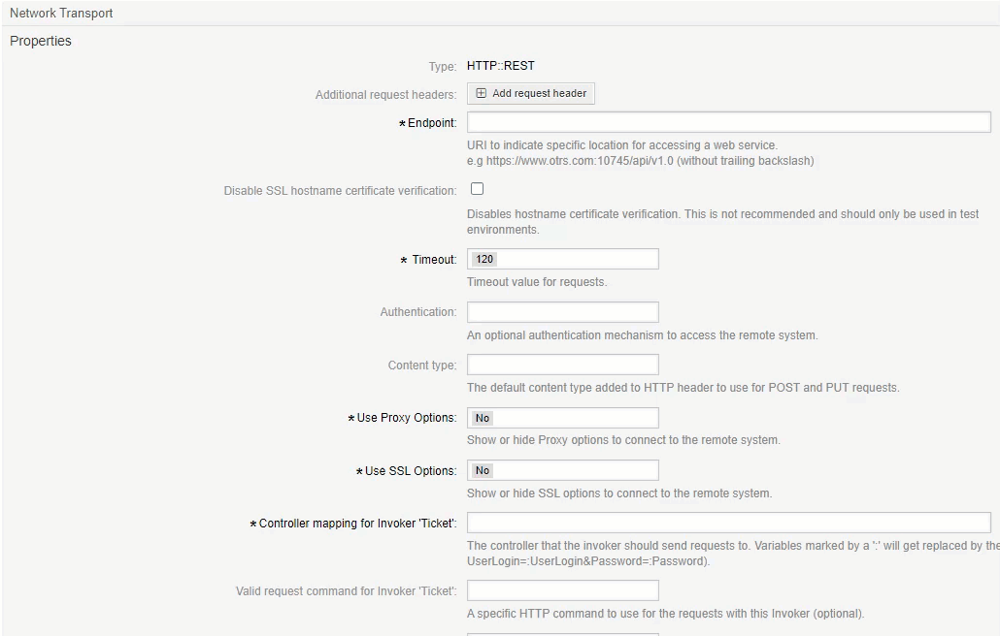

New Features
############

Appointment Filtering
*********************

We've added the ability to filter appointments in the calendar overview.

:ref:`Read More <CalendarOverview filter_appointment>`

OAuth2 For Invoker
******************

OAuth2 Tokens are not only available for use by the mail account management, but now for the invoker. After setting up a token, it can now be selected in the transport settings as an authentication method.

:ref:`Read More <AuthenticationMethod generic_interface_invoker>`

New Events
***********

Until now, no one notices when a transmission error occurs and the ticket is closed. With the new events it is possible to create GenericAgent jobs that listens for the transmission error events and tickets can be re-opened automatically upon error.

:ref:`See the Annex <PageNavigation annexes_event_reference_index_event_reference>`

Improvements
************

Mentions Blacklist
==================

It's now possible to limit the mentions by excluding groups. Use the ``Mentions###BlockedGroups`` setting.

Mentions Limiting
=================

As groups can be used to mention users, and groups can be quite large, it's now possible to limit the number of agents who will be mentioned. Use the ``Mentions###Limit`` setting.

Bugs Fixed
**********

Read about all changes in teh `CHANGES.md <https://github.com/znuny/Znuny/blob/rel-6_4_3/CHANGES.md>`_
