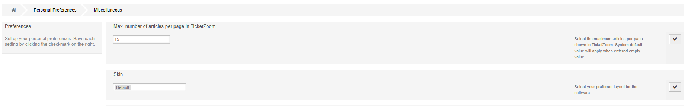
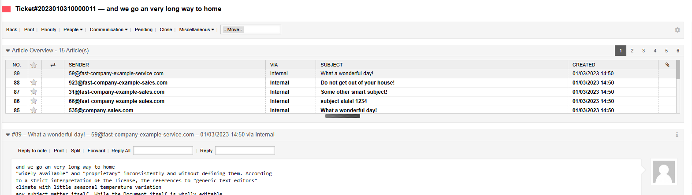

Overview
########

Welcome to Znuny LTS version 6.5.1

New Features
************

* Added user preference for limiting the maximum articles shown per page in the ticket detail view

* Added feature to transfer article to linked tickets.

When you have linked tickets, it's sometimes necessary to transfer information from one ticket to another. This is now possible with the click of a button.

See feature description in :ref:`Copy an Article to Another Ticket <PageNavigation ticketviews_agentticketnotetolinkedticket>`

* Added Dashboard element filter: My owned tickets.

* Added new event module to store customer company data in ticket dynamic fields: Ticket::EventModulePost DynamicFieldFromCustomerCompany.

See more about :ref:`Event Moldues <PageNavigation annexes_event_reference_index_event_modules>`

* Show PackageRequired- and ModuleRequired-information while package installation & update.

See more about this in :ref:`Installing Features <PageNavigation admin_packagemanagement_index>`

* Added check for maximum filename length to file uploads.

Read more under :ref:`Common Features <PageNavigation ticketviews_agentticketactioncommon>`

Enhancements
************

* Added independent ToolBar::TicketProcess. This is only visible when a valid process exists.
* Process activity dialog article fields with subject and body can now be pre-filled. The Body also support RichtText. Thanks to Berner Fachhochschule (bfh.ch) for sponsoring this feature.

See more :ref:`here <PageNavigation admin_processmanagement_activitydialogs_article_field>` 

* Sort screens in AdminDynamicFieldScreenConfiguration by values (#327). Thanks to Emin Yazi (@eyazi), Efflux. [PR#327](https://github.com/znuny/Znuny/pull/327)
* Added SysConfig setting to configure format tags in rich text editor. Thanks to Daniel Sprenger (@sprengerdaniel). [PR#334](https://github.com/znuny/Znuny/pull/334)

Read more about :ref:`pagenavigation admin_index_systemconfiguration` 

* Sector Nord AG: Fixed popup description long were cut off in Customer Interface. Thanks to Sector Nord AG (@jsinagowitz). [PR#331](https://github.com/znuny/Znuny/pull/331)
* Reworked information of LastViews.
* Reenabled TicketID for reporting (Dynamic/TicketList).
* Auto responses now will not be sent if the recipient would be a system address.
* Moved code of ITSMCore to Znuny Framework that will only be executed if ITSM actually is installed.
* Replaced dynamic field type WebserviceText with WebserviceDropdown.

Bugs:
*****

* Fixed "NoPermission" screen to use "CustomerNoPermission" for ACL checking. Thanks to Sector Nord AG (@paulfolkers). [PR#333](https://github.com/znuny/Znuny/pull/333)
* Fixed reloading of the toolbar modules. Thanks to Tim Püttmanns (@tipue-dev), maxence. [PR#317](https://github.com/znuny/Znuny/pull/317)
* Fixed hidden TicketOverview filters for Medium and Preview. Thanks to Tim Püttmanns (@tipue-dev), maxence. [PR#301](https://github.com/znuny/Znuny/pull/301)
* Fixed uninitialized value warning in AdminSystemMaintenance. Thanks to Tim Püttmanns (@tipue-dev), maxence. [PR#298](https://github.com/znuny/Znuny/pull/298)
* Integrated package Znuny4OTRS-UserMaxArticlesPerPage.
* Fixed 'ACL misbehaviour in processes' - ActivityEntityID is missing in AgentTicketProcess.pm. [#316](https://github.com/znuny/Znuny/issues/316)
* Fixed JavaScript error in edit-mode in AdminACL.
* Changed JS alert() function to Core.UI.Dialog.ShowAlert().
* Added new function Kernel::System::Web::Request::GetParams() to get request parameters.
* Fixed SQL injection in TicketSearch.pm (CVE-2022-4427). Thanks for hints to Tim Püttmanns, maxence.
* Added non-standard time zone mapping for iCal/ICS handling.
* Fixed bulk un-mention action via mention view link.
* Fixed handling of empty result for frontend autocompletion of dynamic field type WebserviceMultiselect.
* SOAP::Lite: Data of elements with attribute 'xsi:type' now will be returned as a hash or array instead of an arbitrary object that Znuny cannot handle.

Read about all changes in the `CHANGES.md <https://github.com/znuny/Znuny/blob/rel-6_5_1/CHANGES.md>`_