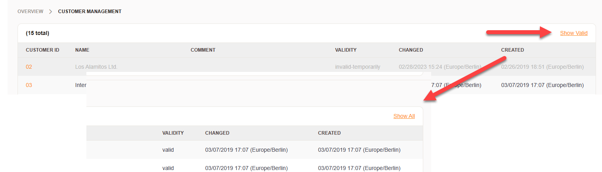

Changes
#######
.. _Integrated features 7.0:

Integrated Features
*******************

Znuny-AdminValidFilter
======================

It's not possbile to remove certain records for reasons of consistency. These item lists, such as agents, customers, queues (for example) grow over time. the new feature allows you to filter invalid entries in the administration area.

Improvements
************

Bugs Fixed
**********

Read about all changes in the `CHANGES.md <https://raw.githubusercontent.com/znuny/Znuny/rel-7_0_1/CHANGES.md>`_
