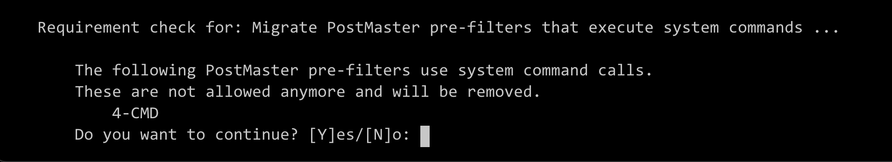

Update to 6.3
#############
.. _PageNavigation install_update-6_3:

.. note:: Test your Update

  We highly recommend to update on a test instance first.

A Step-by-Step explanation on how to update to Znuny 6.3.

Please make sure your current system is at least at version:

- Znuny 6.2.x

We do not support direct updates from any version of OTRS, ((OTRS)) Community Edition, Znuny LTS or before 6.2

For updates from OTRS, ((OTRS)) Community Edition, or Znuny LTS contact `Znuny GmbH <https://znuny.com>`_ or the experts of your choice for assistance.

Preparations
************

Before the update can started we need to perform some tasks to prepare the update.

Check if every add-on your are using is available for version 6.3. You don't have to care on packages which are already integrated, see the list of them in the :ref:`release notes <Integrated features 6_3>`.

Create a backup of the database, the application and all data, especially the attachments.

.. code-block::
  :caption: **Stop all services**

  # Stop the webserver
  systemctl stop httpd # CentOS / RHEL
  systemctl stop apache2 # Debian / Ubuntu
  # Stop your local MTA, mostly Postfix, sometimes Exim or Sendmail
  systemctl stop postfix
  # Remove crontab, stop daemon
  su -c 'bin/Cron.sh stop' - otrs
  su -c 'bin/otrs.Daemon.pl stop' - otrs

New Required Modules
********************

Due to the integration of Znuny4OTRS-ExcelStats, please ensure the installation of the following perl modules.

* Hash::Merge
* Excel::Writer::XLSX

Update via RPM
***************

The update via RPM.

You can find the correct URL for your RPM at https://www.znuny.org/releases. 

.. code-block::

  # Update to Znuny 6.3 (RHEL 7 / CentOS 7)
  yum update -y https://download.znuny.org/releases/RPMS/rhel/7/znuny-6.3.4-01.noarch.rpm

  # Check for missing modules and add required modules
  /opt/otrs/bin/otrs.CheckModules.pl --all

Update via source
*****************

The installation from source takes some more steps. If there are more file to restore than mentioned in the restore block, add them by yourself.

.. code-block::

  # Download latest Znuny 6.3
  cd /opt
  wget https://download.znuny.org/releases/znuny-latest-6.3.tar.gz

  # Extract
  tar xfz znuny-latest-6.3.tar.gz

  # Set permissions
  /opt/znuny-6.3.4/bin/otrs.SetPermissions.pl

  # Restore Kernel/Config.pm, articles, etc.
  cp -av /opt/otrs/Kernel/Config.pm /opt/znuny-6.3.4/Kernel/
  mv /opt/otrs/var/article/* /opt/znuny-6.3.4/var/article/

  # Restore dotfiles from the homedir to the new directory
  for f in $(find -L /opt/otrs -maxdepth 1 -type f -name .\* -not -name \*.dist); do cp -av "$f" /opt/znuny-6.3.4/; done

  # Restore modified and custom cron job
  for f in $(find -L /opt/otrs/var/cron -maxdepth 1 -type f -name .\* -not -name \*.dist); do cp -av "$f" /opt/znuny-6.3.4/var/cron/; done

  # Delete the old symlink
  rm /opt/otrs

  # Create a symlink 
  ln -s /opt/znuny-6.3.4 /opt/otrs

  # Check for missing modules and add required modules
  /opt/otrs/bin/otrs.CheckModules.pl --all

**Remove Hotfix (Recommended)**

If you have applied the hotfix for version 6.3.1, we recommend uninstalling it before running the migration script.

.. code-block::

  bin/otrs.Console.pl Admin::Package::Uninstall Znuny-Bugfix225

Execute the migration script
****************************

.. code-block::

  su - otrs
  scripts/MigrateToZnuny6_3.pl

.. important::

  Changes made to release 6.3.4 may require you to reconfigure some generic agents. You will be warned here in this step.

  (see :ref:`Breaking Changes <BreakingChange rel-6.3.4>`!)

Missing Dynamic Field Objects
=============================

When performing a source update, the module files for installed packages are not available.

If dynamic field backend or object type can not be loaded you may get an error message during the migration (step 42).

This will include, but is not limited to, systems with have configured dynamic fields for objects of the following add-ons:

* FAQ
* ITSMChangemanagement / ITSM

The error looks similar to this:

.. code-block::

  Step 42 of 48: Remove Generic Agent system commands ...
  ERROR: OTRS-otrs.Console.pl-Dev::Code::CPANAudit-17 Perl: 5.30.0 OS:

  Message: Can't locate Kernel/System/DynamicField/ObjectType/XXX.pm in @INC (you may need to install the Kernel::System::DynamicField::ObjectType::XXX module) (@INC contains: /opt/otrs/Custom /opt/otrs/Kernel/cpan-lib /opt/otrs /etc/perl /usr/local/lib/x86_64-linux-gnu/perl/5.30.0 /usr/local/share/perl/5.30.0 /usr/lib/x86_64-linux-gnu/perl5/5.30 /usr/share/perl5 /usr/lib/x86_64-linux-gnu/perl/5.30 /usr/share/perl/5.30 /usr/local/lib/site_perl /usr/lib/x86_64-linux-gnu/perl-base) at /opt/otrs/Kernel/System/Main.pm line 86.

Patch Level Update
~~~~~~~~~~~~~~~~~~
(For 6.0.x and 6.3.x to 6.3.4)

Reinstall all packages and re-run the migration script.

.. code-block::

  > bin/otrs.Console.pl Admin::Package::ReinstallAll

Framework Updates
~~~~~~~~~~~~~~~~~~
(For 6.2 to 6.3)

You have two options:

* Run the script, install the missing package using the package manager 

.. code-block::

  > bin/otrs.Console.pl Admin::Package::Upgrade LOCATIONOFYOURPACKAGE
  #or
  > bin/otrs.Console.pl Admin::Package::UpgradeAll

* Upgrade to 6.3.1 first, then upgrade to 6.3.4 using the instructions above.

Breaking Changes Notification
=============================

These break points will inform you about the breaking changes allowing you to cancel the update, if desired.

All active generic agents configured to use the CMD module will be renamed and deactivated.

Update installed packages
*************************

.. note:: Packages for earlier versions of Znuny LTS (6.0.x) or Znuny might not be compatible with Znuny 6.3 and have to be updated. Please contact the vendor of the packages before upgrading if you have doubts.

.. code-block::

  su - otrs
  bin/otrs.Console.pl Admin::Package::UpgradeAll

Install Hotfix
**************

Version 6.3.1 only
===================

We have released a fix to the following issue: `Missing Codemirror Plugin <https://github.com/znuny/Znuny/issues/225>`_.

Please install this from the repository via the package manager.

* Update the repository *Freebie Features*
* Select and Install Znuny-Bugfix225

Alternatively, use the command line.

.. code-block::

  bin/otrs.Console.pl Admin::Package::Install https://download.znuny.org/releases/packages/:Znuny-Bugfix225

Restart everything
*******************

.. code-block::

  # Fill the crontab and wait(!) at least 5 minutes that the Daemon is started via cron
  su -c 'bin/Cron.sh start' - otrs

  # Start the webserver
  systemctl start httpd # CentOS / RHEL
  systemctl start apache2 # Debian / Ubuntu

  # Start your local MTA, mostly Postfix, sometimes Exim or Sendmail
  systemctl start postfix
