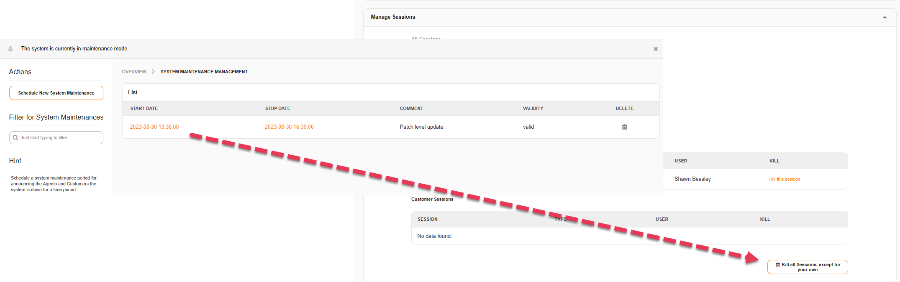

Update to 7.0
##############

.. note::	We highly recommend to update on a test instance first.

This documentation explains how to update to the Znuny 7.0 release.

Please note that your current system needs to be a

- Znuny LTS 6.5.x or Znuny 7.0.x for a patch level update

to perform the update. We do not support direct updates from any version before Znuny LTS 6.5.

.. important::

	The base settings have been changed to reflect the new product name. During an update, you should verify the following settings to use the new user and path during an update. We recommend creating a new ``znuny`` user to /opt/znuny for the best compatibility and changing the following variables.

    - ``$Self->{Home}``
    - ``$Self->{'Frontend::WebPath'}``
    - ``$Self->{'ScriptAlias'}``
    - ``$Self->- {'Ticket::Article::Backend::MIMEBase::ArticleDataDir`}``

    Also, any scripts like backup.pl or apache configurations like ``DocumentRoot`` or directives like ``<Directory>`` should be verified and changed if you are moving to /opt/znuny.
	
    Should you stay with /opt/otrs, you must ensure that the paths in ``scripts/apache2-perl-startup.pl`` and ``apache2-httpd.include.conf``, are verified and changed. Ensure you use the correct user when running ``bin/znuny.SetPermissions.pl --znuny-user otrs`` If you use the backup.pl and stay with otrs, also check the ``backup.pl`` if you use this.

Preparations
************

Before the update can started we need to perform some tasks to prepare the update.

You should or should have entered a scheduled maintenance time period in the admin area. Login as your admin user, select the active maintenance window and kill all sessions but your own. Now only administrators can login.

	Maintenance Session Managment

Check if every add-on your are using is available for version 7.0. You don't have to care on packages which are already integrated, see the list of them in the :ref:`release notes <Integrated features 7.0>`.

Create a backup of the database, the application and all data, especially the attachments.

.. code-block::
	:caption: **Stop all services**

	# Stop the webserver
	systemctl stop httpd # CentOS / RHEL
	systemctl stop apache2 # Debian / Ubuntu

	# Stop your local MTA, mostly Postfix, sometimes Exim or Sendmail
	systemctl stop postfix

	# Remove crontab, stop daemon
	su -c 'bin/Cron.sh stop' - <APP_USER>
	su -c 'bin/znuny.Daemon.pl stop' - <APP_USER>

..

Update via RPM
**************

The update via RPM.

You can find the correct URL for your RPM at https://www.znuny.org/releases. 

.. code-block:: 

	# Update to Znuny 7.0 (RHEL 7 / CentOS 7)
	yum update -y https://download.znuny.org/releases/RPMS/rhel/7/znuny-7.0.12-01.noarch.rpm

	# Check for missing modules and add required modules
	<HOME_DIR>/bin/znuny.CheckModules.pl --all

.. 

Update via source
*****************

The installation from source takes some more steps. If there are more file to restore than mentioned in the restore block, add them by yourself.

.. code-block::

	# Download latest Znuny 7.0
	cd /opt
	wget https://download.znuny.org/releases/znuny-latest-7.0.tar.gz

	# Extract
	tar xfz znuny-latest-7.0.tar.gz

	# Set permissions
	# If you intend on keeping the previous user, then run this command.
	# The new default user is znuny
	/opt/znuny-7.0.12/bin/znuny.SetPermissions.pl --znuny-user <APP_USER>

	# Restore Kernel/Config.pm, articles, etc.
	cp -av <HOME_DIR>/Kernel/Config.pm /opt/znuny-7.0.12/Kernel/
	mv <HOME_DIR>/var/article/* /opt/znuny-7.0.12/var/article/

	# Restore dotfiles from the homedir to the new directory
	for f in $(find -L /opt/znuny -maxdepth 1 -type f -name .\* -not -name \*.dist); do cp -av "$f" /opt/znuny-7.0.12/; done

	# Restore modified and custom cron job
	for f in $(find -L <HOME_DIR>/var/cron -maxdepth 1 -type f -name .\* -not -name \*.dist); do cp -av "$f" /opt/znuny-7.0.12/var/cron/; done

	# Delete the old symlink
	rm /opt/<HOME_DIR>
	
	# Create a symlink 
	ln -s /opt/znuny-7.0.12 /opt/<HOME_DIR>

	# Check for missing modules and add required modules
	<HOME_DIR>/bin/znuny.CheckModules.pl --all

..

Execute the migration script
****************************

.. code-block::

    su - <APP_USER>
    scripts/MigrateToZnuny7_0.pl

..

Update installed packages
*************************

.. note:: Packages for Znuny LTS (6.5.x) are not compatible with Znuny 7.0 and have to be updated.

.. note:: UpgradeAll should only be performed, after your target version has been reached. 
	
.. note:: UpgradeAll can fail, if repositories are not reachable or configured, versions for your framework are not available, or packages have been renamed. In this case, you should upgarde your packages manually via the commandline or by installing/updating them via the package manager.

.. code-block::

    su - <APP_USER>
    bin/znuny.Console.pl Admin::Package::UpgradeAll
    # Make sure all add-ons are correct installed after a patch level update
    bin/znuny.Console.pl Admin::Package::ReinstallAll

..

Restart everything
******************

.. important:: Before starting the cron or mail service and daemon, you should ensure the frontend is working properly. Once new mails are received, or articles are created, a roll back is much more difficutlt, and mails may get lost.

.. code-block::

	# Fill the crontab and wait(!) at least 5 minutes that the Daemon is started via cron
	su -c 'bin/Cron.sh start' - <APP_USER>

	# Start the webserver
	systemctl start httpd # CentOS / RHEL
	systemctl start apache2 # Debian / Ubuntu

	# Start your local MTA, mostly Postfix, sometimes Exim or Sendmail
	systemctl start postfix

..

Deactivate maintenance 
**********************

Don't forget to deactivate the scheduled maintenance, so that your users and customers can login again.
