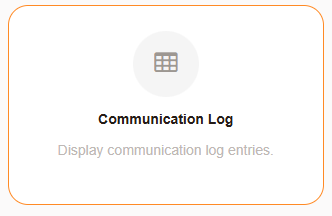
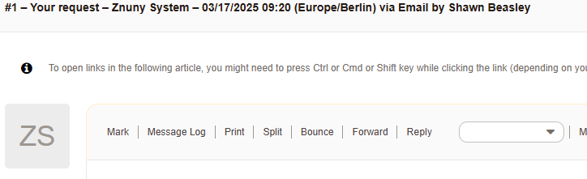
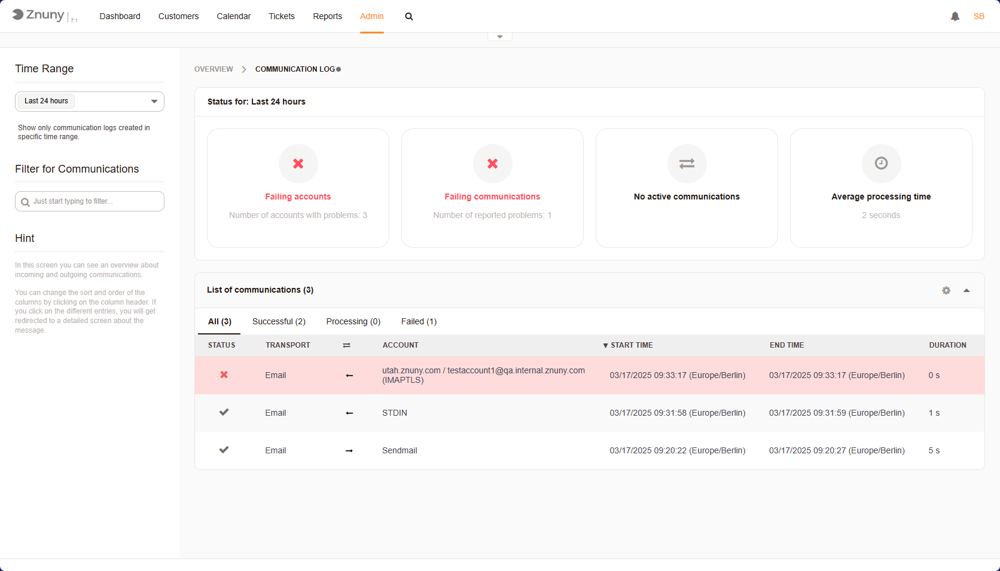
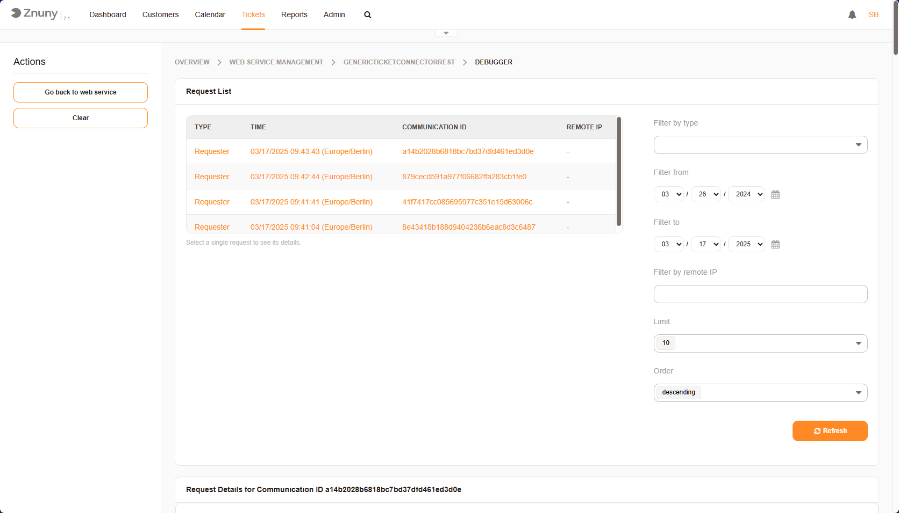

.. meta::
   :description: Debug Znuny issues using application, communication, daemon, web server and web service logs — know which log to check for which class of problem.
   :keywords: znuny logging, application log, communication log, daemon log, web service log, znuny debugging, log reference

.. _PageNavigation standardoperations_logging:

Debugging and Logs
###################

When searching for errors, you will need to know where to search. Here are the different Logging mechanisms in Znuny.

- Application Log
- Communication Log
- Daemon Log
- Web server Log
- Web service Log

Application Log
***************

**Where to find it?**

The default setting is for the ``LogModule`` is ``Kernel::System::Log::SysLog``. This will log to your operating system's logging service, if available.

**How to configure it?**

1. Navigate to Admin -> System configuration
2. Search for ``LogModule`` 
3. Select the configuration settin
4. Click *Edit this setting*

You can modify the option to use ``Kernel::System::Log::File`` 

Application Log options
=======================

File
~~~~

Increase logging efficiency with ``LogModule::LogFile::Date``. This extends the log file name with a date, and creates a new log for each month.
Use the setting ``LogModule::LogFile`` to determine where you log file should be located.

.. important::

    The Znuny and web server user must have write access to the directory.

SysLog
~~~~~~

If logging to the syslog, you can:

- Set the ``LogModule::SysLog::Facility``
- Choose the ``LogModule::SysLog::Charset`` 

General
~~~~~~~

General options for both logging methods:

``CGILogPrefix``
    Specifies the text that should appear in the log file to denote a CGI script entry
``MinimumLogLevel``
    Set the minimum log level. If you select 'error', just errors are logged. With 'debug' 
    you get all logging messages. The order of log levels is: 'debug', 'info', 'notice' and 'error'.

Communication Log
*****************

The communication log is used to view information for incoming and outgoing connections. 

**How to access?**

As an administer, You can access the communication log:

1. Navigate to Admin -> Communication Log
2. Select the Communication Log Admin LogModule

    Administration Module

Additionally, each mail communication contains a link to the associated entry in the communication log.

    Link in Article to Communication Log

Overview
========

**Features**

* ✅Filter for communication log entries
* ✅Analyze connection issues
* ✅Review header and message processing
* ✅Identify unsent messages

   Communication Log Overview

In the overview, the most important categories of message log entries can be seen.

Daemon Log
==========

This log is located under ``var/log/Daemon/`` and every time a task logs an error it save it to an individual log.
The logs are associated with the type of Daemon Task.

- **SystemConfigurationSyncManagerERR.log** -Errors which occurred during synchronization of the system configuration when using multiple front-end nodes.
- **SchedulerFutureTaskManagerERR.log** -Errors which occurred during planned future tasks.
- **SchedulerCronTaskManagerERR.log** -Errors which occurred during regularly run tasks.
- **SchedulerTaskWorkerERR.log** -Errors which occurred during asynchronous tasks.
- **SchedulerGenericAgentTaskManagerERR.log** -Errors which occurred during tasks run as a generic agent.

Web Server Log
==============

For configuration and access to the webserver log, contact you system administrator.

Web service Log
***************

The web service log aids in identifying issues during configuration and normal operations. As with the normal
system log, the order of log levels is: 'debug', 'info', 'notice' and 'error'. To access the error log:

1. Navigate to Admin -> Web Services
2. Select you web service i. e. GenericTicketConnectorREST
3. Select **Debugger** from the Actions block in the left sidebar.

   Web Service Debugger Overview

**Features**

* ✅Filter for web service request and provider log entries
* ✅Analyze connection issues
* ✅Review mapping results
* ✅Verify data sent or received

Selecting an entry will allow you to see the following details (depending upon log level and request type).

- Communication sequence start Date and Data.
- Received data by provider (Type Provider)
- Detected operation (Type Provider)
- Used Invoker (Type Requester)
- Outgoing and Incoming Data:
  - Pre-Mapping
  - Post-Mapping
- URI after interpolating URI params from outgoing data (Type Requester)
- Remaining outgoing or incoming data (helps with xml conversion by non-conventional tags)
- Request parameters (Type Requester)
- JSON Data received
- Error Data
- Error Handling Information
- Returning provider data to remote system (Type Provider)
- Error Messages generated by Operations prior to mapping.

.. important:: 
    
    Taking size and frequency into account, it's best practice not to run an active webserivce on log level *debug*.
